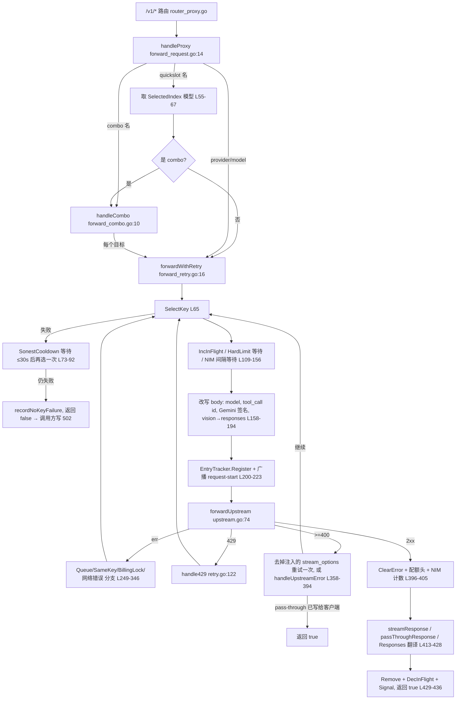

# ProjectAnalysis.md — TinyLab 工程审计（迭代文档）

> **性质：** 架构审计的**活文档**，不是重构方案，也不是一次性报告。每一轮只推进一小步，
> 推进后立即回填本文档。**本文档不修改任何代码。**
>
> **当前轮次：** 第 14 轮（F-06 修复）｜**最后更新：** 2026-10-05
> **路线状态：** 用户指定范围（① API 调度 A1–A7 + ② 衍生 debug/日志 B1–B3）**已全部完成**；
> C1 及新登记问题见 §2/§5，待用户指示是否继续。

---

## 0. 使用说明

### 0.1 可信度标记（每条事实/判断必须带一个）

| 标记 | 含义 | 可否作为后续结论依据 |
|---|---|---|
| ✅ 已核实 | 本轮已对照**源码**（附 `文件:行号`）确认 | 可以 |
| 🧪 待实测 | 代码路径已核实，但尚未运行复现，影响程度未量化 | 可以作为依据，影响评估需保留 |
| 📄 文档声称 | 来自 `PROJECT_MAP.md` / `docs/*-architecture.md`，**尚未对照源码** | 只能作为线索 |
| ❓ 待了解 | 尚不清楚，需要专门调查 | 不可以 |
| ⚠️ 疑点 | 已看到迹象、怀疑存在问题，但证据不足 | 不可以，需升级为 ✅ 或撤销 |
| ❌ 已否定 | 曾经的假设/对话中的说法，经核实不成立 | — |

### 0.2 迭代规则

1. 每轮只做 §2 路线中**一个**最高优先级的未完成项（或其一个子项）。
2. 每轮结束必须：更新对应章节 → 把新产生的问题写入 §5 → 在 §6 追加一行日志。
3. 发现只登记、不修复；修复方案只写"方向"，不写代码。
4. 文档声称（📄）与源码不一致时，以源码为准，并在 §4 登记为"文档漂移"类发现。
5. 行号以登记当日源码为准；后续代码变动可能导致偏移，引用时以函数名为主锚点。

---

## 1. 需求理解

### 1.1 用户真实目标（来自 `ref/log.md` 的意图提炼）

| # | 意图 | 状态 |
|---|---|---|
| U1 | 项目是**长期自用、经真实使用反复打磨**的个人工具，**功能与使用体验没有问题** | ✅ 用户明确陈述（log.md:626） |
| U2 | 目标是 **工程审计**：结构、性能、稳定性、边缘状况；**不是**功能/产品/UX 改造 | ✅ 用户明确陈述（log.md:626） |
| U3 | 不追求重写；寻找"今天看不出来、继续演化会越来越疼"的结构性隐患 | ✅ 用户认同的方向（log.md:954-986） |
| U4 | 认为项目核心是 **API 调度**，其余功能多依赖它，因此优化它价值最大 | ✅ 用户判断（log.md:991），本文档初步认同，见 §1.3 |
| U5 | 认为 WebView 只是可关闭的控制面板，Go 进程才是常驻本体（类比 mihomo / Clash Verge） | ✅ 用户判断（log.md:989），**是否与代码一致待核实**，见 §1.3 |
| U6 | 本轮审计顺序：**① API 调度 → ② 由 API 调度衍生的 debug / 日志** | ✅ 用户本次指令 |

### 1.2 范围

| 范围内（按顺序） | 暂不涉及（非目标） |
|---|---|
| ① API 调度主干：请求入口 → 模型/Combo 解析 → Key 选择 → 重试/故障转移/冷却 → 上游转发 → SSE/非流式回传 | 新功能建议（如"智能路由/健康度评分/成本优化"——属于功能扩展，用户明确不要） |
| ② 调度衍生的可观测性：Console 日志、Recent Requests 环形缓冲、EntryTracker 在途、Trace JSONL 落盘与清理、SSE 广播 | 产品边界/模块去留（用户已否定此方向） |
| 贯穿两者的：并发模型、goroutine/timer 生命周期、锁、内存/磁盘边界、故障恢复、边缘场景 | Playground / Assistant / 多媒体工具 / 游戏等（后续轮次另议） |
| | DDD / Hexagonal / CQRS 等理论化重构 |

### 1.3 对对话记录中 AI 结论的复核

> 对话中 AI 的回答**不一定正确**，以下逐条重新判断。

| 对话中的说法 | 本文判断 | 依据 / 状态 |
|---|---|---|
| "核心是 API 调度，优化它有乘数效应"（log.md:1082-1168） | **基本认同**。第 6 轮已核实：Assistant 回环主干、Gallery 进程内直调主干、Probe/测速有意旁路——乘数效应成立但有折扣（旁路不受重试/冷却保护） | ✅ 见 Q1 / §3.8 |
| "WebView 可关闭、Go 常驻，类似 mihomo/Clash Verge"（log.md:998-1049） | **方向认同，细节待核实**。项目有 default/tray/webview/debug 多个构建变体 | 📄 `docs/build-variants.md`；❓ C1 |
| "统一 Provider 协议 vs 每加一家复制一套逻辑"（log.md:1182-1198） | **前提基本不成立**：普通 provider 走 `entryFormat` 四分支统一构造（不是每家一套）；分化点在 **jethub/webhub 桥接**，它以"可选接口注入"方式接入（Augment/Customize/InterceptResponse），且存在请求头共享问题（F-05） | ✅ `upstream.go:74-252`（四分支 185-218；桥接分支 87-175） |
| "请求生命周期含 缓存"（log.md:1245-1263） | **不成立**：主干上没有任何响应缓存查找/写入；唯一缓存是 Gemini `thought_signature`（功能性回填） | ✅ `forward_request.go` / `forward_retry.go` 全文无缓存逻辑；`forward_retry.go:160-162` 仅签名回填 |
| "数据库损坏恢复"（log.md:803） | **不适用**：无数据库。等价问题是 `config.yaml` / `state.yaml` / `traces/*.jsonl` 损坏后的恢复 | 📄 AGENTS.md「关键设计决策 2」；见 Q2 |
| "Capability System / 模型能力目录值得重构"（log.md:1220-1240） | **暂列为非目标**：偏功能扩展 | ❓ 低优先级 |
| "日志会把项目拖死，关注一年/三年增长"（log.md:914-932） | **认同，且需扩展到内存**：磁盘 Trace 有 retainDays+MaxDiskMB 双限制（✅ §3.10）；内存侧 Ring 以**条数**而非**字节**限界，单条可携带完整请求/响应体（F-06 ✅）——内存是比磁盘更现实的风险 | ✅ 见 §3.9/§3.10 |
| "Goroutine 生命周期 / 运行 7 天才出问题"（log.md:847-871） | **认同**。第 1 轮已核实流式 ticker goroutine 有正确的 `done` 关闭；但发现更现实的问题是**上游挂起时没有任何超时**（F-02），而非 goroutine 泄漏本身 | ✅ `stream.go:111-154`；F-02 |

---

## 2. 审计路线与优先级

> 按"影响面 × 风险"排序。P0 先做。每项完成后改状态，并在 §3/§4 回填。

| ID | 优先级 | 任务 | 状态 |
|---|---|---|---|
| A1 | P0 | **请求生命周期全链路地图**：从 `/v1/*` 入口到响应结束，列出每一跳的函数、文件:行号、谁持有状态、谁负责收尾 | ✅ 第 1 轮完成（§3.3），产出 F-01~F-07 |
| A2 | P0 | **重试 / 故障转移状态机**：`retry.go` 的 `handle429`/`handleUpstreamError` 分支矩阵；循环终止是否完备；`maxRetries` 实际在哪里生效（见 Q6） | ✅ 第 2 轮完成（§3.4），结案 Q6，补强 F-01 |
| A3 | P0 | **Key 选择与冷却的并发模型**：锁层级（cfgMu / stateMu / ks.mu / manualMu）、`BackoffLevel` 何时复位、`onStateChange` 持久化频率 | ✅ 第 3 轮完成（§3.5），结案 Q8，新增 F-08/F-09 |
| A4 | P1 | **流式路径资源生命周期**：`stream.go` 读循环、断开检测、`[DONE]` 强关、`responses_translate.go` 同构路径 | ✅ 第 4 轮完成（§3.6），F-06 升级为 ✅，Q5 部分结案 |
| A5 | P1 | **Combo 解析与重试的交互**：combo 多目标 × 每目标多 key × 冷却等待 30s 的最坏耗时；round-robin 不 fallback 是否有意（F-07） | ✅ 第 5 轮完成（§3.7），F-07 结案，Q3 定量结案 |
| A6 | P1 | **旁路调用识别**：哪些模块不走 `/v1/*` 主干直接打上游 | ✅ 第 6 轮完成（§3.8），Q1/Q7 结案，F-05 部分定论 |
| A7 | P1 | **上游 HTTP 客户端配置**：Transport 连接池/超时/代理环境变量的实际行为（F-02、F-03 的影响量化） | ✅ 第 6 轮完成（§3.8）；F-03 已于第 13 轮修复 |
| B1 | P1 | **调度衍生的可观测性数据流**：一次请求会写入哪些地方（Console / Ring / pgRing / EntryTracker / Trace / SSE 广播），各自容量与清理；F-06 核实 | ✅ 第 7 轮完成（§3.9），F-06 完全结案，Q5 完全结案 |
| B2 | P2 | **Trace 落盘**：写放大、`attemptCounter` 等内存表的增长、sweep 正确性、磁盘满/损坏行为 | ✅ 第 8 轮完成（§3.10），新增 F-10/F-11 |
| B3 | P2 | **EntryTracker / Broadcaster**：慢订阅者、订阅泄漏、`SweepStale` 兜底语义 | ✅ 第 9 轮完成（§3.11），范围①②全部完成 |
| C1 | P3 | 常驻进程视角：webview 关窗后 Go 侧行为、shutdown 顺序（与 U5 对应） | ⏳ |

---

## 3. 已知事实底座（API 调度主干）

### 3.1 模块与职责（📄 PROJECT_MAP §4–§9）

| 包 | 职责要点 |
|---|---|
| `internal/proxy` | `/v1/*` 入口（chat/messages/responses/embeddings/generateContent/images/tasks）；`handleProxy` → `handleCombo` / `forwardWithRetry` → `forwardUpstream` → `streamResponse` / `passThroughResponse` → `recordUsage` |
| `internal/rotation` | `Selector.SelectKey`（三策略 + manual pin + NIM）、`cooldown.go`（指数退避、日配额锁 CST 00:05、per-model 锁）、`error_rules.go`（错误分类） |
| `internal/combo` | `Resolver.Resolve` → 有序目标列表（fallback / round-robin / greedy-squirrel） |
| `internal/registry` + `internal/keystate` | config + per-key 运行时状态；`keystate` 为叶包，打破 rotation→registry 反向依赖 |
| `internal/usage` | 内存 Ring（500 条）、Playground Ring（50 条）、累计统计、配额 |
| `internal/console` | 应用日志 ring + SSE 推送 |

### 3.2 已知的历史修补点（📄，暗示曾出过问题的区域）

> 修补密集处往往是结构性薄弱点，审计时优先复查"同类问题是否还有遗漏"。

- `forwardWithRetry` 入口深拷贝 `parsed`（combo 各目标共享 map 曾导致改写泄漏）——✅ 已见 `forward_retry.go:28-30`；**同类问题在 `r.Header` 上仍存在**，见 F-05
- NIM 三路径调整锁顺序以消除 `cfgMu→stateMu→ks.mu→cfgMu` 死锁环
- `[DONE]` 后 500ms 强制关闭上游 body ——✅ `stream.go:175-191`
- 非流式 keep-alive 提前提交 200 的问题已移除（H-8）——✅ `forward_retry.go:225-231` 仅剩注释
- `stream.go` token 计数改 atomic + 时间驱动节流 ——✅ `stream.go:85-154`
- Trace sweep 曾遗留"幽灵请求"
- `SelectKey` 失败后的冷却等待（上限 30s）——✅ `forward_retry.go:73-92`

### 3.3 请求生命周期地图（✅ 第 1 轮核实）



**逐跳要点（✅）：**

| 阶段 | 位置 | 要点 |
|---|---|---|
| 入口解析 | `forward_request.go:15-48` | 32 MiB `MaxBytesReader`，整体读入 + `json.Unmarshal` 成 `map[string]any`；`sessionKey` 指纹 |
| 模型解析 | `forward_request.go:50-117` | combo → quickslot → combo（quickslot 可指向 combo）→ `SplitModel` → prefix 查 provider → 循环剥离重复前缀 → 别名解析 |
| Combo 分发 | `forward_combo.go:22-50` | fallback / greedy-squirrel 逐目标调用 `forwardWithRetry`；**round-robin 只取 `Targets[0]`，失败直接 502** |
| 单目标重试 | `forward_retry.go:64-437` | 无限 `for` 循环；终止依赖：各错误分支向 `excludeKeyIDs` 追加，直至 `SelectKey` 失败；或有界计数器（queue ≤180、sameKey ≤4、stream_options 剥离 1 次） |
| 收尾 | 每个分支手写 | `EntryTracker.Remove` + `DecInFlight` + `InflightUpdates.Signal()` 三件套，在循环内重复约 10 处（不能用 `defer`） |
| 上游构造 | `upstream.go:177-251` | Anthropic / Responses / Google / 默认 OpenAI 四分支；仅透传 `User-Agent` 与两个 ModelScope 头；`customheaders.Apply` + cline 特例 |
| 桥接构造 | `upstream.go:87-175` | jethub/webhub：**客户端全部请求头作为出站头基底**；augmenter 可直接改 `r.Header`；`ResponseInterceptor` 可转为 Queue 重试 |
| 流式回传 | `stream.go:43-154` | `Inflight.Register`（defer 注销）→ 写 200 → 清除写 deadline → 250ms ticker goroutine（`defer close(done)` 正确停止）→ `[DONE]` 后 500ms `AfterFunc` 关上游 body |
| 上下文传播 | `forward_retry.go:237`、`upstream.go:121/205/212` | 上游请求使用客户端 `r.Context()`：**客户端断开 → 上游请求被取消**（Q4 前半部分答案） |

**HTTP 客户端配置（✅ `handler.go::New` + `newUpstreamTransport`，F-03 修复后，第 13 轮）：**

| 客户端 | Transport | 总超时 | 用途 |
|---|---|---|---|
| `client` | directTransport（专属共享池，`Proxy=nil`） | `upstreamTimeoutSec`（默认 300s，按需克隆） | 非流式直连 |
| `streamClient` | 同上共享 | 无 `Timeout`；**首字节/空闲超时由 `doStream` 按 provider 施加（F-02 修复，第 12 轮）** | 流式直连 |
| `proxyClient` | proxyTransport（专属共享池，仅显式代理） | 同上 300s | 非流式走代理 |
| `proxyStream` | 同上共享 | 同上（`doStream` TTFB/idle） | 流式走代理 |
| `mgmtClient` / `mgmtProxyClient` | direct / proxy 共享池 | 15s | probe / 测速 |

两个专属 Transport 均克隆自 `http.DefaultTransport`（继承 30s 拨号 / 10s TLS 握手 / 90s 空闲超时 / HTTP/2），池化上调为 `MaxIdleConns=256` / `MaxIdleConnsPerHost=32`（F-03 ①③）；direct 的 `Proxy=nil` 使 `UseProxy=false` 不再受进程 `HTTP(S)_PROXY` 影响（F-03 ②），主干不再与 `http.DefaultClient` 用户共享池。

### 3.4 重试 / 故障转移状态机（✅ 第 2 轮核实）

**循环结构与终止条件（`forward_retry.go:69-437`）：** 无限 `for` 循环，**没有全局
attempt 上限**——`state.maxRetries` 不限制总循环次数，只限制 429 同 key 重试段（见下）。
终止只依赖两条路径：① `SelectKey` 在排除表耗尽所有 key 且无可等冷却后失败 → 502；
② 某分支直接返回（pass-through 写回 / 流式/非流式成功 / 有界计数器超限 / 客户端取消）。

**错误处理分支矩阵（✅）：**

| 触发 | 处理（`retry.go` / `forward_retry.go` 行号为函数内位置） | key 状态 | 排除 | 循环走向 |
|---|---|---|---|---|
| `err` = QueueRetryError（Qoder 10605） | 等 `RetryAfter`（≤10s），同一 key 重发；上限 `maxQueueAttempts=180` ≈ 30min | 不动 | 否 | `continue` |
| `err` = SameKeyRetryError（CodeArts 4004.200） | 立即同 key 重发，`RetryDropHeaderMarker` 写入 `r.Header`；上限 4 次 | 不动 | 否 | `continue` |
| `err` = BillingLockError（Qoder 110） | `MarkRateLimited` 至业务时刻（UTC+8 日终，缺省 1h） | 锁 | 是 | `continue` |
| `err` = 其他（网络错误/取消） | `handleNetworkError`（`retry.go:115-122`）：`OnKeyFailure` → 退避+模型锁 | 退避 | 是 | `continue` |
| 429 NIM | NIM 阶梯冷却 | 阶梯 | 是 | `continue` |
| 429 头部显示配额耗尽（ModelScope） | 日配额锁至次日 CST 00:05 | 日锁 | 是 | `continue` |
| 429 头部有配额未耗尽 | 同 key 退避重试 ≤10 次（override 时 1..20），`BackoffSequence` 延迟；期间 `select ctx.Done` 可退出 | 不动 | 否 | 等待后 `continue` |
| 429 SenseNova entitlement | 冷却 300min + 同账号全部排除 | 300min | 是（含同账号） | `continue` |
| 429 SenseNova rpm / tpm | rpm：60s 冷却+同账号排除；tpm：同 key 等 15s 重试 1 次，仍败则 60s 冷却 | 60s | 视分支 | `continue` |
| 429 兜底 `ClassifyError` | DailyQuota→日锁；Cooldown/Transient→定长冷却；Backoff→同 key 重试 ≤ `state.maxRetries` 次 | 视分支 | 视分支 | `continue` |
| ≥400 请求格式错误（PassThrough） | 原样写回客户端，**停止重试**，key 不冷却 | 不动 | 否 | `return true` |
| ≥400 余额耗尽（402 ModelScope） | `MarkBalanceLocked` 日锁 + quotaTracker 清快照 | 日锁 | 是 | `continue` |
| 5xx / 其他 4xx | `ClassifyError` → 退避/冷却/日锁/瞬时；5xx 追加 500ms~5s 线性 backoff（`consecutive5xx` 计数，override 可改为均一间隔） | 视分支 | 是 | `continue` |
| 2xx | `ClearError` + 配额头解析 + NIM 计数 | 清退避 | — | 流式/非流式回传 → `return true` |

**Q6 结案——`maxRetries` 生效点（✅）：** `state.maxRetries = h.maxRetries()`（全局
`Rotation.MaxRetries`，≤0 → 5）**只**作用于 handle429 的两个同-key-退避段（头部有配额段
上限固定 10、override 时才用 `maxRetriesFor` 的 clamp(1..20)；兜底 Backoff 段用
`state.maxRetries`）。**它不限制"换 key"的总循环次数**。循环终止完全依赖
`excludeKeyIDs` 单调增长 + `SelectKey` 失败。因此请求最坏持续时间 =
Σ(每 key 的 429 退避段) + Σ(5xx backoff) + Σ(冷却等待 ≤30s) + queue 段（≤30min）——
理论最坏以小时计（🧪 依赖 key 数与上游行为，未实测）。

**状态复位语义（✅）：** `state.temp429Retries` / `tpmWaitRetries` / `consecutive5xx`
在**每个非-429 分支都复位为 0**——意味着 429 与 5xx 交替出现时，同 key 退避段计数
互相"洗白"，`excludeKeyIDs` 是唯一单调量（这是终止性的唯一保证，也是 F-01 之外
最值得关注的结构事实）。

**上下文检查缺口（✅，补强 F-01）：** 全部 5 处等待点（冷却等待 `forward_retry.go:88-94`、
queue 等待、429 backoff `retry.go:206-210`、TPM 等待、5xx backoff `retry.go:455-460`）
都正确 `select ctx.Done` 提前退出；但**循环顶部与 `handleNetworkError` 不检查
`r.Context().Err()`**——取消后的请求仍会以 `context canceled` 走网络错误分支冷却 key、
记录一条 error usage，然后由下一个等待点退出（若剩余路径无等待点，则持续轮询直到
key 耗尽——F-01 完整成立）。

### 3.5 Key 选择与冷却的并发模型（✅ 第 3 轮核实）

**锁层级（✅）：** 四级锁各管一域，`SelectKey`/冷却路径的获取顺序固定为
`registry.cfgMu(R) → registry.stateMu(R) 取 *KeyRuntimeState → ks.mu`，无反向嵌套：

| 锁 | 保护对象 | 持有者 |
|---|---|---|
| `registry.cfgMu` | providers/combos 配置 map | `GetProvider`（RLock）等 |
| `registry.stateMu` | `states`/`probeRecords` map（指针值，不保护结构体内部） | `GetKeyState` 等 |
| `keystate.mu`（ks.mu） | 单个 key 的 `ModelLocks`/`BackoffLevel`/`LastUsedAt`/`InFlight` 等 | 所有读写方直接 `state.Lock()` |
| `Selector.manualMu` / `settingsMu` | manualPins / settings 副本 | Set/ManualKey |

关键点：`stateMu` 只护 map 查找，返回的 `*KeyRuntimeState` 由 ks.mu 自护——所以
不存在"stateMu 持有期间等 ks.mu"的层级倒挂。NIM 路径（`nim.go`）同样先 GetKeyState
再拿 ks.mu，未见 cfgMu→stateMu→ks.mu→cfgMu 环（历史死锁修补仍成立，🧪 未重跑压测）。

**SelectKey 流程（✅ `selector.go:88-153`）：** 过滤（active → exclude →
`isKeyAvailable` 清过期锁）→ NIM 过滤 → manual pin（可用即胜出）→ 策略选择 →
`LastUsedAt=now` + `ConsecCount++` → **无条件 `onStateChange()`**。

**三策略（✅ `strategy.go`）：**

| 策略 | 算法 | 失败处理 |
|---|---|---|
| fill-first | `Priority` ASC 取第一 | `OnKeyFailure` → 指数退避 `MarkUnavailable` |
| round-robin | 粘性：`LastUsedAt` 最新的 key 用满 `stickyLimit`（默认 3）次后，换 `LastUsedAt` 最旧的 | 同上 |
| failover | `RotatedAt` ASC（零值=从未失败=最优先），平局按 Priority | `RotateToBack`（只写 `RotatedAt`，**不设 ModelLock、不退避**） |

**Q8 结案——`BackoffLevel` 复位条件（✅ `cooldown.go::ClearError`）：** 仅当
`ClearError` 删除该 model 锁后 `len(ModelLocks)==0`（该 key 所有 model 的锁都清了）
才复位为 0。`MarkRateLimited`（固定时长冷却）**不动** BackoffLevel。含义：
① F-01 的取消误冷却在 fill-first/round-robin 下会**累积** BackoffLevel（2^level 秒，
上限 300s，level≤15），直到该 key 某个 model 出现一次 2xx `ClearError` 且无其他锁；
② failover 策略完全绕过退避系统（只排队），F-01 在 failover 下只影响队列顺序，不产生锁。

**`onStateChange` 持久化频率（✅）：** 回调 = `state.Manager.ScheduleWrite`
（500ms 去抖 + 临时文件 rename，`state/manager.go:67,75-90`）。触发点比想象密集：
**每次 SelectKey 成功都触发**（不只失败/冷却），即高 QPS 下每 500ms 一次全量
state.yaml 快照写（🧪 写放大量 = 快照体积 × 2 QPS，未量化，归 B2 复核）。

**`isKeyAvailable` 的锁内删除副作用（✅ `cooldown.go::isKeyAvailable`）：** 可用性
**检查**函数顺带做过期锁清理（`delete(ModelLocks/Status/Errors)`）——读路径带写语义，
且清理不触发 `onStateChange`（锁过期本不需持久化，但若此刻崩溃，state.yaml 里留着
已过期锁，重启后靠同函数懒清理恢复——自洽，✅）。注意它在 `SelectKey` 的候选循环里
对**每个 key** 都拿一次 ks.mu。

**manual pin 语义（✅）：** pin 是"可用才胜出"的偏好，非强制——被锁/被排除时回落到
常规策略。与 AGENTS.md 描述一致。

### 3.6 流式路径资源生命周期（✅ 第 4 轮核实）

覆盖 `streamResponse`（`stream.go:43-540+`）与同构的 `streamResponsesAsChat`
（`responses_translate.go:299-`）：

| 资源 | 生命周期 | 核实 |
|---|---|---|
| 上游 `resp.Body` | `defer resp.Body.Close()`；`[DONE]` 后 500ms `AfterFunc`+`sync.Once` 强关 | ✅ |
| `Inflight.Register` | defer 注销；首个 chunk 打 `SetFirstChunk`，content 字节 `AddBytes` | ✅ |
| ticker goroutine | `done := make(chan struct{})` + `defer close(done)` + `defer ticker.Stop()`，无泄漏 | ✅ |
| 客户端断开检测 | 每行 `w.Write` 失败 → `clientDisconnected=true` → break；**200 头已发出，断开后无法再故障转移**（结构性：SSE 一旦开始透传就只能终止） | ✅ |
| SSE 行缓冲 `SSELineBuffer` | 预算 1 MiB/行、8 MiB 总量，超限 `streamAborted` 受控中止（F-14 机制） | ✅ `sse.go:15-19` |
| `sseBuf`（usage 捕获副本） | **已限界（F-06 修复，第 14 轮）**：`cappedBodyBuffer` 保留头部 256 KiB + 真实总字节计数（`capture_buffer.go`），超限时以截断信封写入 ring；usage/token 逐行增量提取不依赖该缓冲 | ✅ `stream.go:82,542-545`、`responses_translate.go:326,502-505` |
| 合成终止符 | 上游不发 finish/[DONE]（opencode.ai）时代 client 补发，仅 OpenAI 格式 | ✅ `stream.go:460-494` |
| `sigCache`（Gemini 签名） | TTL 10min + LRU 上限 + Put 时惰性驱逐，读不续期；无后台 goroutine | ✅ `signature_cache.go:22-84` |
| token 计数 | atomic + 200ms 节流广播（≤5/s），read 单 goroutine 写 / ticker goroutine 读 | ✅ |

**Q5 部分结案（✅）：** 流式路径按请求增长的资源中，sigCache 有界、ticker/AfterFunc
有正确停止路径、SSELineBuffer 有预算；原唯一无界项 `sseBuf` 已随 F-06 修复限界（第 14 轮）。
`passThroughResponse` 有 256 MiB 预算拒绝（`maxPassThroughBodyBytes`，`stream.go:37-41`）。

### 3.7 Combo 解析与重试的交互（✅ 第 5 轮核实）

**Resolve 流程（✅ `combo/resolver.go::Resolve`）：** combo 名 → 逐 model 剥 prefix →
`GetProviderByPrefix` → 别名解析 → 查 provider.Models 取 QuotaType（缺省 limited）→
策略后处理：round-robin → `rotateTargets`（per-combo `comboState{index, consecCount}`
粘性轮转，sticky 用**全局** `rotation.stickyLimit`，≤0 → 3）；greedy-squirrel →
`sortTargetsByTier`（unlimited→limited→paid 稳定排序）；fallback 原样。**协议过滤已
移除**（entryFormat 仅保留作路由标识，由上游决定接受与否）。

**三策略 × 失败语义（✅ `forward_combo.go`）：**

| 策略 | 执行 | 失败后 |
|---|---|---|
| fallback | 逐目标 `forwardWithRetry` | 下一目标；全败 → 502 |
| round-robin | 只执行 `Targets[0]` | **直接 502，不 fallback** |
| greedy-squirrel | 按配额层级排序后逐目标 | 同 fallback |

**F-07 结案——round-robin 不 fallback 是有意的移植偏差：** 本地
`docs/combo-architecture.md` 三处明确记录"round-robin 只暴露 `Targets[0]`、不跨
target 回退"为设计（📄 但与源码 ✅ 一致）；而 9router 参考实现 `combo.js` 的
`handleComboChat` 对**所有策略**统一走 `for (models)` 逐个尝试 + `checkFallbackError`
决定是否继续。即 TinyLab 的 round-robin combo 是"弱化版"：目标数 N>1 时可用性低于
9router 同策略。属有意决策但值得知晓的差异，不再列为疑点。

**Q3 定量结案（✅）——combo 最坏耗时公式：**

```
 worst = Σ_targets [ Σ_keys(429 退避段 ≤10 次 × BackoffSequence ≤15s)
        + 5xx backoff 累计 + 冷却等待(≤30s/次) ] + queue 段(≤30min，仅桥接)
```

普通 provider（无 queue）：单目标最坏 ≈ keys × (10×15s + 5×5s + …) 分钟量级；
N 目标 fallback 串行相乘，可达小时级。**但**所有等待点均 `select ctx.Done`——
客户端断开立即终止（✅，F-01 的"取消被当错误冷却"问题仍在，见 §3.4）。
该公式仅说明"无全局预算"，正常配置下（少量 key、上游健康）不会触达。

### 3.8 旁路调用识别 + HTTP 客户端配置（✅ 第 6 轮核实）

**Q1 结案——上游调用分两类（✅）：**

| 调用方 | 路径 | 证据 |
|---|---|---|
| Assistant（`chat.go` / `llm_classifier.go`） | **回环**：`http://127.0.0.1:<port>/v1/chat/completions`（自打自己的代理主干） | ✅ `assistant/chat.go:46`、`api/assistant/chat.go:60`、`router.go:168` |
| Gallery AI Review | **进程内直调** `proxy.Handler.ChatCompletions(rec, req)`（httptest Recorder，不经网络） | ✅ `gallery/review_engine.go:211-223` |
| Probe（连通性/模型测试） | **真旁路**：直接对 `provider.BaseURL` 发请求，用 mgmt 客户端（15s 超时） | ✅ `probe/register.go:234,409` |
| Combo 测速 | **真旁路**：`BuildUpstreamURL(provider.BaseURL, ...)` 直发，`TraceMgmtCall` 单独记录 | ✅ `combos/register.go:299-472` |
| Playground / StoryMaker / TextReview 前端 | 浏览器 fetch 本地 `/v1/*`（走主干） | ✅ `apibase/deps.go:43` ProxyHandler 注入 |

结论：**"乘数效应"成立但有折扣**——Assistant 与 Gallery 经主干（享重试/冷却/配额），
Probe 与测速是刻意旁路（避免污染 Key 状态，语义正确），但意味着**旁路调用不受重试/
冷却保护，也不计入 Key 配额**。

**Q7 结案——jethub augmenter 全部重置头（✅），F-05 严重度下调：** 逐个核实 13 个
provider 的 augmenter：buddy / lobsterai / trae / cline / raccoon / loomy / minimax /
zcode / opencode / codearts / qoder（Customize 路径）**全部**先 `for k := range
r.Header { r.Header.Del(k) }` 再 Set 自己的头集。所以"客户端凭据外泄给桥接上游"
不成立。**但** F-05 的机制前提仍在：`upstream.go:128-135` 以客户端头为出站基底 +
augmenter 直接改 `r.Header`——安全性完全依赖"每个 augmenter 记得先全删"这一约定，
未来新增 provider 漏写 `Header.Del` 循环即回归泄漏。结构性风险从"当前泄漏"降为
"约定脆弱"。

**A7 客户端配置补充核实（✅ `upstream.go:54-71`）：**
- `UseProxy=true` 且配置了 proxyURL 才用 proxyClient/proxyStream；**UseProxy=false 的
  "直连"语义已于第 13 轮修正（F-03）**——direct Transport `Proxy=nil`，进程继承
  `HTTP(S)_PROXY` 不再影响直连，与 UI"走/不走代理"开关语义一致。
- `clientFor` 按需克隆注入 `Timeout`（非流式）；流式无 `Timeout`（F-02 已由 `doStream`
  施加首字节/空闲超时）。

### 3.9 可观测性数据流（✅ 第 7 轮核实）

**一次请求（含每次 attempt）的全部写入点（✅）：**

| # | 写入点 | 容量/清理 | 触发时机 |
|---|---|---|---|
| 1 | `console.Logger` ring（`console/logger.go:21`，maxLines 默认 200，条数限界） | 覆盖写 | REQUEST/SEND/PROXY/错误行 |
| 2 | `usageBuf` RingBuffer（`app.go:148`，容量 `cfg.UsageRingSize` 默认 500） | 条数 + **字节双限界**（`DefaultRingByteBudget` 64 MiB，`usage/ring.go:50`）；单条 payload ≤256 KiB 截断信封（F-06 修复，第 14 轮） | 每 attempt 的 `recordUsage`（error/retry 各一条） |
| 3 | `pgUsageBuf`（容量 50，Source=playground 分流） | 同上（默认字节预算 64 MiB 不约束 50 条上限） | 同上 |
| 4 | `EntryTracker`（processing map） | `Remove` 每 attempt 收尾 + `SweepStale` 兜底（1min 扫、5min 心跳过期，`app.go:354`） | Register（start）/Remove（done） |
| 5 | Trace JSONL（`traces/index-YYYYMMDD.jsonl` + `req/<id>.jsonl`，运行时开关） | `SweepTraces`（retainDays + MaxDiskMB 删最旧，`app.go:352`） | 每 attempt 一行 + 每 attempt 详情 |
| 6 | `RequestUpdates` Broadcaster（buf 256）request-start/done | 满即丢（per-subscriber 非阻塞） | start/done/tokens |
| 7 | `UsageUpdates` / `InflightUpdates`（buf 32）Signal | 满即丢 | 每 attempt |
| 8 | `Inflight` tracker（流式字节） | defer 注销 | 流式 |
| 9 | `hardLimit` 窗口（`hardlimit.go`，per-provider `[]hlEvent` 60s 滑窗） | `cleanExpired` 滚动淘汰 | WaitAndReserve/Reconcile |

**F-06 已修复（第 14 轮）：** 原结论——Ring 条数限界、单条存完整 masked body，
内存上界 ≈ 条数 × 单条完整体积。修复后三层限界：① `captureBody` 256 KiB 截断
（`maxCapturedBodyBytes`，`recorder.go:213`），超限包装为自描述截断信封
（`marshalTruncatedBody`：`{"raw","truncated","truncatedBytes","totalBytes"}`）；
② 流式 `sseBuf` 改 `cappedBodyBuffer`（保留头部 256 KiB + 真实总字节计数，
usage/token 提取本就逐行增量进行、不依赖该缓冲）；③ Ring 增加字节预算
（`usage/ring.go::NewWithByteBudget` + `evictOverBudgetLocked`，超预算淘汰最旧、
保留最新、淘汰槽位清零释放内存，`Clear`/`Resize` 同步维护 byteTotal）。
**SSE 广播侧是轻量通道**（`MarshalEntryJSONLight` 剥离 payload 后才广播，
`entry_tracker.go:170-177`），不放大。**行为变更：** Trace 开启时，流式响应体
超过 256 KiB 的部分不再落盘（捕获缓冲本身有界）；非流式 trace 仍记完整 body。

**Q5 完全结案（✅）：** 按请求/attempt 增长的内存结构全部有界或清理：
`attemptCounter`（defer + SweepTraces 双清）、`EntryTracker`（Remove+SweepStale）、
`hardLimit` 窗口（cleanExpired）、`sigCache`（LRU+TTL）、Ring（条数）。唯一"无界"项是
单条 Entry 体积——已于第 14 轮随 F-06 修复（captureBody 256 KiB 截断 + Ring 字节预算）。

**广播器语义（✅ `broadcaster.go`）：** per-subscriber 缓冲 + 非阻塞投递（满即丢）——
慢订阅者不阻塞请求路径、不泄漏（unsubscribe 幂等关闭）；代价是 UI 慢时事件静默丢失。
`Broadcast` 持 RLock 逐个投递，无死锁面。

### 3.10 Trace 落盘（✅ 第 8 轮核实）

**写入路径（✅ `request_log.go::writeRequestLog`）：** 每个 attempt 3 类写——
① index 行追加到 `index-YYYYMMDD.jsonl`（**每次 attempt 都追加一行**，Attempts=count）；
② 首次 attempt 建 `req/<reqID>.jsonl` 写 request 行（含完整 masked reqBody）；③ 每 attempt
追加 attempt 行（含完整 masked respBody）。均为 `O_APPEND` 直写，**无缓冲、无批量**——
一次请求 N 个 attempt = 1 + N + N 行、≥2N 次小文件写（每行一次 open/write/close）。
默认关闭（`logRequests()` 运行时开关）；开启后写放大与请求 QPS、body 大小成正比。

**sweep 正确性（✅ `SweepTracesOnce`）：** 每小时一次（启动先跑一次）；按 retainDays
删旧 index/req 文件；MaxDiskMB 超限时按 mtime 从旧到新删；**req 详情文件被删时同步从
所有 index 文件清除对应行**（`purgeIndexLines` 重写 index、无法解析的行原样保留）——
历史上的"幽灵请求"问题已修。mtime 语义：purge 后 index 获得新 mtime，防有用 index
被磁盘上限优先淘汰。

**内存表（✅）：** `attemptCounter`（sync.Map reqID→int）双清理：请求正常结束
`defer clearAttemptCount` + sweep 删 req 文件时 Delete——崩溃残留靠后者兜底，✅ 有界。

### 3.11 EntryTracker / Broadcaster 订阅语义（✅ 第 9 轮核实）

**订阅点与清理（✅）：** 全部 4 类订阅点均正确解绑——
`api/sse/register.go:84-89`（三个 Broadcaster，defer unsub ×3）、
`api/console_logs/register.go:68-69`（defer Unsubscribe）、
`api/assistant/events.go`（EventBroadcaster，同型 defer）、
`api/download/register.go:350`。**无订阅泄漏**：连接断开（handler return）即 defer 触发，
unsubscribe 幂等（sync.Once + close(channel)）。

**慢订阅者语义（✅，与 §3.9 结论一致并展开）：** `Broadcast` 对每个 sub 非阻塞
`select-default`——慢 UI（如标签页休眠）不阻塞请求路径；代价是该订阅者丢失溢出
事件。对 `RequestUpdates`（buf 256）这类携带状态的事件，前端靠"version-lag
compensation"（S connected 帧的 version 序号 vs 拉取快照）补偿——丢事件只导致 UI
短暂陈旧，不导致错误。

**`SweepStale` 兜底语义（✅ `handler.go::SweepStaleEntries` + `entry_tracker.go:184`）：**
心跳（`Refresh`，流式路径每秒打）过期 5 分钟即视为孤儿：写一条 timeout usage error
记录、广播 request-done、**遍历所有 provider 找 KeyID 对应 keyState 做 DecInFlight**
（`handler.go:385-395`）。这是 recordUsage 被绕过时的最后防线。注意 KeyID 查找是
O(providers) 线性扫——量小可接受；若正常路径的 Remove 都执行（✅ 每分支都调），
sweep 实际只覆盖"handler goroutine 整体消失"的极端情况（panic 被 recover 吞掉、
未来引入的提前 return）。

---

## 4. 发现清单

> 维度取值：架构 / 运行时 / 资源 / 状态 / 并发 / 故障恢复 / 边缘场景 / 维护成本 / 文档漂移
> 影响分级：🔴 高（会在正常使用中触发并影响调度结果）/ 🟠 中（特定条件触发）/ 🟢 低（理论或极少触发）

### F-01 🔴 客户端取消被当作"网络错误"，会冷却 Key 并继续轮询剩余 Key

- **维度：** 故障恢复 / 状态
- **状态：** ✅ **已修复（2026-10-05，第 11 轮）**——取消即静默退出。回归
  `internal/proxy/forward_cancel_test.go`（取消组 + 真实网络错误对照组，全量 proxy suite 绿）
- **证据链：**
  1. 上游请求绑定客户端 context（`forward_retry.go:237`）。客户端在**收到响应头之前**断开（非流式全程；流式的 TTFT 前阶段）→ `Do` 返回 `context canceled`。
  2. 错误进入通用分支 `handleNetworkError`（`forward_retry.go:337`），该函数**不区分取消**：调用 `OnKeyFailure(..., 0, err)` 并把 key 加入排除表（`retry.go:110-115`）。
  3. `OnKeyFailure` → `MarkUnavailableWithOverride`：`BackoffLevel++`、写 `ModelLocks[model]`（2^level 秒，上限默认 300s）、`onStateChange()` 触发持久化（`selector.go:165-183`、`cooldown.go:48-84`）。failover 策略下则改为 `RotateToBack`。
  4. 循环回到顶部，**顶部没有 `ctx.Err()` 检查**（`forward_retry.go:64-65`）→ 选下一个 key → 上游请求立即因 ctx 已取消而失败 → 再冷却……直到所有 key 被排除。
  5. Combo fallback/greedy 在目标之间同样不检查 context（`forward_combo.go:25-31`），会继续把后续目标的 key 也冷却一遍。
  6. 例外：配置了 HardLimit 的 provider 会在 `WaitAndReserve(r.Context())` 处提前退出（`forward_retry.go:130`）。
- **影响：** Playground 点"停止"、客户端自身超时、IDE 插件取消补全等**日常操作**，可能把一个 provider/model 下的全部 key 推入退避；连续发生时 `BackoffLevel` 叠加；Recent Requests 中出现 N 条伪"网络错误"。用户感知可能是"偶尔莫名所有 key 在冷却"。
- **方向：** 取消不是 key 故障——在循环顶部与错误分支先判断 `r.Context().Err()`，命中即静默退出（不冷却、不排除、不重复记录）；combo 目标间同理。
- **修复实现（第 11 轮）：** ① `forward_retry.go` 循环顶部（`SelectKey` 前）判取消 →
  `(false,"")` 静默返回（循环顶部无持有：各分支 `continue` 前已清理三件套）；② 上游错误
  分支在任何错误分类（Queue/SameKey/BillingLock/网络错误）前先判取消 → 清理
  `EntryTracker.Remove`+`DecInFlight`+`Signal` 后返回——不冷却、不排除、不写 error usage；
  ③ `forward_combo.go` fallback/greedy 目标间与循环后 502 写出前、round-robin 失败 502 前
  短路；④ `forward_request.go` 的 502 写出前短路。仅留 Debug 级日志。测试侧坑：mock 上游
  须先读尽 request body，net/http 才启动后台连接读检测对端关闭，否则 server 端 ctx 不随
  取消传播、`httptest.Server.Close` 挂起。

### F-02 🟠 流式请求没有任何超时；上游"挂起"时永不触发故障转移

- **维度：** 边缘场景 / 故障恢复
- **状态：** ✅ **已修复（2026-10-05，第 12 轮）**——首字节超时触发切 key 故障转移；流空闲超时中止悬挂流并记 error。回归 `internal/proxy/stream_timeout_test.go`（TTFB 切 key / idle 中止 / 解析契约三用例，全量 proxy suite 绿）
- **证据：** `streamClient`/`proxyStream` 无 `Timeout`（`handler.go:114/125`）；`proxyTransport` 为零值，无 `ResponseHeaderTimeout`、无拨号/TLS 握手超时（`handler.go:118-123`）；流式开始后还主动清除了服务端写 deadline（`stream.go:72-74`）。重试循环只对**错误**作出反应。
- **影响：** 上游已建连但迟迟不返回响应头，或流到一半停止发送却不关连接（半开 TCP、网关卡死）时：不会切 key、不会 fallback 到 combo 下一目标，handler goroutine 与上游连接一直挂着，直到客户端自己放弃。对"调度器"而言，这是**故障转移覆盖不到的盲区**。非流式有 300s 总超时，但同样意味着最坏 300s 才切换。
- **方向：** 区分"首字节超时"和"流空闲超时"（可 per-provider 配置），超时归类为可切 key 的瞬时错误；注意与推理模型长思考期的兼容（以 SSE 注释/心跳是否到达判定空闲）。
- **修复实现（第 12 轮）：** ① 新增 `internal/proxy/stream_timeout.go`：`doStream` 包装两个流式 `Do` 点（`upstream.go` 桥接分支与普通分支）——**首字节超时**（默认 120s）用派生 ctx + timer 实现，`timer.Stop()` 失败（计时器已触发）统一返回 `stream first-byte timeout` 错误，进入 `handleNetworkError` 网络错误分支：退避 + 排除 + 换 key（客户端取消仍由 F-01 的 `r.Context().Err()` 检查先行拦截，互不干扰）；② **流空闲超时**（默认 300s）用 `idleTimeoutBody` 包装 `resp.Body`：每次成功 Read 重置计时器，触发即 cancel 派生 ctx 解除阻塞中的 Read，错误改报 `StreamIdleTimeoutError`；`streamResponse`/`streamResponsesAsChat` 读循环 `errors.As` 识别后记录 status=error / decision=`stream idle timeout`（200 已提交，结构性无法 failover，目的是释放 goroutine/连接并如实记录），**不冷却 key**（已交付部分数据，不作为路由健康证据）；③ per-provider 覆盖：`config.Provider.StreamTTFBTimeoutSec`/`StreamIdleTimeoutSec`（`*int`，nil=默认、≤0=禁用），`UpdateProvider` 合并 + `ProviderDTO` 暴露；④ 推理模型兼容：空闲窗口按**字节到达**重置，SSE 注释/心跳/reasoning delta 均算活动；⑤ webhub 无端点桥接分支不经过 Do，不受影响。

### F-03 🟠 上游连接池使用默认值，且"直连"实际受环境代理变量影响

- **维度：** 运行时 / 性能
- **状态：** ✅ **已修复（2026-10-05，第 13 轮）**——主干双专属 Transport：direct `Proxy=nil` 真直连、proxy 仅认显式设置；池化 256/32 + 30s 拨号/10s TLS/90s 空闲超时。回归 `internal/proxy/upstream_transport_test.go`（专属池/共享关系/超时常量 + 环境代理忽略契约两用例，全量 proxy suite 绿）
- **证据（修复前）：** `client`/`streamClient` 使用 `http.DefaultTransport`（`handler.go:109-114`）：`MaxIdleConnsPerHost` 默认 2，`Proxy: ProxyFromEnvironment`；`proxyTransport` 为零值 Transport（`handler.go:118`），`IdleConnTimeout=0`（空闲连接永不过期）、`MaxIdleConnsPerHost` 同样为 2。
- **影响（修复前）：** ① 同一上游并发 >2 时，多余连接用完即关，下次重新 TCP+TLS 握手，增加 TTFT；② `UseProxy=false` 的 provider 若进程继承了 `HTTPS_PROXY`（终端启动时常见），实际仍走代理，与 UI 语义不符；③ DefaultTransport 与进程内其他使用 `http.DefaultClient` 的代码共享连接池。
- **修复实现（第 13 轮）：** ① `handler.go::New` 改用 `newUpstreamTransport`（`http.DefaultTransport.(*http.Transport).Clone()`，继承 30s 拨号 / 10s TLS 握手 / 90s 空闲超时 / `ForceAttemptHTTP2`）构造两个专属 Transport：directTransport `Proxy=nil`（`UseProxy=false` 真直连，环境代理变量不再被咨询）、proxyTransport 仅从 `SetProxy` 的原子 `proxyURL` 取显式代理；② 池化上调 `MaxIdleConns=256` / `MaxIdleConnsPerHost=32`（常量 `upstreamMaxIdleConns`/`upstreamMaxIdleConnsPerHost`）；③ 六个 client 按两侧共享池（client+streamClient+mgmtClient 共享 direct；proxyClient+proxyStream+mgmtProxyClient 共享 proxy），主干不再与 `http.DefaultClient` 用户共享；④ 零值 proxyTransport 的三项缺失（拨号/TLS 握手/空闲超时）由 Clone 继承补齐。**行为变更：** 依赖"不设 UseProxy、靠环境变量走代理"的隐式用法失效，需在 Settings 显式配置代理。**测试侧说明：** `ProxyFromEnvironment` 对 loopback 豁免且结果按进程缓存，故回归断言 Transport 字段契约（`Proxy==nil` / proxy func 解析值）而非端到端拨号。

### F-04 🟢 重试循环的收尾逻辑手工配对，已发现一处遗漏

- **维度：** 维护成本 / 状态
- **状态：** ✅
- **证据：** `Remove + DecInFlight + Signal` 在 `forward_retry.go` 中重复约 10 次。marshal 失败分支（`forward_retry.go:186-191`）在 `IncInFlight`（L111）之后直接返回，**未 `DecInFlight`**；且返回 `(false, reqID)` 后调用方 `handleProxy` 会再写一次 502（重复 `WriteHeader`），combo fallback 则会继续尝试下一目标。
- **影响：** 该分支实际几乎不可触发（由 JSON 解出的 map 再 marshal 不会失败），但说明"每加一个分支就要记得收尾"的模式脆弱——过去新增的 Queue/SameKey/BillingLock 分支都是这样逐个补的。
- **方向：** 把"单次 attempt"抽成独立函数，以 `defer` 统一收尾；返回值区分"已写响应 / 可继续 / 终止"三态。

### F-05 🟢 桥接 provider 共享并修改客户端请求头（与已修复的 parsed 泄漏同类）

- **维度：** 架构 / 状态（潜在凭据外泄）
- **状态：** ✅ 第 6 轮定论：**当前无实际泄漏**（13 个 augmenter 全部先全删再 Set，§3.8），严重度从 🟠 降为 🟢；**约定脆弱性维持**——安全性依赖每个 augmenter 记得先 `Header.Del` 循环，漏写即回归
- **证据：** 桥接分支把 `clientReq.Header` 全部复制为出站头（`upstream.go:128-135`），仅在缺失时才补 `Authorization`（L142-144）；augmenter 按约定**直接修改** `r.Header`（L76-80 注释）；`RetryDropHeaderMarker` 也写进 `r.Header`（`forward_retry.go:308`）。`r` 在同一请求的所有重试与 combo 所有目标间共享。
- **影响：** ① ~~凭据外泄~~（不成立：所有 augmenter 重置头）；② combo 中先后命中两个桥接 provider 时，前者写入的签名头会被后者 augmenter 的全删清除——**当前无残留泄漏**；③ 未来新增 augmenter 忘记全删循环 → 回归泄漏（真实残余风险）。
- **方向：** 把"全删+白名单 Set"从每个 augmenter 的手工约定上移为框架行为（桥接分支出站头一律从空构造，augmenter 只提供增量），或加一条单测断言"桥接出站请求不包含客户端独有头"。

### F-06 🟠 内存观测数据按"条数"限界，单条可携带完整请求/响应体

- **维度：** 资源
- **状态：** ✅ **已修复（2026-10-05，第 14 轮）**——三层限界：单条 payload 256 KiB 截断信封 + 流式捕获缓冲封顶 + Ring 64 MiB 字节预算。回归 `internal/proxy/capture_body_test.go`（captureBody 欠额/超额/掩码序、截断信封幂等、流式端到端全量透传+尾部 usage 提取、大请求体截断）+ `internal/usage/ring_bytebudget_test.go`（字节淘汰/单条超额保留/头计入/Clear+Resize 账目一致），全量 `go test ./...` 绿。
- **证据（修复前）：** ① 每个 attempt 把完整请求体（≤32 MiB）掩码复制进 `processingEntry.ReqPayload`，`captureBody` 只做 base64 图片掩码 + JSON 包装，**不截断**；② 流式路径 `sseBuf` 全量累积整个上游响应，**无上限**（非流式路径反而有 256 MiB 拒绝预算）；③ Ring：`usageBuf` 500 条 / `pgUsageBuf` 50 条，条数限界、尾部淘汰，`Entry.ReqPayload/RespPayload` 为完整 masked body。理论内存 ≈ 条数 × 单条完整体积（含 base64 图片、长推理输出）。
- **影响（修复前）：** 重负载下 Recent Requests 的内存占用以"最近 500 个大响应体"为上界；Playground 并发长流式时可叠加。是"运行 7 天内存增长"最可能的实锚点之一。
- **修复实现（第 14 轮）：** ① `recorder.go`：`maxCapturedBodyBytes = 256 << 10`；`captureBody` 对超额 body 保留头部并经 `marshalTruncatedBody` 包装为合法 JSON 信封（`{"raw","truncated","truncatedBytes","totalBytes"}`，复用既有 `{"raw"}` 包装形状，前端 modal 无需改动）；`isTruncationEnvelope` 探测（`truncated`+`raw`+`totalBytes` 三字段）使信封幂等——流式预包装的信封经过 `recordUsage` 的 captureBody 不会被二次截断（否则 totalBytes 被中间长度污染）；掩码先于截断（纯图片撑大的 body 掩码后回落欠额、不截断）。② 新增 `capture_buffer.go::cappedBodyBuffer`（保留头部 cap 字节 + 计数真实总量），`stream.go`/`responses_translate.go` 的 `sseBuf` 替换之；流末若 `Truncated()` 则以真实总字节预包装——usage/token/签名提取本就逐行增量进行（`util.ExtractTokens`/`parseAnthropicSSEUsage`/`extractThoughtSignature`），与捕获缓冲解耦，客户端透传字节流不受影响。③ `usage/ring.go`：`RingBuffer` 增加 `byteTotal`/`byteBudget`（`NewWithByteBudget`，`New` 默认 `DefaultRingByteBudget = 64 MiB`）；`entryBytes` 估算（payload + headers 键值 + 256 固定）；`Add` 覆盖槽位先减账、超预算经 `evictOverBudgetLocked` 从最旧淘汰（保留最新、槽位清零释放 payload 内存）；`Clear` 清零全部槽位（原实现只复位游标，payload 残留至覆盖）、`Resize` 重建后重算并执行预算。条数预算管典型流量，字节预算只在病态大 payload 时触发：典型 entry 数 KB → 500 条 ≈ 数 MB，远不及 64 MiB；极端 entry ≈ 512 KiB（双侧截断信封+转义）→ 预算允许 ~120 条。**行为变更：** Trace 开启时流式响应体超过 256 KiB 的部分不再落盘（捕获缓冲本身有界，尾部字节在 recordUsage 时已不存在）；非流式 trace 仍记完整 body（writeRequestLog 在 captureBody 之前调用）。

### F-07 🟢 Combo round-robin 策略失败时不 fallback

- **维度：** 架构
- **状态：** ✅ 已结案（第 5 轮，§3.7）：**有意的设计**。`docs/combo-architecture.md` 三处明确记录该行为；与 9router 参考（所有策略均逐 model fallback）存在有意偏差——round-robin combo 可用性弱于参考实现，属知情决策。

### F-08 🟠 每次成功选 key 都触发 state.yaml 去抖写，高 QPS 下持续全量快照

- **维度：** 资源 / 性能
- **状态：** ✅ 代码路径已核实（§3.5）· 🧪 写放大未量化（归 B2）
- **证据：** `SelectKey` 末尾无条件 `onStateChange()`（`selector.go:148-151`），回调为
  500ms 去抖全量快照写（`state/manager.go:75-90`）。选 key 成功也写——`LastUsedAt`
  /`ConsecCount` 确实变了，但意味着持续负载下 state.yaml 每 500ms 重写一次，
  与 key 数、probe 记录数成正比；SSD 写放大 + 崩溃窗口常开。
- **方向：** 把"必须持久化"（锁、配额）与"尽力持久化"（LastUsedAt 等统计数据）
  分级，后者可拉长去抖或丢失。

### F-09 🟢 ClearError 的跨 model 复位条件可能拉长退避恢复

- **维度：** 状态 / 边缘场景
- **状态：** ✅
- **证据：** `BackoffLevel` 只在 `ClearError` 后 `len(ModelLocks)==0` 时复位
  （`cooldown.go::ClearError`）。若一个 key 因 model A 反复失败把 level 推高，随后
  model B 成功清了 B 的锁，但 A 的锁仍在 → level 不复位；下次 A 再失败从高 level
  继续翻倍。与 F-01 叠加时（取消误冷却也 ++level），恢复更慢。
- **影响：** 仅影响冷却时长（封顶 300s），不影响正确性。
- **方向：** level 按-model 记账，或成功即衰减。

### F-10 🟢 Trace 开启时每 attempt 多次 open/write/close 小文件写，无缓冲批量

- **维度：** 资源 / 性能
- **状态：** ✅ 机制已核实 · 🧪 写放大量未实测（与 QPS/body 正比）
- **证据：** `appendJSONLine` 每行独立 `OpenFile(O_APPEND)+Write+Close`（`request_log.go:240-258`）；
  每 attempt 写 index 行 + attempt 行两个文件各一次。开启 trace 的高频使用下 syscalls
  密集，但 trace 默认关闭、属诊断场景，实际影响有限。
- **方向：** 若将来默认开启或高频使用：按文件句柄缓冲 + 定期 flush，或 bufio.Writer。

### F-11 🟢 SweepTracesOnce 全程持锁与否/与写路径并发

- **维度：** 并发 / 边缘场景
- **状态：** ✅ 已核实为**无锁设计，无数据竞争**：sweep 删文件与 writeRequestLog 追加写
  并发时，最坏情况是正在追加的 req 文件被 sweep 删除（Windows 上 `os.Remove` 打开中的
  文件会失败，sweep 静默跳过 `_ = os.Remove`，下轮再删；POSIX 下 unlink 后写者写孤儿
  inode，空间被回收）。`purgeIndexLines` 重写 index 与追加并发：重写读的是删除前的行集，
  新追加的行可能丢失（该 reqID 的详情文件刚被删，行本该被清）——语义自洽，仅当轮丢行。
- **影响：** 无正确性问题；极端并发下 sweep 轮次间的轻微不一致，可接受。
- **方向：** 无需修复；若追求严格一致可用目录级互斥（代价不值得）。

### 4.1 旁注（不在本次范围，但已观察到）

- ~~📄 `PROJECT_MAP.md` ≈ 450 KB、`proxy-architecture.md` ≈ 160 KB、`playground-architecture.md` ≈ 300 KB。文档以"逐次修改流水"方式累积，单行可达数 KB。~~ **已处理（2026-10-05）**：① 流水剥离——三文件顶部「最后核对」堆叠块（104+47+111 条，共 ~334 KB）原文归档至 `docs/changelog/<同名>.md`，文首改单条替换式核对行；② 流程修正——AGENTS.md 新增「最后核对行维护规则」：核对行只替换不追加，过程叙述写入归档；③ 结构修整——PROJECT_MAP §10.1–10.29/§13 链重排序、§17a→§13p 归位、重复 §13e 解撞（filetransfer→§13c.2）、§10.18/10.20 重复节合并；④ 正文保守压实（仅折叠历史叙述，反引号 token 集合零丢失、标题字节一致，12 块机械校验全过）。结果：457/159/306 KB → **306/99/152 KB**。发现：正文本身为当前事实密集（压实仅 -0.8~-10%），债务主体是顶部流水而非正文；原文档存在少量先天残迹（截断行、未闭合反引号 span），按存疑保留。
- ✅ `forwardWithRetry` 签名有 14 个参数，`recordUsage` 调用有 20 个位置参数（`retry.go:116`）——请求上下文以散参数传递，是 F-04 收尾脆弱、以及每次新增字段都要改一串调用点的根源之一。归入后续"请求上下文对象化"议题，暂不展开。

---

## 5. 待了解问题清单

| ID | 问题 | 关联任务 | 状态 |
|---|---|---|---|
| Q1 | 各业务模块（Playground / StoryMaker / TextReview / Assistant / Gallery Review / Combo 测速 / Probe）调用上游是否都经过 `/v1/*` 主干？旁路有哪些？ | A6 | ✅ 已结案（§3.8）：Assistant 回环主干、Gallery 进程内直调主干、Probe/测速真旁路（有意）、Playground 前端走主干 |
| Q2 | `config.yaml` / `state.yaml` 损坏或写入一半时，启动行为是什么？ | 后续 | ❓ |
| Q3 | 一次请求从入口到结束，最坏情况下会持续多久？（重试次数 × 退避 × combo 目标数 × 冷却等待 ≤30s × queue ≤180 次） | A2/A5 | ✅ 完全结案（§3.4 定性 + §3.7 定量公式）：无全局预算，combo 串行相乘可达小时级；所有等待点可被客户端断开终止 |
| Q4 | 客户端断开时，上游请求是否被取消？ | A1/A4 | ✅ **会取消**（ctx 传播），但取消被误判为 key 故障 → F-01 |
| Q5 | 内存中所有"按请求增长"的 map（attemptCounter、EntryTracker、sigCache、HardLimiter 窗口等）是否都有清理路径？ | A4/B2/B3 | ✅ 完全结案（§3.6+§3.9）：sigCache LRU+TTL、attemptCounter defer+SweepTraces 双清、EntryTracker Remove+SweepStale（1min/5min）、hardLimit cleanExpired、Ring 条数限界——唯一无界项是单条 Entry 体积（→F-06） |
| Q6 | `retryState.maxRetries` 用全局 `h.maxRetries()` 初始化（`forward_retry.go:17`），而 per-provider 的 `maxRetriesFor` 另有定义（`retry.go:62`）——两者分别在哪里生效？覆盖值是否真正作用于循环次数？ | A2 | ✅ 已结案（§3.4）：仅作用于 429 同-key 退避段，不限制总循环次数 |
| Q7 | jethub 各 augmenter 是否总会覆盖 `Authorization` 等敏感头？是否读取/依赖客户端原始头？ | A6 / F-05 | ✅ 已结案（§3.8）：13 个 augmenter 全部先全删再 Set；不读取客户端原始头（qoder 的 Customize 仅浅拷贝改 URL，头仍走重置约定） |
| Q8 | `BackoffLevel` 在什么条件下复位？（`ClearError` 是否重置）——决定 F-01 的累积程度 | A3 | ✅ 已结案（§3.5）：`ClearError` 后该 key 所有 model 锁均空才复位；`MarkRateLimited` 不动 level；failover 策略完全绕过退避 |

---

## 6. 迭代日志

| 轮次 | 日期 | 做了什么 | 产出 |
|---|---|---|---|
| 0 | 2026-10-03 | 阅读 `ref/log.md`、AGENTS.md、PROJECT_MAP §4–§10/§24；提炼需求、确定范围、复核对话结论、排出路线 | 本文档骨架；§1、§2、§3（全 📄）、§5 Q1–Q5 |
| 1 | 2026-10-03 | A1：通读 `forward_request.go`、`forward_combo.go`、`forward_retry.go`，`upstream.go:1-290`，`stream.go:40-200`，`handler.go` 客户端构造，`retry.go:1-170`（`handleNetworkError`），`selector.go::OnKeyFailure`，`cooldown.go::MarkUnavailableWithOverride` | §3.3 生命周期地图（✅）；F-01~F-07；Q4 结案；新增 Q6–Q8 与 A7；§1.3 两条结论定论 |
| 2 | 2026-10-03 | A2：通读 `forward_retry.go:59-437`（完整循环体）、`retry.go:99-494`（`handleNetworkError` / `handle429` / `handleUpstreamError` 全部分支、SenseNova 分类、`excludeSameAccountKeys`） | §3.4 分支矩阵与终止性分析（✅）；Q6/Q3（定性）结案；F-01 证据补强（等待点 ctx 检查完备、循环顶部缺失）；确认无全局 attempt 上限 |
| 3 | 2026-10-03 | A3：通读 `selector.go`、`cooldown.go`（`MarkUnavailableWithOverride`/`ClearError`/`isKeyAvailable`/`SonestCooldown`）、`strategy.go` 全部三策略、`registry/state.go::GetKeyState`、`state/manager.go` 去抖写 | §3.5 锁层级/策略/复位语义（✅）；Q8 结案；新增 F-08（每次选 key 触发去抖写）、F-09（BackoffLevel 跨 model 复位条件）；确认历史 NIM 死锁修补仍成立 |
| 4 | 2026-10-03 | A4：通读 `stream.go:43-540+`（读循环/断开/[DONE] 强关/合成终止符）、`responses_translate.go:299-423`、`sse/sse.go` 预算、`recorder.go::captureBody`、`signature_cache.go` | §3.6 资源生命周期表（✅）；F-06 升级 ✅（captureBody 不截断、sseBuf 无上限）；Q5 流式部分结案；确认 ticker/AfterFunc/sigCache 均有界或正确停止 |
| 5 | 2026-10-03 | A5：通读 `combo/resolver.go`（Resolve/rotateTargets/sortTargetsByTier）、`forward_combo.go` 全文；对照 `docs/combo-architecture.md` 与 9router `ref/../combo.js` 的 `handleComboChat` | §3.7（✅）；F-07 结案（有意偏差）；Q3 定量结案（最坏耗时公式） |
| 6 | 2026-10-03 | A6+A7：`assistant/chat.go`、`api/assistant/chat.go`、`gallery/review_engine.go`、`probe/register.go`、`combos/register.go` 上游调用路径；jethub 13 个 augmenter 逐一核对头重置（`products.go::RegisterProviderAugmenters`、各 `*_augment.go`/`*_provider.go`/`qoder_adapter.go`）；`upstream.go:40-150` 客户端选择与桥接头复制 | §3.8（✅）；Q1/Q7 结案；F-05 定论（无当前泄漏、约定脆弱，降 🟢）；F-03 维持（环境代理影响"直连"） |
| 7 | 2026-10-03 | B1：`usage/ring.go`（Entry 结构/RingBuffer）、`recorder.go::recordUsage` 全流程、`entry_tracker.go`（SweepStale）、`broadcaster.go` 全文、`request_log.go:269-363`（attemptCounter/TraceMgmtCall）、`hardlimit.go` 滑窗、`app.go:148-354` 装配、`console/logger.go` | §3.9 写入点矩阵（✅）；F-06 完全结案；Q5 完全结案 |
| 8 | 2026-10-03 | B2：通读 `request_log.go:63-270`（writeRequestLog/appendJSONLine/parseBodyForJSON）、`SweepTraces/SweepTracesOnce/purgeIndexLines`（363-560+） | §3.10（✅）；新增 F-10（逐行 open/write/close 写放大）、F-11（sweep 无锁并发语义核实为自洽）；确认幽灵请求已修、attemptCounter 双清理 |
| 9 | 2026-10-03 | B3：`api/sse/register.go:80-110`、`console_logs/register.go:68-73`、`assistant/events.go`、`download/register.go:350` 订阅点；`handler.go::SweepStaleEntries/StartEntryTrackerSweeper` | §3.11（✅）：无订阅泄漏（4 类订阅点 defer 解绑幂等）、慢订阅者满即丢 + version-lag 补偿、SweepStale 兜底覆盖 handler 消失场景。**范围①②（API 调度 + 衍生 debug/日志）的 A1–A7、B1–B3 全部完成** |
| 10 | 2026-10-05 | §4.1 文档维护债处理（用户指定）：三文件流水剥离至 `docs/changelog/`、AGENTS.md 流程修正（核对行替换式）、PROJECT_MAP 结构修整（重排/解撞/合并重复节）、12 块并行保守压实 | §4.1 结案（✅）：457/159/306 KB → 306/99/152 KB；token 集合零丢失、标题字节一致、锚点抽查 37 处零真实失效；新规则写入 AGENTS.md「最后核对行维护规则」 |
| 11 | 2026-10-05 | F-01 修复（用户指定）：`forward_retry.go` 循环顶部 + 上游错误分支最前、`forward_combo.go` 三策略目标间/502 前、`forward_request.go` 502 前共四处 `r.Context().Err()` 短路；新增 `internal/proxy/forward_cancel_test.go` 双用例；文档同步（proxy-architecture 正文 + 双 changelog + PROJECT_MAP §4 三条目） | F-01 ✅ 已修复：取消即静默退出（不冷却/不排除/不记 error usage/不轮询剩余 key）；对照组证明真实网络错误仍冷却；全量 proxy suite 绿 |
| 12 | 2026-10-05 | F-02 修复（用户指定）：新增 `internal/proxy/stream_timeout.go`（`doStream` 首字节超时 120s 默认 → 网络错误分支切 key；`idleTimeoutBody` 空闲超时 300s 默认 → `StreamIdleTimeoutError` 中止流记 error 不冷却 key）；`config.Provider` 新增 `StreamTTFBTimeoutSec`/`StreamIdleTimeoutSec`（nil=默认、≤0=禁用）+ UpdateProvider 合并 + ProviderDTO；`stream.go`/`responses_translate.go` 读循环 errors.As 识别；新增 `internal/proxy/stream_timeout_test.go` 三用例 | F-02 ✅ 已修复：悬挂上游首字节超时触发故障转移、半开流空闲超时释放 goroutine/连接；proxy+config+registry+api 全量套件绿 |
| 13 | 2026-10-05 | F-03 修复（用户指定）：`handler.go::New` 改用 `newUpstreamTransport`（克隆 `http.DefaultTransport`）构造双专属 Transport——direct `Proxy=nil` 真直连（不再响应 `HTTP(S)_PROXY`）、proxy 仅认 `SetProxy` 显式设置；池化 `MaxIdleConns=256`/`MaxIdleConnsPerHost=32`（原默认 2）+ 继承 30s 拨号/10s TLS/90s 空闲超时（原零值 proxyTransport 皆无）；六 client 两侧共享池，不再共享 `http.DefaultTransport`；新增 `internal/proxy/upstream_transport_test.go` 两用例；文档同步（proxy-architecture 正文 + 双 changelog + PROJECT_MAP §4 + 本文 §3.3/§3.8） | F-03 ✅ 已修复：连接池专属化、零值 proxyTransport 超时补齐、"直连"与环境代理脱钩；全量 proxy suite + `go build`/`go vet` 绿 |
| 14 | 2026-10-05 | F-06 修复（用户指定）：`recorder.go` `captureBody` 加 256 KiB 截断（`maxCapturedBodyBytes` + `marshalTruncatedBody` 自描述信封 + `isTruncationEnvelope` 幂等探测防二次截断）；新增 `capture_buffer.go::cappedBodyBuffer`（头部保留+真实总字节计数）替换 `stream.go`/`responses_translate.go` 的无界 `sseBuf`；`usage/ring.go` 增加字节预算（`NewWithByteBudget`/`DefaultRingByteBudget` 64 MiB/`entryBytes`/`evictOverBudgetLocked`，`Clear` 顺带修 payload 残留清零）；新增 `capture_body_test.go` 六用例 + `ring_bytebudget_test.go` 四用例；文档同步（proxy-architecture §11.1 漂移段落更正 + 核对行、PROJECT_MAP §4/§6 三条目 + 核对行、双 changelog、本文 §3.6/§3.9/F-06） | F-06 ✅ 已修复：单条 payload ≤256 KiB（截断信封）、在途流式捕获 ≤256 KiB、Ring 累计 ≤64 MiB；测试侧坑——截断信封经 JSON 转义后仍可能超额需幂等直通（否则 totalBytes 被中间长度污染）、`forwardWithRetry` 测试调用需显式传 bodyBytes（nil 时 ReqPayload 为空）；全量 `go test ./...` 绿 |
