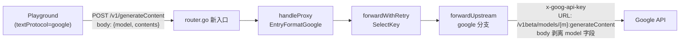

# Google 原生 generateContent 协议支持 — 实施计划

> **文档定位：** 本文档是 Google 原生 `generateContent` 协议接入 TinyLab 的 **入口文档与迭代上下文**。在新对话中实施时，先读本文档 §1（如何使用）与 [`docs/gemini_research.md`](gemini_research.md)，再按 §4 Phase 1→4 顺序推进；每完成一个 Phase，按 §7 变更维护清单更新本文档的"最后核对"行与对应条目。
>
> **最后核对（2026-08-17，实施完成）：** Phase 1（后端协议地基）、Phase 2（Settings 协议下拉）、Phase 3（Playground 协议专属参数+原生 body）、Phase 4a（内联多模态）与 Phase 4b（服务端 ffmpeg media-prep 端点）全部实施完毕并通过单元测试与构建验证。
>
> **参考文档：** [`docs/gemini_research.md`](gemini_research.md)（Google 原生 generateContent / Files API / 多模态实测指南，所有方法经免费层 key + 本机代理实测通过 2026-08-17）。

---

## 1. 如何使用本文档（入口导航）

本文档自包含足够上下文，使新对话无需重新调研即可实施。使用流程：

1. **读约束**：先读 [`AGENTS.md`](../AGENTS.md) 的"文档同步指令"与"不要做的事"（禁止格式转换、禁止数据库、禁止前端框架）。
2. **读调研**：读 [`docs/gemini_research.md`](gemini_research.md) 的 §0（关键结论）、§1（端点鉴权对照）、§3（两种媒体输入）、§12（完整参数清单）、§18（已知坑）。本文档的"文档约束"列引用这些章节号。
3. **读现状**：读本文档 §2（当前协议 = OpenAI 兼容）与 §3（架构决策）。
4. **按 Phase 实施**：§4 给出 4 个阶段的精确文件:行锚点。Phase 1 是所有需求的前提，必须最先完成。
5. **验证**：每个 Phase 的"验收"行是完成判据。Phase 1 验收用 curl 手测；Phase 2-4 用浏览器驱动 Playground 验证。
6. **回写**：每完成一个 Phase，更新本文档 §6"实施进度"勾选 + §7"变更维护清单"对应条目 + 顶部"最后核对"行。若触及 `PROJECT_MAP.md` §1-§24 或其他 `docs/*-architecture.md` 覆盖的模块，同步更新对应文档。

> **不在本文档范围**：本文档只规划 google 原生协议接入。OpenAI 兼容端点（现有 `IsGeminiOpenAICompat` + `thought_signature` 回填）行为不变。

---

## 2. 背景：当前 Google 协议 = OpenAI 兼容，非原生

**结论：TinyLab 当前对 Google 模型走 OpenAI 兼容端点，不支持原生 `generateContent`。**

证据（均为源码锚点）：

- `Provider.IsGeminiOpenAICompat()`（`internal/config/types.go:161-169`）：判定条件是 `BaseURL` 含 `generativelanguage.googleapis.com` **且** 路径含 `/openai`——即 `…/v1beta/openai/chat/completions`，Bearer 鉴权。
- `backfillThoughtSignatures`（`internal/proxy/forward.go:199-259`）：处理的是 **OpenAI 兼容格式**（`messages[].tool_calls[].extra_content.google.thought_signature`），非原生 `thoughtSignature`。触发点 `internal/proxy/forward_retry.go:115-116`，仅在 `IsGeminiOpenAICompat()` 时执行。
- 全仓搜索 `generateContent` / `ProtocolGoogle` / `EntryFormatGoogle` / `streamGenerateContent` **零命中**——无原生入口、无 `EntryFormatGoogle`、无 `ProtocolGoogle` 常量。
- `entryFormat → forwardUpstream` 分支表（`internal/proxy/upstream.go:48-61`）只有 Anthropic / OpenAIResponses / default(OpenAI) 三分支。
- [`docs/gemini_research.md`](gemini_research.md) §0、§20 印证：OMP/TinyLab 的 google provider 走 OpenAI 兼容端点，只能 text+image，无视频/音频/PDF 的 wire 格式。

**要支持视频/音频/PDF（需求 3）与 google 原生参数（需求 2），必须新增原生 `generateContent` 协议路径。**

---

## 3. 核心架构决策

### 3.1 决策 1：不做格式转换（遵循 AGENTS.md）

AGENTS.md 明令"不要实现格式转换 (OpenAI ↔ Anthropic)"。Google 原生路径采用 **透明透传**：Playground 端构建原生 `contents`/`parts` 体，代理仅负责 URL 构造 + `x-goog-api-key` 鉴权 + 透传，不翻译。这与现有 `/v1/messages`（Anthropic）、`/v1/responses` 的透传软策略（`proxy-architecture.md §3.4`）一致。

### 3.2 决策 2：协议下拉 = Playground 入口路径选择器

5 个 `TextProtocol` 值映射到 `entryFormat` + 入口路径，复用现有 `entryFormat → forwardUpstream` 分支机制，仅新增一个 google 分支：

| `TextProtocol` 值 | `entryFormat` | 入口路径 | 上游构造 | 鉴权 |
|---|---|---|---|---|
| `""` / `"auto"`（默认） | — | 由客户端实际入口决定（当前行为） | 现有逻辑 | — |
| `"openai-compat"` | `EntryFormatOpenAI` | `/v1/chat/completions` | `{baseURL}/v1/chat/completions` | `Authorization: Bearer` |
| `"openai-responses"` | `EntryFormatOpenAIResponses` | `/v1/responses` | `{baseURL}/v1/responses` | `Authorization: Bearer` |
| `"anthropic"` | `EntryFormatAnthropic` | `/v1/messages` | `{baseURL}/v1/messages` | `x-api-key` |
| `"google"`（新增） | `EntryFormatGoogle`（新增） | `/v1/generateContent`（新增） | `{baseURL}/v1beta/models/{realModel}:generateContent` | `x-goog-api-key` |

外部客户端仍按现有入口透明访问（软策略不变）；`TextProtocol` 字段是 **Playground 侧提示 + 探测元数据**，不被代理转发路径读取（与现有 `ModelDef.Protocols` 同理——`forwardUpstream` 按 `entryFormat` 分支，不读 `ModelDef.Protocols`，见 `internal/proxy/forward_request.go:50-56` 注释）。

### 3.3 决策 3：新增 `ModelDef.TextProtocol` 字段（手动覆盖）

- 新增 `ModelDef.TextProtocol string`（`yaml/json:"textProtocol,omitempty"`），默认 `""` = auto。
- 与 `ModelDef.Protocols`（探测结果，`internal/config/types.go:56`）、`ModelDef.ImgProtocol`（图片模式，`types.go:48`）三轴分离，互不干扰。
- `config.yaml` 严格解析（`KnownFields(true)`，`internal/config/persistence.go:65`），但新增 `omitempty` 字段对旧配置无害（缺失即默认空）。
- `"auto"` 在存储时归一化为 `""`（避免双值歧义）。

### 3.4 决策 4：Google 入口用 TinyLab 内部别名 `/v1/generateContent`

不为模型在路径中（`/v1beta/models/{model}:generateContent`）注册 chi 参数路由——那会破坏 TinyLab 统一的"从 body `model` 字段解析 provider/key"路由模型（`forward_request.go:65-83`：`util.SplitModel` + `GetProviderByPrefix` + `ResolveModelAlias`）。改为：

- Playground POST `/v1/generateContent`，body 含 `model:"prefix/gemini-3.5-flash"` 用于路由。
- 代理解析 provider/key 后构造真实上游 URL `{baseURL}/v1beta/models/{realModel}:generateContent`（流式用 `:streamGenerateContent?alt=sse`，见 [`docs/gemini_research.md`](gemini_research.md) §13）。
- 从 body 剥离 `model` 字段后透传（Google 不期望 body 有 `model`；代理已有 body 改写先例：`stream_options` 注入、`thought_signature` 回填）。

### 3.5 已确认的待答问题（按推荐方案落定）

1. **入口路径命名** → `/v1/generateContent`（TinyLab 别名，body 带 model）。✅ 已确认。
2. **视频 Files API 落地优先级** → 4c（含 key-pinning）列为后续规划（§5.1），本期先交付 4a+4b（image/audio/PDF + ffmpeg 转码）。✅ 已确认。
3. **协议下拉作用域** → `TextProtocol` 仅作 Playground 侧提示 + 探测元数据，代理仍按入口路径透传，不做翻译。✅ 已确认。

---

## 4. 实施阶段（Phase 1-4）

每个 Phase 的"验收"行是完成判据。锚点均为当前源码行号，实施时以最新 `read` 为准。

### Phase 1 — 后端协议地基（config + probe + proxy 入口）

所有 3 个需求的前提。无此阶段，google 协议无处落地。

| # | 文件:行 | 改动 |
|---|---|---|
| 1.1 | `internal/config/types.go:34-39` | 新增 `ProtocolGoogle = "google"` 常量（"google native generateContent"） |
| 1.2 | `internal/config/types.go:42-57` | `ModelDef` 新增 `TextProtocol string` 字段（`yaml/json:"textProtocol,omitempty"`）。注意 `UnmarshalYAML`(70-83)/`UnmarshalJSON`(86-103) 的 `modelDefAlias` 别名机制对新字段自动兼容，无需改 |
| 1.3 | `internal/config/validate.go:11-15` | `validProtocols` map 加入 `ProtocolGoogle`（顺带补 `ProtocolOpenAIEmbedding` 的既有遗漏——当前 map 只有 3 项）；`validateModelDef`(29-34) 校验 `TextProtocol` ∈ {`""`,`auto`,`openai-compat`,`openai-responses`,`anthropic`,`google`} |
| 1.4 | `internal/combo/resolver.go:17-26` | 新增 `EntryFormatGoogle EntryFormat = "google"` |
| 1.5 | `internal/api/router.go:259-273` | 新增 `r.Post("/v1/generateContent", proxyHandler.GenerateContent)` |
| 1.6 | `internal/proxy/handler.go:213-254` | 新增 `GenerateContent()` handler → `handleProxy(w, r, "/v1/generateContent", combo.EntryFormatGoogle)` |
| 1.7 | `internal/proxy/upstream.go:48-61` | `forwardUpstream` 新增 `case entryFormat == combo.EntryFormatGoogle:` 分支：①URL = `{baseURL}/v1beta/models/{realModel}:generateContent`（`isStream` 时用 `:streamGenerateContent?alt=sse`）；②header `x-goog-api-key: {sel.Key.Key}`；③从 body 剥离 `model` 字段后透传。`realModel` 取自 `sel`（已剥 prefix 的上游 model ID）；URL 构造不走 `urlutil.BuildUpstreamURL`（model-in-path 特殊），需独立拼接 + 启发式处理 `baseURL` 是否已含 `/v1beta` |
| 1.8 | `internal/api/probe/register.go:49-54,131-135,152-160` | 新增 `probeProtocolGoogle` 常量；`probeModel` 校验(131-135) + switch(152-160) 加 `case config.ProtocolGoogle`；新增 `ProbeGoogle()` wrapper（`register.go:524-591` 区）：POST `{baseURL}/v1beta/models/{model}:generateContent`，`x-goog-api-key`，body `{contents:[{parts:[{text:probeTestPrompt}]}]}` |
| 1.9 | `internal/state/state.go:37-50` | `ProbeRecord` 新增 `Google ProbeDetail` 字段（yaml `google,omitempty`），持久化 google 探测明细；`SnapshotKeyStates`/`RestoreKeyState` 相关 probe 快照逻辑同步（见 `config-registry-state-architecture.md §13`） |
| 1.10 | `internal/registry/models.go:205-225` | 新增 `UpdateModelTextProtocol(providerID, modelID, textProtocol string)` 方法（镜像 `UpdateModelKind`:186-205 与 `UpdateModelProtocols`:205-225 的写法） |
| 1.11 | `internal/api/providers/register.go:104-108` | 新增 PATCH 路由 `r.Patch("/providers/{id}/models/textProtocol", h.updateModelTextProtocol)` + handler（校验 6 个合法值，`"auto"` 归一化为 `""` 存储；镜像 `updateModelKind`:599-632） |
| 1.12 | `internal/api/models/register.go:34-44` | `modelInfo` struct 新增 `TextProtocol string` 字段（`json:"textProtocol,omitempty"`）+ 从 `ModelDef.TextProtocol` 填充；顺带可加 `Protocols []string` 供前端探测徽章 |

**验收**：`go build ./...` 通过；手动 curl `POST /v1/generateContent`（body `{model:"prefix/gemini-3.5-flash",contents:[{role:"user",parts:[{text:"你好"}]}]}`）能经轮转/鉴权转发到 Google 并返回 `candidates[].content.parts[].text`。代理日志显示 `x-goog-api-key` 头与 model-in-path URL。

### Phase 2 — Settings 模型详情协议下拉（需求 1）

| # | 文件:行 | 改动 |
|---|---|---|
| 2.1 | `web/static/providers.js:517-553` | `buildModelRowMainInner` 新增 TextProtocol 下拉（`renderCustomSelectHtml`，参考 `web/static/app.js:1206`）。显示逻辑镜像 ImgProtocol（519 行 `protoDisplay`）：`kindVal==='text'` 时显示，否则 `display:none`。选项：Auto / OpenAI Compat / OpenAI Responses / Anthropic / Google |
| 2.2 | `web/static/providers.js:1604-1629` | 新增 `updateModelTextProtocol(pid, selectEl)` → `apiPatch('/providers/'+pid+'/models/textProtocol', {model, textProtocol})`，镜像 `updateModelKind`:1604-1619 |
| 2.3 | `web/static/i18n.js:75-82,821-828` | 新增 i18n 键（en+zh）：`textProtocol` / `protocolAuto` / `protocolGoogle` / `protocolOpenAICompat` / `protocolOpenAIResponses` / `protocolAnthropic` |
| 2.4 | `web/static/providers.js:1133-1233` | `buildMiniProtocolBadges` 新增 'G' (google) 徽章 |
| 2.5 | `web/static/providers.js:1024-1132` | `testModelProtosSerial` 的 `allProtos` 数组加入 google（仅对 `kind=text` 探测，镜像 embedding 的 kind 过滤逻辑） |

**验收**：浏览器驱动 Settings → provider detail → 模型行：text 模型显示 5 选项协议下拉；切换值后 `config.yaml` 的 `textProtocol` 字段正确持久化；探测按钮支持 google 协议测试。

### Phase 3 — Playground 协议专属侧栏参数 + 原生 body（需求 2）

| # | 文件:行 | 改动 |
|---|---|---|
| 3.1 | `web/playground/static-pg/playground/pg-ui.js:534-560` | `pgRenderSidebar`(433) normal 分支：按选中模型的 `textProtocol`（来自 `pgState.models`，Phase 1.12 已暴露）渲染协议专属参数面板。google 面板参数见下表 |
| 3.2 | `web/playground/static-pg/playground/pg-ui.js:1526` | `pgOnModelChange` 补调 `pgRenderSidebar()`（当前缺——图片模式 528 行有调，text 模式无）。模型切换时面板须刷新 |
| 3.3 | `web/playground/static-pg/playground/pg-core.js:19-87` | `PG_DEFAULT_CFG`(19-77) 新增 google 参数字段（`thinkingLevel`/`topK`/`maxOutputTokens`/`stopSequences`/`responseMimeType`/`candidateCount` 等）；`PG_DEFAULT_PARAMS`(79-87) 加对应 toggle（默认关）。localStorage v2 合并机制（`pg-state.js:189-204`）使新字段对存量用户自动默认 |
| 3.4 | `web/playground/static-pg/playground/pg-request.js:47-82` | `pgBuildBodyForWin` 按 protocol 分支：google 构建 `{contents:[{role,parts}], systemInstruction, generationConfig:{thinkingConfig,temperature,topP,topK,maxOutputTokens,stopSequences,...}, safetySettings}` 而非 `{model,messages,stream}`。`messages→contents` 映射：role `user`/`assistant`→`user`/`model`（google 无 assistant 角色），system 消息→顶层 `systemInstruction`。`pgFinalizeBodyForSend`(88-111) 的图片缝合点(96-108)对 google 改发 `inlineData` part（见 Phase 4a） |
| 3.5 | `web/playground/static-pg/playground/pg-stream.js:33-50,204-218` | fetch URL 按 protocol 分支：google → `/v1/generateContent`；SSE 解析新增 google 分支（`candidates[].content.parts[].text`，非 OpenAI `choices[].delta`）；非流式解析 `{candidates:[{content:{parts:[{text}]}}]}`。`pgParseSSELine`(pg-request.js:18) 对 google chunk 的 `[DONE]` 等价判断 |
| 3.6 | `web/playground/static-pg/playground/pg-i18n.js:5-10,394-399` | 新增 google 参数 i18n 标签（`pgTopK`/`pgThinkingLevel`/`pgResponseMimeType`/`pgStopSequences`/`pgCandidateCount`/`pgSafetySettings` 等，en+zh） |

**Google 侧栏参数集**（对齐 [`docs/gemini_research.md`](gemini_research.md) §12 原生 `generationConfig`）：

| 参数 | 字段 | 说明 |
|---|---|---|
| `thinkingLevel` | `generationConfig.thinkingConfig.thinkingLevel` | minimal/low/medium/high。**Gemini 3 无法关闭**（§8），替代现有 `thinkingBudget` |
| `temperature` | `generationConfig.temperature` | 采样温度 |
| `topP` | `generationConfig.topP` | nucleus 采样 |
| `topK` | `generationConfig.topK` | **Gemini 特有**（OpenAI 无） |
| `maxOutputTokens` | `generationConfig.maxOutputTokens` | 替代 `max_tokens` |
| `presencePenalty` / `frequencyPenalty` | `generationConfig.*` | 同名 |
| `stopSequences` | `generationConfig.stopSequences` | 替代 `stop` |
| `candidateCount` | `generationConfig.candidateCount` | 替代 `n` |
| `responseMimeType` | `generationConfig.responseMimeType` | `text` / `application/json`（§11） |
| `responseSchema` | `generationConfig.responseSchema` | JSON Schema（可选，配合 `responseMimeType=application/json`） |
| `safetySettings` | `safetySettings:[{category,threshold}]` | 内容安全阈值（§12） |
| `stream` | （URL 驱动） | google 流式由 `:streamGenerateContent?alt=sse` 决定，非 body 字段 |

**验收**：浏览器驱动 Playground normal 模式：选 google 协议模型 → 右侧栏显示 google 参数集（含 topK/thinkingLevel）；发送消息 → 请求体是 `contents`/`generationConfig` 形态，POST 到 `/v1/generateContent`，响应正确渲染。

### Phase 4 — Playground 多模态输入 + ffmpeg（需求 3）

最复杂。按 [`docs/gemini_research.md`](gemini_research.md) §3/§18 的实测约束分三子阶段。本期交付 4a+4b，4c 列后续（§5.1）。

#### 4a — 内联多模态（image/audio/PDF，<20MB）

文档 §3/§4/§5/§7：图片/PDF/音频走 inline（小、快），**视频不可 inline（挂死 5 分钟，§18）**。

| # | 文件:行 | 改动 |
|---|---|---|
| 4a.1 | `web/playground/static-pg/playground/pg-ui.js:210-242,1451` | `pgPasteImage` 接受过滤从 `image/*` 扩到 `image/*,video/*,audio/*,application/pdf`；新增 `<input type=file multiple>` + drag-drop（当前只有 paste，`pg-ui.js:1451` 只绑 paste 监听） |
| 4a.2 | `pg-ui.js:172-184` + `pg-request.js:96-108` | 单一缝合点：google 协议时 parts 改发 `{inlineData:{mimeType, data:<base64去 data: 前缀>}}` 而非 `{type:'image_url',image_url:{url}}`。mimeType 从 data URL 或 `File.type` 取 |
| 4a.3 | `web/playground/static-pg/playground/pg-core.js:35-36` | `imageUrls` 泛化为 `mediaParts`（带 `kind`+`mimeType`），google 门控。向后兼容：openai 协议仍用 `image_url` |

**验收**：Playground 选 google 模型 → 粘贴/选择图片/音频/PDF → 请求体含 `inlineData` part → Google 正确识别多模态内容。

#### 4b — 服务端 ffmpeg 转换端点（audio→mp3, video→mp4）

ffmpeg 仅服务端可运行（`internal/mediaedit`，浏览器不可调）。需新端点接收 blob → 转码 → 返回可用 part。

| # | 文件 | 改动 |
|---|---|---|
| 4b.1 | 新增 `internal/api/playground/media_prep.go` | `POST /api/playground/media-prep`（multipart）：接收 blob + 协议提示 + 目标格式 → 复用 `mediaedit.ResolveFfmpeg`(`binary.go:37-49`)/`RunFfmpeg`(`executor.go:67`) 转码。audio→mp3（`-vn -acodec libmp3lame -b:a 128k -ac 1 -ar 44100`，文档 §7）；video→mp4。小媒体 base64 返回 `{inlineData:{mimeType,data}}`；视频走 4c（后续） |
| 4b.2 | `internal/api/router.go` | 注册 `/api/playground` 路由组（管理 session 鉴权，32MiB body cap，镜像 `/api/gallery` 组模式） |
| 4b.3 | `web/playground/static-pg/playground/pg-ui.js` | 文件选择后 POST 到 `/api/playground/media-prep`，拿到 `inlineData` part 存入 `mediaParts`；转码进度 UI |
| 4b.4 | ffmpeg 可用性检测 | 前端复用 `gallery-edit-operations.js:139` 的 `GET /api/gallery/edit/ffmpeg-status` 模式（`edit_handlers.go:56-90`），不可用时降级为原样 inline（不转码） |

**验收**：选 google 模型 → 上传任意格式音频 → 后端 ffmpeg 转 mp3 → 请求含 `inlineData:{mimeType:'audio/mp3',data}` → Google 正确转录。ffmpeg 不可用时优雅降级。

> **4c（视频 Files API）见 §5.1 后续规划，本期不实施。**

---

## 5. 未来规划（本期不实施，列于本文档供后续迭代）

### 5.1 Phase 4c — 视频 Files API 路径

文档 §6：视频走 Files API（resumable upload → 轮询 `ACTIVE` → `fileData.fileUri` 引用）。**inline 视频挂死（§18），必须走 Files API。**

| # | 文件 | 改动 |
|---|---|---|
| 4c.1 | 新增 `internal/api/playground/google_files.go` | 后端用轮选 key 调 Google Files API：①启动 resumable upload（`X-Goog-Upload-Protocol:resumable`）→ ②上传二进制 → ③轮询 `state==ACTIVE` → ④返回 `{fileData:{mimeType,fileUri}}` |
| 4c.2 | `internal/proxy/forward_retry.go` + `internal/rotation` | **key 固定机制**：Files API 文件绑定上传 key 的 project，`generateContent` 必须复用同 key（§6 全程用同一 `KEY`）。需扩展 forward 路径接受 pinned-key 提示（如请求头 `X-TinyLab-Pin-Key:{keyId}`），`SelectKey` 优先返回该 key。**单 key 配置无此问题**；多 key 轮转才需 |

> ⚠️ **key 固定是后续最大后端复杂点**。单 Key google 配置可直接工作；多 key 轮转需 pin-key 机制贯穿 rotation/forward。

### 5.2 工具调用 thought_signature 原生路径

Playground 普通聊天不用工具调用，本期不涉及。**若后续 Playground normal 模式加 tools**：

- 原生路径的 `thoughtSignature` 是 `functionCall` 的**同级字段**（同 part 内，§10），与 OpenAI 兼容的 `extra_content.google.thought_signature`（`forward.go:199-259` 现有回填）**不同**。
- 需新增 `backfillThoughtSignaturesNative`（处理 `contents[].parts[].thoughtSignature`），与现有 OpenAI 兼容回填并存，按 `entryFormat` 分支。
- `extractThoughtSignature`（`signature_cache.go:107-151`）需新增原生 SSE 扫描分支（`candidates[].content.parts[].thoughtSignature`）。

### 5.3 Interactions API / 显式缓存 / 代码执行

文档 §14/§15/§16：Interactions API（服务端多轮）、代码执行（`tools:[{type:code_execution}]`）、显式缓存（`cachedContent`）均可用，但非本期目标。若后续需要，Interactions API 的 `steps[]` 响应需独立 SSE 解析器。

### 5.4 协议下拉对外部客户端的影响（当前不实施）

`TextProtocol` 当前仅 Playground 侧提示。若后续需外部客户端也按 `TextProtocol` 自动选入口，则涉及入口协商——更复杂，与"不做翻译"原则冲突，不推荐。

---

## 6. 实施进度

- [x] Phase 1 — 后端协议地基
- [x] Phase 2 — Settings 协议下拉
- [x] Phase 3 — Playground 协议专属参数 + 原生 body
- [x] Phase 4a — 内联多模态（image/audio/PDF）
- [x] Phase 4b — 服务端 ffmpeg 转换端点
- [ ] Phase 4c — 视频 Files API（后续，§5.1）

---

## 7. 变更维护清单

> 每完成一个 Phase，更新本清单对应条目 + 顶部"最后核对"行。若触及 `PROJECT_MAP.md` §1-§24 或其他 `docs/*-architecture.md`，同步更新对应文档。

### 7.1 本期新增/修改文件清单

**后端（Phase 1）**
- `internal/config/types.go` — 新增 `ProtocolGoogle` 常量 + `ModelDef.TextProtocol` 字段
- `internal/config/validate.go` — `validProtocols` 加 google + 补 embedding；`TextProtocol` 校验
- `internal/combo/resolver.go` — 新增 `EntryFormatGoogle`
- `internal/api/router.go` — 新增 `/v1/generateContent` 入口路由 + `/api/playground` 路由组（Phase 4b）
- `internal/proxy/handler.go` — 新增 `GenerateContent()` handler
- `internal/proxy/upstream.go` — `forwardUpstream` 新增 google 分支（x-goog-api-key + model-in-path URL + body 剥离 model）
- `internal/api/probe/register.go` — `probeProtocolGoogle` + `probeModel` switch + `ProbeGoogle()` wrapper
- `internal/state/state.go` — `ProbeRecord` 新增 `Google ProbeDetail`
- `internal/registry/models.go` — 新增 `UpdateModelTextProtocol`
- `internal/api/providers/register.go` — PATCH `/providers/{id}/models/textProtocol` 路由 + handler
- `internal/api/models/register.go` — `modelInfo` 新增 `TextProtocol`（+可选 `Protocols`）

**前端 Settings（Phase 2）**
- `web/static/providers.js` — TextProtocol 下拉 + `updateModelTextProtocol` + 探测徽章 'G' + `testModelProtosSerial` allProtos
- `web/static/i18n.js` — 协议下拉 i18n 键

**前端 Playground（Phase 3-4）**
- `web/playground/static-pg/playground/pg-ui.js` — 协议专属参数面板 + `pgOnModelChange` 补 `pgRenderSidebar` + 多模态输入扩展
- `web/playground/static-pg/playground/pg-core.js` — `PG_DEFAULT_CFG`/`PG_DEFAULT_PARAMS` google 字段 + `mediaParts`
- `web/playground/static-pg/playground/pg-request.js` — `pgBuildBodyForWin` google 分支 + `pgFinalizeBodyForSend` inlineData 缝合
- `web/playground/static-pg/playground/pg-stream.js` — fetch URL + SSE 解析 google 分支
- `web/playground/static-pg/playground/pg-i18n.js` — google 参数 i18n

**新增（Phase 4b）**
- `internal/api/playground/media_prep.go` — ffmpeg 转码端点

### 7.2 需同步更新的既有文档

| 触及模块 | 需更新文档 | 条目 |
|---|---|---|
| 新增入口路径 + entryFormat | `docs/proxy-architecture.md` | §3（入口协议）新增 google 入口；§7（上游构造）新增 google 分支表 |
| `ModelDef` 新增字段 | `docs/config-registry-state-architecture.md` | §4（ModelDef 表）加 `TextProtocol` 行；§13（ProbeRecord）加 `Google` |
| `EntryFormat` 新增 | `docs/combo-architecture.md`（若有 EntryFormat 章节） | 新增 `EntryFormatGoogle` |
| 探测新增协议 | `docs/proxy-architecture.md` §18（探测） | allProtos 加 google |
| Playground 多模态 | `docs/playground-architecture.md` | §4.2（HTTP 接口）加 `/v1/generateContent` + `/api/playground/media-prep`；新增 google 协议参数面板章节 |
| `PROJECT_MAP.md` §24 速查 | `PROJECT_MAP.md` | 新增"新增 google 原生协议"行（涉及 types.go/resolver.go/upstream.go/pg-*.js） |

---

## 8. 文档约束与风险（来自 docs/gemini_research.md）

| 约束 | 调研文档章节 | 应对 |
|---|---|---|
| **thought_signature 多轮必传** | §10 | 本期 Playground 无 tools，不涉及；后续见 §5.2 |
| **inline 视频挂死** | §18 | 视频强制走 4c Files API（后续），永不 inline |
| **Flash-Lite 不产结构化输出** | §7 | `responseMimeType=json` 时 UI 提示需 Flash 全量；不强制 |
| **x-goog-api-key 非 Bearer** | §1 | Phase 1.7 google 分支专设此头 |
| **model 在 URL 路径非 body** | §1 | Phase 1.7 构造 model-in-path，body 剥离 `model` |
| **流式 URL 不同** | §13 | `:streamGenerateContent?alt=sse`，Phase 1.7 按 `isStream` 选 |
| **ffmpeg 仅服务端** | mediaedit 包 | Phase 4b 端点承接，浏览器不直接调 ffmpeg |
| **免费层无 Google 搜索/Batch** | §15/§17 | 不接入 grounding/batch；代码执行/缓存可用但不本期 |
| **直连 POST 被 GFW 重置** | §18 | provider 走 `UseProxy`（现有代理机制，`Provider.UseProxy`） |
| **免费层文件 48h 自动删** | §18 | 4c Files API 文件不持久依赖，每次请求重传或缓存 fileUri |
| **config.yaml 严格解析** | `config-registry-state §6.1` | 新增 `textProtocol` `omitempty` 字段对旧配置无害 |

---

## 9. 参考文档

- [`docs/gemini_research.md`](gemini_research.md) — Google 原生 generateContent / Files API / 多模态实测指南（§0 关键结论、§1 端点鉴权、§3 媒体输入、§6 视频 Files API、§7 音频 ffmpeg、§8 thinking、§10 thought_signature、§11 结构化输出、§12 完整参数、§13 流式、§18 已知坑）。
- [`AGENTS.md`](../AGENTS.md) — 项目指令（文档同步指令、不要做的事、编码规范）。
- [`docs/proxy-architecture.md`](proxy-architecture.md) — 代理核心（§3 入口协议透传软策略、§7 上游构造、§8 SSE、§18 探测）。
- [`docs/config-registry-state-architecture.md`](config-registry-state-architecture.md) — 三层基础设施（§4 ModelDef、§13 state ProbeRecord）。
- [`docs/playground-architecture.md`](playground-architecture.md) — Playground 架构（§4.2 HTTP 接口、§4.3 通用代理调用链）。

---

*本计划基于 2026-08-17 `main` 工作区源码锚点制定，三处待确认问题已按推荐方案落定。实施时以最新 `read` 锚点为准；每 Phase 完成后回写本文档 §6 进度与 §7 清单。*
