# Image Batch Project 流程审核文稿

> 审核对象：Playground Image 模式「批量项目」（Batch Project）完整流程
> 依据：最近提交 `06101fa`（2026-08-04 初始实现）→ `a2933c5`（08-05 retry export 修复）→ `09ee6dc`（08-10 JSON 容错/模板可编辑/仓鼠加载）→ `0a0028d`（08-11 工作流修复）及当前代码事实基线（2026-08-11 inline 双 Pane & Request Trace 交互架构重构 + 生命周期审计修正：执行项目引用持久化与**显式点击恢复（无自动重入）**、统一 Close SSE cleanup、模式切换时序、显式 stop immediate/after-current、Prompt×Variant 导航、`responseRawBody` 脱敏、Batch Project↔Return 显式进出与手动生成计数缝，见 §15.4/§15.5）
> 本文描述流程、提示词、交互规范与结果契约。

---

## 1. 提交脉络

| 提交 | 日期 | 内容 | 对流程的影响 |
|---|---|---|---|
| `06101fa` | 08-04 | 新增 Playground Image 画布与批量项目（4089 行） | 建立 plan → transform → create 三步流程；`internal/imagebatch/` 引擎、`/api/image-batches/*` 路由、前端 `pg-image-batch.js` 初版 |
| `a2933c5` | 08-05 | fix image batch retry export | 重试/导出边界修复（单行） |
| `09ee6dc` | 08-10 | JSON 容错、模板检查与可编辑系统提示词、仓鼠加载动画、UI 对齐 | `PlanInput` 新增 `customSystemPrompt`/`customUserPrompt`；`decodeStrictContent` 自动剥离 Markdown fence 并提取 JSON；前端新增 🔍 模板查看/编辑弹窗 |
| `0a0028d` | 08-11 | 修复批量项目工作流 | 错误详情透传（`helperErrorDetail`/`compactErrorBody`）；plan/transform 校验错误拆分（decode 与 Validate 分离）；`scheduler.go` 终态区分 `completed_with_errors`/`failed` 并持久化 `lastError`；冻结 Image 参数与 ComfyUI workflow；edits endpoint 分派；新增 `scheduler_test.go` |

---

## 2. 功能定位与入口

- **入口**：Playground Image 模式（单窗口）侧栏「Batch Project」按钮。多窗口 Image 模式下按钮禁用（批量项目仅支持单 Image 窗口）。
- **与 Manual Canvas（Gallery）的关系**：Image 模式分两层——
  - **Manual Canvas（手工画布/图片画廊）**：`pg-image-model.js`/`pg-image-inspire.js`，单张生成、独立 generation/asset 历史、Prompt Inspire（Natural/Tag/JSON 三种格式）、仙女棒一键生成、自动保存、PNG 元数据注入与 Gallery 元数据侧栏。
  - **Batch Project（批量项目）**：后端引擎按单并发顺序批量生成，本稿主体。
- **整体定位**：用户给出「批量创作要求」→ AI 辅助拆解为 N 条提示词计划 → 逐条可编辑 → 冻结为 Prompt×Variant manifest → 后台顺序执行（间隔/重试/seed 可控）→ 结果落盘到 `imgs/<slug>/` 目录，SSE 实时回传，dashboard 逐张审阅。

---

## 3. 流程总览

```mermaid
flowchart LR
    A[Image 模式单窗口<br/>Batch Project 按钮] --> B[Step 1 规划 Planning]
    B -->|POST /api/image-batches/plan<br/>Helper Model + 提示词| C[规划结果 Plan<br/>title + items]
    C --> D[Step 2 格式转换 Conversion<br/>逐条编辑 + Transform]
    D -->|natural 格式跳过<br/>tag/json 调 /transform| E[转换结果 Transform<br/>finalPrompt/finalPromptObject]
    E --> F[Step 3 审查 Review & Start]
    F -->|POST /api/image-batches| G[冻结 manifest<br/>填充 Variants + seed]
    G --> H[Scheduler 单并发调度<br/>interval/retry/backoff/onError]
    H --> I{生成器分派}
    I -->|remote| J[RemoteGenerator<br/>GPT/xAI/ModelScope 代理]
    I -->|comfyui| K[ComfyGenerator<br/>loopback 8188]
    J --> L[资产校验/落盘<br/>p####/v####.ext]
    K --> L
    L --> M[SSE 事件推送<br/>snapshot-first + typed]
    M --> N[前端 Dashboard<br/>Prompt×Variant 审阅/重试]
    L --> O[project.json 持久化<br/>重启后 Reconcile 恢复]
```



三个阶段的**前端向导**（Step1 → Step2 → Step3）与**后端 API**一一对应，是整条流程的骨架：

| 阶段 | 前端步骤 | 后端端点 | 输入 | 输出 |
|---|---|---|---|---|
| 规划 | Step 1 Planning | `POST /api/image-batches/plan` | `PlanInput`（要求、默认负面、默认数量、自定义提示词可选） | `PlanOutput`（标题 + items 列表） |
| 转换 | Step 2 Conversion | `POST /api/image-batches/transform`（natural 时前端直通不调用） | `TransformInput`（items + 目标格式） | `TransformOutput`（items 带 finalPrompt） |
| 启动 | Step 3 Review & Start | `POST /api/image-batches` | 冻结的 manifest（createRequest） | `{projectId, snapshot}` |
| 运行 | Dashboard | `GET /api/image-batches/{id}` + `/events` + `pause/resume/stop/retry` | — | 快照 + SSE 事件流 |

---

## 4. 阶段一：规划（Planning）

### 4.1 前端表单输入

| 字段 | 说明 | 约束 |
|---|---|---|
| 项目名称 | `displayName` | 必填 |
| 批量创作要求 | `requirements` | 必填；规划的唯一语义来源 |
| 输出格式 | `format` | natural / tag / json（默认 natural） |
| 默认数量 | `defaultQuantity` | 1–100（默认 4） |
| 默认负面提示词 | `defaultNegativePrompt` | 可选 |
| 调度设置（折叠面板） | intervalMs / maxRetries / retryDelayMs / retryBackoff / seedMode / baseSeed | interval≤24h、retries≤20、retryDelay≤24h |
| 图片模型/协议/端点/参数 | 从当前 Image 窗口配置继承 | GPT / XAI / ModelScope / ComfyUI |
| Prompt 辅助模型 | `helperModel`（仅 `kind:text` 模型） | 必填 |

> 图片模型、协议、端点、图片参数（size/quality/background/moderation/aspect_ratio/n/response_format/steps/guidance 等）在**点击"生成规划"前**从 Image 窗口实时读取（`readDraft`），保证冻结的是当前生效配置。

### 4.2 请求

```
POST /api/image-batches/plan
```

```json
{
  "helperModel": "gpt-4o-mini",
  "requirements": "为一款赛博朋克主题桌游设计 6 张角色立绘：3 名战士、2 名黑客、1 名机械师",
  "defaultNegativePrompt": "lowres, bad anatomy, blurry, watermark",
  "defaultQuantity": 1,
  "customSystemPrompt": "",      // 可选，覆盖默认系统提示词
  "customUserPrompt": ""         // 可选，覆盖默认用户提示词
}
```

### 4.3 Helper Model 调用

系统提示词（默认，可在 🔍 模板弹窗中编辑）：

```
Return only the requested output. For JSON, return valid JSON without Markdown fences. Preserve the user's subject and intent. Do not include explanations.
```

用户提示词（默认，可在 🔍 模板弹窗中编辑；自定义时整体替换）：

```
Create a JSON image plan for these requirements: {requirements}
Default negative prompt: {defaultNegativePrompt}
Default quantity: {defaultQuantity}
Return {"title":string,"items":[{"id":string,"title":string,"naturalPrompt":string,"negativePrompt":string,"quantity":number}]}
```

调用方式：经 `POST /v1/chat/completions`（in-process 代理）非流式调用 helper model；失败时返回有界错误详情（`status {code}: {message}`，截断 512 字符）。

### 4.4 返回结果

```json
{
  "title": "赛博朋克桌游角色立绘",
  "items": [
    { "id": "p0001", "title": "街头战士", "naturalPrompt": "cyberpunk street warrior, chrome arm, neon-lit alley, cinematic lighting", "negativePrompt": "lowres, bad anatomy, blurry, watermark", "quantity": 1 },
    { "id": "p0002", "title": "黑客", "naturalPrompt": "cyberpunk hacker in a dim server room, holographic interfaces, teal rim light", "negativePrompt": "lowres, bad anatomy, blurry, watermark", "quantity": 2 }
  ]
}
```

### 4.5 结果校验（双层）

**后端**（`decodeStrictContent` + `Validate`，最近两个提交的修复重点）：
1. **JSON 容错**：剥离 ```json Markdown fence（首行/末行）、提取首 `{` 到末 `}` 之间的 JSON 子串后再解析——解决模型返回包裹代码块时"秒回 invalid JSON"的暗雷。
2. **结构校验**：`items` 非空、`id` 匹配 `^[A-Za-z0-9][A-Za-z0-9._-]{0,127}$` 且不重复、`naturalPrompt` 非空、`quantity` 1–100。
3. 校验失败 → `502 helper model returned invalid plan: {err}`，错误留在当前步骤（不再伪成功）。

**前端**（`validatePlan`）：
- `items` 必须为非空数组；`id` 重复、naturalPrompt 为空、quantity 非整数 → 抛 `planningError`。
- 缺失字段兜底：`id` → `p0001` 递增；`quantity` → 默认数量；`negativePrompt` → 默认负面提示词。
- 通过后进入 Step 2，每个 item 补齐 `index/finalFormat/finalPrompt(finalPrompt=naturalPrompt)/variants[]`。

---

## 5. 阶段二：格式转换（Transform）

### 5.1 前端 Step 2 编辑能力

对规划结果逐条编辑：标题、naturalPrompt（正文 textarea）、负面提示词、数量（步进器）、上移/下移、删除（保留至少 1 条）、添加新项（新增项 naturalPrompt 为空需手动填写）。

### 5.2 分派逻辑

- **格式 = natural**：不调 Helper，`finalPrompt = naturalPrompt`，直接进入 Step 3。
- **格式 = tag / json**：调 `/transform`。

### 5.3 请求

```
POST /api/image-batches/transform
```

```json
{
  "helperModel": "gpt-4o-mini",
  "format": "tag",
  "items": [
    { "id": "p0001", "index": 1, "title": "街头战士", "naturalPrompt": "cyberpunk street warrior, chrome arm, neon-lit alley", "finalFormat": "tag", "finalPrompt": "cyberpunk street warrior, chrome arm, neon-lit alley", "negativePrompt": "lowres", "quantity": 1, "variants": [] }
  ]
}
```

### 5.4 Helper Model 调用提示词

系统提示词：同 `helperSystemPrompt`（§4.3）。

用户提示词（固定模板，不支持自定义）：

```
Convert each prompt to format {format}. Preserve naturalPrompt exactly. Input: {items 的 JSON 数组}
```

### 5.5 返回结果

```json
{
  "format": "tag",
  "items": [
    {
      "id": "p0001", "index": 1, "title": "街头战士",
      "naturalPrompt": "cyberpunk street warrior, chrome arm, neon-lit alley",
      "finalFormat": "tag",
      "finalPrompt": "1girl, cyberpunk, street warrior, chrome arm, neon, night",
      "finalPromptObject": null,
      "negativePrompt": "lowres",
      "quantity": 1, "variants": []
    }
  ]
}
```

### 5.6 结果校验与修正

- **后端**：`format` 必须与请求一致；`items` 数量必须与输入一致；服务端**强制把每条 `naturalPrompt` 回写为输入原文**（"Preserve naturalPrompt exactly" 契约由代码兜底，不依赖模型自觉）；`Validate` 同 §4.5。
- **前端**（`transformItems`）：`finalPrompt` 优先取模型返回值，缺失回退 `naturalPrompt`；格式为 json 时校验 `finalPromptObject` 可 `JSON.parse`，失败标 `_invalid`（Step 3 禁用启动按钮并提示 `jsonInvalid`）。

---

## 6. 阶段三：审查与启动（Review & Start）

### 6.1 Step 3 摘要面板

- 项目名、Prompt 数、总 Variant 数（Σquantity）、最大尝试次数（总 Variant × (1+maxRetries)）
- 图片模型 + 辅助模型、interval、retries、seedMode
- 逐条列出 `title × quantity` + finalPrompt；`_invalid` 项高亮

### 6.2 启动请求（manifest 冻结）

```
POST /api/image-batches
```

```json
{
  "schemaVersion": 1,
  "displayName": "赛博朋克桌游角色立绘",
  "slug": "cyberpunk-roster-{时间戳36进制}",
  "promptPlan": { "helperModel": "gpt-4o-mini", "sourceRequirement": "为一款赛博朋克主题桌游设计…", "outputFormat": "tag", "planVersion": 1 },
  "imageConfig": { "model": "gpt-image-1", "protocol": "gpt", "endpoint": "", "params": { "size": "1024x1024", "quality": "hd", "n": 1 } },
  "batchConfig": { "intervalMs": 0, "maxRetries": 1, "retryDelayMs": 1000, "retryBackoff": "fixed", "onError": "continue", "seedMode": "provider-controlled", "baseSeed": 0 },
  "prompts": [
    { "id": "p0001", "index": 1, "title": "街头战士", "naturalPrompt": "…", "finalFormat": "tag", "finalPrompt": "1girl, cyberpunk, …", "finalPromptObject": null, "negativePrompt": "lowres", "quantity": 1, "variants": [] }
  ]
}
```

**冻结语义**（关键契约）：
- `imageConfig` 的 `params` 已包含当前窗口全部图片参数（size/quality/…），**ComfyUI 时 `params.workflow` 冻结整个 workflow JSON、`params.port` 冻结端口**——运行期不再读取窗口配置，保证"所见即所得"。
- Manifest **不写** API Key / Authorization / Base64 / 大响应。
- `slug` 由 displayName 小写化 + 时间戳生成，长度 ≤64；`batchConfig` 缺省补默认值（exponential-jitter / continue / provider-controlled）。

### 6.3 服务端 create 处理

1. 为每条 Prompt 按 `quantity` 补足 Variants（`{id}-v{NNNN}` 序号、`status=pending`）。
2. 计算 seed（见 §8.3），`status=queued`，`Stats.Recompute`。
3. 落盘 `project.json` → 启动调度协程 → 返回 `{projectId, snapshot}`。

---

## 7. 执行引擎（Scheduler）流程

```mermaid
flowchart TD
    A[循环开始] --> B{stop=immediate?}
    B -->|是| C[status=canceled<br/>保存退出]
    B -->|否| D{pause?}
    D -->|是| E[status=paused<br/>等待 wake/ctx 取消]
    D -->|否| F{stop=after-current?}
    F -->|是| G[重算 stats<br/>终态=completed[_with_errors]]
    F -->|否| H{还有 pending/retry_wait variant?}
    H -->|否| I[终态完成<br/>emit project-completed]
    H -->|是| J[取下一个 variant<br/>status=running attempt++ seed 重算]
    J --> K[间隔等待 intervalMs（相对上次启动）]
    K --> L[emit variant-started<br/>构造 ImageGenerationRequest]
    L --> M{重试循环<br/>1..maxRetries+1}
    M -->|Generate 成功| N[结果资产校验非空]
    M -->|可重试错误| O[emit variant-retry-wait<br/>退避延迟后重试]
    M -->|不可重试/耗尽| P[finishError<br/>variant=failed]
    N --> Q[WriteAsset 落盘<br/>p####/v####.ext]
    Q --> R[variant=succeeded<br/>写入 asset 元数据]
    R --> S[emit variant-completed<br/>保存 manifest]
    P --> T{onError=stop?}
    T -->|是| U[project=failed<br/>emit project-error]
    T -->|否| A
```

### 7.1 关键行为

- **固定单并发**：一次只生成一张图；无并行。
- **间隔**：`intervalMs` 相对**上一次变体启动时间**计时（非完成时间），保证节流节奏稳定。
- **停止语义**：
  - `stop immediate`：正在运行的 variant 标 `interrupted`，项目 `canceled`。
  - `stop after-current`：当前 variant 跑完后，项目按失败统计进入 `completed` 或 `completed_with_errors`。
  - **前端显式双动作（08-11 修正）**：侧栏 Stop 提供 `after-current`（`pgImageBatchStop`）与 `immediate`（`pgImageBatchStopImmediate`）两个显式控件（`POST .../stop` body `{mode:'after-current'|'immediate'}`），不再只有默认 after-current 单按钮。
- **暂停/恢复**：`pause` → 调度循环停在等待态（status=paused）；`resume` → 置 queued 并唤醒（startRuntime 幂等）。
- **单 Variant 重试**：仅 `failed`/`interrupted` 的 variant 可重试；重置 status/LastError/Attempt 为 pending/空/0 后重启调度。
- **终态分类**（08-11 修复）：`Failed>0 || Interrupted>0` → `completed_with_errors`，否则 `completed`；`onError=stop` 且出错 → `failed`（持久化 `LastError`）；`stop immediate` → `canceled`。

### 7.2 重试/退避

- **可重试错误**：429、500、502、503、timeout、temporarily unavailable、connection reset、EOF（上下文取消不可重试）。
- **退避策略**：`fixed` = retryDelayMs 恒定；`exponential` = retryDelayMs × 2^(attempt-1)（上限 2^10 倍）；`exponential-jitter` = 指数 + 均匀抖动（+0..25%）。
- **上限**：maxRetries ≤20，总尝试 = maxRetries+1。

### 7.3 Seed 策略

| seedMode | 行为 |
|---|---|
| `random` | 不发送 seed（服务端随机） |
| `provider-controlled` | 不发送 seed（默认，由提供商控制） |
| `increment` | 发送 `baseSeed + (promptIndex-1)×variantsPerPrompt + (variantIndex-1)` |
| `fixed-base-plus-offset` | 同上（两者当前算法一致） |

---

## 8. 生成器（结果获取）

### 8.1 RemoteGenerator（GPT / XAI / ModelScope）

请求构造（`POST /v1/images/generations`，endpoint 含 edits 时走 `/v1/images/edits`）：

```json
{
  "model": "gpt-image-1",
  "prompt": "{finalPrompt}",
  "negative_prompt": "{negativePrompt}",   // 非空时
  "seed": 42,                               // seedMode 提供时
  "n": 1,                                   // 非 ModelScope 且未显式设置时默认补 1
  "...": "params 全部展开"
 }
```

- 请求头：所有 Batch 请求带 `X-TinyLab-Source: playground-batch` 与 provenance（project/prompt/variant）；ModelScope 额外带 `X-Modelscope-Async-Mode: true`。
- **结果解析**：兼容 OpenAI `data[]` 与 ModelScope/DashScope 的 `output.results`、`output_images`、`output.images`、`image_url`；图片项支持 URL、`b64_json`/`base64`，保留 `revised_prompt`。
- **ModelScope 异步任务**：提交只返回嵌套 `task_id` 时，通过 proxy `ImageTask` 轮询 `GET /v1/tasks/{id}?model={provider/model}`，带 `X-Modelscope-Task-Type: image_generation`；最多 60 次、间隔 2s、单次 10s 超时，SUCCEED/SUCCESS/COMPLETE/DONE 才完成，FAIL/ERROR/CANCEL 失败，只有拿到真实图片资产才进入下一 Variant。
- **资产校验**（写入前强制）：MIME 必须 `image/*`、字节 ≤32 MiB、`image.DecodeConfig` 可解码且宽高为正；jpeg 归一为 jpg 扩展名。
- **错误详情**：非 2xx 响应体解析 `error.message/code` 或顶层 `message`，截断 512 字符随错误返回（08-11 修复）。


### 8.2 ComfyGenerator（ComfyUI loopback）

- 固定访问 `127.0.0.1:{port}`（默认 8188，来自冻结的 `params.port`），只走 `/prompt`、`/history`、`/view` 三个端点。
- 把冻结的 `params.workflow` + `prompt/negative_prompt/seed` 等输入注入 workflow，提交 `/prompt` 得 `prompt_id`，轮询 `/history/{prompt_id}` 直到出现输出图，经 `/view?filename=...&subfolder=...&type=...` 拉取字节，走同一套资产校验。
- 不直连 WebSocket（浏览器端也不直连，规避 Origin 校验差异）。

### 8.3 结果落盘（WriteAsset）

- 路径：`{ImageSaveDir}/{slug}/p{NNNN}/v{NNNN}.{ext}`（prompt 序号 × variant 序号，1 起始）。
- 原子性：`.part` 临时文件 + `fsync` + rename；槽位已存在 → 拒绝（不覆盖）。
- Manifest 记录：`RelativePath`、`MIME`、`Extension`、`Width`、`Height`、`Bytes`、`DurationMs`、`CreatedAt`；variant 标 `succeeded`，`LastError` 清空。
- 生成结果只取 `Assets[0]` 落盘（单并发单图契约；多余资产丢弃但保留在 `ImageGenerationResult`）。

---

## 9. 持久化与恢复

### 9.1 磁盘布局

```
{ImageSaveDir}/
└── {slug}/
    ├── project.json          # 唯一事实源：manifest（含 prompts/variants/stats/cursor）
    └── p0001/
        ├── v0001.png         # 成功槽位
        └── ...
```

- `project.json` 原子读写（同目录 `.project-*.tmp` 临时文件 + `fsync` + rename）；每次状态变更（variant 起止、失败、控制操作）同步落盘，无去抖。
- 内存态（Usage/日志）不落盘；任务与 manifest 由后端持有，**离开页面只关闭 EventSource，不取消后端任务**。

### 9.2 Reconcile（重启恢复）

- 重启后按 manifest 期望的槽位扫描目录：合法图片 → 恢复 `succeeded` 并回填尺寸/字节；`succeeded/running/retry_wait` 但文件缺失 → `interrupted`。
- 分类：valid / part / missing / corrupt / orphan；`.part` 残留标记不参与恢复。
- **边界**：无 manifest 的旧目录（unmanaged）只报告，绝不猜测为可运行任务。

---

## 10. SSE 事件与前端 Dashboard

### 10.1 事件流（`GET /api/image-batches/{id}/events`）

先发 `snapshot`（完整 manifest），随后推送 typed 事件：

| 事件 | 时机 |
|---|---|
| `project-status` | pause/resume/stop 等状态切换 |
| `planning-started` / `planning-completed` / `transform-completed` | （预留的规划/转换事件） |
| `variant-started` | 变体开始生成（含开始时间） |
| `variant-retry-wait` | 重试等待（data=延迟时长） |
| `variant-completed` / `variant-failed` / `variant-interrupted` | 变体终态（data=错误信息） |
| `project-reconciled` | 文件系统 reconcile 后 |
| `project-completed` / `project-error` | 项目终态（data=状态/错误） |

前端：保留最近 100 条事件；无 snapshot 载荷的事件触发 250ms 去抖的 snapshot 重拉；事件带 snapshot 则直接应用。

### 10.2 Dashboard

- Prompt 标签页（水平切换）→ 该 Prompt 的 Variant 翻页（prev/next）。
- **Prompt×Variant 双层导航（08-11 修正）**：viewer 同时提供 Prompt 上一层/下一层（`pgImageBatchViewPrompt(index)`，越界禁用）与 Variant ←/→（`pgImageBatchViewVariant(±1)`，越界禁用）；侧栏 Prompt 树 variant 行点击（`pgImageBatchSelectViewer(pi, vi)`）直接定位。
- 显示：当前图、状态、进度（completed/total）、`lastError`、最近事件日志。
- 控制：pause / resume / stop（immediate / after-current）/ 单 Variant retry。

---

## 11. 错误处理与可观测性（08-10/08-11 修复汇总）

| 问题 | 修复 |
|---|---|
| Helper 返回 Markdown fence → 秒回 invalid JSON | `decodeStrictContent` 剥离 fence + 提取 `{...}` 子串 |
| 模板不可见、无法自定义提示词 | 🔍 模板检查弹窗：可查看/编辑 system + user 提示词，保存后真实生效（`readDraft` 保证切回表单 100% 还原） |
| 失败时看不到原因 | plan/transform/create 错误带后端详情（`helperErrorDetail`、`compactErrorBody`，512 字符截断），错误保留在当前步骤 |
| 终态混淆 | `completed_with_errors` / `failed` 分开；`LastError`（项目级 + variant 级）持久化 |
| 响应体验 | 仓鼠跑轮加载动画（plan/transform 期间）；步进器回写状态；`.pg-batch-*` 样式统一高度 |
| 校验粗糙 | decode 错误与 Validate 错误分开返回；transform 强制回写 naturalPrompt 原文、数量/格式必须匹配 |

---

## 12. 提示词清单（全量汇总）

| 用途 | 角色 | 提示词（默认） | 可自定义 |
|---|---|---|---|
| 规划 | system | `Return raw JSON only. No code blocks, no backticks, no explanations. Start with { and end with }. Preserve the user's subject and intent.` | ✅（🔍 弹窗） |
| 规划 | user | `Create a JSON image plan for these requirements: {requirements}\nUse this as the default negative prompt unless an item specifies otherwise: {defaultNegativePrompt}\nDefault quantity: {defaultQuantity}\nReturn {"title":string,"items":[{"id":unique alphanumeric string (max 128 chars),"title":string,"naturalPrompt":string,"negativePrompt":string,"quantity":integer 1-100}]}` | ✅（🔍 弹窗） |
| 转换 | system | 同规划 system；natural/tag/json 均要求返回原始 JSON | ❌（固定） |
| 转换 | user | 固定模板：返回 `{"format":"{format}","items":[...]}`，保持同序同数并原样保留 `naturalPrompt`；natural=描述句，tag=Booru 逗号标签（人物数量/主体/动作/环境/风格/质量、下划线），json=8 字段 `finalPromptObject` + 编译后的自然语言 `finalPrompt`（不发送裸 JSON） | ❌（固定） |
| Inspire natural | system | `Return only a polished natural-language image prompt.` | — |
| Inspire tag | system | `Return only comma-separated image tags.` | — |
| Inspire json | system | `Return only valid JSON object with subject, action, environment, composition, style, lighting, quality, negative.` | — |
| Inspire user | user | `{当前输入}` 或 `Create a random image prompt.`（temperature 0.8, stream false） | — |

---

## 13. 结果契约清单（全量汇总）

| 环节 | 结果 | 校验要点 |
|---|---|---|
| plan | `{title, items:[{id,title,naturalPrompt,negativePrompt,quantity}]}` | items 非空、id 唯一且安全、naturalPrompt 非空、quantity 1–100；negative 作为默认值但允许 item 覆盖 |
| transform | `{format, items:[{…,finalPrompt,finalPromptObject}]}` | format/条数/顺序一致、naturalPrompt 强制回写原文；natural 非空；tag 单行且非 JSON；json 的 `finalPromptObject` 为含 subject 的对象、`finalPrompt` 为可发送自然语言 |
| create | `{projectId, snapshot}` | Variant 按 quantity 补齐、seed 计算、stats 重算；`promptPlan.transformVersion=1` |
| generate（remote） | `Assets[]（bytes+mime+wh+ext）` + revisedPrompt | OpenAI `data[]` 与 ModelScope `output.results/output_images` 均可解析；异步 task 必须轮询完成并取得真实图片；image/*、≤32MiB、可解码 |
| generate（comfyui） | 同上 | 同左 |
| 落盘 | `Asset{id:pNNNN-vNNNN, relativePath, …}` | 槽位原子写、不覆盖 |
| SSE | snapshot + typed events | 前端 250ms 去抖重拉、100 条事件环形缓冲 |
| reconcile | 恢复 succeeded/interrupted | 仅合法图片、不猜任务 |

---

## 14. 验收要点（可复验）

1. **规划**：输入要求 → 返回结构化 items；模型返回 ```json 包裹/夹杂散文时仍能解析；失败时错误可见。
2. **转换**：tag/json 输出 finalPrompt 且 naturalPrompt 原文不变；json 格式前端可校验。
3. **冻结**：启动后修改窗口图片参数/ComfyUI workflow 不影响运行中的项目。
4. **调度**：间隔节流生效；429/5xx 触发退避重试（次数 ≤ maxRetries+1）；pause 后进度冻结、resume 续跑；stop immediate 标 canceled。
5. **落盘与恢复**：`imgs/{slug}/p####/v####.ext` 生成成功；重启进程后 Reconcile 恢复 succeeded 状态、缺失槽位标 interrupted。
6. **重试**：失败 variant 单条重试后变 succeeded，其余不动。
7. **终态**：部分失败 → `completed_with_errors` 且项目/variant `LastError` 非空（`scheduler_test.go` 覆盖该契约）。
8. **前端**：SSE 事件驱动 dashboard 实时更新；离开页面任务继续，重进先读 `tinylab.playground.imageBatchActiveProject.v1` 再 snapshot-first 恢复（GET snapshot 成功后才开 SSE）；Close/模式切换先 cleanup 关闭 SSE 再退出 UI，任务不被 UI 关闭隐式取消。

---
**验证方案与结果**：受影响包测试、Playground webview 构建、临时实例 Batch UI DOM/交互冒烟均通过；全量 `go test ./...` 唯一失败为既有 `internal/mediaedit/TestManager_VideoToWebp` 的 ffprobe `count_frames=N/A` 环境问题。部署实例已替换并在端口 20102 返回 200；ModelScope 真密钥端到端生成尚未执行。

## 15. 已实施整改记录（2026-08-11）

### 15.1 三种输出格式契约

- Planning system/user prompt：仅返回 raw JSON；明确唯一安全 `id`、`quantity` 1–100、negative 默认继承但允许单项覆盖。
- Transform：返回 `{"format","items"}`；保持条数、顺序和 `naturalPrompt` 原文；`natural` 为描述句；`tag` 固定 Booru 风格逗号标签，不拆分子格式；`json` 生成含 `subject` 等字段的 `finalPromptObject`，同时生成可直接发送的自然语言 `finalPrompt`，不把裸 JSON 发给 Provider。
- 后端 `TransformOutput.Validate`：检查空 finalPrompt、tag 非 JSON/非多行、json 对象及 `subject`；前端同步标记非法结果并禁止启动。
- Manifest 新增 `promptPlan.transformVersion=1`；旧 manifest 缺省值 0 仍可读取。

### 15.2 ModelScope 异步生成契约

- Batch ModelScope submit 设置 `X-Modelscope-Async-Mode: true`，未显式设置时不强制补 `n:1`。
- 响应解析兼容 OpenAI `data[]` 与 ModelScope/DashScope 的嵌套 `task_id`、`output.results`、`output_images`、`output.images`、`image_url` 及 URL/base64 图片项。
- 仅返回 task id 时，Batch 通过 `ImageTask → TaskGet` 轮询 `GET /v1/tasks/{id}?model={provider/model}`，带 `X-Modelscope-Task-Type: image_generation`；最多 60 次、2 秒间隔、单次 10 秒超时。
- SUCCEED/SUCCESS/COMPLETE/DONE 才进入图片获取；FAIL/ERROR/CANCEL 返回错误；必须取得并校验真实图片资产后，Scheduler 才完成当前 Variant 并继续下一张。

### 15.3 已执行验证

- `go test ./internal/imagebatch/... ./internal/api/imagebatch/... ./internal/proxy/...`：通过。
- 覆盖：异步提交→轮询→base64 资产、失败状态、同步 `output.results`、非 ModelScope `n:1`/异步头回归、proxy task 路由/Provider Key/任务头透传。
- Playground webview 构建与部署替换已完成；部署前备份：`C:\Tools\TinyLab\backup-remediation-20260811-155529`。部署实例：`tinylab-webview-pg-stripped.exe`，端口 20102。
### 15.4 前端生命周期审计修正（2026-08-11）

依据 `image_batch_project_redesign_plan.md` 审核结论（P0-1~P0-4、P1-1~P1-4）修正，后端 `/api/image-batches` 协议、SSE 事件名与 manifest schema 未变：

- **P0-1 全局引用修复**：`pg-ui.js` 不再引用未定义的 `root`，改以全局函数存在性守卫或显式 `window.*` 引用，模式切换与执行态 sidebar 刷新不再抛 `ReferenceError`。
- **P0-2 执行项目引用持久化**：create/open-project 成功后写 `tinylab.playground.imageBatchActiveProject.v1`（`{schemaVersion:1, projectId, savedAt}`）；只存 projectId，不存 snapshot/trace/凭证。~~刷新/重入由 `pgImageBatchOnEnter` 先读引用再 GET snapshot，snapshot 成功后才进入 executing~~ —— **该自动重入路径已于 2026-08-11 复核废除（见 §15.5）**：Batch 仅由显式点击进入，恢复改由 `pgImageBatchRestore()` 承担。
- **P0-3 统一 Close 入口**：`pgImageBatchCloseUI()` = cleanup（关 EventSource/timers）+ `pgImageBatchExitUI({preserveProject:true})`，侧栏 Close 与模式切换共用，消除 SSE 连接泄漏与重复建流。
- **P0-4 模式切换时序**：`pgSetMode()` 在切换 mode/加载目标模式 windows 之前先退出 Batch 并恢复 Image 布局，防止 Image 布局污染目标模式。
- **P1-1 显式 Stop 双语义**：侧栏提供 `pgImageBatchStop()`（after-current）与 `pgImageBatchStopImmediate()`（immediate）两个显式动作，后端 `controls.go` 仅接受这两种 mode。
- **P1-2 Prompt×Variant 导航**：viewer 补全 Prompt 上一层/下一层（`pgImageBatchViewPrompt(index)`，越界禁用），与 Variant ←/→ 构成双层导航。
- **P1-3 responseRawBody 脱敏**：`apiPostTrace()` 对 JSON body 经 `redactTraceValue` 递归脱敏后 stringify，非 JSON 经 `redactTraceText`（data URL → `[redacted data URL]`、凭证键值 → `[redacted]`），再统一 256 KiB 截断。
- **P1-4 新建项目清理**：`pgOpenImageBatch()` 先 cleanup 并清空 `projectId`/`snapshot`（含 active-project 引用）再进入 planning。

**验证边界**：后端行为未变，仍由 `internal/imagebatch/*_test.go` 与 `internal/proxy/handler_test.go` 覆盖；前端修复经 `node --check` 语法检查（pg-image-batch.js / pg-ui.js / pg-lifecycle.js / web/static/api.js）；浏览器/截图/图像识别交互验收未在本轮声明，留待后续。

### 15.5 显式进出与手动生成计数修正（2026-08-11 复核）

复核修正（当前代码事实基线，替代 §15.4 P0-2 的自动重入路径；后端 `/api/image-batches` 协议、SSE 事件名与 manifest schema 未变）：

- **Batch 仅显式进入，绝不自动重入**：`pg-lifecycle.js` `renderPlayground` 与 `pg-ui.js` `pgSetMode` 不再调用任何 Batch 进入函数——刷新、切回 Image 模式一律落回普通 Image 布局；`pgImageBatchOnEnter` 已删除，由 `pgImageBatchRestore()`（`pg-image-batch.js`，导出 `root.pgImageBatchRestore`）替代，且仅由用户**显式点击**侧栏按钮触发，按 内存 projectId（executing）→ 内存规划态（plan/transform/stage/draft 内容）→ `imageBatchActiveProject.v1` 引用 → `imageBatchDraft.v1` 草稿 顺序恢复，全部落空才进入新建项目流程（`pgOpenImageBatch()` 在 `uiMode!=='idle'` 时防御性走 Close 而非再建项目）。
- **侧栏 Batch Project ↔ Return**：Batch UI 激活（`pgState.imageBatch.uiMode!=='idle'`）期间，Image 侧栏按钮渲染为可点击 `Return`（i18n `pgBatchReturn`，en 'Return'/cn '返回'），点击 = `pgImageBatchCloseUI()`（`pgImageBatchCleanup()` 关 EventSource/reconnect/reconcile 定时器 → `pgImageBatchExitUI({preserveProject:true})` 恢复 Image 布局），**保留 draft/plan/transform/active-project/后端执行**；下一次显式点击 Batch Project 恢复既有会话（含 Stage 4 executing 重新开 SSE）。
- **Batch 激活期隐藏 Clear Chat**：`pgRenderSidebar` 在 Batch 激活时不再渲染 `pgImageClear` 按钮（对 Batch 无效）；普通 Image 模式 Clear Chat 行为完全保留。pane-head 的 Clear 按钮本就按 `!isBatchActive` 隐藏。
- **手动生成计数与 Batch 数量完全独立**：Batch Project/Return 按钮右侧数字输入（默认 1）仅表示普通 Image 每次提交的生成次数——状态 `w.config.imgSubmitCount`（`pg-core.js` `PG_DEFAULT_CFG` 默认 1，经 `pgSave` 持久化），读缝 `pgGetImageSubmitCount()`（clamp 1..99）、写缝 `pgOnImageSubmitCount(v)`；**不进 API body、不改动 Batch Planning quantity（保持默认 4 且独立，`pg-img-batch-quantity` 步进器/`draft.quantity` 不受影响）**。多图生成循环由 `manual-image-batch` 工作流消费 `pgGetImageSubmitCount()` 实现（GPT/xAI 单请求 n=count、ModelScope/ComfyUI 顺序请求 per-image seed；count=1 保持原单请求行为）。

**验证边界**：前端改动经 `node --check` 语法检查（pg-image-batch.js / pg-ui.js / pg-lifecycle.js / pg-core.js / pg-i18n.js）；浏览器交互验收留待后续。

