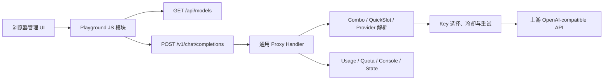
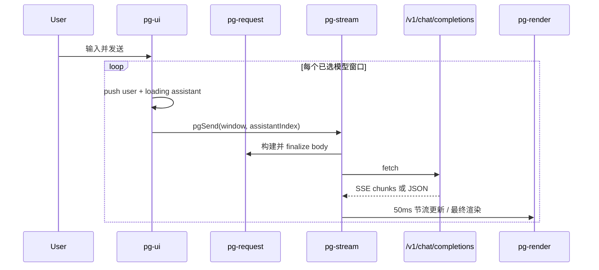
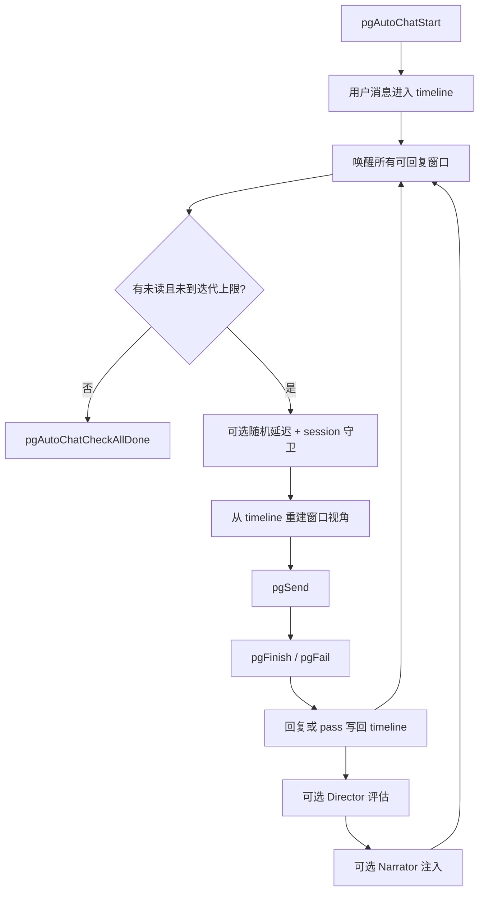

# TinyLab Playground 架构

> **文档定位：** Playground 前后端实现的 canonical 架构事实基线。
> **当前导航覆盖（2026-08-08）：** 后续 Utility 重组已将顶层 Download/GIF 收入 Utility；F5 打开 Utility 菜单，F4 直达 Gallery。下方 2026-07-26 导航条目保留为历史叙述，不代表当前入口。
> **最后核对（2026-10-02，单行摘要）：** Gallery Image DirectoryTree 排序选项 + autoplay 观看时长统计 + 气泡 TTFT 中途冻结修复 + 失败请求详情可达。历次核对流水已归档至 `docs/changelog/playground-architecture.md`；本行每次变更**替换**而非追加，过程叙述写入归档文件。

## 1. 范围与结论

Playground 是 TinyLab 管理 UI 中的可选交互式 LLM 客户端，覆盖以下能力：

- 1–4 窗口的普通并行模型对话；
- OpenAI-compatible 流式和非流式聊天；
- Markdown、KaTeX、代码高亮、Mermaid、HTML 预览和来源展示；
- 多 Agent 自动群聊；
- AI 场景/角色设定生成；
- Director/Narrator 剧情推进；
- 请求、响应和原始 SSE 调试视图。

Playground **没有独立的 Go 业务 handler**。后端专属代码只负责资源编译、静态路由和入口选择；模型请求复用 TinyLab 通用代理栈。



## 2. 事实优先级

出现冲突时按以下优先级判断：

1. 当前源码和测试；
2. 本文；
3. `web/playground/README.md`（仅作为入口）；
4. `handoff.md`、`docs/research/*`、历史提交信息（仅作历史背景）。

本文的关键结论都在第 14 节列出源码锚点。修改相关模块后，应同步更新本文的“最后核对”、接口、状态和风险章节。

## 3. 编译、嵌入与运行时门控

### 3.1 两层开关

Playground 同时受编译期开关和运行时开关控制：

| `playground` build tag | `enablePlayground` | 根页面 | Playground 静态路由 |
|---|---:|---|---|
| 无 | 任意 | `index-nopg.html` | 不注册 |
| 有 | `true` | `index.html` | 注册 |
| 有 | `false` | `index-nopg.html` | 仍注册 |

- 编译期：`web/embed_playground.go` 嵌入 `web/playground/static-pg`，`PlaygroundCompiled()` 返回 `true`。
- 无 tag：`web/embed.go` 只嵌入核心 `web/static`；`web/embed_playground_stub.go` 提供空 `PlaygroundStatic`。
- 运行期：`Config.EnablePlayground` 只影响根路径选择哪个 HTML 入口，默认值为 `true`。
- 旧 YAML 未出现 `enablePlayground` 时，加载逻辑补为 `true`。

因此，`enablePlayground=false` 是 **UI 可见性开关，不是能力或安全开关**。带 tag 的二进制仍能直接访问 Playground 资产，`/v1/chat/completions` 也始终存在。

### 3.2 构建方式

```powershell
# 默认构建：不含 Playground
go build -o tinylab.exe .

# 含 Playground
go build -tags playground -o tinylab-pg.exe .

# Windows 构建脚本
./build.ps1 -Playground
./build.ps1 -Variant tray -Playground
./build.ps1 -Variant webview -Playground -Strip
```

`build.ps1` 将 `-Playground` 转为 `playground` tag，并和 `tray`、`webview` tag 合并。`debug` 变体明确忽略 Playground。Playground 资产当前约增加 4 MiB，主要来自 vendor 库。

`internal/api/router.go` 在 `PlaygroundCompiled()` 为真时挂载：

- `/playground.css`；
- `/vendor/*`（playground vendor 目录优先，未命中回退 `web.Static` 主静态）；
- Playground 模块子目录脚本（`playground/`、`gallery/`）由 `feature.Assets(RootPlaygroundPG)` 派生；
- Utility 的 Editor/Log Reader/Text Review 脚本不属于 Playground 静态路由，统一由 `RootStatic` 的 `/utility/editor/*` 提供，默认与 `-tags playground` 构建均可用；`review.js` 是独立 Utility Review wrapper，Editor 不承载 Log Reader/Text Review tabs。

新增或重命名 Playground 模块时必须同时更新：

1. `web/playground/static-pg/` 对应子目录（当前为 `playground/`、`gallery/`）；
2. `internal/feature/feature.go` 对应 feature 的 `StaticFiles` manifest（路由由 `feature.Assets` 派生）；
3. `web/static/index.html` 的加载顺序。

Utility Editor/Log Reader/Review 资产变更则更新 `web/static/utility/editor/`、Editor manifest 的 `RootStatic` 条目及 `index.html`/`index-nopg.html` 两个入口；新增或变更 `review.js` 与 `editor_textreview_*` 时同时核对独立 `review` Utility tool。

`playground/playground.js` 当前只有兼容说明，不承载实现。

## 4. 后端架构

### 4.1 后端职责边界

Playground 后端相关职责只有三类：

| 职责 | 实现位置 | 说明 |
|---|---|---|
| 资源编译 | `web/embed*.go` | build tag 决定是否嵌入 |
| UI 入口与静态路由 | `internal/api/router.go` | 选择 index、挂载静态文件 |
| 运行时配置 | `internal/config/*`、`internal/api/settings.go` | 保存 `enablePlayground` |
| Gallery 图片查看器后端 | `internal/api/gallery/`（7 文件子包）、`internal/gallery/*`、`internal/mediaedit/` | **Go 包无条件编译、路由无条件注册**（`internal/api/router.go` `/api/gallery` 路由块与 `/api/gallery/edit/*`）；仅**前端静态资产**（`web/playground/static-pg/gallery*.js`）随 `-tags playground` 内嵌。zip/tiff 解析与转码，会话驻内存 LRU，Handler 字段 `h.sessions`/`h.media`（状态注入，无包全局变量） |

聊天、模型解析、轮转、冷却、重试、用量统计等均属于通用代理能力，不是 Playground 私有实现。Gallery 的**前端**同理：仅 `-tags playground` 构建内嵌其静态资产（无 tag 二进制经 `index-nopg.html` 不加载 Gallery 脚本）；但 Gallery/Editor/AI Review 的 **Go handler 无条件编译且路由无条件注册**（`internal/api/gallery`、`internal/api/editor`、`internal/api/textreview` 等），`-tags playground` 只裁剪前端资产、不裁剪后端 Go 包——feature 级编译裁剪属计划 §11（P5）未实施项，见 [`docs/archive-architecture.md`](archive-architecture.md) §9/§12 与 `docs/build-variants.md`。

### 4.2 Playground 使用的 HTTP 接口

| 接口 | 用途 | 鉴权 | Body 上限 |
|---|---|---|---:|
| `GET /api/models` | 侧栏模型选择器 | 管理 session；未启用密码时放行 | `/api` 统一 1 MiB（GET 无 body） |
| `POST /v1/chat/completions` | 普通聊天、群聊、摘要、场景生成、导演和旁白 | 无应用层鉴权 | 32 MiB |
| `POST /v1/generateContent` | Google Gemini 原生聊天（支持 thinkingLevel、多模态 inlineData、safetySettings） | 无应用层鉴权 | 32 MiB |
| `GET /api/playground/ffmpeg-status` | Playground 探测 ffmpeg 可用性 | 管理 session | 1 MiB |
| `POST /api/playground/media-prep` | Playground 媒体转码/预处理（音视频转 44.1k mono mp3、PDF/图片直传 inlineData） | 管理 session | 32 MiB |
| `POST /v1/images/generations` | Manual Image 远程图片生成（GPT/xAI/ModelScope） | 无应用层鉴权 | 32 MiB |
| `POST /v1/images/edits` | Manual Image 编辑类图片生成 | 无应用层鉴权 | 32 MiB |
| `GET /v1/tasks/{taskId}` / `POST /v1/tasks/{taskId}` | ModelScope 异步任务轮询（GET 为 Manual/Batch 查询，POST 为兼容入口） | 无应用层鉴权 | 32 MiB |
| `GET /api/image-proxy` | 同源代拉远程图片字节 | 管理 session | 32 MiB |
| `POST /api/comfyui/proxy` | ComfyUI 同源代理：仅本机 `127.0.0.1:{port}`、GET/POST、校验路径/query/redirect | 管理 session | 32 MiB |
| `POST /api/image-batches/plan` | Helper model 生成严格结构化 Natural prompt 计划 | 管理 session | 32 MiB |
| `POST /api/image-batches/transform` | 将每条 Natural prompt 转 Natural/Tag/JSON；保留 Natural 原文 | 管理 session | 32 MiB |
| `POST /api/image-batches` | 冻结 Prompt × Variant manifest 并启动后台顺序任务 | 管理 session | 32 MiB |
| `GET /api/image-batches` | 项目列表 | 管理 session | 32 MiB |
| `POST /api/image-batches/import` | JSON/YAML manifest 导入并持久化 | 管理 session | 32 MiB |
| `GET /api/image-batches/{projectID}` | snapshot；重新进入页面时先取此快照并 reconcile | 管理 session | 32 MiB |
| `GET /api/image-batches/{projectID}/events` | snapshot-first typed SSE | 管理 session | 32 MiB |
| `GET /api/image-batches/{projectID}/manifest` | manifest 快照 | 管理 session | 32 MiB |
| `GET /api/image-batches/{projectID}/assets/{assetID}` | 受路径校验保护的本地资产流 | 管理 session | 无 body |
| `POST /api/image-batches/{projectID}/pause|resume|stop` | 调度控制；stop 支持 `after-current`/`immediate` | 管理 session | 32 MiB |
| `POST /api/image-batches/{projectID}/retry/{promptID}/{variantID}` | 单 Variant retry | 管理 session | 32 MiB |
| `GET/PATCH /api/settings` | 读取/修改 `enablePlayground` | 管理 session | 1 MiB |
| `POST /api/anysearch/subdomains` | Search 模式子域查询 | 管理 session | 1 MiB |
| `POST /api/editor/open` | Editor 原生文件选择器打开文本文件 | 管理 session | 32 MiB |
| `POST /api/editor/rename` | Editor 原子重命名物理文件名 | 管理 session | 32 MiB |
| `POST /api/editor/save` | Editor 原子写保存文本文件 | 管理 session | 32 MiB |
| `GET /api/text-review/review-nodes` | AI 文本审核节点池列表 | 管理 session | 32 MiB（`/api/text-review/*` 独立组） |
| `POST /api/text-review/review-nodes` | 新增/更新节点（无 ID 创建、有 ID 更新） | 管理 session | 32 MiB |
| `DELETE /api/text-review/review-nodes/{id}` | 删除节点 | 管理 session | 32 MiB |
| `GET /api/text-review/split-patterns` | 章节切分模式列表 | 管理 session | 32 MiB |
| `POST /api/text-review/split-patterns` | 新增/更新切分模式（按 key） | 管理 session | 32 MiB |
| `DELETE /api/text-review/split-patterns/{key}` | 删除切分模式 | 管理 session | 32 MiB |
| `GET /api/text-review/prompt-default` | 内置默认清理 system prompt | 管理 session | 32 MiB |
| `POST /api/text-review/sessions` | 创建并启动审核会话（携带 `rawText`/`chapters`） | 管理 session | 32 MiB |
| `GET /api/text-review/sessions/{id}` | 会话完整快照 | 管理 session | 32 MiB |
| `GET /api/text-review/sessions/{id}/events` | SSE 实时进度流（chunk/status/node 事件） | 管理 session | 32 MiB |
| `POST /api/text-review/sessions/{id}/pause` | 暂停调度器（在途 worker 继续） | 管理 session | 32 MiB |
| `POST /api/text-review/sessions/{id}/resume` | 恢复调度器 | 管理 session | 32 MiB |
| `POST /api/text-review/sessions/{id}/stop` | 取消会话（标记 cancelled） | 管理 session | 32 MiB |
| `POST /api/text-review/sessions/{id}/chapters/{idx}/reprocess` | 单章重清理（必要时重启调度） | 管理 session | 32 MiB |
| `DELETE /api/text-review/sessions/{id}` | 取消并删除会话（防会话无界增长） | 管理 session | 32 MiB |
| `GET /api/gallery/edit/ffmpeg-status` | ffmpeg 可用性与动画编解码能力检测（6 字段 `{available,path,error,gif,webpAnim,webpAnimDecode}`） | 管理 session | 无上限（`/api/gallery` 组） |
| `POST /api/gallery/edit/probe` | 媒体文件元数据探针（宽/高/编码/时长/IsImage） | 管理 session | 无上限 |
| `POST /api/gallery/edit/subtitle-upload` | 字幕文件上传（.srt/.ass/.vtt，≤16MB） | 管理 session | 16 MiB |
| `POST /api/gallery/edit/start` | 启动 ffmpeg 编辑 job（转码/裁剪/字幕烧录） | 管理 session | 无上限 |
| `GET /api/gallery/edit/status/{jobId}` | 查询 job 进度与结果（含 outputURL） | 管理 session | 无上限 |
| `POST /api/gallery/edit/cancel/{jobId}` | 取消运行中 job（kill 进程树） | 管理 session | 无上限 |
| `POST /api/gallery/edit/extract-zip-entry` | 从服务器端 zip 会话或磁盘归档解压单条图片到临时文件（批量转换用） | 管理 session | 无上限 |
| `POST /api/gallery/edit/zip-outputs` | 将多个转换结果打包为 zip（可选 `zipName`） | 管理 session | 无上限 |
| `POST /api/gallery/edit/zip-writeback` | 原子回写压缩包中的转换结果 | 管理 session | 无上限 |
| `POST /api/gallery/open-folder` | 打开系统文件管理器目录 | 管理 session | 无上限 |

前端源码中的 `pgApiGet('/models')` 经宿主 `apiGet` 自动加 `/api`，实际请求是 `/api/models`。聊天相关代码直接 `fetch('/v1/chat/completions')`。

`/api/models` 返回：

```json
{
  "models": [
    { "id": "provider-prefix/model-id", "provider": "Provider Name", "type": "provider" },
    { "id": "combo-name", "provider": "fallback", "type": "combo" }
  ]
}
```

它聚合启用 Provider 的模型和 Combo；Provider 未配置模型时暴露 `prefix/*`。

### 4.3 通用代理调用链

`POST /v1/chat/completions` 的调用链为：

```text
api.Router
  -> proxy.Handler.ChatCompletions
  -> handleProxy
  -> Combo / QuickSlot / provider-prefix 解析
  -> rotation.Selector.SelectKey
  -> forwardWithRetry
  -> forwardUpstream
  -> streamResponse / non-stream response
```

后端只强制校验 JSON 和非空 `model`。`messages` 不做完整 schema 校验；其他字段原则上透传。发送上游前会：

- 将客户端模型名替换为真实上游模型名；
- 用选中的 Provider Key 重建 `Authorization: Bearer ...`；
- 流式请求设置 `Accept: text/event-stream`；
- 按 Provider 配置可注入 `stream_options.include_usage`；
- 对 Gemini OpenAI-compatible 请求按需补 `thought_signature`；
- 执行 key 轮转、冷却、重试、Combo fallback 和配额逻辑。

所有 Playground 模型请求都会进入通用 Usage、Quota、Console、运行时状态和 debug tracking 链路。

### 4.4 响应契约

流式成功响应：

- `Content-Type: text/event-stream`；
- `Cache-Control: no-cache`；
- `Connection: keep-alive`；
- `X-TinyLab-Provider`；
- `X-TinyLab-Key`；
- 按 chunk flush；默认不解析/改写 SSE 内容。

当 `NormalizeStreamChunks` 开启时，代理可将无 error 的 `"choices": null` 规范为 `[]`，这是“原样透传”的已知例外。

非流式响应强制为 JSON，保留上游状态码并附加 Provider/Key 响应头。TinyLab 本地代理错误统一为：

```json
{"error":{"message":"...","type":"proxy_error"}}
```

- TinyLab 监听 `127.0.0.1:<port>`；localhost 是主要安全边界。
- 管理面 `/api/*`（含 Gallery/Editor/Archive/FileTransfer）经 `AuthMiddleware`：`PasswordEnabled=false` 时直接放行，不进入 setup-required，也不因页面切换强制弹窗；开启密码保护后才要求 session-bound `X-CSRF-Token` + 本地 Origin/Referer + JSON/multipart Content-Type。`/v1/*` 与 Playground 静态文件不经过 `AuthMiddleware`（本地代理入口，无应用层认证；`/v1` 无配置修改能力——F-12 显式兼容决策）。
- `/v1/*` 支持 CORS preflight，并暴露 Provider/Key 调试响应头。
- 客户端提供的 Authorization 不会原样送给上游；上游认证始终换为 TinyLab 选中的 Key。
- Gallery/Editor/Archive/FileTransfer 资源按 **owner cookie**（`tinylab_owner`，HttpOnly，`internal/owner`）绑定会话：跨会话资源访问 403/404，浏览器只提交 `grantId`/`assetId`/`sourceId`（F-29）。

## 5. 前端模块拓扑

### 5.1 加载顺序

`web/static/index.html` 的顺序是运行时契约：

```text
vendor:
katex -> marked -> marked-katex-extension -> DOMPurify -> highlight.js -> mermaid

modules:
pg-i18n -> pg-core -> pg-state -> pg-markdown -> pg-request -> pg-stream
-> pg-comfyui -> pg-image-model -> pg-image-inspire -> pg-image-batch
-> pg-autochat -> pg-setup -> pg-director -> pg-search -> pg-render -> pg-ui-params
-> pg-presets -> pg-ui-reqleft -> pg-ui-events -> pg-ui -> pg-modal -> pg-lifecycle
-> gallery modules

```
模块文件位于 `static-pg` 下两个实现子目录：`playground/`（pg-*）与 `gallery/`（gallery-*）。Utility 的 File Editor、Log Reader、Text Review 位于 `web/static/utility/editor/`，不属于 Playground 静态资产；`review.js` 由 RootStatic 提供。

### 5.2 文件职责

> 表中 `pg-*.js` 均位于 `web/playground/static-pg/playground/`；Gallery 模块在 `gallery/` 子目录。Utility Editor/Log Reader/Review 模块不在本节清单内，见 §17。

| 文件 | 职责 |
|---|---|
| `pg-core.js` | 默认配置、localStorage key、宿主适配、限制和公共常量 |
| `pg-state.js` | 全局/窗口状态、Image generation history、Batch UI state、模型目录与持久化 |
| `pg-request.js` | body、内容/图片、SSE 行和错误解析 |
| `pg-stream.js` | 普通流式/非流式请求、图片旧路径兼容、generation-aware autosave |
| `pg-image-model.js` | Manual Canvas 请求构建 `pgImageBuildRequest`、单元规划 `pgImagePlanUnits`、单元执行 `pgImageExecUnit` 与统一资产归档 `finalizeImageAssets` |
| `pg-image-tasks.js` | Image 模式任务队列调度、FIFO 调度器 `pump()`、per-provider 并发在途控制、500ms 刷新计时器、任务选择与 Scoped View、Task Queue 侧边栏列表渲染 |
| `pg-image-inspire.js` | 仅使用 text helper model 的 Natural/Tag/JSON Prompt Inspire modal |
| `pg-image-batch.js` | Batch 三步 plan/transform/review、natural/tag/json 选择与提示词编译、snapshot-first SSE、pause/resume/stop/retry、Prompt × Variant viewer |
| `pg-comfyui.js` | 浏览器同源 ComfyUI proxy、workflow 参数与 history polling |
| `pg-render.js` | Manual Canvas、消息、来源、代码/Mermaid/HTML、debug 渲染、气泡 meta（详情按钮 + ttft/gt/in/res/ct/spd 两行） |
| `pg-ui.js` | 输入、消息操作、窗口/侧栏/参数（Top K / Min P / Max Tokens 8192）、Image mode routing |
| `pg-presets.js` | Parameters / System Prompt 预设：标题行按钮、列表弹窗（复用 Settings `.qs-modal*` 卡片；点击应用 / 右键删除 / 键盘 ↑↓ Enter Del Esc / 表头 `+` 保存当前）、`tinylab.playground.presets.v1` 读写 |
| `pg-ui-reqleft.js` | 左侧会话列表（Time + Title + 行删除，仅内存）、用量条目缓存（轮询 + SSE）、气泡详情弹窗、指标刷新 |
| `pg-modal.js` | `pgShowModal(html, cardClass)`（卡片类可替换）、调试、图片预览（含 zoom/pan/copy/save/reset）、模型选择等 modal |
| `pg-autochat.js` | 共享时间线、多 Agent 调度、摘要、群聊 modal |
| `pg-setup.js` | 场景向导、ScenarioProfile、导入导出和应用 |
| `pg-director.js` | Director 判断、Narrator 生成和生命周期 |
| `pg-search.js` | Search 模式：3 步 AI 编排、搜索设置面板、结果渲染 |
| `pg-lifecycle.js` | render/cleanup；Batch 离开页面只关闭 SSE，不取消后端任务；离开页面不中止在途聊天请求 |
| `pg-i18n.js` | Playground 独立中英文字典 + 共享 `T()` 回退 |
| `playground.css` | 全屏布局、Manual Canvas、Batch、侧栏、modal 与既有模块样式 |

### 5.3 宿主适配契约

`pg-core.js` 读取可选的 `window.PG_HOST`：

```text
apiGet(path) -> Promise<object>
toast(message, type?)
escapeHtml(value)
copyToClipboard(text, label?)
t(key, args?)
```

未注入时回退 TinyLab 管理 UI 的同名全局函数。此契约只覆盖模型目录和 UI 基础能力；聊天、场景和导演请求仍硬编码为 same-origin `/v1/chat/completions`，所以当前并非完全后端无关的组件。

## 6. 页面生命周期与布局

管理 UI 的 `navigateTo('playground')` 调用 `renderPlayground(container)`：

1. `pgLoad()` 从 localStorage 恢复状态；
2. `pgEnsureWindows()` 初始化到四个窗口；
3. `pgInitMarker()` 初始化 Markdown；
4. 注入 `.pg-layout`、消息 panes、输入栏和侧栏；
5. 立即渲染；
6. 异步获取模型目录后重绘。

离开 Playground 时 `cleanupPlayground()`：

- **Search 模式（`mode === 'search'`）：** 不 abort 请求（让搜索在后台继续运行），仅调用 `pgSaveSearchHistory()` 持久化 searchHistory + `pgSaveMode()` 保存模式，然后 early return。
- 停止自动群聊（`pgAutoChatStop`，仅在群聊运行中）；
- 停止 Recent Requests 左侧面板的轮询/SSE（`pgStopReqLeftPolling`）；
- reset Director/Narrator。

**在途请求不中止：** 普通模式下的流式/非流式 fetch 不被 abort，离开页面只是拆掉页面自身的订阅；回到 Playground 时 `renderPlayground` 复用同一份内存窗口渲染，仍在跑的流继续写入同一 assistant 消息对象（气泡在无 DOM 时静默跳过重绘）。主动中止只由 Stop 按钮（`pgStop`）、Clear 与 `pgClearWindowMessages` 触发。

CSS 在 Playground 页面禁用主容器滚动，只允许消息区和侧栏内部滚动；宽度不超过 900px 时切为单列。

### 6.1 模式切换

Playground 侧栏顶部的"窗口设置"面板标题右侧有四个模式按钮：**普通**、**自动对话**、**图片** 和 **搜索**。模式状态由四态字段 `pgState.mode`（`'normal'`|`'autochat'`|`'image'`|`'search'`）驱动，不额外持久化（重载后默认普通模式）。

- **普通模式**（`mode = 'normal'`）：侧栏不显示 Auto Chat、Director 和 Agent Identity 面板；输入栏不显示 auto chat 停止按钮。
- **Auto Chat 模式**（`mode = 'autochat'`）：显示全部面板；切换到 Auto Chat 时若窗口数 < 2 会 toast 警告并回退。
- **Image 模式**（`mode = 'image'`）：GPT/xAI/ModelScope 图片协议走 `/v1/images/*`；`comfyui` 协议的筛选器显示端口连接面板，不使用 TinyLab `/api/models` 的模型选择器。用户输入端口并连接后，前端通过 `POST /api/comfyui/proxy` 读取 ComfyUI `/system_stats`、`/models/*`、`/object_info/KSampler`、`/userdata` 和 `/history`，并请求同源 `GET /api/comfyui/active` 获取 Comfy Desktop 当前 Tab 路径；通过 `/userdata/workflows/...` 读取工作流，活动 Tab 优先，其余已保存与历史候选按来源、workflow id/规范化签名去重；无任何候选时可粘贴 API-format JSON。`pg-comfyui.js` 识别 `UNETLoader`/`CLIPLoader`/`VAELoader`/`KSampler`/`EmptyLatentImage`/`CLIPTextEncode`/`SaveImage` 输入生成下拉与输入框，生成时把输入栏文本写入正向 `CLIPTextEncode`，POST `/prompt` 后同源轮询 `/history/{prompt_id}`，经 `/view` 转 base64 data URL，复用消息图片渲染和 `/api/save-image`。代理固定 loopback 目标…

- **Search 模式**（`mode = 'search'`）：第四种模式，单窗口，侧栏显示模型选择 + 搜索设置面板（AnySearch API Key 输入 + Max Results 滑块） + Debug 面板。输入栏按钮文案为"Search"。发送时调用 `pgSearchSend()` 执行 3 步 AI 编排流程：分类（Categorize）→ 搜索（Search）→ 综合（Synthesize）。分类阶段将用户查询归类并提取搜索关键词；搜索阶段调用 `POST /api/anysearch/search` 代理执行 AnySearch JSON-RPC 搜索；综合阶段将搜索结果与原始查询合并，调用 LLM 生成最终回答。搜索中间结果（分类信息、原始搜索结果）在消息气泡中可折叠渲染。`pgState.search` 保存 `maxResults` 和 `apiKey` 配置。

切换入口为 `pgSetMode(mode)`，接收字符串参数，内部调用 `pgAutoChatToggle`。`pgAutoChatToggle` 在修改状态后同时调用 `pgRenderSidebar()` 和 `pgRenderPanes()`，后者负责布局切换和左侧面板的启停。


#### Image Batch Project 运行契约

Image Batch 与 Manual Canvas 分离：Step 1 Planning 生成结构化 prompt 计划，Step 2 Transform 按 `natural`/`tag`/`json` 生成可校验的最终提示词，Step 3 Review & Start 冻结 Prompt × Variant manifest，随后由后端 Scheduler 单并发执行。三种格式的语义固定为：natural 是描述句；tag 是不拆分子格式的 Booru 风格逗号标签（人物数量/主体/动作/环境/风格/质量，复合词使用下划线）；json 是结构化 `finalPromptObject` 加编译后的自然语言 `finalPrompt`，生成请求只发送后者，不把裸 JSON 直接发往图片 Provider。

Transform 返回必须保持输入条数、顺序及每条 `naturalPrompt` 原文；后端校验 `format`、非空 `finalPrompt`，tag 不得为 JSON/多行，json 必须有对象形式的 `finalPromptObject.subject`。manifest 的 `promptPlan.transformVersion` 标记转换模板版本。

Remote ModelScope 批量生成先提交 `X-Modelscope-Async-Mode: true`（该协议不强制补 `n:1`），提交结果支持 OpenAI `data[]` 与 ModelScope 的嵌套 `task_id`、`output.results`/`output_images`。只有拿到实际图片资产后才完成当前 Variant 并继续下一张；若仅返回 task id，后台通过 `GET /v1/tasks/{taskId}?model={provider/model}`，携带 `X-Modelscope-Task-Type: image_generation`，按 60 次、2 秒间隔、单次 10 秒超时轮询。`proxy.Handler.ImageTask` 委托已有 `TaskGet`，复用 Provider/Key 选择和请求头透传。

验证基线：`internal/imagebatch/adapters_test.go` 覆盖异步提交→轮询→资产、失败状态、同步 `output.results`、非 ModelScope 默认值；`internal/proxy/handler_test.go` 覆盖 GET task 路由、Provider/Key 转发和 `X-Modelscope-Task-Type` 透传。
#### 生命周期与重入契约（2026-08-11 审计修正）

- **Stage 1–3 草稿持久化**：`tinylab.playground.imageBatchDraft.v1`（`{schemaVersion, savedAt, stage, draft, plan, transform}`）；不保存 trace/API Key/Authorization/凭证；schemaVersion 不匹配则丢弃；create 成功后清除，plan/transform/create 失败保留。
- **执行项目引用（P0-2）**：create/open-project 成功后写 `tinylab.playground.imageBatchActiveProject.v1`（`{schemaVersion:1, projectId, savedAt}`）；Stage 4 Close 与模式切换不清除；仅新建项目（`pgOpenImageBatch`）与恢复引用 snapshot 404 时清除。**不自动重入**：`renderPlayground`/`pgSetMode` 均不触发 Batch 进入；`pgImageBatchRestore()` 仅在用户显式点击侧栏 Batch Project 时调用，按 内存 projectId → 内存规划态 → active-project 引用 → draft 顺序恢复（恢复 executing 时 GET snapshot → `uiMode='executing'`/`stage=4`、切单 Pane、开 SSE）；EventSource 只订阅，不取消后端任务。

- **统一 Close 入口（P0-3）**：`pgImageBatchCloseUI()` = `pgImageBatchCleanup()`（关 EventSource + timers）+ `pgImageBatchExitUI({preserveProject:true})`；`pgImageBatchClose` 保留为别名导出；侧栏 Close 按钮与 `pgSetMode` 模式切换均走此入口。
- **模式切换时序（P0-4）**：`pgSetMode(mode)` 在改写 `pgState.mode`/加载目标模式 windows **之前**，若 `oldMode==='image' && uiMode!=='idle'` 先 `pgImageBatchCloseUI({preserveProject:true})` 恢复 Image 布局，再执行切换；Batch active 时 `pgSetSplitCount` 直接 return（Ctrl+1~4 / split selector 不改变布局）。
- **侧栏 Batch Project ↔ Return**：Image 侧栏按钮在 Batch UI 激活（`uiMode!=='idle'`）时渲染为可点击 `Return`（i18n `pgBatchReturn`），点击 = `pgImageBatchCloseUI()`（cleanup 关 SSE/reconnect → ExitUI 恢复 Image 布局），保留 draft/plan/transform/projectId/后端执行；`pgOpenImageBatch()` 在 `uiMode!=='idle'` 时防御性退出，`uiMode==='idle'` 时先 `pgImageBatchRestore()` 恢复既有会话，失败才新建项目（新建流程同时清理旧引用）。Batch 激活期间侧栏 Clear Chat（`pgImageClear`）隐藏——对 Batch 无效；普通 Image 模式保留。
- **手动生成计数缝（UI/状态部分）**：Batch Project/Return 按钮右侧的数字输入（默认 1）表示普通 Image 每次提交的生成次数，仅用于 Manual Canvas：状态 = `w.config.imgSubmitCount`（`pg-core.js` `PG_DEFAULT_CFG` 默认 1，pgSave 持久化），读缝 `pgGetImageSubmitCount()`（clamp 1..99）、写缝 `pgOnImageSubmitCount(v)`；该值不进 API body（与 `imgN`/Batch Planning quantity=4 无关）；多图生成循环由另一工作流消费 `pgGetImageSubmitCount()` 实现。

- **Stop 显式双语义（P1-1）**：侧栏运行/queued/paused 态提供两个显式按钮——`pgImageBatchStop()`（`{mode:'after-current'}`，当前 variant 跑完后按失败统计收尾）与 `pgImageBatchStopImmediate()`（`{mode:'immediate'}`，运行中 variant 标 `interrupted`、项目 `canceled`）；后端 `controls.go` 仅接受这两种 mode。
- **Viewer 双层导航（P1-2）**：Stage 4 viewer 的 Prompt 上一层/下一层按钮（`pgImageBatchViewPrompt(index)`，越界禁用）+ Variant ←/→（`pgImageBatchViewVariant(±1)`，越界禁用）；侧栏树 variant 行点击（`pgImageBatchSelectViewer(pi, vi)`）直接定位。
- **新建项目清理（P1-4）**：`pgOpenImageBatch()` 先 cleanup 并清空 `projectId`/`snapshot`（同时清除 active-project 引用）再进入 planning，防止旧引用残留影响 OnEnter/SSE/新旧项目混淆。
- **Trace 脱敏（P1-3）**：`apiPostTrace()` 的 `responseRawBody` 统一脱敏后再截断——JSON body 经 `redactTraceValue` 递归脱敏（data URL → `[redacted data URL]`、敏感键 → `[redacted]`）后 `JSON.stringify`；非 JSON 经 `redactTraceText`（data URL 与凭证 `key:value` 值替换为 `[redacted]`、保留键名）；均受 256 KiB 截断（`... [truncated]` + `truncated=true`），内存级展示不落地。
### 6.2 Recent Requests 左侧面板

在**普通模式 + 单窗口**（`splitCount === 1`）时，布局自动切换为三列：

```text
grid-template-columns: 260px 1fr 320px
  列1: .pg-req-left    — Recent Requests 面板（固定窄宽，占满全部高度）
  列2: .pg-main         — 聊天窗口（右对齐，max-width 取消，填满列宽）
  列3: .pg-side         — 右侧栏（不变）
```

左侧面板通过 `pgRenderReqLeft(showReqLeft)` 构建，内容由 `pgRenderConvList()` 渲染。**列表是本次应用运行的会话列表**：行由客户端在发送时创建（`pgConvCreate`，文本请求取 `pgConvTitleFromText(body 中最后一条 user 文本)`，图片请求取图片提示词），持有该请求时刻的消息快照（`w.messages.slice()`，与实时窗口共享消息对象，流式写入即反映到行快照）。行只存内存、不落盘——退出应用或刷新即清空（见 §7）。

表格三列（第三列为删除操作）：

| 列 | 数据字段 | 显示格式 |
|---|---|---|
| 时间 | 行 `ts`（发送时刻） | `toLocaleTimeString()` |
| 标题 | 行 `title` | 前 20 个中文（含日文假名/兼容汉字）字符，或非中日文本的前 10 个单词；超长加 `…` |
| 删除 | — | 行内垃圾桶按钮（hover 显示，复用任务队列的动画垃圾桶 SVG）→ `pgConvDelete(id)` |

**点击切换对话：** 行 `onclick="pgSwitchConversation(id)"` 把 `w.messages` 替换为该行快照的副本（副本保证后续续聊不会污染快照），并高亮该行为 active。无对话的行（图片请求）提示 `pgConvUnavailable`；有在途生成时提示 `pgGenSwitchLock` 并不切换。行点击详情弹窗（`pgShowReqDetail`）已移除；请求/响应详情由响应气泡的详情按钮打开（见 §6.3）。

**删除行按钮对齐：** `.pg-req-table td` 显式 `vertical-align:middle`，`.pg-req-del-btn` 为 `inline-flex` 居中并置 `line-height:0`，两个 `svg` 置 `display:block`，使图标组中心与单元格中心重合——inline-flex 按钮默认按 `vertical-align:baseline` 对齐，不修正时图标组比行文字中心低约 4.8px。

**删除行：** 行右侧垃圾桶按钮调 `pgConvDelete(rowId)`，只从 `pgConvList` 移除该行——被删的若是活动行则清 `pgActiveConvId`（高亮消失，pane 内消息保持原样），`pgReqEntryCache` 的用量条目不受影响，因此已回复气泡的指标行仍可查看。按钮 `onclick` 带 `event.stopPropagation()`，不会触发行切换对话。列表仅存内存，删除不可撤销。

**用量条目缓存（气泡指标与详情弹窗的数据源）：** `pgReqEntryCache`（id → usage.Entry，上限 200，`pgMergeEntry`/`pgMergeTokenUpdate`/`pgMergeTTFTUpdate`）由 `GET /api/monitor/playground?limit=50`（10 秒轮询后备）+ SSE `/api/monitor/events` 的 `request-start` / `request-ttft` / `request-tokens` / `request-done` 事件喂入；processing 条目的 REST 快照用 `mergeProcessingEntryFields`（`monitor_state.js`，与 Monitor 列表同源）保证 live 字段不回退。`request-ttft` 分支（`pgMergeTTFTUpdate`，仅 `ttftMs>0` 且未冻结时写入）让 TTFT 在首 token 即冻结；`pgReqLeftSSE.onopen`（首连 + 自动重连）额外调 `pgFetchReqLeft()` resync，补回订阅空窗期（切页停订阅但流继续，见 §6.1）丢失的 done 事件。有在途条目时 500ms 定时器（`pgReqLeftProcTimer`）重绘气泡指标行。面板本身不直接渲染条目，轮询只服务缓存与指标刷新。

**来源过滤（物理分流 + 前端双保险）：** 后端 `recordUsage` 按 `X-TinyLab-Source` 头分流：`source == "playground"` 的请求写入独立的 `pgUsageBuf`（经 `Handler.SetPgUsage` 注入），其余写入 `usageBuf`；`GET /api/monitor/playground` 仅返回 `pgUsageBuf` 的条目 + playground 来源的 inflight 条目。`GET /api/monitor` 过滤掉 playground 来源的 inflight。前端 `pgFetchReqLeft` 使用 `/api/monitor/playground` 并再次过滤 `source === 'playground'` 作双保险。Playground 与管理端 Recent Requests 均始终捕获 payload/headers，不依赖 debug mode。

离开普通模式或切换到多窗口时，`pgStopReqLeftPolling()` 清除定时器并清空面板内容。`cleanupPlayground()` 也会调用此函数（不中止在途请求，见 §6.1）。

### 6.3 响应气泡的详情按钮与用量行

每条 assistant 消息（普通模式）在气泡下方的 meta 行里渲染：

1. **详情按钮（SVG `PG_ICON_INFO`）**：仅当消息带 `reqId` 时渲染。点击 `pgShowRequestInfo(i, idx)` → `pgShowReqEntry(id, msg)` 打开 `info-modal-overlay`（与 Usage 页 Recent Requests 详情同款），先取 `GET /api/monitor/entry/{id}` 拿完整 payload/headers，失败则退回内存缓存条目，再失败退回本地消息摘要（Status/Latency/Response Body），**不伪造数据**。
2. **两行用量指标**（`.pg-msg-metrics`）：表头行 `ttft gt in res ct spd` + 数值行，取自该请求的 usage 条目，用 `monitor_state.js` 的 `entryMetrics(e, nowMs)` 计算——与 Monitor Recent Requests 表格同一函数、同一格式（`formatTTFT`/`formatGenTime`/`formatGenSpeed`/`resDisplay`），因此同一请求在 Playground 与 Monitor 显示一致；处理中的条目由 SSE `request-tokens` 与 500ms 定时器刷新。

`reqId` 来自代理响应头 `X-TinyLab-Request-Id`（`internal/proxy/stream.go::setUpstreamIdentityHeaders`，见 `proxy-architecture.md`），由 `pg-stream.js::pgCaptureRequestId` 在 fetch 返回头阶段写入消息。该头覆盖失败路径——上游 4xx pass-through 与代理本地 502/503（`writeProxyError`）同样携带，**失败请求也渲染 ⓘ 按钮**并能打开详情弹窗查看错误。走 Custom Endpoint（绕过代理）的请求没有该头，因此不渲染详情按钮与指标行。meta 行重建由 `pg-render.js::pgRenderMsgMeta` 统一负责（渲染时与指标刷新时都走它）。

## 7. 状态模型与持久化

### 7.1 核心状态

```text
pgState
├─ splitCount / activeWin
├─ mode ('normal'|'autochat'|'image'|'search')
├─ models[]
├─ windows[4]
│  ├─ config / parameterEnabled / messages
│  ├─ streaming / abortCtrl
│  ├─ pendingContent / pendingReasoning / pendingSources
│  ├─ sseEvents / debugRequest / debugResponse
│  └─ replyCount / autoChatPending / lastReadTimelineId / ...
├─ autoChat
│  ├─ enabled / iterations / userName / delaySeconds
│  ├─ isRunning / abortFlag / session
│  ├─ timeline[] / timelineId
│  ├─ scenario
│  └─ director
└─ search
   ├─ maxResults
   └─ apiKey
```

每个窗口有独立模型、采样参数、system prompt、消息、网络状态和群聊游标。全局状态通过直接引用共享，UI 依靠显式 render/update 调用保持同步。

### 7.2 localStorage

| Key | 内容 | 是否完整恢复 |
|---|---|---|
| `tinylab.playground.cfg.v2` | window 0 config | 是 |
| `tinylab.playground.params.v2` | window 0 参数开关 | 是 |
| `tinylab.playground.presets.v1` | Parameters / System Prompt 预设（`{params:[{name,config,enabled}], system:[{name,text}]}`） | 是（坏 JSON/非数组条目降级为空表） |
| ~~`tinylab.playground.msg.v2`~~ | 不再写入：对话不持久化（内存态，退出/刷新即清空） |
| `tinylab.playground.autochat.v1` | 用户名、迭代、延迟、Director 配置 | 仅配置 |
| `tinylab.playground.scenario.v1` | 最近 ScenarioProfile | 是 |
| `tinylab.playground.search.history.v1` | searchHistory 列表（最多 50 条） | 是（不含 streaming 状态） |
| `tinylab.playground.search.active.v1` | activeSearchId | 是 |
| `tinylab.playground.imageBatchDraft.v1` | Stage 1–3 草稿（stage/draft/plan/transform） | 是（schemaVersion 校验；create 成功清除） |
| `tinylab.playground.imageBatchActiveProject.v1` | 执行中项目引用（仅 `{schemaVersion,projectId,savedAt}`） | 是（Stage 4 snapshot-first 重入入口；Close/模式切换不清除） |

关键语义：

- **只有 window 0 的普通 config 与参数持久化。** window 1–3 在首次进入时克隆 window 0 配置，但清空消息和运行态。
- `splitCount`、`activeWin`、timeline、群聊运行状态、回复计数和读游标不持久化。
- 普通保存有 500 ms debounce。
- **消息不持久化：** 消息列表、左侧会话列表（`pgConvList`）与行快照只存内存，`pgLoad`/`pgSave`/`pgSaveSync`/`pgSetMode` 均不写 `PG_MSG_KEY`（旧 key 不再读取，历史残留数据被忽略）。刷新或重启即回到空对话。
- ScenarioProfile 独立持久化，但应用到各窗口后的 window 1–3 配置本身不会直接持久化；刷新后可从场景 review 再次应用。
- **Search 模式持久化：** `searchHistory`（最多 50 条）和 `activeSearchId` 通过 `PG_SEARCH_HISTORY_KEY`/`PG_SEARCH_ACTIVE_KEY` 持久化到 localStorage。`pgSearchSend()` 创建 entry 后立即调用 `pgSaveSearchHistory()`；`pgLoad()` 中 mode 加载后立即调用 `pgLoadSearchHistory()` 恢复历史，search 模式下跳过 localStorage messages 加载改用 `pgSyncSearchMessages()` 从 searchHistory 同步消息引用。`cleanupPlayground()` 在 search 模式下 early return 不 abort 请求，仅持久化状态。渲染函数（`pgSearchFlushRender`/`pgSearchFinish`/`pgSearchFail`）检查 DOM 存在性，后台 tab 渲染时容器已被清空则静默跳过。

## 8. 普通多窗口聊天

### 8.1 请求流程



普通模式把同一用户消息广播到当前分屏中所有已选择模型的窗口；未选择模型的窗口跳过。任一窗口正在生成时，不允许发起新一轮普通广播。

发送按钮可见性：`pgRenderInputBar` 在没有任何窗口选择模型时把发送按钮设为 `disabled`（forbidden 光标），Enter 走 `pgOnInputKey` 不受该属性限制。`pgOnModelChange` 选模型后调用 `pgUpdateInputBar()` 重新渲染输入栏，使按钮即时可用；模型目录加载完成回调也补一次 `pgUpdateInputBar()`。

标准 body 包含：

- `model`、`messages`、`stream`；
- 可选 `temperature`、`top_p`、`top_k`、`min_p`、`max_tokens`（`top_k`/`min_p` 非 OpenAI 标准字段，多数 OpenAI 兼容上游接受；两者仅在开关开启且值 > 0 时发送，Google 分支不发送 `min_p`。`max_tokens` 默认值 8192，开关关闭时省略）；
- 滑块类参数的读数格式由 `pg-ui.js::pgParamValText(v, step)` 统一：步进 ≥1 的整数参数（`topK` 1–100 步进 1）显示整数（`20`），其余保留两位小数（`0.70`）；`pgOnParam(name, v, step)` 由滑块的 `oninput` 传入 `this.step`。Top K 在 Google 与非 Google 分支都是滑块；
- 可选 `frequency_penalty`、`presence_penalty`、`seed`；
- 可选 `thinking: {type: "enabled", budget_tokens: ...}`。

`systemPrompt` 在消息中没有 system role 时前插。启用图片时，用户消息在 `pgUserSend` 阶段即被构建为 OpenAI 多模态 content parts（`[{type:"text",...}, {type:"image_url",...}]`），同时清空 `imageUrls` 并关闭 `imageEnabled`，使输入区缩略图消失、图片缩略图随用户消息气泡渲染。`pgFinalizeBodyForSend` 中的 image 注入逻辑仅作为后备（当 `imageEnabled` 仍为 true 且 `imageUrls` 非空时触发）。

“Custom body”会先 `JSON.parse` 用户输入，但后续仍假定 `body.messages` 存在，并继续执行 system/image finalize；它不是任意 JSON 的完全原样透传入口。

### 8.1b Custom Endpoint

侧栏 Custom Body 面板上方有 **Custom Endpoint** 面板（`pg-ui.js` 的 `pgRenderSidebar`），包含开关（`useCustomEndpoint`）、Endpoint URL 输入框（`customEndpoint`）和 API Key 输入框（`customEndpointKey`）。启用后，`pgStream` 和 `pgSendNonStream` 的 fetch 目标从 `/v1/chat/completions` 改为用户填入的 URL，`Authorization: Bearer <key>` 头由用户填入的 Key 生成，不附带 `X-TinyLab-Source` 头。此功能**仅在普通模式生效**，auto chat / director / narrator / setup 等辅助请求仍走 `/v1/chat/completions`。Custom Endpoint 的请求不经过 TinyLab 代理栈（key 轮转、重试、combo 解析等），由前端直接 fetch。

### 8.2 流式解析

前端只处理逐行 `data:`：

- `[DONE]` 结束；
- JSON 的 `choices[0].delta.content` 进入内容；
- `reasoning_content`、`reasoning`、`thinking`、`thought` 进入思考内容；
- `sources`、`citations`、`web_search_citation`、`web_search` 进入来源列表；
- `pgMergeChunk` 同时兼容增量 chunk 和累计全文 chunk；
- **think 标签块**：`pgSplitStreamReasoning(text, w)` 在每次 flush 时只分类尚未分类的后缀，并把「块是否打开」记在 `w.thinkingBlockOpen` 上——开标签一旦出现，其后所有文本持续路由到 reasoning，直到闭合标签（无状态重推会导致首个 flush 之后 reasoning 冻结、文本泄漏进 content）。返回的 `tail`（跨 chunk 被截断的标签残片）与 `w.pendingContentLen`（已分类内容前缀长度）由 `pgStreamSplitContent(w)` 维护：残片留在缓冲不渲染，已分类前缀不再重扫；
- 50 ms 定时器将 pending 状态刷入消息 DOM（`pgStreamSplitContent` 分类 → 写 `msg.content`/`msg.reasoning` → 渲染）；同一次 flush 末尾调用 `pgScrollBottom(i)` 跟随输出，见 §8.4。

它不是完整 SSE 实现：不合并多行 data，也不处理 event/id/retry 字段。

### 8.3 渲染与安全

- Markdown 使用 marked；数学公式使用 KaTeX；代码使用 highlight.js。
- Markdown HTML 经 DOMPurify 清洗。
- 来源 URL 只允许 `http:` / `https:`。
- Mermaid 以 `securityLevel: strict` 初始化。
- HTML/SVG 预览使用 sandboxed iframe，不允许脚本执行；预览标题行右侧的展开按钮（`.pg-html-preview-expand`）把同一份标记放进 `pgShowHtmlPreviewModal` 的近全屏弹窗（1100px × 88vh，iframe 填满 body），弹窗内 iframe 保持同样的 `sandbox=""` 沙箱——只放大视口，不放开脚本。
- 代码块（含 HTML/SVG/Mermaid 源码块）由 `pgWrapCodeBlock` 包进 `.pg-code-block` 并在右上角挂复制按钮：点击写入剪贴板并 toast `pgCodeCopied`。按钮挂在 `pre` 的**外层**容器上——`pre` 横向滚动，按钮在其内部会被 `scrollLeft` 拖走；平时 `opacity:0`，悬停整块时显示。
- Provider/Key 响应头、实际请求、原始 SSE/响应进入 debug 视图。
- Reasoning 气泡使用 `pgRenderMarkdown` 渲染（与 content 相同的 Markdown 管线）；`.pg-thinking-body` 限制 `max-height:60vh` 并内部滚动，滚动位置由 §8.4 的跟随/保持规则管理；reasoning 结束后自动折叠（`collapsed` CSS class），用户可手动展开/折叠。
- 流式思考 spinner（`.pg-thinking-spinner`）在每次气泡重渲染后被 `pgRenderBubble` 写负 `animation-delay`（相位按 `msg.reasoningStartedAt` 续接），避免元素重建导致 CSS 动画每 50 ms 从 0deg 重启。
- 图片预览弹窗（`pgShowImageModal` → `pg-modal-overlay`）支持：鼠标滚轮缩放（以图片中心为轴心，最小不低于 auto-fit 比例）、鼠标拖拽平移、Reset 按钮复位、Copy 按钮（经同源 `/api/image-proxy` 代拉图片字节后 `ClipboardItem` 写入剪贴板，复制的是图片本身而非网址）、Save 按钮（`POST /api/save-image` 保存到 `imgs/` 目录）。弹窗尺寸 90vw × 90vh；auto-fit 由 `transform: scale(fitScale)` 单独负责缩放（大图缩小到正好填满、小图放大铺满窗口）。底部 footer 显示分辨率（`naturalWidth × naturalHeight`）、大小（`pgFormatBytes`，经同源 `/api/image-proxy` 取 Blob 的 `size`）、格式（Blob `type` 或 data: 的 mime）。输入区缩略图和聊天气泡缩略图均可点击打开预览。纯图片结果（无文本）下不再渲染空文本气泡。

### 8.4 流式滚动：只在底部时跟随（2026-09-22 修复）

流式期间消息列表与 reasoning 面板都在持续增长；每次 flush（约 20 次/秒）无条件 `scrollTop = scrollHeight` 会把两份容器都锁死在末尾，用户上滚查看早前内容会被下一次 flush 拽回，等于无法上滚。因此契约是**仅在容器位于底部时跟随**：

- `pg-render.js::pgAtBottom(el, slack=4)` 判定容器是否在末尾（`slack` 吸收排版取整的几像素）；
- `pgBindScrollPin(el, onChange)` 给容器挂一次 `scroll` 监听，滚动离开末尾即解钉、滚回末尾即重新钉住（绑定标记在元素上，标记状态放在会被重建的元素之外）；
- `pgFollowBottom(el, pinned, onChange)` 仅在钉住时 `scrollTop = scrollHeight`；
- 消息列表：`pgScrollBottom(i, force)`，钉住状态 `w.msgsPinned`（窗口对象，不持久化）。`force` 用于「新输出开始」的边界——`pg-stream.js::pgSend`（新请求）、`pg-ui.js::pgUserSend`（发送前渲染）、`pg-ui-reqleft.js::pgSwitchConversation`（切会话）；其余渲染（编辑/删除消息等）保持用户的阅读位置；
- reasoning 面板：气泡 HTML 每次 flush 整体替换，`.pg-thinking-body` 元素（连同 `scrollTop`）会被重建。`pgRenderBubble` 在替换前 `pgCaptureThinkingScroll` 取 `{top, pinned}`、替换后 `pgRestoreThinkingScroll` 应用：钉住时跟随末尾，未钉住时恢复该 `top`（否则每次 flush 都会跳回面板顶部）。钉住状态存 `msg.thinkingPinned`；reasoning 结束后的折叠面板不参与滚动。
- `pgScrollBottomReasoning` 已删除（搜索模式 `pg-search.js` 的三处调用同步改为 `pgScrollBottom`）；回归测试 `web/pg-scroll-pin.test.js`。

### 8.5 System Prompt 面板：只读预览 + V2 差异编辑器（2026-09-22）

普通模式侧栏 System Prompt 面板的文本框是**当前系统提示的只读预览 + 编辑入口**，提示本身只在差异编辑器里改：

- 面板始终渲染活动窗口的 `config.systemPrompt`（`pg-ui.js::pgRenderSidebar`），空值显示占位符 `pgSystemPromptPlaceholder`；应用 System Prompt 预设后同一面板重渲染，所以框内显示的就是**实际随请求发送的提示**（`pg-request.js` 在无 system role 时前插，见 §8.1）。
- 框为 `readonly`，`cursor:pointer` + 悬停高亮（`.pg-system-prompt:hover`），`data-tooltip` = `pgSystemPromptEditHint`。点击调用 `pg-ui-events.js::pgOpenSystemPromptEditor()`，打开 **Editor V2 差异编辑器**（`window.EditorV2Embed.openDiffModal`）——即 Utility → Text Review → Step 3「Prompt」按钮所用的同一个弹窗：左侧按右行 1:1 对齐的差异表 + 右侧 Monaco 编辑区 + 统计/↑↓/缩放/✕，footer 为 Cancel / Save。
- 参数：`title` = `pgT('pgSystemPrompt')`，`original` = `current` = 打开时的 `config.systemPrompt`（编辑过程中左侧表实时显示差异），`filename` = `system-prompt.txt`（Monaco 纯文本）。**Save** 把右栏文本写回 `config.systemPrompt` → `pgSave()` → `pgRenderSidebar()`（框内立即显示新值）+ toast `pgSystemPromptSaved`；**Cancel / ✕** 丢弃（无 toast）。未传 `showSaveDefault` / `showRestoreBuiltIn`：Playground 没有后端默认提示（内置默认即空串，embed 对空串 restore 直接忽略），故这两颗按钮不出现。
- `customMode`（Custom Body 开启）下框为 `disabled`：此时提示不参与请求，与面板其余控件的置灰语义一致。
- 编辑器缺失（`window.EditorV2Embed` 未加载）时 toast `pgSystemPromptEditorFailed` 并保留原值。
- `pg-ui-events.js::pgIsEditingTarget` 把 `readonly` 的 textarea 视为非输入目标：点开框后焦点短暂停在框上时，Alt/Ctrl 全局快捷键仍然生效。
- 注意：V2 弹窗不响应 Esc（与 Step 3 一致，属 embed 的既有行为），关闭走 footer 的 Cancel / ✕。
- 回归：`web/pg-presets.test.js`（框的只读/点击/内容、弹窗参数、保存回写与 toast、空提示仍可编辑、缺编辑器降级、`pgIsEditingTarget` 语义）。

## 9. 自动群聊

### 9.1 核心模型

自动群聊要求至少两个窗口。`pgState.autoChat.timeline` 是唯一事实源，每条记录概念结构为：

```text
{ id, sender, senderType, winIdx, content, ts, status }
```

`senderType` 包括 `user`、`agent`、`system`、`narrator`。每个窗口用 `lastReadTimelineId` 表示自己的消费位置。

发送前按窗口重建视角：

- 自己过去的发言映射为 `assistant`；
- 用户和其他 Agent 映射为带 `[sender]:` 前缀的 `user`；
- system 和 narrator 映射为 `system`；
- 未配置角色 system prompt 时使用默认群聊 prompt，并允许精确输出 `<pass/>`。

### 9.2 事件驱动循环



循环由 fetch 完成回调和 `setTimeout` 驱动，没有阻塞式 while：

- 延迟为配置值的 0.5–1.5 倍；被 `@AgentName` 提及时缩为基础延迟的 0.3 倍。
- `session` epoch 在 start/stop 时递增，使旧 timer 回调失效。
- 正常回复增加窗口 `replyCount`，写入 timeline 并唤醒其他窗口。
- 精确 `<pass/>` 写入 pass 记录，但不增加迭代数。
- 用户运行中发言可通过 `@name` 定向唤醒；没有 mention 时广播。
- 单窗口失败最多在 3 秒后重试一次；耗尽后仍推进群聊完成逻辑。

### 9.3 终止与摘要

所有窗口达到迭代上限，或没有 streaming/pending/未读工作时进入终止检查。Director/Narrator 在途时会阻止过早结束；Director 还可获得一次 final-chance 判断。

timeline 较长时可异步滚动摘要：旧记录被压缩为 system summary，并保留最近记录。摘要是 best-effort，失败静默，不阻塞主流程。

stop/finish 会 abort 请求、清 timer 和运行态，但保留 timeline 供当前页面查看，并追加终止原因；刷新或离开页面后 timeline 不恢复。

## 10. 场景生成

### 10.1 三种管线

场景向导至少要求两个已选模型窗口，支持：

| 模式 | 调用阶段 | 定位 |
|---|---:|---|
| M1 | 5 | 方向 → 架构 → 侧写 → 人物卡 → 客户端合成，控制最多 |
| M2 | 2 | 场景和侧写 → 完整人物卡，默认平衡模式 |
| M3 | 1 | 一次生成场景和完整人物卡，速度最快 |

所有阶段都调用 `/v1/chat/completions`，固定 `stream:false`。可显式选择生成模型，否则回退第一个有模型的窗口。请求有 AbortController 和阶段超时，输出通过去围栏、平衡括号等方式宽容提取 JSON。

### 10.2 ScenarioProfile

持久化/导入导出的事实 schema：

```text
schema: "tr.playground.scenario"
version: 1
createdAt
seedInput
scenario
  ├─ coreSeed / world / tone / openingSituation / relationships
characters[]
agents[]
  ├─ agentName / systemPrompt / params / paramsRationale / paramsOverridden
director
  └─ plotOutline / suggestedEveryNReplies
```

客户端将人物 `personaAxes` 映射为 temperature、topP、maxTokens、随机 seed 和 thinkingBudget，并将场景与人物卡合成为每个 Agent 的 system prompt。

应用 Profile 时，按“当前有模型的窗口”顺序映射 Agent，确认是否覆盖已有 system prompt，设置参数开关，保存 ScenarioProfile，自动启用群聊，并将 `openingSituation` 预填到输入框。

Profile 支持 JSON 导入/导出，导入校验 schema/version；单个角色支持 regenerate/enrich 后重新合成 Agent 配置。

## 11. Director / Narrator

Director 是群聊的可选 best-effort 子系统：

1. 每收到一次 Agent 完成事件（包含 pass）累加计数；
2. 达到 `everyNReplies` 后，用场景、大纲、最近 20 条 timeline 和旁白历史发起非流式判断；
3. 只有 `decision=advance` 才启动 Narrator；
4. Narrator 根据方向和最近 10 条上下文生成旁白；
5. 旁白以 `senderType=narrator` 写入 timeline，并唤醒所有 Agent。

Director 和 Narrator 模型可以独立配置；空值回退第一个有模型窗口。Director 超时 30 秒，Narrator 超时 60 秒。网络或解析失败通常静默跳过，不影响主对话。

## 12. 已知约束与风险

以下是当前实现事实，不代表都要在同一轮修复：

1. **Lite 入口漂移。** `index-nopg.html` 已落后于 `index.html`，当前还缺少 Download 导航、`download.js`、`info_common.js` 等非 Playground 内容；关闭 Playground 会连带改变其他模块。
2. **多窗口持久化不对称。** 只有 window 0 是普通聊天 reload 后的事实源；window 1–3 是临时态。
3. **运行时开关不是安全边界。** 它只切换入口 HTML，不撤销已编译资源，也不关闭 `/v1/*`。
4. **配置能力与编译能力可能不一致。** Lite 构建中 `enablePlayground` 仍可为 true，Settings API 也不暴露 `PlaygroundCompiled()` 能力位。
5. **路由清单漂移风险已收敛。** 路由清单由 `internal/feature/feature.go` manifest 派生，`internal/feature/feature_test.go`（`TestAssetsPlaygroundPGExactOrder` + `TestAssetsExistOnDisk`）锁定顺序与磁盘存在性；新增 JS 时仍须同步 manifest 与 `index.html`。
6. **Custom body 有隐式结构要求。** 缺少 `messages` 会在后续发送链触发前端异常。
7. **SSE 支持是 OpenAI 常用子集。** 不支持完整 SSE 多行/命名事件语义。
8. **群聊不恢复。** timeline、在途状态和多窗消息刷新后丢失。
9. **摘要模型固定取 window 0。** window 0 无模型时不会执行滚动摘要，即使其他窗口有模型。
10. **场景生成离页清理不完整。** `cleanupPlayground()` 没有显式 abort `pgSetupState.abortCtrl`；场景生成可能在离页后继续到完成或超时。
11. **辅助模型失败多为静默。** 摘要、Director、Narrator 的失败不阻塞主流程，但可观测性较弱。
12. **静态缓存策略不一致。** 核心静态文件显式 `no-cache`，Playground 专属静态路由未设置同样 header。
13. **`fs.Sub` 失败静默。** 嵌入根路径变更时可能只表现为前端 404。

## 13. 测试与验证现状

已有覆盖：

- `enablePlayground` 默认 true；
- 显式 false 的配置保存/加载；
- 旧配置缺字段时的兼容迁移；
- 通用代理的流式、非流式、重试和响应行为；
- Playground 前端 VM 契约测试（零依赖 Node VM + 手写 DOM stub，`node web/<name>.test.js`）：`web/pg-conversation-list.test.js`、`web/pg-presets.test.js`（参数默认值/请求体字段/预设存取/会话行删除/System Prompt 只读预览框与 V2 差异编辑器接线）、`web/pg-thinking-stream.test.js`（think 块跨 flush 路由、跨 chunk 标签残片、已分类前缀不重扫、spinner 相位续接）、`web/pg-scroll-pin.test.js`（流式滚动：底部跟随、上滚保持、滚回恢复、新消息重钉、reasoning 面板跨重渲染保持位置）、`web/pg-code-block.test.js`（代码块包装与复制按钮位置/点击复制、HTML 预览展开按钮与沙箱弹窗）、`web/pg-image-*.test.js`、`web/pg-media-render.test.js` 等。

当前缺口：

- `PlaygroundCompiled × EnablePlayground` 路由矩阵测试；
- Playground 静态资源及 JS 白名单完整性测试；
- `index.html` / `index-nopg.html` 同步约束测试；
- 前端 JS 单元测试；
- 浏览器集成或 Playground E2E；
- 自动执行 `go test -tags playground ./...` 的 CI。

修改 Playground 时的最低建议验证：

```powershell
go test ./...
go test -tags playground ./...
go build -tags playground -o tinylab-pg.exe .
```

涉及前端交互时还应手工或用浏览器验证：普通流式、非流式、多窗、停止/离页、群聊、场景向导和 Director/Narrator。

## 14. 源码锚点

后端与集成：

- `web/embed.go`：无 tag 的核心静态资源与能力位；
- `web/embed_playground.go`：Playground 资产嵌入；
- `web/embed_playground_stub.go`：无 tag 空 FS；
- `internal/api/router.go`：路由、鉴权边界、静态挂载和入口矩阵；
- `internal/api/models.go`：Playground 模型目录（响应 `modelInfo` 含 `kind`/`imgProtocol`/`imgSizes`/`providerId`/`realModelId`/`note` 字段，按 `ModelDef.Kind`/`ImgProtocol`/`ImgSizes`/`Note`；`note` 供前端 `pg-modal.js` 模型选择项 hover 显示；`providerId`/`realModelId` 供图片尺寸编辑发送 PATCH）；
- `internal/api/settings.go`：运行时开关 API；
- `internal/config/types.go`、`internal/config/defaults.go`：配置结构和默认值；
- `internal/proxy/forward.go`、`internal/proxy/upstream.go`、`internal/proxy/stream.go`：代理契约；
- `internal/api/comfyui/register.go`：固定 loopback 的 ComfyUI JSON/图片代理与重定向端口约束；`internal/api/router.go`：受保护路由挂载、`feature.Assets` 派生的静态白名单路由和 loopback WebSocket CSP。
- `build.ps1`：Windows 构建矩阵。
- `internal/textreview/`：AI 文本清理会话引擎（`session.go`/`scheduler.go`/`cleaner.go`/`proxy_call.go`/`streaming_writer.go`/`events.go`，详见 §18）；
- `internal/api/textreview/`：`/api/text-review/*` HTTP handler + ramp-down 落盘 `nodepersister.go`；
- `internal/registry/text_review.go`：节点池/切分模式 CRUD；
- `internal/config/types.go` 中的 `TextReviewConfig`/`TextReviewNode`/`SplitPattern` + `defaults.go` 中的内置 split-pattern 注入。

前端：

- `web/static/index.html`：完整入口和硬依赖加载顺序；
- `web/static/index-nopg.html`：Lite 入口；
- `web/static/app.js`：导航和生命周期接入；
- `web/static/api.js`：`/api` 宿主适配；
- `web/playground/static-pg/pg-core.js`：公共契约；
- `web/playground/static-pg/pg-state.js`：状态与持久化（含 `pgLoadSearchHistory()`/`pgSaveSearchHistory()`/`pgSearchEntryToJSON()` Search 历史 localStorage 持久化、`PG_SEARCH_HISTORY_KEY`/`PG_SEARCH_ACTIVE_KEY`/`PG_SEARCH_MAX_ENTRIES` 常量）；
- `web/playground/static-pg/pg-comfyui.js`：ComfyUI 连接、动态工作流参数表单、`/prompt` 提交、`/history` 轮询、`/view` data URL 转换和图片保存。
- `web/playground/static-pg/pg-request.js`：请求体契约（含 `pgBuildImageBody` 按协议构建 images 请求体；GPT 分支新增 n（1..5）/ response_format（url/b64_json）/ output_format（png/jpeg/webp）/ output_compression（0..100，限 jpeg/webp，保留显式 0）/ user 字段；所有协议均保留 JSON `image_url` 传递 data URL，edits 端点同样以 JSON body 发送，无 multipart 转换；单图=字符串、多图=数组）
- `web/playground/static-pg/pg-stream.js`：网络和流生命周期（含 `pgSendImage` 根据 imgEndpoint 动态选择 endpoint（edits 走 /v1/images/edits，否则 /v1/images/generations）、`pgPollModelScopeTask` ModelScope 异步轮询、`pgSend` 创建左侧会话行、`pgCaptureRequestId` 从响应头绑定 `msg.reqId`）；
- `web/playground/static-pg/pg-autochat.js`：群聊事实源和调度；
- `web/playground/static-pg/playground/pg-image-batch.js`：Batch 三步向导（plan/transform/review）、Stage 4 viewer/sidebar renderer（`pgImageBatchRenderPane`/`pgImageBatchRenderSidebar`/`pgImageBatchRenderCanvas`）、SSE 订阅与 `pgImageBatchCleanup`、`pgImageBatchRestore` 显式恢复（替代 `pgImageBatchOnEnter`，仅由侧栏 Batch Project 点击触发，无自动重入）、`tinylab.playground.imageBatchDraft.v1`/`tinylab.playground.imageBatchActiveProject.v1` 持久化、显式 Stop immediate/after-current、Prompt×Variant 双层导航；`web/static/api.js` 的…
- `web/playground/static-pg/pg-director.js`：剧情推进；
- `web/playground/static-pg/pg-markdown.js`、`pg-render.js`：内容安全与渲染（`pg-render.js` 的 `pgMsgInnerHTML` 负责气泡内缩略图（含 image 模式气泡上方编辑输入图、右侧对齐）、空文本气泡剔除、loading 气泡秒级等待计数（`pgTickWaiting`/`pgEnsureWaitingTicker`））；
- `web/playground/static-pg/pg-ui.js`、`pg-modal.js`、`pg-lifecycle.js`：交互和页面生命周期（`pg-ui.js` 含 `pgRenderImageParams`/`pgGetImgProtocol`/`pgImgParamSelectWithEdit`/`pgImgSizeOptionsFor`/`pgOnImgSizeSelect` 图片参数面板与协议分支+Size 下拉编辑按钮+自定义尺寸输入、`pgRenderImageBlock`/`pgRenderInputThumbs` 图片附加 UI 与输入栏缩略图（image 模式发送前后位移）、发送时将输入图捕获到 `msg.images` 并清空 `config.imageUrls`；`pg-ui.js` 的 System Prompt 面板为只读预览框（`readonly` + `onclick="pgOpenSystemPromptEditor()"`，见 §8.5）；`pg-modal.js` 模型选择器支持 `kindFilter` 按 kind 过滤、Image Preview 弹窗 `pgShowImageModal`/`pgInitImageZoom`/`pgCopyImage` 含 auto-fit、footer 分辨率/大小/格式、经同源 `/api/image-proxy` 复制、图片尺寸编辑弹窗 `pgOpenImgSizesModal`/`pgSaveImgSizesModal` 调用 `pgApiPatch` 持久化 `ModelDef.ImgSizes`）；
- `web/playground/static-pg/playground/pg-ui-reqleft.js`：普通模式左侧**会话列表**（`pgConvCreate`/`pgConvTitleFromText`/`pgSwitchConversation`/`pgRenderConvList`，Time + Title 两列，仅内存）+ 用量条目缓存（`pgMergeEntry`/`pgMergeTokenUpdate`/`pgMergeTTFTUpdate`（`request-ttft`）/`pgEntryById`，轮询 + SSE + `onopen` resync）+ 气泡详情弹窗（`pgShowRequestInfo`/`pgShowReqEntry`，复用 `info-modal-overlay`）+ `pgRefreshBubbleMetrics` + 行删除 `pgConvDelete`；轮询/SSE 生命周期 `pgStartReqLeftPolling`/`pgStopReqLeftPolling`；
- `web/playground/static-pg/playground/pg-markdown.js`：Markdown/KaTeX/DOMPurify 管线 + `pgSplitStreamReasoning`/`pgThinkTagHold`（流式 think 块的跨 flush 状态路由与标签残片处理）；
- `web/playground/static-pg/playground/pg-stream.js`：`pgStreamSplitContent`（分类已到达文本 + `w.pendingContentLen` 前缀记账）、`pgFlushRender`（50 ms 刷帧）、`pgFinish`/`pgFail`（收尾分类、状态复位、`msg.status='complete'`）；
- `web/playground/static-pg/playground/pg-render.js`：`pgRenderBubble` 重建气泡后按 `msg.reasoningStartedAt` 续接 spinner 动画相位（`PG_SPIN_PERIOD_MS`）；
- `web/playground/static-pg/playground/pg-modal.js`：`pgShowModal(html, cardClass)`（卡片类可替换，预设弹窗复用 Settings 的 `.qs-modal`）、调试/媒体弹窗；
- `web/playground/static-pg/playground/pg-render.js`：`pgAtBottom`/`pgBindScrollPin`/`pgFollowBottom`/`pgScrollBottom`/`pgCaptureThinkingScroll`/`pgRestoreThinkingScroll`（流式滚动跟随与 reasoning 面板位置保持）、`pgRenderBubble` spinner 相位续接、`pgPostProcessCode`+`pgWrapCodeBlock`（代码块容器与复制按钮）、`pgRenderHtmlPreview`+`pgShowHtmlPreviewModal`（内联预览与展开弹窗）；
- `web/playground/static-pg/playground/pg-presets.js`：Parameters / System Prompt 预设（`pgPresetButton`/`pgPresetOpen`/`pgPresetApply`/`pgPresetSaveCurrent`/`pgPresetRemove`/`pgPresetDelete`/`pgPresetCapture`，`localStorage` `tinylab.playground.presets.v1`，`PG_PRESET_PARAM_KEYS` 为参数面板字段清单）；
- `web/playground/static-pg/playground/pg-ui-events.js`：`pgOpenSystemPromptEditor()`（System Prompt 面板的只读预览框点击入口 → `window.EditorV2Embed.openDiffModal`，保存写回 `config.systemPrompt` + 重渲染面板；见 §8.5）、`pgIsEditingTarget`（`readonly` textarea 不算输入目标）；
- `web/playground/static-pg/playground.css` 中的 `.pg-mode-toggle`、`.pg-req-left`、`.pg-req-table`、`.pg-preset-btn`、`.pg-req-del-*`：模式切换按钮、左侧面板布局与预设入口/删除控件（预设弹窗本体沿用 `style-settings.css` 的 `.qs-modal*`）。
- `web/playground/static-pg/pg-render.js` 中的 `pgMsgMetaInnerHTML`/`pgRenderMsgMeta`/`pgMetricsBlockHTML`：响应气泡按钮行（含详情 SVG 按钮）与 ttft/gt/in/res/ct/spd 两行（值来自 `web/static/monitor/monitor_state.js::entryMetrics`）；
- `web/playground/static-pg/pg-search.js`：Search 模式 3 步 AI 编排（分类→搜索→综合）、搜索设置面板、结果渲染（含 `pgSearchFlushRender()`/`pgSearchFinish()`/`pgSearchFail()` DOM 存在检查防御后台 tab 渲染、`pgSearchSend()` 创建 entry 后立即调用 `pgSaveSearchHistory()`）；
- `web/playground/static-pg/pg-state.js` 中的 `pgState.mode` 四态含 `'search'` 与 `pgState.search` 子树；
- `web/playground/static-pg/pg-ui.js` 中的 `pgSetMode` search 分支、`pgSearchSend` 调用入口、搜索设置面板渲染；
- `web/playground/static-pg/pg-render.js` 中的 search loading 状态与 searchRaw/searchClassification 折叠渲染；
- `web/playground/static-pg/pg-i18n.js` 中的 search 相关中英文键；
- `web/playground/static-pg/playground.css` 中的 `.pg-search-*` 样式类；
- `internal/anysearch/client.go`：AnySearch JSON-RPC API 客户端（`Search`/`GetSubDomains`/`Extract` 方法）；
- `internal/api/anysearch.go`：3 个 Search 模式 HTTP handler（`POST /api/anysearch/search`、`/subdomains`、`/extract`）；
- `internal/config/types.go` 中的 `AnySearchConfig` 结构体（`APIKey`/`MaxResults` 字段）+ `Config.AnySearch` 字段；
- `internal/config/defaults.go` 中的 `AnySearch.MaxResults` 默认值 5 回填。
- `web/static/utility/editor/editor-state.js`、`editor_workspace.js`、`editor_commands.js`、`editor_markdown.js`、`editor_layout.js`、`editor.js`、`editor_shell.js`、`editor-logs.js`：RootStatic Editor 的状态、IndexedDB/内存工作区、local commands/IO、Markdown preview/sanitization、Explorer/navigation/preview/TOC/status shell 与 Log Reader；Editor 的生命周期由 `suspendEditor`/`resumeEditor` 维护。
- `web/static/utility/editor/review.js` + `editor_textreview_*`：独立 Text Review Utility wrapper 与 4 步 wizard；不属于 Editor tabs。
- `web/static/app.js`：Utility tool selection、active header label、fresh-init landing 与 `suspendEditor`/`resumeEditor` 等 lifecycle hooks。
- `web/static/index.html`/`index-nopg.html`：RootStatic Utility Editor/Log Reader/Review script load order；默认 no-Playground build 也提供这些资产。
- `web/static/i18n.js`：Editor/Log Reader/Review 相关 UI 字符串。
## 15. 变更维护清单

| 变更类型 | 必查位置 |
|---|---|
| 新增/删除前端模块 | `static-pg/` 子目录、`internal/feature/feature.go`（StaticFiles manifest）、`index.html`、本文模块表 |
| 修改入口或运行时开关 | 两个 index、`serveUI`、Settings、路由矩阵测试 |
| 修改请求字段 | `pg-request.js`、`pg-stream.js`、proxy 透传/改写规则；改 Custom Endpoint 须同步 `pg-stream.js` 的 `pgStream`/`pgSendNonStream` fetch URL/headers 与 `pg-core.js` 的 `PG_DEFAULT_CFG`；Normal 模式新增参数（如 reasoning_effort）按此链路：`pg-core.js`（`PG_DEFAULT_CFG`/`PG_DEFAULT_PARAMS`/`PG_REASONING_EFFORT_WIRE` 映射）→ `pg-ui.js`（`pgRenderSidebar` 参数行）→ `pg-request.js`（`pgBuildBodyForWin` 请求体字段）→ `pg-i18n.js` 增补键 |
| 修改 Normal 模式参数面板 / 预设 | `pg-core.js`（`PG_DEFAULT_CFG` 的 `maxTokens`/`minP`、`PG_DEFAULT_PARAMS`、`pgBinIcon`）、`pg-ui.js`（`pgRenderSidebar` 参数行 + Parameters/System Prompt 标题行 `pgPresetButton`）、`pg-request.js`（`pgBuildBodyForWin` 的 `top_k`/`min_p`）、`pg-ui-events.js`（`pgOnParam(name, v, step)`：maxTokens 归一化 + `pgParamValText` 读数格式）、`pg-state.js`（`pgLoad` maxTokens 迁移）、`pg-presets.js`（`pgPreset*` 存取与应用、`pgPresetBodyHTML` 复用 Settings `.qs-modal*` 卡片、`pgPresetFocusIdx` 键盘导航、`tinylab.playground.presets.v1`）、`pg-modal.js`（`pgShowModal(html, cardClass)`）、`pg-i18n.js`、`playground.css`（`.pg-preset-btn` + `.pg-modal-overlay.show .qs-modal`）、`web/static/index.html` + `internal/feature/feature.go`（静态清单，两者必须同步）、回归 `web/pg-presets.test.js` |
| 修改 System Prompt 面板 / 差异编辑器 | `pg-ui.js`（`pgRenderSidebar` 的 `sysPrompt` 只读预览框 + `pgPresetButton('system')`）、`pg-ui-events.js`（`pgOpenSystemPromptEditor`：`openDiffModal` 参数与保存回写；`pgIsEditingTarget` 的 `readonly` 语义）、`web/static/utility/editor-v2/editor-v2-embed.js`（**共用 embed，改动会同时影响 Text Review Step 3**）、`pg-i18n.js`（`pgSystemPromptEditHint`/`pgSystemPromptSaved`/`pgSystemPromptEditorFailed`）、`playground.css`（`.pg-system-prompt`）、回归 `web/pg-presets.test.js` |
| 修改流式思考（reasoning / think 标签） | `pg-markdown.js`（`pgSplitStreamReasoning`/`pgThinkTagHold`：块状态路由与标签残片）、`pg-stream.js`（`pgStreamSplitContent` + `w.pendingContentLen` 前缀记账、`pgApplyChunk` 累积、`pgFlushRender`、`pgFinish`/`pgFail` 收尾与状态复位）、`pg-search.js`（同源 flush/finish 路径）、`pg-state.js`（`pendingContentLen`/`thinkingBlockOpen` 窗口字段与 clone 复位）、`pg-render.js`（`pgRenderBubble` 的 spinner 相位续接 `PG_SPIN_PERIOD_MS` 与 `playground.css` 的 `.pg-thinking-spinner` 周期对齐）、回归 `web/pg-thinking-stream.test.js` |
| 修改代码块 / HTML 预览渲染 | `pg-render.js`（`pgPostProcessCode` 分支、`pgWrapCodeBlock` 包装+复制按钮、`pgRenderHtmlPreview` 标题行与展开按钮、`pgShowHtmlPreviewModal`）、`pg-core.js`（`PG_ICON_EXPAND`）、`playground.css`（`.pg-code-block`/`.pg-code-copy`/`.pg-html-preview-title`/`.pg-html-preview-expand`/`.pg-modal.pg-html-preview-modal`）、`pg-i18n.js`（`pgCopyCode`/`pgHtmlPreviewExpand`）、回归 `web/pg-code-block.test.js` |
| 修改流式自动滚动 / 阅读位置 | `pg-render.js`（`pgAtBottom`/`pgBindScrollPin`/`pgFollowBottom`/`pgScrollBottom(i, force)`/`pgCaptureThinkingScroll`/`pgRestoreThinkingScroll`，`pgRenderBubble` 内先取后复原 reasoning 面板滚动）、`pg-stream.js`（`pgFlushRender` 调用、`pgSend` 置 `w.msgsPinned`，`pgFinish` 不再单独滚 reasoning）、`pg-ui.js`（`pgUserSend` 渲染前重钉）、`pg-ui-reqleft.js`（`pgSwitchConversation` 重钉）、`pg-search.js`（三处 `pgScrollBottom`）、`playground.css`（`.pg-thinking-body` 的 `max-height`/`overflow`）、回归 `web/pg-scroll-pin.test.js` |
| 修改群聊 | timeline schema、视角映射、终止守卫、Director hooks |
| 修改场景档案 | schema/version、导入迁移、localStorage、应用映射 |
| 修改持久化 | localStorage key/version、容量限制、多窗口语义 |
| 修改模型存活校验 | `pg-state.js::pgLoadModels` 拉取后 `pgPruneStaleModels()`（live id 集合校验全部窗口 + 停车窗口 + director 双模型 + setup 模型，失效清 `''`，`__comfyui__` 保留，变更后回写 + 重渲染 + toast）+ `pg-i18n.js::pgStaleModelCleared`（en+cn） |
| 修改 ComfyUI Image 协议 | `web/playground/static-pg/playground/pg-comfyui.js`、`pg-ui.js`、`pg-core.js`、`pg-i18n.js`、`playground.css`、`web/static/index.html`、`internal/api/comfyui/register.go`、`internal/api/router.go`（路由、静态白名单、CSP） |
| 修改渲染 | DOMPurify、URL 协议、iframe sandbox、Mermaid security；改 reasoning 渲染须同步 `pg-render.js` 的 `pgMsgInnerHTML`/`pgRenderBubble` 与 `playground.css` 的 `.pg-thinking-body` |
| 修改图片功能 | `pg-modal.js` 的 `pgShowImageModal`/`pgInitImageZoom`/`pgCopyImage`、`pg-render.js` 的 `pgMsgInnerHTML`（气泡缩略图 onclick、空文本气泡剔除、loading 秒级计数）、`playground.css` 的 `.pg-img-btn`/`.pg-image-row`；改保存或同源代理须同步 `internal/api/image.go` 的 `saveImage`/`imageProxy` 端点与 `/api/save-image`/`/api/image-proxy` 路由。保存链路含 PNG 元数据注入——`internal/api/image/register.go::saveImage`（`Metadata *imageMetadata` → `internal/image` 的 `AsciiJSON`/`InjectPNGText`，`ext==".png"` 时写 `prompt` tEXt）+ 前端 `pg-image-model.js`（`asset.meta`）/`pg-stream.js`（`pgAutoSaveImageArtifact` body.metadata）/`pg-modal.js`（`pgSaveImage` 按 url 反查 meta）；Gallery 元数据浮层见 §16 `gallery-meta.js` |
| 修改 Editor 文件标题重命名 | `web/static/utility/editor/editor_shell.js::renameCurrent`（先调用 `/api/editor/rename`，成功后更新工作区节点与标题；本地-only 节点仅更新 IndexedDB）+ `internal/api/editor/register.go::editorRename`（docDir-relative `fileId` / owner-bound `pathGrantId`，安全文件名校验、冲突检查、原子 `os.Rename`）+ `internal/pathgrant/pathgrant.go::Store.Rebind` + `internal/api/editor/register_test.go`（物理改名、冲突/路径名校验、grant 重绑定与改名后 Save） |
| 修改 Editor 文件选择、标题重命名与 HTML 预览安全边界 | `web/static/utility/editor/editor_shell.js`（`#ed-title` 唯一重命名入口、`pathGrantId` 优先、`__editorFilePickerBusy` 捕获层按键锁、HTML `srcdoc` 脚本/inline handler 清理）+ `web/static/app.js`（全局快捷键 busy guard）+ `web/static/utility/editor/editor_layout.js`（移除独立 `ed-action-rename`）+ `internal/api/editor/register.go`（picker grant 权威身份、rename/save 目标优先级）+ `internal/api/editor/register_test.go`（混合身份回归） |
| 修改 Image 模式或图片参数 | `pg-ui.js` 的 `pgRenderImageParams`/`pgGetImgProtocol`/`pgImgParamSelectWithEdit`/`pgImgSizeOptionsFor`/`pgOnImgSizeSelect`、`pg-request.js` 的 `pgBuildImageBody`、`pg-stream.js` 的 `pgSendImage`/`pgPollModelScopeTask`、`pg-core.js` 的 `PG_DEFAULT_CFG` 图片参数 + `pgApiPatch` 桥接、`pg-i18n.js` 图片 i18n key + `pgImgEditSizes`/`pgImgCustomSize` 系列、`proxy/handler.go` 的 `ImagesGenerations`/`PollTask` 及通用代理（`/v1/images/edits` 走同一代理链路）、`proxy/upstream.go` 的 `X-Modelscope-Async-Mode` header 转发、`api/router.go` 的 `/v1/images/generations`、`/v1/tasks/{taskId}`、`/api/image-proxy` 路由 + `PATCH /providers/{id}/models/imgSizes`、`internal/api/image.go` 的 `imageProxy` 端点 |
| 修改图片尺寸列表 | `pg-modal.js` 的 `pgOpenImgSizesModal`/`pgSaveImgSizesModal`/`pgResetImgSizesTextarea`/`pgImgBuiltinSizesFor`（弹窗编辑+保存）+ `pg-ui.js` 的 `pgImgParamSelectWithEdit`/`pgImgSizeOptionsFor`/`pgOnImgSizeSelect`（下拉渲染+自定义输入）+ `internal/api/providers_models_crud.go` 的 `updateModelImgSizes`（PATCH 端点）+ `internal/registry/models.go` 的 `UpdateModelImgSizes`（写入 `ModelDef.ImgSizes`）+ `internal/config/types.go` 的 `ModelDef.ImgSizes` 字段 + `internal/api/models.go` 的 `modelInfo.ImgSizes`/`providerId`/`realModelId` 回显 + `playground.css` 的 `.pg-img-edit-btn`/`.pg-img-custom-row` 样式 |
| 修改图片请求超时兜底 | `pg-stream.js` 的 `pgSendImage` 的 `imgTimer`（300s fetch 兜底 `pgFail`）、`pg-render.js` 的 `pgTickWaiting` 的 `pgSafetyNetMs`（300s loading 安全网）；改兜底阈值须同时调两侧并覆盖 4k 实际耗时上限；代理侧 keep-alive 见 `proxy-architecture.md` §8.7 的 `forward.go` keep-alive ticker 与 `compress.go` 绕过列表 |
| 修改模式切换或左侧面板 | `pgSetMode`、`pgAutoChatToggle`、`pgRenderPanes` 布局类、`pg-ui-reqleft.js`（会话列表 `pgConvCreate`/`pgSwitchConversation`/`pgRenderConvList` + 条目缓存 `pgMergeEntry`/`pgMergeTTFTUpdate`（`request-ttft` 冻结 TTFT）+ `pgReqLeftSSE.onopen` resync + 气泡详情 `pgShowReqEntry`）、`pg-render.js`（`pgMsgMetaInnerHTML`/`pgRenderMsgMeta`/`pgMetricsBlockHTML`）、`pg-stream.js`（`pgSend` 建行、`pgCaptureRequestId`）、`pg-lifecycle.js`（`cleanupPlayground` 不再 abort 在途请求）、`pg-state.js`（对话不持久化）、`info-modal-overlay`/`info_common.js`（详情弹窗基础设施）、`web/static/monitor/monitor_state.js`（`entryMetrics`/`mergeProcessingEntryFields`，与 Monitor Recent Requests 同源）、`.pg-req-left-mode`/`.pg-req-*`/`.pg-msg-metrics` CSS；改来源过滤须同步 `pg-stream.js` 的 `X-TinyLab-Source` 头与 `recordUsage` 的 `Entry.Source` 回填 + `Handler.SetPgUsage` 注入 + `api/monitor/register.go` `getPlaygroundUsage`；改详情弹窗须同步 `app.js` 的 `topOpenModal`/`dismissTopModal` 对 `pg-modal-overlay` 的 ESC 处理；改气泡↔请求绑定须同步代理响应头 `X-TinyLab-Request-Id`（`proxy/stream.go::setUpstreamIdentityHeaders` + 失败路径 `writeProxyError`/pass-through/`recordNoKeyFailure`）与 `api/router_proxy.go` 的 CORS `Expose-Headers`；改 Recent Requests 实时性须同步 SSE 事件处理（`request-start`/`request-ttft`/`request-tokens`/`request-done` 四类）与 `/api/monitor/events` 后端 |
| 修改 Image Batch Project 前端生命周期/SSE/重入（显式进出） | `pg-image-batch.js`（`pgImageBatchCloseUI` 统一 Close、`pgImageBatchRestore` 显式恢复无自动重入、`pgImageBatchStopImmediate`、`pgImageBatchViewPrompt` 导航、active-project/draft localStorage）、`pg-ui.js`（`pgSetMode` Batch 退出时序且不再自动重入；侧栏 Batch Project↔Return 切换、Batch 激活期隐藏 Clear Chat；`pgGetImageSubmitCount`/`pgOnImageSubmitCount` 手动生成计数缝）、`pg-core.js`（`imgSubmitCount` 默认 1）、`pg-lifecycle.js`（`renderPlayground` 不再自动重入）、`web/static/api.js`（`redactTraceText`/`redactTraceValue`）、本文 §6.1/§7.2、`docs/image_batch_project_flow_review.md` §15.4 |
| 发布 Playground 变体 | 无 tag/tag 测试、资源 200、完整首页手测 |
| 修改 Manual Image Canvas / Task Queue / Inspire | `pg-image-tasks.js`（任务队列、pump 调度、per-provider 并发）、`pg-image-model.js`（请求构建与单元执行原语）、`pg-image-inspire.js`、`pg-state.js`（`PG_IMAGE_KEY` 与 per-window generation/asset state）、`pg-render.js`（独立 Canvas 与 flattened history、视图源 `pgImageViewSource`）、`pg-ui.js`（Image routing、Task Queue / Recent Requests 侧栏容器、并发 Stepper）、`pg-stream.js`（generationId+assetId autosave）、`pg-i18n.js`、`playground.css`、`web/static/index.html`、`internal/api/image/register.go` |
| 修改 Image Batch Project | `internal/imagebatch/{types,paths,project_store,reconciler,manager,scheduler,remote_generator,comfy_generator,generator}.go`、`internal/imagebatch/*_test.go`、`internal/api/imagebatch/*.go`、`internal/api/router.go`（auth + 32 MiB exact/root routes）、`internal/proxy/handler.go`/`handler_test.go`（异步 ImageTask GET 委托）、`pg-image-batch.js`、`pg-lifecycle.js`、`web/static/index.html`、`PROJECT_MAP.md`、本文 Image Batch 运行契约 |
| 新增/修改 Search 模式 | `pg-search.js`（3 步 AI 编排）、`pg-ui.js`（`pgSetMode` search 分支 + 搜索设置面板 + `pgSearchSend`）、`pg-state.js`（`pgState.mode` `'search'` + `pgState.search`）、`pg-render.js`（search loading 状态 + 折叠渲染）、`pg-i18n.js`（search 键）、`playground.css`（`.pg-search-*` 样式）、`internal/anysearch/client.go`（JSON-RPC 客户端）、`internal/api/anysearch.go`（3 个 handler）、`internal/api/settings.go`（`anySearch` 字段流转）、`internal/api/router.go`（路由注册 + `feature.go StaticFiles manifest` 含 `pg-search.js`）、`internal/config/types.go`（`AnySearchConfig`）+`defaults.go`（`MaxResults` 默认值 5） |
| 修改 Search 状态持久化 | `pg-state.js`（`pgLoadSearchHistory()`/`pgSaveSearchHistory()`/`pgSearchEntryToJSON()`、`PG_SEARCH_HISTORY_KEY`/`PG_SEARCH_ACTIVE_KEY`/`PG_SEARCH_MAX_ENTRIES`、`pgLoad()` search 分支跳过 localStorage messages）、`pg-lifecycle.js`（`cleanupPlayground()` search early return、`renderPlayground()` 恢复后重新渲染）、`pg-search.js`（`pgSearchSend()` 即时保存、`pgSearchFlushRender()`/`pgSearchFinish()`/`pgSearchFail()` DOM 存在检查） |
| 修改/新增 Editor 功能 | `web/static/utility/editor/editor-state.js`、`editor_workspace.js`、`editor_commands.js`、`editor_markdown.js`、`editor_layout.js`、`editor.js`、`editor_shell.js`、`editor-logs.js`、`web/static/style.css`（Editor shell/workspace 样式）、`web/static/vendor/utility-editor/*`、`web/static/app.js`（Utility `suspendEditor`/`resumeEditor` 生命周期与 cleanup）、`web/static/auth.js`（Utility menu）、`web/static/i18n.js`、`web/static/index.html`/`index-nopg.html`、`internal/api/editor`（保持 `/api/editor/open|save`）`
| 新增/修改 GIF 编辑器页面（`web/static` 全局 SPA 页） | `docs/gif_implented.md`（实施入口，§4.3/§4.5/§4.6/§7/§8/§10 与 ADR 10-11）、`web/static/gif-editor/gif-editor-state.js`（`window.GifEditorCore`：constants/state/dom/modules/commands/cleanupFns + `registerModule`/`cleanupModules`/`resetSlices`/`releaseSource` + `bindStateEvents`；cleanup 注册表持久化，state 模块经 `registerModule('state', {cleanup})` 每次 teardown 移除 window 键盘块/清 spinner）、`gif-editor-import.js`（Import Modal：`openFromFile`/`bindEvents`/`cancel`/`cleanup` + `draftGeneration` 事务代数 + Import Modal 全量标签 `t(key,fallback)` 接线：GridSplitTitle/Scale/CenterGap/OuterMargin/EnableOuterGap）、`gif-editor-timeline.js`（虚拟化窗口 `timelineWindow`/`thumbCache`/`THUMB_CACHE_MAX`，容器委托交互 + `render`/`updateWindow`/`ensureVisible`/`setZoom`（20%–300%，与舞台 zoom 解耦））、`gif-editor-playback.js`（播放状态机 + `core.commands.focusFrame` 每 render 重注册 + `first`/`previous`/`play`/`pause`/`toggle`/`next`/`last`/`updateButtons`）、`gif-editor-export.js`（GIF/ZIP/精灵图三导出 + **export modal** `previewCache`/`setHandoff`/`openResultInGallery`（惰性 MediaBridge 登记）/`closeExportModal`；ZIP 走 Archive `assets→pack` + legacy 回退，帧资产失败/成功均释放；旧 `showResultModal`/`lastResultAsset` 已移除）、`gif-editor.js`（入口 `renderGifEditor`/`cleanupGifEditor` + 模板/cacheDom/`applyPageI18n`/`registerCoreCommands`/画布绘制；常量 `MAX_FILE_BYTES`/`EXPORT_MEM_LIMIT` 与 `checkExportMemory`；图片源 Edge Crop/Grid Slice 折叠面板 + Split Sheet Even/Uneven `state.splitMode` 持久化；模块内 `t(key,args,fallback)` 透传 `{N}` 占位符，四确认弹窗参数化；Split Sheet/Overlay/时间线 aria 标签走 t()）、`web/static/i18n.js`（`gifEditor*` 键，导出弹窗 `gifEditorSaveAsZip`/`gifEditorSaveAsGif`/`gifEditorOpenGallery`/`gifEditorClose`；确认键 `gifEditorConfirmDeleteRange`/`gifEditorConfirmKeepRange`/`gifEditorResizeConfirm`/`gifEditorIntervalDeleteConfirm` 用 `{0}..{N}` 占位符；另含 15 键（`gifEditorSetLatency`/`gifEditorGridSplitTitle`/`gifEditorEven`/`gifEditorUneven`/`gifEditorSplitX/Y`/`gifEditorCellWidth/Height`/`gifEditorCenterGap`/`gifEditorOuterMargin`/`gifEditorEnableOuterGap`/`gifEditorSplitBtn`/`gifEditorTextColor`/`gifEditorStrokeColor`/`gifEditorTimelineAria`）+ CN 修正 9 处（`gifEditorGlobalDelay`='设置延迟'、`gifEditorDelRange`='删除范围'、`gifEditorKeepRange`='保留范围'、ReduceFrame/IntervalDeleteTitle='间隔删帧'、Apply×2='应用'（BatchDelayBtn/IntervalDeleteBtn）、ExportTitle='导出'、BatchDelete='批量删除帧'）+ CN 补齐 5 键（MagicWandTitle/ApplyTrans/CancelTrans/ApplyDelay/CancelDelay））、`web/static/style.css`（`gif-*` 样式，`.gif-timeline-item` 绝对定位 + GIF 段末尾窄视口权威规则；旧 `.gif-result-overlay` 已移除）、`web/static/{index.html,index-nopg.html}`（第 6 按钮 + gif.js→gifuct-js→state→import→timeline→playback→export→editor 脚本序）、`web/static/app.js`（`case 'gif'` + cleanup）、`internal/feature/feature.go`（GIF `StaticFiles` 清单：6 模块 + 3 vendor）、`web/static/media-bridge.js`（导出结果登记生产者；`deliverPendingImports` 逐资产投递 + 拒绝/跳过重试）、`internal/api/gallery/edit_handlers.go`（`galleryEditUploadTemp` 保留请求 basename、`galleryEditZipOutputs` cleanUp 全路径释放）、`web/gif-editor-i18n-args.test.js`（零依赖 Node 合同测试：`{N}` 占位符替换 + 字符串 fallback 兼容 + smoke-flagged 键覆盖（14 个 `check()`——`gifEditorSetLatency` en/cn 与五 CN 标签非英文断言）、PROJECT_MAP §18.2/§24。`go test ./...` 全量（37 包）已通过；**未完成项（勿标完成）见 `docs/gif_implented.md` §10.2**（P4 浏览器冒烟未跑） |

## 16. Gallery 模块（图片查看器分页）

Gallery 是 playground 构建变体（`-tags playground`）下的图片查看器分页，绑定 F4 快捷键，UI 由 `web/playground/static-pg/gallery/gallery.js` 实现（约 827 行 vanilla JS，IIFE + `window.renderGallery`/`window.cleanupGallery` 入口）。

### 交互方式
- **拖拽**：drop 事件读 `DataTransferItem.getAsFileSystemHandle()` 拿 `FileSystemDirectoryHandle`/`FileSystemFileHandle`，立即调用 `requestPermission({mode:'readwrite'})` 前置授权（一次性系统弹窗，之后所有磁盘操作免确认），递归 BFS 遍历目录；不支持 FS Access API 时降级 `DataTransfer.files` blob。
- **粘贴**：优先调用后端 `POST /api/gallery/paste-paths` 读取 Windows 剪贴板 CF_HDROP 绝对路径（零弹窗）；若后端无路径（截图/非 Windows）则降级为 FSAA `clipboardData.items` blob。
- **“打开”**：优先调用后端 `POST /api/gallery/open-dir`（原生 COM IFileOpenDialog 目录选择器，返回绝对路径 + 递归文件列表，后续磁盘操作零弹窗）；后端不可用时降级 `showDirectoryPicker({mode:'readwrite'})` / `showOpenFilePicker({multiple:true, mode:'readwrite'})`，无 FS Access API 时降级 `<input type=file multiple webkitdirectory>`。

### 支持格式
`webp png jpg jpeg bmp tiff`（`tif` 同 tiff）。目录/单图/多图全部前端 `FsApi.BlobTracker.create(blob)` + `` 显示（浏览器原生 GPU 加速，BlobTracker 追踪防泄漏）。TIFF 因 Chromium/WebView2 原生不支持 `` 显示，走后端 `POST /api/gallery/tiff` 解码转 JPEG 后再显示。 video 区另支持 `mp4 webm ogv` 与 GIF/animated WebP（`gif`/`webp` 经 video pane 的 `` 浏览器原生播放、不转码，见 §5.2 前后端白名单）。

### 后端协作
zip、tiff 及文件系统操作需后端参与：
- **POST `/api/gallery/open-dir`**：后端调用 `fsutil.OpenDirectoryPicker()`（原生 COM 对话框），返回 `{dirPath, files:[{name,path,rel,size,kind}]}`（递归列出支持的图片/视频/zip 文件）。
- **POST `/api/gallery/list-dir`**：按给定目录路径返回文件列表（用于粘贴路径展开目录）。
- **GET `/api/gallery/file?path=`**：按绝对路径提供文件二进制（替代 FSAA `handle.getFile()`）。
- **DELETE `/api/gallery/fs`**：按绝对路径删除文件/目录（`{path, recursive?}`），Go 后端 `os.Remove`/`os.RemoveAll`，零浏览器权限弹窗。
- **POST `/api/gallery/zip-from-path`**：请求体为 JSON `{path}`，先解析并校验非空路径，再从磁盘路径直接创建 zip 会话（避免上传往返）；请求体错误或缺少路径返回 400。
- **POST `/api/gallery/zip-writeback`**：将 zip 会话字节写回磁盘原文件（`fsutil.AtomicWrite`）。
- **POST `/api/gallery/paste-paths`**：读取 Windows 剪贴板 CF_HDROP 格式文件路径（`fsutil.GetClipboardFilePaths()`）。
- **POST `/api/gallery/zip`**：上 zip 二进制（500MB 上限覆盖 `/api` 1MB 组级限制），返回 `{sessionId, manifest:{entries:[{path,size,kind}], total}}`；zip bytes 缓存于进程内纯 LRU 会话（`galleryMaxSessions=128`，无 TTL；`internal/api/gallery/session_store.go` 的 `h.sessions` Handler 字段）。；驱逐不再致命——前端 `rehydrateZipSession` 在 404 时按包源（`zipAbsPath`/`zipFileHandle`/`zipFile`）重建会话并迁移同包条目。
- **GET `/api/gallery/zip/{sessionId}/{entryPath:*}`**：从会话取 zip 内单张图二进制。`{entryPath:*}` 是 chi 通配匹配含 `/` 的路径；前端 `encodeURIComponent` 拼接。会话被 LRU 驱逐后返回 404，前端 `getZipEntryBlob` 触发 `rehydrateZipSession` 重传后重试一次。
- **DELETE `/api/gallery/zip/{sessionId}`**：删除整个 zip 会话（`galleryDeleteZipSession`，204 No Content，幂等）。前端 `releaseZipSessions` 在清空/移除包时 fire-and-forget 调用，使后端立即回收内存而非等 LRU 驱逐。chi 以更具体的非通配路由优先，与 `DELETE /zip/{sessionId}/*`（条目删除）共存。
- **POST `/api/gallery/zip/{sessionId}/touch`**：刷新会话 LRU 位置（`galleryTouchSession`，204；会话已驱逐则 404）。前端 `setActive` 在切到某包时 fire-and-forget 调用，使当前查看的会话不易被驱逐。
- **POST `/api/gallery/tiff`**：上 TIFF 二进制（50MB 上限），后端用 `golang.org/x/image/tiff` 解码后重编码为 JPEG 返回。解码前先解析 TIFF 头（IFD ImageWidth/ImageLength）预检尺寸（`internal/gallery/dimensions.go`，含 PNG IHDR/GIF/JPEG/WebP 头部预检），任一维度超过 `maxImageDim`（16384）即拒绝，防解压炸弹 OOM；解码后仍保留二次尺寸校验兜底（`internal/gallery/tiff.go`）。

### 全屏交互
进入全屏后**仅**键盘操作：`←` 前一张 / `→` 或 `Space` 下一张 / `Esc` / `Enter` 退出全屏 / `1`-`9` 设置 9 档间隔时间（按序映射到 1/2/3/5/10/15/30/60/120 秒）/ `a` 切换自动播放。capture 阶段绑定 keydown（`galleryState.keyHandler = onFullscreenKey`，`document.addEventListener('keydown', ..., true)`）以拦截 app.js 全局 F1-F6。

> 2026-07-19：除 1-9（间隔档位，全屏内仍硬编码不可自定义）外的全屏键经 `web/static/shortcuts.js` 注册中心分发，`onFullscreenKey` 与 `onGalleryKeyDown` 走 `Shortcuts.matchEvent('gallery.<actionID>', e)`：`gallery.prev`/`gallery.next`/`gallery.prev-folder`/`gallery.next-folder`/`gallery.toggle-autoplay`/`gallery.toggle-fullscreen`/`gallery.toggle-tree`/`gallery.exit-fullscreen`/`gallery.toggle-split`/`gallery.toggle-media`/`gallery.switch-focus`。视频激活时 `ArrowLeft/Right/Up/Down/Space/1-9`（媒体控制：倒退 10 秒、上一/下一视频、音量、暂停）保持硬编码，**刻意不纳入自定义**避免与全局 quickslot 1-9（弹出模型选择 modal）跨区域冲突；`Space`/`PageUp`/`PageDown` 仍走通用导览分支作为快捷的同义键。详见 §16.x（快捷键注册中心）与 §23“变更维护清单”。

> 2026-07-26：Gallery & Usage UI 矩形无缝化重构与交互优化：(1) Usage 和 Gallery 页面容器为 `gap: 0`、`padding: 0`、圆角 `border-radius: 0`，1px `--glass-border` 分割网格，Usage 页 `repeat(2, minmax(0, 1fr))` 保证分辨率/DPI 切换时 50/50 不破坏并重绘趋势图（SVG 堆叠柱）；(2) 视频 hover 控制栏单行，进度条非全屏时贴底常驻；(3) `gallery-io.js` 调用 File System Access API 发起 `requestPermission` 前先弹居中提示模态框 (`showPermissionNoticeModal`) 说明读写权限用途；(4) 全屏 `.gallery-bottom` 控制栏不再固定 `height: 42px`、为 `height: auto`，动态包裹 104px 缩略图与 42px 操作栏，仅当鼠标滑入底部热区时进度条与操作栏合体 Overlay 浮现。涉及 `web/static/style.css`、`web/static/monitor.js`、`web/playground/static-pg/gallery/gallery-layout.js`、`web/playground/static-pg/gallery/gallery-video.js`、`web/playground/static-pg/gallery/gallery-io.js`。

### 元数据侧边栏（gallery-meta.js，2026-08-10）

Gallery 图片/视频查看区的生成元数据为固定右侧侧边栏。`gallery-layout.js::buildPanelHTML` 在图片/视频 pane 各建一枚 `#gallery-meta-btn`（`GALLERY_ICONS.metaInfo`，按钮带 `gallery-meta-btn` class，开启态 `.active` 为实心 accent 填充，含全屏模式覆盖）与 `#gallery-meta-sidebar` 容器；点击按钮或 ESC 切换开合，**无 hover 触发**。侧边栏为 `#gallery-main` 的 flex 子项（`flex:0 0 33.333%`），开启时 `toggleMetaOverlay` 给 `#gallery-main` 加 `.gallery-meta-open`（CSS 驱动显隐），媒体元素收缩到左侧 2/3 并 `object-fit:contain` 等比缩放；split 双 pane 各自独立（`querySelectorAll`+`forEach` 安全）。内容随导航重渲染：`renderActive`/`renderActiveVideo` 末尾调用 `renderMetaSidebar(false)/(true)`；`bindEventsForCurrentLayout` 在布局重建后重新应用 `.gallery-meta-open` 并重渲染。

解析全在客户端（`gallery-meta.js`）：`readPNGTextChunks` 读 PNG tEXt 键值（重复 key 保留首个，越界保护）；`readMP4Metadata` 走 `moov→udta→meta` full-box 链，`keys` 盒以偏移 -8 取键名、`ilst` 按 1-based 索引映射键名并 UTF-8 解码值；`readItemMetadata` 经 `getItemBlob` 取 blob、失败回退 `fetch(mainURL)`，`_extractPromptMeta` 解析 `prompt` 并把同文件 `workflow` 键存为 `__workflow_graph`（据此显示 Workflow Yes/No）。`formatMetadataForOverlay` 渲染：Prompt 全量首显（TinyLab 记录取 `meta.prompt`；ComfyUI 图经 `_comfyPrompts` 三阶段提取——sampler/guider 输入链接（`inputs.positive/negative[0]`）→ `_meta.title` 关键词 → 无 CLIPTextEncode 时取最长 `inputs.prompt`（MiniMax H3 等自定义节点），负向提示词单独一行全量显示），其余内容（模型/参数/节点清单等）折叠进 `<details class="gm-more">` 可展开；侧边栏固定占 pane 1/3 宽，内部可滚动且无滚动条；Prompt/Negative Prompt 值可点击复制（`gm-copy` class + document 级 click 委托 `onMetaCopyClick`，`e.target.closest` + `textContent` 取原文，复用 app.js 全局 `copyToClipboard`，toast 提示）；所有值经 `escapeHtml` 转义后插入（无 innerHTML 注入面）。i18n 键 `gmMetaToggle`/`gmMetaLoading`/`gmMetaNone`/`gmPrompt`/`gmModel`/`gmParams`/`gmSource`/`gmNegative`/`gmDetails`（en/cn，`pg-i18n.js`）。

ESC 关闭走 capture 阶段：模块加载时注册 `document.addEventListener('keydown', onMetaOverlayKeyDown, true)`，侧边栏开启时对 ESC `stopImmediatePropagation` 并 `toggleMetaOverlay()` 关闭——阻断 app.js 的关机处理与 `onFullscreenKey` 的退出全屏（bubble 阶段 `onFullscreenKey`/`onGalleryKeyDown` 顶部另有同款分支兜底）；侧边栏关闭或有 modal 打开时原样放行，正常 Escape 行为不受影响。

### 缩略图
前端懒生成：IntersectionObserver 触发 → `createImageBitmap(blob)` + `OffscreenCanvas(THUMB_SIZE=300)` 等比例缩放 → `convertToBlob('image/jpeg',0.8)` → `FsApi.BlobTracker.create`；失败回退原 blob。

### AI Review（图片审核）

AI Review 从硬编码"广告审核"（`is_ad` 字段）泛化为通用二值判断审核系统。用户可配置提示词或通过调用 LLM 自动生成，提示词生成模型与视觉审核模型可分别选择，预设持久化到 `config.yaml`。LLM 返回字段统一为 `match`，同时向后兼容旧 `is_ad` 字段（`ParseReviewResponse` 按顺序回退 `matchField` → `match` → `is_ad`）。

#### 后端架构

- **`internal/gallery/review.go`**：定义 `ReviewStrategy`（`all`/`head-tail`）、`ReviewStatus`（`running`/`completed`/`cancelled`/`error`）、`ReviewResult`（`Index`/`Path`/`IsMatch`/`Reason`）、`ReviewResponse`（`Match`/`Reason`）类型；`ParseReviewResponse(body, matchField)` 解析 LLM 返回的 JSON，按 `matchField` → `match` → `is_ad` 尝试读取 bool 字段；`PromptGenSystemPrompt` 常量定义提示词生成器的 system prompt，`PromptGenUserPromptTemplate` 是用户消息模板，`DefaultUserPrompt` 是审核启动时的默认 user prompt。
- **`internal/api/gallery_review.go`**：`galleryStartReview`（`POST /api/gallery/review/start`）接受 `{sessionId, provider, model, systemPrompt, userPrompt, matchField, strategy, headSize, tailSize, concurrency}` 启动审核；`galleryReviewStatus`（`GET /api/gallery/review/status/{sessionId}`）返回 `{status, total, processed, failed, results}`（results 只含 `isMatch=true` 的条目）；`galleryCancelReview`（`POST /api/gallery/review/cancel/{sessionId}`）取消审核；`galleryGeneratePrompt`（`POST /api/gallery/review/gen-prompt`）接受 `{provider, model, judgeTarget}`，调用 LLM 生成审核提示词。审核引擎使用 worker pool 并发处理图片，每张图片经 `analyzeImage` → `resizeImage`（max 1024px）→ `sendVisionRequest`（经 `httptest` 调用 `/v1/chat/completions` 代理转发）→ `ParseReviewResponse` 解析结果。
- **`internal/api/review_presets.go`**：`listReviewPresets`（`GET /api/review-presets`）、`upsertReviewPreset`（`POST /api/review-presets` 创建/更新）、`deleteReviewPreset`（`DELETE /api/review-presets/{id}`）。
- **`internal/config/types.go:265-272`**：`ReviewPreset` 结构体（`ID`/`Name`/`SystemPrompt`/`UserPrompt`）；`Config.ReviewPresets` 字段（`config/types.go:290`）。
- **`internal/config/defaults.go:168-177`**：首次启动（`ReviewPresets == nil`）注入内置"广告审核"预设。
- **`internal/registry/review_presets.go`**：`ListReviewPresets`/`AddReviewPreset`/`UpdateReviewPreset`/`DeleteReviewPreset` CRUD 方法，线程安全（`cfgMu` 保护）。
- **`internal/api/router.go:306-309`**：`/api/review-presets` 路由块；`router.go:377`：`POST /api/gallery/review/gen-prompt` 路由；`router.go:374-377`：review start/status/cancel 路由；`router.go:401`：`pgJSFiles` 含 `gallery-review.js`。

#### 前端架构

- **`web/playground/static-pg/gallery/gallery-review.js`**（757 行，独立 IIFE 模块）：提供 `window.renderReviewPanel`（渲染审核面板）、`window.startReviewPolling`（800ms 轮询审核进度）、`window.loadReviewPresets`（加载预设列表）、`window.cleanupReview`（停止轮询）四个全局钩子。面板分配置态（预设选择、提示词生成模型选择、审核目标描述、生成提示词、审核模型选择、策略/并发/首尾参数、启动按钮、保存预设）和运行态（进度条、取消按钮、结果列表、过滤模式切换、重置按钮）。
- **`web/playground/static-pg/gallery/gallery-state.js:170-194`**：`reviewState` 对象包含 `active`/`status`/`total`/`processed`/`failed`/`results`/`sessionId`/`promptModelId`/`reviewModelId`/`judgeTarget`/`systemPrompt`/`userPrompt`/`matchField`/`availablePresets`/`selectedPresetId`/`strategy`/`headSize`/`tailSize`/`concurrency`/`reviewMode`/`pollTimer`/`originalIndices`。
- **`web/playground/static-pg/gallery/gallery-tree.js:189-192`**：审核面板渲染由 `gallery-review.js` 接管，此处只暴露容器（`<div id="gallery-review-section">`）并调用 `window.renderReviewPanel`。
- **`web/playground/static-pg/gallery/gallery.js:30-40,76-77`**：初始化时恢复运行中审核的轮询、加载预设；`cleanupGallery` 时调用 `window.cleanupReview`。
- **`web/playground/static-pg/gallery/gallery-fullscreen.js:471-474`**：`toggleReviewItemMark` 在全屏 review 模式下切换当前项的删除标记并前进。
- **`web/static/style.css:1996-2021`**：`.gallery-review-*` 样式类（按钮、输入框、选择框、进度条、结果列表、标签、字段、行等）。
- **`web/static/index.html:137`**：在 `gallery-tree.js` 后插入 `<script src="/gallery-review.js">`。

#### 数据流

1. 用户选择预设或填写审核目标描述 → 可选择"提示词生成模型"调用 `POST /api/gallery/review/gen-prompt` 自动生成 system prompt
2. 用户选择"视觉审核模型"、填写/确认 system prompt、选择策略/并发数
3. 点击 Start Review → `POST /api/gallery/review/start` → 后端启动 worker pool 并发处理图片
4. 前端每 800ms 轮询 `GET /api/gallery/review/status/{sessionId}` 获取进度
5. 完成后结果列表只显示 `isMatch=true` 的条目；用户可切换过滤模式（`reviewMode`）仅显示匹配图片
6. 预设可保存（`POST /api/review-presets`）或删除（`DELETE /api/review-presets/{id}`）

### 配套改动
- `internal/api/compress.go` `skipTypes` 追加 `image/tiff`
- `internal/api/router.go` `pgJSFiles` 数组追加 `gallery.js`
- `web/static/index.html` 增加 Gallery nav-item + `<script src="/gallery.js">`
- `web/static/app.js` 加 `case 'gallery'` / F6 快捷键 / `cleanupGallery` 钩子；F6 与 1-9 quickslot 经 `Shortcuts.matchEvent('global.goto-gallery' / 'global.quickslot-cycle-N', e)`；1-9 弹出 quickslot 模型选择 modal（`openQuickSlotModalByOrder(n, true)`，1s 无操作自动关闭）
- `web/static/i18n.js` 加 `gallery` 与 14 个 gallery 专用 key（en/cn）+ 20 个 `shortcut*` key（en/cn，对应 Settings > Shortcut Settings 弹窗）
- `web/static/style.css` 末尾追加 `.gallery-*` 段（约 35 行）
- `go.mod` 新增直接依赖 `golang.org/x/image v0.44.0`

### 媒体交接（MediaBridge，2026-08-06）

Gallery 是媒体交接链路的**消费者端**。生产端（Download `playVideo`、GIF 编辑器导出、未来 Archive pack 输出）统一经 `web/static/media-bridge.js`（`MediaBridge`）登记资产并请求打开 Gallery；Gallery **唯一**的外部导入入口是 `gallery-io.js::galleryImportAssets(assets)`——外部代码不再直接写 `galleryState`、不再传绝对临时路径。契约与生产端细节见 [`docs/archive-architecture.md`](archive-architecture.md) §7/§8；本节只记录 Gallery 侧的消费实现：

- **导入分流**（`gallery-io.js::galleryImportAssets`）：`kind==='video'` 或 `video/*` mime → `buildBridgeVideoItem`（`kind:'plain'` 项带 `assetId` + `mainURL` 受控 URL，video 区直接播放）；`kind==='archive'` 或 zip mime → `importBridgeArchiveAsset`（`MediaBridge.getAssetBlob` 取 pack 字节 → 复用既有 zip 会话流 `addZipBlob` 展开 manifest）；其余按图片 → `importBridgeImageAsset`（`getAssetBlob` 取 blob 为普通项）。`_bridgeImported` 按 assetId 去重（失败回滚 claim，允许重试）；导入计数 toast `mediaBridgeImported`。
- **投递触发**（`gallery.js::renderGallery`）：渲染完成后调 `MediaBridge.deliverPendingImports()`——逐资产串行投递：每个资产单独调 `galleryImportAssets([asset])`，解析 `importedCount>0` 才 `consume`（明确接受）；被拒（rollback）或跳过（bytes 不可解析）的资产留在队列、下次投递重试；pendingImports 队列不被 `cleanupGallery` 清空，切走再切回仍补投递未消费 handoff。
- **加载顺序**：`web/static/index.html` 与 `index-nopg.html` 都在其他脚本之前加载 `<script src="/media-bridge.js">`；Gallery 脚本（`web/playground/static-pg/gallery*.js`）只存在于 index.html（playground 变体），桥接对无 playground 构建的 Download/GIF 仍可用。
- **i18n**：`mediaBridgeImported`/`mediaBridgeGalleryUnavailable`/`mediaBridgeAssetExpired`（en/cn，`web/static/i18n.js`）。

### 归档源条目（`sourceId`，P3 部分落地）

Gallery 现支持**两类 zip 包条目**并存（后端桥接 + 前端双路径）：

- **archive-source 条目**（`item.sourceId`，经 `POST /api/archive/sources` 登记）：读取走 `GET /api/archive/sources/{id}/entries/{path...}`（`gallery-io.js::getZipEntryBlob` sourceId 分支；404 = 源 TTL 过期 → `rehydrateZipSession` 以原包源重登记后重试）；删除按 sourceId 分组（`gallery-tree.js`：`DELETE /api/archive/sources/{id}` 释放整源、`gallery-fullscreen.js::_zipReplaceDeleteEntries` 经 `POST /api/archive/zip-replace` 原子写回删除条目 + `GET /api/archive/assets/{id}` 取结果）；AI Review 以 `sourceId` 启动/轮询（`gallery-review.js`，后端任务键 = sourceId）；媒体编辑 `_resolveBatchInput`/extract 送 `body.sourceId`（`gallery-edit.js`/`gallery-edit-batch.js`）。导入过滤用 `_ARCHIVE_IMG_EXTS`（镜像后端 `SupportedExts` 图片白名单——archive manifest 列出**全部**条目，过滤必须保持图片集与 legacy 会话 manifest 一致）。
- **legacy 会话条目**（`item.sessionId` / `zipAbsPath`，FSAA 拖放、目录选择、`zip-from-path` 粘贴、`/api/gallery/zip` 上传产生）：**完整保留**——读取 `GET /api/gallery/zip/{sid}/{entryPath}`、touch `POST /api/gallery/zip/{sid}/touch`、释放 `DELETE /api/gallery/zip/{sid}`、`zip-from-path`/`/api/gallery/zip` 上传（`gallery-io.js` 四处调用）、编辑 `/edit/extract-zip-entry`（zipAbsPath/sessionId 分支）/`upload-temp`/`zip-outputs`/`zip-writeback`。**旧专用端点未删除**（计划 §7.2"迁移完成后删除"未执行，两套并存，无 shim）；`gallery.js` 的 `zipSessionId` touch 只对 legacy 条目生效。

边界：**没有新增浏览器任意路径 API**——sourceId/sessionId 都是服务端签发的 token；`/edit/extract-zip-entry` 的 sourceId 分支经 `archiveBridge`（`internal/api/gallery/register.go`，router `SetArchive` 注入，nil 时全部流程回 legacy）严格校验后读取。

**已知缺口（P3 未覆盖，勿误标完成）：**
- **原生 picker 不含 .7z/.rar**：`gallery-layout.js:15` `input.accept = 'image/*,video/*,.zip'`——文件选择器无法选中 .7z/.rar。
- **用户导入 7z/RAR 无前端路径**：`gallery-state.js::isArchiveName` 已识别 `.7z`/`.rar`，但 `gallery-io.js` 的导入分类把一切 `isArchiveName` 命中都归为 `'zipfile'` 走 `/api/gallery/zip` zip-only 上传（`.7z/.rar` 上传会失败或产生垃圾条目）。7z/RAR 的 list/read 能力只在 `/api/archive` API 层可用（`/api/archive/sources` 可登记 7z/RAR 并返回 manifest），前端浏览器导入路径未接外部工具——计划 §8.2 的 "gallery-layout 文件 picker 同步 .7z/.rar" 与 §P3 的 7z/RAR 浏览**未实施**。

### 源码锚点
- `web/playground/static-pg/gallery/gallery.js`（playground 静态资源，由 embed_playground.go 注入）
- `web/playground/static-pg/gallery/gallery-review.js`（AI Review 独立面板模块）
- `web/playground/static-pg/gallery/gallery-meta.js`（元数据侧边栏：toggle 开关右侧 1/3 侧边栏、媒体左移等比缩放、Prompt 全显 + 其余折叠、客户端解析 PNG tEXt / MP4 元数据、capture 阶段 ESC 关闭）
- `internal/gallery/{gallery,zip,tiff,review}.go` + 测试
- `internal/api/gallery/`（7 文件子包：register.go/session_store.go/fs_handlers.go/zip_handlers.go/review_engine.go/review_handlers.go/edit_handlers.go）
- `internal/api/review_presets.go`（ReviewPreset HTTP CRUD）
- `internal/registry/review_presets.go`（ReviewPreset CRUD 数据层）
- `internal/api/router.go::Gallery` 路由块与 `pgJSFiles`
- `internal/api/compress.go::skipTypes`

### 变更维护清单
| 触发变更 | 涉及源码 |
|---|---|
| 修改 Gallery 后端 ZIP 路径导入 | `internal/api/gallery/zip_handlers.go::galleryZipFromPath`（解析/校验 `{path}` 后从磁盘创建会话）+ `internal/api/gallery/register_test.go`（成功、缺路径和 malformed JSON 回归测试）+ `web/playground/static-pg/gallery/gallery-io.js`（`onPaste`/`loadBackendPaths` 调用契约） |
| 修改磁盘删除/写回操作 | `web/playground/static-pg/gallery/gallery-fullscreen.js`（`deleteMarkedFromDisk`/`deleteNodeFromDisk`/`deleteCurrentVideo`）、`internal/api/gallery/fs_handlers.go`（`galleryDeleteFs`/`galleryZipWriteback`）+ `zip_handlers.go`（`galleryZipWriteback`）、`internal/fsutil/clipboard_*.go` |
| 修改 zip 解压格式或上传限制 | `internal/gallery/zip.go`、`internal/api/gallery/zip_handlers.go::galleryListZip`（500MB 上限） |
| 修改 TIFF 转码质量或格式 | `internal/gallery/tiff.go`、`internal/api/gallery/zip_handlers.go::galleryConvertTiff` |
| 修改 zip 会话 LRU 容量/过期/驱逐 | `internal/api/gallery/session_store.go`（`galleryMaxSessions`、`gallerySessionStore.put`/`get`/`touch`/`pin`/`unpin`、`galleryDeleteZipSession`/`galleryTouchSession` 处理器，现为 `h.sessions` Handler 字段） |
| 修改归档源条目（sourceId）双路径 | `web/playground/static-pg/gallery/gallery-io.js`（`getZipEntryBlob`/`rehydrateZipSession` sourceId 分支 + `_ARCHIVE_IMG_EXTS` 图片过滤）、`gallery-tree.js`（source 分组删除/释放）、`gallery-fullscreen.js`（`_zipReplaceDeleteEntries`/`_zipDeleteEntryGroup`）、`gallery-review.js`（sourceId 启动/轮询）、`gallery-edit.js`/`gallery-edit-batch.js`（extract 送 sourceId）、`internal/api/gallery/register.go`（`archiveBridge` + `SetArchive`）、`internal/api/archive/register.go::zipReplace`；**legacy 调用方保留勿删**（见 `docs/archive-architecture.md` §5.1/§12） |
| 修改 zip 会话重建/批量导入并发 | `web/playground/static-pg/gallery/gallery-io.js`（`rehydrateZipSession`/`getZipEntryBlob`/`runWithConcurrency`/`addZipBlob` 的 `zipFile` 保留）、`web/playground/static-pg/gallery/gallery-tree.js`（`setActive` 的 touch、`releaseZipSessions`） |
| 修改 Gallery 导入渐进加载（tree 先显/首图即显/包流式展开） | `web/playground/static-pg/gallery/gallery-io.js`（`walkDir` 纯遍历收 `zipfile`、`appendProgressiveItems`+`queueProgressiveItems`/`flushProgressiveItems`(120ms 合并)、`processZipFilesProgressive`(并发6)/`processBackendZipsProgressive`(`BACKEND_ZIP_CONCURRENCY`=12)/`fetchZipManifest`/`pushZipPackItems`、`loadBackendGrants`/`onOpenDirBackend`/`processBackendFileList`(zipJobs 参数)/`processCollectedEntries`/`onDrop`/`onPaste` 契约）、`autoresearch/bench.mjs`（管线基准，含 rebuild/scanned 工作量计数） |
| 修改自动播放档位 | `web/playground/static-pg/gallery/gallery.js::AUTOPLAY_INTERVALS` |
| 修改全屏快捷键集 | `web/playground/static-pg/gallery/gallery.js::onFullscreenKey` |
| 修改 Gallery i18n 文案 | `web/static/i18n.js` (`gallery*` 键) |
| Gallery 不再随 playground 编译 | `internal/api/router.go::pgJSFiles` 移除 `gallery.js`、`web/embed_playground.go`、`web/static/index.html` |
| 修改 AI Review 提示词逻辑 | `internal/gallery/review.go`（`ParseReviewResponse`/`PromptGenSystemPrompt`/`DefaultUserPrompt`）、`internal/api/gallery/review_engine.go`（`galleryGeneratePrompt`/`analyzeImage`/`sendVisionRequest`，经 `h.proxy.ChatCompletions` 调用） |
| 修改审核策略/并发 | `internal/api/gallery/review_handlers.go`（`galleryStartReview`/`runReview`/`selectReviewIndices`/`selectHeadTailIndices`）+ `review_engine.go`（`reviewTask`/`runReview` 引擎核心） |
| 修改审核前端交互 | `web/playground/static-pg/gallery/gallery-review.js`（`renderReviewPanel`/`startPolling`/`applyReviewFilter`）、`web/playground/static-pg/gallery/gallery-state.js`（`reviewState`）、`web/static/style.css`（`.gallery-review-*`） |
| 修改审核预设 CRUD | `internal/api/review_presets.go`、`internal/registry/review_presets.go`、`internal/config/types.go`（`ReviewPreset`）、`internal/config/defaults.go`（内置预设） |
| 修改元数据侧边栏 | `web/playground/static-pg/gallery/gallery-meta.js`（`toggleMetaOverlay`/`renderMetaSidebar`、`readPNGTextChunks`/`readMP4Metadata`/`readItemMetadata`/`_extractPromptMeta`（`__workflow_graph`）、`formatMetadataForOverlay`/`_comfyPrompts`/`_comfyNodeList`（Prompt 全显 + `<details>` 折叠）、`onMetaOverlayKeyDown` capture 阶段 ESC）、`gallery-state.js`（`metaOverlayEnabled`/`metaCache`）、`gallery-layout.js`（`#gallery-meta-btn`（含 `gallery-meta-btn` class）/#gallery-meta-sidebar + `.gallery-meta-open` 布局切换 + 重建后重应用）、`gallery-tree.js`/`gallery-video.js`（`renderActive`/`renderActiveVideo` 末尾 `renderMetaSidebar` 钩子）、`gallery-fullscreen.js`（`onFullscreenKey`/`onGalleryKeyDown` 顶部 ESC 分支）、`web/static/style.css`（`.gallery-meta-sidebar`（1/3 宽/无滚动条）、媒体 `object-fit:contain` 等比缩放、`.gallery-meta-btn.active` 实心 accent）、`pg-i18n.js`（`gm*` 键，含 `gmNegative`/`gmDetails`）、`internal/feature/feature.go`（StaticFiles 清单）+ `web/static/index.html`（script 标签） |

### Gallery 媒体编辑器（ffmpeg）

Gallery 提供了通过 ffmpeg 子进程对图片/视频进行转码、裁剪、字幕烧录的能力，并支持「转换文件夹/压缩包内全部图片」的批量处理（`gallery-edit.js`/`gallery-edit-operations.js`/`gallery-edit-batch.js` 三文件，`gallery-edit.js` 的 `_getSiblingImages` 按条目 kind 分组定位兄弟项、`_startBatch` 逐条解析临时磁盘路径再转码、`_resolveBatchInput` 复用 extract-zip-entry/upload-temp）。后端由 `internal/mediaedit/` leaf 包实现，HTTP 端点为 `internal/api/gallery/edit_handlers.go` 的 9 个 edit handler；动画输出与动画 trim 走 `video_to_gif`/`video_to_webp`/`video_anim_trim` 三 operation，FFmpeg 能力由 `ProbeFfmpegCaps` 分字段探测（`ffmpeg-status` 6 字段 `{available,path,error,gif,webpAnim,webpAnimDecode}`），缺 encoder/decoder 只禁用对应能力，后端 Start 前再复核。
#### API 端点（`/api/gallery/edit/*`）

| 端点 | 方法 | 请求体 | 响应 |
|---|---|---|---|
| `/edit/ffmpeg-status` | GET | — | `{available, path, error, gif, webpAnim, webpAnimDecode}`（6 字段能力位，`gif`=GIF encoder、`webpAnim`=`libwebp_anim` encoder、`webpAnimDecode`=animated WebP decoder） |
| `/edit/probe` | POST | `{path}` | `ProbeResult`（width/height/codec/duration/hasAudio/frameRate/isImage） |
| `/edit/subtitle-upload` | POST | raw body + `?name=` query | `{subtitlePath}`（abs path，写入 `%TEMP%/tinylab-subs/`） |
| `/edit/start` | POST | `StartRequest`（inputPath/operation/overwrite/**params/outputDir?/outputName?**） | `{jobId}` |
| `/edit/extract-zip-entry` | POST | `{zipAbsPath? | sessionId? , zipPath}` | `{tempPath}` |
| `/edit/upload-temp` | POST | raw body + `?name=` query | `{assetId}`（`tempPath` 已 410；以请求 `name` 注册 asset——`galleryEditUploadTemp` 保留 `frame_001.png` 类 basename 供后续 pack/zip 条目名，不再折叠成 upload.png） |
| `/edit/zip-outputs` | POST | `{assetIds:[...], zipName?, cleanUp?:bool}` | `{assetId, name, size}`（`cleanUp:true` 在成功与所有失败路径都释放输入帧资产——defer 全路径；前端经受控 `/api/gallery/file?assetId=` 下载，不再持有 `outputURL`/`zipPath`） |
| `/edit/status/{jobId}` | GET | — | job snapshot（status/progress/outputPath/outputURL/error） |
| `/edit/cancel/{jobId}` | POST | — | 204 No Content |

#### 操作类型与 params

- **image_transcode**：`ImageTranscodeParams{format, quality, scalePercent, stripMetadata}` — JPEG/PNG/WebP/BMP/TIFF/GIF 转码
- **video_transcode**：`VideoTranscodeParams{codec, container, qualityTier, preset, scalePercent, audioCodec, audioBitrate, stripMetadata}` — H264/H265/VP9/AV1 编码，含编码-容器兼容校验；`container` 含 `mp3/m4a/ogg/opus/wav/flac` 六音频-only 容器（`-vn` 音轨提取，`desc=audio_<container>`，容器-编码兼容校验，`none` 拒绝），`audioCodec` 含 `flac`（无码率）/`wav`（`pcm_s16le` 无码率）
- **video_trim**：`VideoTrimParams{start, duration, reencode, codec, qualityTier}` — 无损裁剪（`-c copy`）或重编码裁剪
- **video_subtitle**：`VideoSubtitleParams{subtitlePath, mode, language, fontSize, fontName, container}` — burn（烧录进视频，H.264+AAC 重编码）或 soft（作为独立字幕轨 mux，无损 remux）
- **video_to_gif**：`VideoAnimParams{start, duration, fps, width, height, cropLeft/Right/Top/Bottom, loopCount, quality, paletteColors, dither}` — 视频→GIF，单次 `split→palettegen→paletteuse` filtergraph；`-loop` 为 GIF muxer 选项（-1=不循环/0=无限/正数=次数）
- **video_to_webp**：`VideoAnimParams`（含 `lossless`）— 视频→animated WebP，`libwebp_anim` encoder；`-loop` 走 WebP muxer（0=无限/正数）
- **video_anim_trim**：`VideoAnimTrimParams{start, duration, segments[], quality, paletteColors, dither, lossless, loopCount}` — 动画图片（GIF/WebP）数字时间裁剪，输出扩展名=输入扩展名；GIF 走 palettegraph、WebP 走 `libwebp_anim`，动画输入绝不落入 H.264 `video_trim` 分支

#### 约束

- **absPath-only**：所有操作基于绝对路径（非沙箱），前端通过 `POST /api/gallery/open-dir` 原生对话框获取绝对路径后传给 edit 端点；输出文件也通过 `GET /api/gallery/file?path=` 提供访问。
- **输出路径（无 OutputDir）**：非覆盖且不指定 `OutputDir` 时在原文件同目录生成 `{base}_{desc}.{ext}`（仅单文件编辑路径；批量转换必带 `OutputDir`），冲突时追加 `_2`/`_3`；覆盖模式（`overwrite:true`）同格式直接写入原文件（`runJob` temp+rename 覆盖），跨格式输出到 `<dir>/<stem><newExt>` + 成功后删原文件（`removeOnSuccess`），实现真正的原地替换。
- **批量转换 / 兄弟匹配**：「Convert all images in the folder / zip」勾选时，前端 `_getSiblingImages`（`gallery-edit.js`）按 `kind` 分组定位当前项的兄弟项：`backend`→`rootDirPath`（回退 `absPath` 目录）、`fs`→`rootDirHandle` identity 相等、`zip`→`zipAbsPath` 或回退 `sessionId`、`plain`→无兄弟；FSAA/drag-drop 条目（`kind:'fs'` 与无 `zipAbsPath` 的 `kind:'zip'`）同样按上述键归组，不再因分组键缺失返回 `[]`。
- **输出命名**：`StartRequest.OutputName`（可选，无扩展名 stem）非覆盖时优先用作输出文件名 + `buildArgs` 的 `ext`，避免把临时输入名（`gallery-edit-upload-XXXX.png` / `gallery-edit-XXXX.png`）泄漏进保存的文件或 zip 内条目名；不传则 fallback 到 `InputPath` stem（旧行为不变，单文件编辑路径行为完全一致）。`zip-outputs` 的 `zipName` 经服务端 `filepath.Base` + `.zip` 强制后缀（防目录穿越/非 zip 后缀），客户端按上述分组键推导 `<原文件夹/压缩包名>_converted.zip`。
- **批量 UX 选项**（仅在「Convert all」勾选且非 Same Path 时出现）：(a) **Rename**（`ge-img-rename` + `ge-img-rename-name`）— 仅在压缩为 ZIP 时显示，自定义压缩包名 stem（回退到原文件夹/压缩包 stem + `_converted.zip`）；(b) **Sequential rename**（`ge-img-renorm` + `ge-img-renorm-prefix` 默认 `img` + `ge-img-renorm-digits` 默认 2）— 按兄弟序顺序将每条 `OutputName` 设为 `prefix` + 左补零序号，超出位数**自动扩位**（`_padNum` 不截断），扩展名仍由服务端 `buildArgs` 追加。
- **replace-original 守卫**：`_startJob` 与 `_startBatch` 均前置守卫 `overwrite && !canReplace` → 弹 `geNoDiskPath` 拒绝；`canReplace = kind==='backend' || (kind==='zip' && zipAbsPath && zipPath)`，覆盖 fs/plain/FSAA-dropped-zip 等无可写回原文件的情况（覆写临时文件会让用户误以为成功）。
- **Tree Batch Convert（image 左侧 Tree 顶部按钮）**：`gallery-tree.js` 标准 Header 有 `Batch Convert`（左对齐）+ `AI Review` 按钮，经 `window.openTreeBatchConvert`（`gallery-edit-batch.js`）打开瘦身版 Image Convert 弹窗——包含 Format/Quality/Scale 以及 **Fit to（限制长边）** 选项（移除 Compress 开关，默认统一原地保存）。目标 = `_treeBatchTargets()` 过滤 tree 全部 `galleryState.items` 中 `kind:'backend'`+`grantId` 可写项（fs/plain/zip 跳过并计数 `geTreeBatchSkipped`）；无可写项弹 `geTreeBatchNoWritable`。**Fit to 交互与处理**：Scale 右侧 Fit to 开关（`.toggle-switch`）与项目自定义数字步进输入框（`renderStepperHtml`，默认 1920，步长 64），开启时 Scale 滑块禁用置灰，每张图片保持比例将自身长边缩到输入的值（后端 `internal/mediaedit/args.go` 针对 `FitTo > 0` 优先生成 `scale='if(gte(iw,ih),target,-2)':'if(gte(iw,ih),-2,target)'` 且规整偶数尺寸，忽略 `ScalePercent`）；关闭时 Stepper 禁用置灰并恢复 Scale 滑块控制。完成后 `_refreshTreeBatchOutputs()` 同步 rel/path/name（跨格式）+ 吊销 blob URL + 重渲染 thumbs/tree/main。i18n：`geTreeBatchConvert/geTreeBatchSummary/geTreeBatchSkipped/geTreeBatchNoWritable/geFitTo/geFitToTip`（en+zh）。
- **打开目录（open-folder）**：完成结果区提供"打开目录"（`geBatchOpenFolder`）按钮 POST `/api/gallery/open-folder {path}`，复用既有 `fsutil.OpenInFileManager`（跨平台 explorer/xdg-open/reveal）。
- **zip 原位回写（writeback）**：`replace-original` 且源为后端 zip（`kind:'zip'` + `zipAbsPath`）时（单图在 `_onCompleted`、convert-all 在 `_zipWritebackBatch`），POST `/api/gallery/edit/zip-writeback {archivePath, entries:[{zipPath,filePath}]}`；`internal/gallery/zip_replace.go` `ReplaceZipEntries(data, map[string][]byte) ([]byte, Manifest, error)` 替换命中条目、未命中条目字节级保留（含 Method/Modified/Extra/comment），`galleryEditZipWriteback` 读取磁盘 → `ReplaceZipEntries` → `fsutil.AtomicWrite` 原子回写 + best-effort 清理临时输入。

#### 源码锚点

- `internal/mediaedit/types.go`：Job/ProbeResult/StartRequest/各操作 params 类型
- `internal/mediaedit/binary.go`：ResolveFfmpeg/ResolveFfprobe + `ProbeFfmpegCaps`（`FfmpegCaps`{gif,webpAnim,webpAnimDecode}，按绝对路径缓存 `ffmpegCapsCache`，`ffmpegListCodecs`/`parseCodecListOutput`）
- `internal/mediaedit/probe.go`：Probe(ffprobePath, path)
- `internal/mediaedit/args.go`：BuildImageTranscodeArgs/BuildVideoTranscodeArgs/BuildVideoTrimArgs/BuildVideoSubtitleArgs + BuildOutputPath + BuildVideoToGifArgs/BuildVideoToWebpArgs/BuildVideoAnimTrimArgs（+ normalizeAnimParams/parseSeconds/buildAnimTimeInputOptions/buildAnimVideoFilterChain/animDithers）
- `internal/mediaedit/executor.go`：RunFfmpeg + tailBuffer
- `internal/mediaedit/manager.go`：Manager.Start/Get/Cancel/ProbeMedia
- `internal/api/gallery/edit_handlers.go`：`h.media`（`*mediaedit.Manager`） + `resolveFfmpeg` + 11 个 edit/gallery handler（edit：ffmpeg-status / probe / subtitle-upload / start / status / cancel / extract-zip-entry / upload-temp / zip-outputs / zip-writeback；gallery：open-folder）；`galleryEditFfmpegStatus` 返回 6 字段能力位，`checkAnimCapability` 启动前复核动画能力
- `internal/gallery/zip_replace.go`：`ReplaceZipEntries(data, replacements map[string][]byte) ([]byte, Manifest, error)` — zip 条目替换/原位回写核心
- `internal/fsutil`：`OpenInFileManager(path)` — 打开目录复用（非 gallery 包内）
- `internal/api/router.go`：pgJSFiles 含 `gallery-edit.js`/`gallery-edit-operations.js`/`gallery-edit-batch.js`（加载顺序：gallery-edit.js → gallery-edit-operations.js → gallery-edit-batch.js，共享全局作用域，shell 声明共享变量，operations/batch 引用）
- `web/static/index.html`：`<script src="/gallery-edit.js">` → `<script src="/gallery-edit-operations.js">` → `<script src="/gallery-edit-batch.js">` 加载于 `gallery-fullscreen.js` 后、`gallery.js` 前

#### 变更维护清单

| 触发变更 | 涉及源码 |
|---|---|
| 新增/修改操作类型 | `internal/mediaedit/args.go`（新 Build*Args）+ `internal/mediaedit/types.go`（新 params）+ `internal/api/gallery/edit_handlers.go`（manager.go 的 `buildArgs` switch）（含 `video_to_gif`/`video_to_webp`/`video_anim_trim` 与 `ProbeFfmpegCaps` 能力门控） |
| 修改 Gallery video 区动画播放 | `web/playground/static-pg/gallery/gallery-state.js`（`SUPPORTED_VIDEO_EXTS` 增 gif/webp、`ANIMATED_IMG_EXTS`/`isAnimatedImg`）+ `gallery-layout.js`（video pane 增 ``）+ `gallery-video.js`（`renderActiveVideo`/`applyVideoPaneMode`/`replayAnim`/`stopAnim`）+ `gallery-fullscreen.js` + `gallery-tree.js` + `internal/api/gallery/fs_handlers.go`（`galleryVidExts`）+ `internal/gallery/gallery.go`（`SupportedExts`）+ `internal/gallery/zip.go`（`contentTypeForExt`） |
| 修改质量/编码参数默认值 | `internal/mediaedit/args.go`（CRF 表/jpegQuality/clamp）+ `internal/mediaedit/args_test.go` |
| 修改 ffmpeg 二进制解析 | `internal/mediaedit/binary.go` |
| 修改 ffprobe 探针逻辑 | `internal/mediaedit/probe.go` |
| 修改 job 生命周期/超时 | `internal/mediaedit/manager.go`（Start/runJob/cleanup） |
| 修改 edit HTTP 端点 | `internal/api/gallery/edit_handlers.go`（handler 方法 + Register 方法） |
| 修改前端编辑器 UI | `web/playground/static-pg/gallery/gallery-edit.js`/`gallery-edit-operations.js`/`gallery-edit-batch.js`（三文件共享全局作用域，gallery-edit.js 为壳 + 共享变量，operations/batch 分别承载单操作 UI 与批量流程）（`triggerMediaEditor` 对 assetId/grantId（非 zip）直通 `openMediaEditor`，不预先 `getBlob()`+`upload-temp` 全量传文件，打开延迟与文件大小解耦；ffmpeg 仅在 Execute 后运行） |
| 修改加载顺序 | `internal/api/router.go`（pgJSFiles 三文件顺序）+ `web/static/index.html`（三 script 标签顺序） |
| 修改批量转换兄弟匹配 | `web/playground/static-pg/gallery/gallery-edit.js`（`_getSiblingImages` 按 kind 分组：`backend`→`rootDirPath`/`fs`→`rootDirHandle`/`zip`→`zipAbsPath`/`sessionId`）+ `/edit/extract-zip-entry`+`/edit/upload-temp`（`_resolveBatchInput` 逐条解析临时磁盘路径） |
| 修改输出文件名 / 压缩包命名 | `internal/mediaedit/types.go`（`StartRequest.OutputName`）+ `internal/mediaedit/manager.go`（OutputDir+OutputName+ext 分支）+ `internal/api/gallery/zip_handlers.go`（`galleryEditZipOutputs` 的 `zipName` 经 `filepath.Base`+`.zip` 强制）+ `web/playground/static-pg/gallery/gallery-edit.js`（`_startBatch` 传 `outputName`、`_batchOriginZipName` 推导原文件夹/压缩包名、`_batchOriginStem`/`_captureBatchCfg` 读取 rename/normalise 开关、`_refreshBatchUXVisibility` 按开关+dest 切换行可见性）+ `web/playground/static-pg/pg-i18n.js`（`geRename*`/`geRenorm*`/`geBatchOpenFolder`/`geNoDiskPath` 等） |
| 修改单文件输出名（视频/图片） | `web/playground/static-pg/gallery/gallery-edit.js` `_startJob` 现统一推导 `origStem = _stripExt(_editCurrentItem.name)` 并在 `outputDir && !overwrite` 分支送 `outputName`；`replace-original` 经 `_zipReplacePending` 走 zip-writeback；后端单文件 overwrite 仍由服务端写回真 `absPath`。服务端零改动（复用 `StartRequest.OutputName`） |
| 修改视频缩放控件 | `web/playground/static-pg/gallery/gallery-edit.js`（`_renderVideoTranscodeForm` 的 `ge-vid-scale` 改 `<input type="range">` + `ge-vid-scale-val`/`ge-vid-scale-dims`；`_bindModalEvents` 新增 `vidScaleInput.oninput` 同步百分比+ `WxH`）；服务端 `internal/mediaedit/args.go` `BuildVideoTranscodeArgs` 的 `scalePercent` 仍 clip 10..200，契约不变 |
| 修改 zip 原位回写 | `internal/gallery/zip_replace.go`（`ReplaceZipEntries`）+ `internal/api/gallery/zip_handlers.go`（`galleryEditZipWriteback` 路由+handler、`gallerylib.CleanZipPath`）+ `internal/fsutil.AtomicWrite` + `web/playground/static-pg/gallery/gallery-edit.js`（`_zipReplacePending`、`_onCompleted` 单图 zip 分支、`_zipWritebackBatch` convert-all、`_openInFileManager`） |
| 修改打开目录按钮 | `internal/api/gallery/fs_handlers.go`（`galleryOpenFolder` handler + 路由）+ `internal/fsutil.OpenInFileManager` + `web/playground/static-pg/gallery/gallery-edit.js`（每个完成结果区按钮重新绑定到 `_openInFileManager(path)`）+ `pg-i18n.js`（`geBatchOpenFolder`/`geBatchOpenError`） |
修改 Set Path / Set Name / Uniform（图片弹窗） | `web/playground/static-pg/gallery/gallery-edit.js`（`_renderImageForm` 使用共享 `_renderSourceInfoRows`/`_renderSetPathRow`/`_renderSetNameRow`；`_refreshBatchUXVisibility` 按 toggle 启用/禁用输入；Uniform 仅 archive 可启用；`_captureBatchCfg` 读取 Set Name/Uniform；`_batchOriginZipName` 读取 Set Name）+ `pg-i18n.js`（`geSetPath`/`geSetName`/`geUniform`/`geArchiveHint`/`geSingleHint`/`geNamePlaceholder`/`geImagesCount`）+ `playground.css`（`.ge-header-left`/`.ge-icon-toggle`/`.ge-title-center`/`.ge-src-info`/`.ge-src-row`）+ `internal/mediaedit/manager.go`（`Start()` 新增 `!Overwrite && OutputDir=="" && OutputName!=""` → `relocateOutput` 分支） |
修改源信息路径（图片弹窗） | `web/playground/static-pg/gallery/gallery-edit.js`（`_editContainerPath` 返回容器完整路径或 `''`；`_editContainerParentPath` 返回父目录+分隔符；`_updateImageSourceInfo` 无路径时显示 `geDragNoPathHint`；`_isArchiveMode`/`_batchOriginLabel`/`_formatSize`）+ `pg-i18n.js`（`geDragNoPathHint`） |
修改视频弹窗 | `web/playground/static-pg/gallery/gallery-edit.js`（标题改 `Video Convert` 居中 + 设置齿轮；移除 `ge-dest` 单选 → `overwrite` 恒 false；`_updateVideoSourceInfo` 双行源信息 + `_editVideoPath`；`_getDestination` 替换为 `_getDestFromSetPath` 仅读 Set Path toggle；`_startJob` 简化移除 overwrite 逻辑，从 Set Name toggle 读 `customRename`；移除 `_zipReplacePending` 声明+`_onCompleted` zip-writeback 分支+`ge-dest` 单选绑定死代码）+ `pg-i18n.js`（`geVideoConvert`） |
修改下载视频项 | `web/static/download.js`（`playVideo` 的 `videoObj` 新增 `absPath: normalizedPath`，使 `kind:'plain'` 视频项获得磁盘路径，编辑/删除可操作） |
修改 trim 片段拖动约束 | `web/playground/static-pg/gallery/gallery-edit.js`（`_startTrimDrag.onMove` + `_moveNearestHandle` 新增 prevEnd/nextStart 跨片段约束） |
| 新增/修改 Tree 顶部 Batch Convert 原地批量 | `web/playground/static-pg/gallery/gallery-tree.js`（标准 Header 左对齐 Batch Convert 按钮 + 点击接 `openTreeBatchConvert`）+ `gallery-edit-batch.js`（`openTreeBatchConvert` 弹窗采用 `renderCustomSelectHtml` 自定义下拉与 `.toggle-switch` 开关，弹窗 body 设置 `overflow:visible; min-height:220px` 防裁剪；`_treeBatchTargets`（backend+grantId 可写过滤）/`_bindTreeBatchDialog`/`_refreshTreeBatchOutputs`（跨格式 rel/path/name 同步、重新绑定 `getBlob` 新后缀 rel + 视图刷新）/`_startBatch` 透传 `dest.overwrite`（覆盖不送 outputName）/`_pollBatchJob` 记 `overwritten`/`_onBatchComplete` 绑定新 `rel` 供 Open Folder 精确定位）+ `web/playground/static-pg/playground.css`（`.gallery-edit-row` 下拉样式）+ `internal/mediaedit/types.go`+`manager.go`（`Job`/`Snapshot` 增加 `Overwrite` 并在 `Start()` 透传）+ `internal/api/gallery/edit_handlers.go`（`galleryEditStatus` 依赖 `!job.Overwrite` 避免跨格式覆盖误移临时目录，保留原地输出目标文件）+ `pg-i18n.js`（`geTreeBatchConvert/geTreeBatchSummary/geTreeBatchSkipped/geTreeBatchNoWritable` en+zh） |

## 17. Editor 模块（File Editor）

当前 Editor 由 `web/static/utility/editor/` 的 RootStatic 模块提供，作为独立 Utility `editor` tool 渲染（`window.renderEditor`/`window.cleanupEditor`），不包含 Log Reader 或 Text Review tabs；旧两 pane raw/parsed、Clean/Review tab 及 Playground 资产路径仅在历史段落中保留。

### 核心功能
- **本地工作区**：`editor_workspace.js` 以 IndexedDB 持久化工作区，不可用时回退 in-memory；Editor 首次启动通过 `replaceDocTree` 以配置 `docDir` 的 `/api/editor/tree` 结果重建节点与目录展开集合，避免 Explorer 显示过期的 saved current/expanded 状态；后续会话内仍支持文件 CRUD、move、restore、current file、expanded metadata。
- **StackEdit-inspired shell**：`editor_layout.js`/`editor_shell.js` 提供 Explorer、导航/格式控件、单一主 textarea 与 Markdown preview、TOC/status/control toggles、查找/替换；这是本地 shell 合同，不是完整 StackEdit/cledit/PageDown。
- **本地 commands 与 IO**：`editor_commands.js` 提供编辑、撤销/重做与格式化命令；`editor_shell.js` 提供本地 Markdown import、Markdown/HTML 导出、打印与本地查找/替换；`editor_markdown.js` 负责 Markdown preview、TOC 与 sanitization。当前无 cloud/sync/accounts/comments/PDF/Pandoc，数学公式未在 Editor 中单独启用 KaTeX。
- **与独立工具的边界**：`editor-logs.js` 是独立 Log Reader Utility tool；`review.js` + `editor_textreview_*` 是独立 Text Review Utility tool，不是 Editor tabs。
- **后端 IO**：见下方 HTTP 接口表（分别负责打开/物理重命名/原子写内容）；标题重命名先完成磁盘改名，再同步本地工作区，Save 不承担改名职责。native picker 若返回 `pathGrantId`，该授权身份优先于同路径可能产生的 `fileId`。

### 导航
Editor 通过 Utility 菜单独立提供，默认与 no-Playground 构建均可用；fresh init 只显示 landing，选中工具后 active header label 显示当前工具。Editor/Log Reader/Review 仍是三个独立 Utility tools，不与 Gallery 互换，也不共享 tabs。

### HTTP 接口
| `POST /api/editor/open` | 原生文件选择器打开文本文件，返回 `{fileId?,pathGrantId?,name,size,content}`；native picker 的 `pathGrantId` 为权威身份 | 管理 session | 32 MiB |
| `POST /api/editor/rename` | 原子重命名 `{fileId?,pathGrantId?,newName}`；`pathGrantId` 优先，返回新身份 | 管理 session | 32 MiB |
| `POST /api/editor/save` | 原子写保存 `{fileId?,pathGrantId?,content}`；`pathGrantId` 优先 | 管理 session | 32 MiB |

### 依赖与源码锚点
- `web/static/vendor/utility-editor/`：`markdown-it`、`Prism`、`diff-match-patch`、`Turndown`、`DOMPurify`，每个依赖目录带许可证；仅使用本地 Markdown preview/sanitization 能力，未移植 StackEdit 远程服务。
- **历史源码锚点（仅迁移背景）：** `web/playground/static-pg/editor/editor-state.js`、`editor.js`、`playground.css` 与旧 `pgJSFiles`/Gallery toggle 入口；旧两 pane/Clean/Playground 叙述不得改写为当前事实。
- **当前源码锚点与加载顺序：** `web/static/utility/editor/editor-state.js` → `editor_workspace.js` → `editor_commands.js` → `editor_markdown.js` → `editor_layout.js` → `editor.js` → `editor_shell.js` → `editor-logs.js`，随后 `editor_textreview_*` 与 `review.js`；这些脚本全部由 RootStatic 的 `/utility/editor/*` 提供，`index.html` 与 `index-nopg.html` 均加载。
- `internal/api/editor/register.go` 与 `internal/api/router.go`：`/api/editor/open`、`/api/editor/rename`、`/api/editor/save` 后端 handler 与路由；`pathgrant.Store.Rebind` 在物理改名后更新外部文件 grant 的服务端目标。

### 17.1 当前 Utility Editor/Log Reader/Review 资产与导航（2026-08-08）
`web/static/utility/editor/`（含 `editor-state.js` 等）全部属于 RootStatic；Editor 在 no-Playground 与 Playground 构建中均可用；Utility 切换通过 `suspendEditor`/`resumeEditor`。

Utility 导航由 `web/static/app.js`/`auth.js` 管理：顶层 Utility 菜单列出 `editor`、`logReader`、`review`、`gif`、`download`、`fileTransfer`；旧 Gallery↔Editor toggle、旧 F6 Editor/TextReview 快捷键以及历史 Clean tab 仍仅作迁移背景。
## 18. AI Text Review 模块（独立 Utility Review）

当前前端入口是独立 Utility `review` 工具，由 `web/static/utility/editor/review.js` wrapper 调用 `editor_textreview_*` wizard，不属于 File Editor 的 tabs；导航与资产事实见 §17.1。

历史 UI 由 `web/playground/static-pg/editor_textreview.js` + `editor_textreview_step1..4.js` + `editor_textreview_state.js` + `editor_textreview_split.js`/`editor_textreview_diff.js` 实现；这些路径仅作迁移背景。

### 4 步向导（历史）

1. **导入（step1）**：粘贴/上传长文本原文。
2. **切分（step2）**：按 `SplitPattern` 正则检测章节边界；用户可调整。
3. **AI 清理（step3）**：选择处理节点池与 system prompt，发起会话并通过 SSE 显示增量。
4. **审校（step4）**：行级 diff 对比原文/清理后，逐章接受/拒绝/重处理。

### 后端会话引擎

`internal/textreview` 在进程内驱动会话（不持久化，重启清零）：

```mermaid
flowchart LR
    UI["前端 4 步向导"]
    API["api/textreview handler"]
    Eng["textreview.Engine 调度器"]
    Node["节点池 worker"]
    Proxy["共享 proxy 栈 /v1/chat/completions"]
    SSE["SSE 事件流"]
    Cfg["config.yaml ramp-down 落盘"]

    UI -->|POST /sessions| API
    API --> Eng
    Eng --> Node
    Node --> Proxy
    Proxy -->|流式 chunk| Node
    Node -->|onChunk 增量| SSE
    SSE -->|GET /sessions/{id}/events| UI
    Node -.->|502 exhausted| Cfg
```

- **调度：** `Engine.dispatch` 取下一 pending 章节 → 找 `Active<Target && Enabled` 节点 → spawn worker；`runWorker` 调 `Cleaner.Clean` 流式清理并按 `CleanResult` 分类（`OK`/`Exhausted`/`Passed4xx`）。per-chapter `maxRetries=3`。
- **并发 ramp-down：** 节点返回 502（"all keys exhausted"/"no available keys"）时，调度器递减该节点 `Target` 并经 `NodePersister` 落盘到 `config.yaml`；`Target` 到 0 则禁用节点。与普通代理重试的关键差异——key 池整体耗尽时**降低并发**而非重试。
- **故障分类：** `Exhausted`（502 全 key 耗尽 → ramp-down）vs `Passed4xx`（请求格式 4xx 透传 → 标记章节失败，不锁 key、不 ramp-down）vs mid-stream 错误（流中断 → 标记失败，可重试）。
- **切页存活：** 会话驻进程内存，前端切页时 `cleanupTextReview` 仅退订 SSE；返回时 `editor_textreview_state.js` 取会话快照 + 重新订阅 `/sessions/{id}/events` 恢复进度（snapshot + re-subscribe，会话不丢失）。
- **pause/resume/stop/reprocess：** `Pause` 置 paused 标志（在途 worker 继续，调度器停止取新章）；`Stop` 取消 ctx 并标记 cancelled；`ReprocessChapter` 单章回 pending 并按需重启调度。

### HTTP 接口

见 §4.2 表中 `/api/text-review/*` 行（独立路由组，32 MiB body，`AuthMiddleware` 鉴权）。

### 配置

`internal/config.TextReviewConfig`（`Nodes`/`SplitPatterns`/`DefaultPromptPresetID`）持久化于 `config.yaml`；`finalizeConfig` 首启注入内置 split-pattern（nil 判断，用户清空为 `[]` 不再注入）；`internal/registry/text_review.go` 提供线程安全 CRUD；`internal/api/textreview/nodepersister.go` 在 ramp-down 时写回。

- **历史前端锚点（迁移前）：** `web/playground/static-pg/editor_textreview.js`、`editor/editor_textreview_step1..4.js`、`editor/editor_textreview_state.js`、`editor/editor_textreview_split.js`、`editor/editor_textreview_diff.js`；旧 `pgJSFiles`/独立导航仅作背景。
- **当前前端锚点：** `web/static/utility/editor/editor_textreview.js`、`editor_textreview_step1..4.js`、`editor_textreview_state.js`、`editor_textreview_split.js`（+`bare-num` 纯数字预设/`extractSplitCandidates`/`aiSplitChapters`）、`editor_textreview_diff.js`、`editor_textreview_dedup.js`（`TRDedup.scanDuplicates/applyDedup`）、`web/textreview-dedup-split.test.js`（13 契约），由 `RootStatic` 的 `/utility/editor/*` 脚本加载。
- `internal/textreview/{session,scheduler,cleaner,proxy_call,streaming_writer,events}.go`：会话引擎
- `internal/api/textreview/{register,sessions,nodepersister,export}.go`：HTTP handler + ramp-down 落盘 + Step2 导出（`export-split` 单章 zip / `export-combined` 合并 txt）
- `internal/registry/text_review.go`：节点池/切分模式 CRUD
- `internal/config/types.go`（`TextReviewConfig`/`TextReviewNode`/`SplitPattern`）+ `defaults.go`（10 内置 split-pattern 注入 + 存量 key 回填）
- `internal/api/router.go`：`/api/text-review/*` 路由组（API 路径保持不变）
- `web/static/app.js`：Utility `renderUtility`/`utilityToolLifecycle` 与 cleanup
- `web/static/i18n.js`：`textReview` 及相关 UI 字符串
- `web/static/index.html`/`index-nopg.html`：`/utility/editor/*` 脚本加载

> **最后核对（2026-08-17）：** 当前态——`internal/textreview/events.go` 的 `Event.ChapterIdx` 为 `*int`（配合 `intPtr` 辅助函数；`int` 在 Go `omitempty` 下会丢 chapter 0 的 `chapterIdx`，引发前端 chunk 丢弃与 Stop 状态覆写）。**(2)** `internal/textreview/proxy_call.go` 的 `batchSplitter.finish()` 保证尾部不截断。**(3)** `internal/api/textreview/sessions.go` 的 SSE `Subscribe` 先于 `Flush`（防握手竞态丢事件）。**(4)** `internal/config/types.go` + `internal/registry/text_review.go` + `internal/api/textreview/register.go` 提供 `TextReviewConfig.Prompt` 配置与 `POST /api/text-review/prompt-default` 端点（自定义系统提示词落盘 `config.yaml`，向前端同时返回生效提示词与内置固定初始提示词）。**(5)** 前端 `editor_textreview_step3.js`（初次渲染回填系统默认提示词、「保存为默认」/「恢复系统默认」、Stop 乐观更新、cancelled 防覆写、paused 下池配置可见、completed 文本写回 `trState.chapters`）、`editor_textreview_step2.js`（折叠态点击重新切分直接切分、模式删除 data-key 引号防御）、`editor_textreview_step4.js`（导出全本去重扩展名）、`editor_textreview_state.js`（重置 promptCollapsed）、`editor_textreview.js`（Bootstrap 回填与错误重试）。
>
> **最后核对（2026-08-27，Step3 运行生命周期 / Session restart / 计时速率 HUD）：** 会话可因无可启用节点或并发=0（`Engine.Start` 返回 false）瞬时 `completed`：(1) `createSession` 返回 `{sessionId, status}`，`trStep3Start` 对 `status !== running/paused` 弹 warning toast；(2) `trSubscribeSession` → `trS3FetchSnapshot` 快照 GET 失败/暂不可用重试 3 次（400ms）；(3) `POST /api/text-review/sessions/{id}/restart`（保留 completed、重置剩余 pending、可带 nodeIds 刷新池；409/400 语义见 `sessions.go::restartSession`），`internal/textreview/session.go` 导出 `Lock/Unlock` 供 handler 用；(4) 节点池 stop/完成后 `trS3RefreshPoolAfterStop` 即时渲染可编辑 config 表；(5) Step3 tabs 上方右对齐计时+速率 HUD（`.tr-s3-stats/.tr-s3-timer`，`⏱ mm:ss · N字/秒`，running 计时 / paused 冻结 / completed·cancelled·stop 固定；速率 = 滚动 4s 窗口 cleaned 字符增量/秒），i18n 键 `trCharsPerSec`（en/cn）。
>
>
> **最后核对（2026-09-05，Step2 Split 三项）：** Pattern 下拉为 renderCustomSelectHtml 自定义下拉（隐藏 select#tr-s2-pattern 保 change 契约；#tr-s2-pattern-col 撑满左列，style-textreview.css+playground.css 同步三条规则）；Pattern 增删即时刷新（trStep2RenderPatternSelect()：add/delete/auto-detect 后重建下拉并重绘 editor，触发 DoSplit/ReSplit）；AI Split 弹模型选择 Modal（trStep2AISplit：Step3 同款 openModelPickerModal+.tr-model-select-btn+确定/取消，trS2AIModel 内存态，确认后走候选行+LLM 行号真实切分；i18n trAISplitHint 两套 en/cn；删 TR_AI_SPLIT_PROMPT/trExtractCh…

> **最后核对（2026-09-05，Step2 去重 + 纯数字拆分 + AI 标题拆分落地）：** (1) **去重**：`editor_textreview_dedup.js`（`TRDedup.scanDuplicates/applyDedup`：归一化行滚动哈希 K=8 候选→双向扩展最大块→长度降序贪心取不重叠块，删后现副本留首现；跨 2000 行视为跨章合法复用只计 singleLineGroups；广告行 9 正则整行删；`applyDedup` 迭代至不动点，上限 5 轮）；Step2 去重区（扫描→块列表行号+行数+预览→应用重写 rawText+重切/丢弃/复扫；i18n `trDedup*` en+zh）。(2) **纯数字拆分**：`bare-num` 预设 `^(\d{1,4})$` 进前后端默认池（`defaults.go` 10 项 + 存量 key 回填，custom 恒列尾），`N>>`/`17:03` 类行不中。(3) **AI 标题拆分**：`extractSplitCandidates`（空行包围短行≤60 字，强信号纯数字/第N章/顿号冒号优先保，超 cap 只稀释弱候选）+ `aiSplitChapters`（模型回 JSON 行号数组→切分，非法/越界/空回退 null 不改切分）；Step2 确认为单次 `/v1/chat/completions` 分类调用（Step3 前缀表复用，失败 toast 不改切分）；回归 `web/textreview-dedup-split.test.js` + `go test ./internal/config/` + `go build ./...`。

> **最后核对（2026-09-05，完整版 10.6MB 回归 + 幽灵章节修复）：** `…聪明？ - 副本 (2).txt` 回归约束：(1) `findTitleInLine` 纯数字行内命中只认行首/`CJK_SENTENCE_END`（英文 `.` 剔除，`$100,043.28` 尾部 `28`/`83` 不再成章）；(2) 卷旁路只认 ≤30 字短标题（`第20卷内的描写的是…` 长段落不再成章）。

### 变更维护清单

| 触发变更 | 涉及源码 |
|---|---|
| 修改切分算法/默认模式 | `editor_textreview_split.js`（`bare-num`/`extractSplitCandidates`/`aiSplitChapters`）、`editor_textreview_dedup.js`（去重）、`internal/config/defaults.go`（10 内置 + 存量 key 回填）、`internal/config/types.go`（`SplitPattern`）、`web/textreview-dedup-split.test.js` |
| 修改 diff 算法 | `editor_textreview_diff.js` |
| 修改调度/ramp-down/重试 | `internal/textreview/scheduler.go`（`dispatch`/`runWorker`/`maxRetries`）、`nodepersister.go`（落盘）、`internal/config/types.go`（`TextReviewNode.Concurrency`/`Enabled`） |
| 修改会话端点/SSE | `internal/api/textreview/sessions.go`、`internal/textreview/events.go`、`internal/api/router.go`（路由组） |
| 修改节点池/切分模式 CRUD | `internal/registry/text_review.go`、`internal/api/textreview/register.go`、`internal/config/types.go`、`editor_textreview_step2.js`（trStep2RenderPatternSelect 统一刷新下拉/AI Split 模型弹窗） |
| 修改 4 步向导交互 | `editor_textreview.js`、`editor_textreview_step1..4.js`、`editor_textreview_step2.js`（trStep2RenderPatternSelect/trS2AIModel/去重区 trStep2RenderDedup/Export 右侧 combine\|split toggle `trStep2OnExportMode`）、`editor_textreview_step3.js`、`editor_textreview_step4.js`、`editor_textreview_state.js`（`exportMode` 持久化）、`playground.css`（`.tr-s3`/`.tr-s4`/`.tr-s2-export-toggle`）、`web/static/i18n.js`（`trAISplitHint`/`trDedup*`/`trExportSplit/trExportCombine/trExportModeHint/trExportTxtSuccess`）、`web/static/style-textreview.css`（`.tr-s2-export-toggle`）、`web/static/index.html`/`index-nopg.html`（dedup 脚本挂载） |
| 修改 Step2 导出（combine/split） | `internal/api/textreview/export.go`（`exportSplit` + `exportCombined`）+ `register.go`（两路由）+ `export_test.go`（成功+校验）+ `editor_textreview_step2.js`（toggle UI + 按 mode 走对应端点） |
| 修改导航（历史 Gallery↔Editor 2-way） | `web/static/app.js`、`web/static/auth.js`、`web/static/shortcuts.js`、旧 `web/playground/static-pg/editor/*`（仅迁移背景）；当前 Utility 导航维护见 §17.1 与 `web/static/utility/editor/*` |

| 修改 Gallery 路径/编辑合同（audit F-03/F-28/F-30） | 后端：`internal/api/gallery/fs_handlers.go`（`galleryOpenDir`→grantId、`galleryListDir`/`galleryServeFile`/`galleryDeleteFs`/`galleryOpenFolder`/`galleryPastePaths`，raw path→410）、`zip_handlers.go`（`galleryZipFromPath`/`galleryZipWriteback` grantId）、`edit_handlers.go`（`resolveMediaInput`/`galleryEditZipOutputs`/`galleryEditZipWriteback` assetId/grantId）、`register.go`（`grants`/`uploadSem`/`tempFiles`/`assets` 字段 + `owner.Middleware`）；**前端已迁移**：`gallery-edit-operations.js::_startJob`/`gallery-edit-batch.js`/`gallery-fullscreen.js`/`gallery-io.js` 全走 `grantId`/`assetId`/`sourceId`；残留非安全缺陷：单 zip extract→edit 读已移除的 `data.tempPath`（应读 `data.assetId`） |
| 修改 Gallery/Editor 资源授权（audit F-29/F-11） | `internal/owner/owner.go`（`Middleware`/`From`）+ `internal/api/archive/register.go`（`ResolveSource(ownerID,id)`/`sourceFor`）+ `internal/archive/tempstore.go`（owner 参数化）+ `internal/pathgrant/pathgrant.go`（`Store` 合同）+ `internal/api/gallery/register.go`（`assetStore`）+ `internal/api/editor/register.go`（`fileId`/`pathGrantId`）；跨会话资源访问必须 403/404 |
| 修改 Playground vendor 依赖（audit F-24/F-25） | `web/playground/static-pg/vendor/purify.min.js`（DOMPurify 3.4.13）、`mermaid.min.js`（11.16.1）、`static-pg/vendor/README.md`（来源/SHA-256）、`LICENSE.mermaid`；升级后必须重验 `securityLevel:'strict'` 渲染与 `pg-render.js`/`pg-markdown.js` sanitize 管线 |
