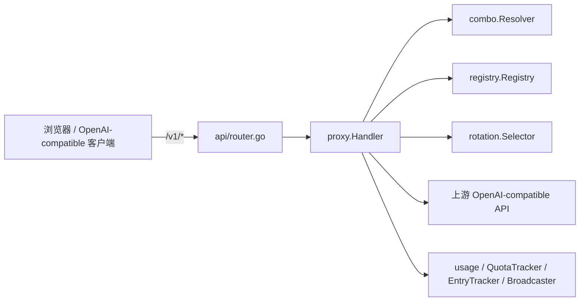
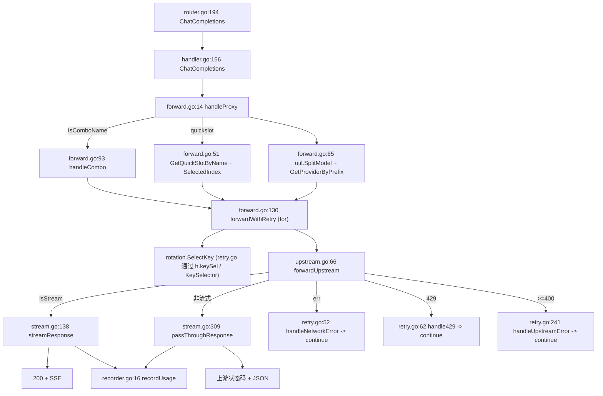

# TinyLab Proxy 代理核心架构

> **最后核对（2026-10-06，单行摘要）：** QuotaMonitor 的 **Provider 列追加渠道级余额读数**（对齐 DSH 插件输入区徽标：`zcode · 30.09M` / `codearts · 2066.84`，小两号次级色）——数据来自 Free Hub 的新聚合端点 `GET /api/jethub/balances`（`internal/jethub/balance_summary.go`：归一单位 token/credit 分组求和、失败账号不进合计、成功 120s / 全失败 15s TTL、账号或凭据变更即失效），前端 `web/static/monitor/monitor_quota.js` 每 60s 拉一次（搭既有 1s 计数节奏，不新开定时器）并**复用** jethub.js 的 `__jethubFormatUnits`（不另写 M/K 口径）；`.quota-provider-balance` 用 `--font-badge`（比 `--font-base` 小 2.5px）、`:empty` 隐藏空槽。上一轮：F-10 trace 落盘缓冲批量（详见 docs/changelog/proxy-architecture.md）。

## 1. 范围与结论

`internal/proxy/` 是 TinyLab 的**代理核心包**，承载所有 `/v1/*`（OpenAI-compatible）请求的处理：模型解析、Key 选择、上游转发、SSE 流式透传、重试/故障转移、用量记录、在途跟踪与事件广播。它自身不含任何管理接口、配置加载或 UI 逻辑。

- **谁调用它：** `internal/api/router.go` 在顶层挂载八个 `/v1/*` 路由（`/v1/chat/completions`、`/v1/completions`、`/v1/models`、`/v1/images/generations`、`/v1/embeddings`、`/v1/messages`、`/v1/responses`、`/v1/tasks/{taskId}`，见 router.go:228-240），把请求派发到 `proxy.Handler`；`internal/app/app.go` 作为组合根构造 `Handler` 并注入依赖（`app/app.go:129`）；`internal/api/sse_events.go` 消费 `Handler` 暴露的 `Broadcaster` / `EntryTracker`，把用量/在途/请求事件以 SSE 推送给管理 UI。四个协议入口——`/v1/chat/completions`（OpenAI Chat）、`/v1/messages`（Anthropic Messages）、`/v1/responses`（OpenAI Responses）、`/v1/embeddings`（OpenAI Embeddings）——均仅注册 POST，并列、同端口、按路径区分（见 §3、§3.1、§3.2、§3.3）。
- **它调用谁：** `rotation.Selector`（Key 选择、冷却、退避、锁定）、`combo.Resolver`（combo 解析）、`registry.Registry`（provider/quickslot/key 运行时状态）、`usage.RingBuffer` 与 `usage.QuotaTracker`（用量）、`config`（配置与 provider 判定）、`util`（模型名拆分、token 提取、日志截断）。



本文的核心结论：

1. `proxy` 包通过 6 个能力接口（而非具体类型）接收依赖，使代理核心对 `rotation`/`combo`/`registry`/`usage`/`config` 仅做结构性依赖（interfaces.go）。
2. 请求生命周期在 `handleProxy` → `forwardWithRetry`（for 循环）→ `forwardUpstream` → `streamResponse`/`passThroughResponse` 中闭环；combo 在 `handleCombo` 中逐目标递归进入 `forwardWithRetry`（forward.go:14、forward.go:93、forward.go:130、upstream.go:66、stream.go:138、stream.go:309）。
3. SSE 默认原样透传（逐 32KB 块读取 + flush），仅在 `NormalizeStreamChunks` 开启时把 `"choices":null` 规范为 `[]`；流式与非流式的 token 提取均为 last-chunk-wins（stream.go:181-293、stream.go:309-341）。
4. 重试/故障转移是一台纯“切 Key”的状态机（除 SenseNova TPM 同 Key 等待重试外），决策分布在 3 个错误处理器中（handleNetworkError/handle429/handleUpstreamError，retry.go:52-305）。
5. Gemini OpenAI-compatible 的 `thought_signature` 采用“流式捕获、发出请求时回填”的非对称缓存（signature_cache.go:25-104、forward.go:314-355、stream.go:444-490）。

## 2. 事实优先级

出现冲突时按以下优先级判断：

1. 当前源码和测试（`internal/proxy/*`、`internal/api/router.go`、`internal/api/sse_events.go`、`internal/app/app.go` 的相关集成）；
2. 本文；
3. `AGENTS.md` / `PROJECT_MAP.md`（仅作模块边界与约定背景）；
4. 历史提交信息（仅作历史背景）。

关键结论的源码锚点见第 14、17 节。修改 `internal/proxy` 或相关集成后，应同步更新本文的“最后核对”行与 `router.go` 路由挂载、重试策略、body 改写、SSE 改写、Gemini 签名、用量/在途、combo 策略等章节（见第 18 节变更维护清单）。

## 3. 路由挂载与鉴权边界

`internal/api/router.go` 在 `Routes` 中通过 chi 挂载代理路由：

- 九个 `/v1/*` 路由（router.go:228-245）：
  - `r.Post("/v1/chat/completions", proxyHandler.ChatCompletions)`；
  - `r.Post("/v1/completions", proxyHandler.Completions)`；
  - `r.Get("/v1/models", proxyHandler.ListModels)`；
  - `r.Post("/v1/images/generations", proxyHandler.ImagesGenerations)`；
  - `r.Post("/v1/embeddings", proxyHandler.Embeddings)`（**OpenAI Embeddings 协议入口**，见 §3.3）；
  - `r.Post("/v1/messages", proxyHandler.Messages)`（**Anthropic 协议入口**，见 §3.1）；
  - `r.Post("/v1/responses", proxyHandler.Responses)`（**OpenAI Responses 协议入口**，见 §3.2）；
  - `r.Post("/v1/generateContent", proxyHandler.GenerateContent)`（**Google GenerateContent 协议入口**，见 §3.5）；
  - `r.Post("/v1/tasks/{taskId}", proxyHandler.PollTask)`。

- **鉴权边界：** `/v1/*` 路由写在 `Routes` 函数顶层（router.go:196-204），而 `AuthMiddleware` 只包裹 `/api` 路由组（router.go:212-214）。因此 `/v1/*` 完全在 `AuthMiddleware` 之外，任意 API Key 或无 Key 均可访问（与 AGENTS.md “纯本地，无对外鉴权”一致）。
- **CORS preflight（仅 `/v1/*`）：** `router_proxy.go` 的 `OPTIONS /v1/*` 处理经 `isLocalhostOrigin` 校验请求方 `Origin` 的 host 是否为 `127.0.0.1`、`localhost` 或 `::1`——**仅 localhost 来源的 Origin 被反射**到 `Access-Control-Allow-Origin`，外部网页不能跨域调用本机代理；并设置 `Allow-Methods: GET, POST, OPTIONS`、`Allow-Headers: Content-Type, Authorization`、`Expose-Headers: X-TinyLab-Provider, X-TinyLab-Key, X-TinyLab-Request-Id`，以 204 响应。管理 `/api/*` 无 CORS（同源管理 UI），外部页面不能跨域读取配置或密钥。`/v1/messages` 经 `/v1/*` 的 OPTIONS 处理自动覆盖，无需额外配置。
- **securityHeaders 跳过 `/v1/`：** `securityHeaders` 中间件（router.go:151-165）对 `/v1/` 前缀路径跳过设置 CSP / `X-Content-Type-Options` / `X-Frame-Options` / `X-XSS-Protection`，使上游响应头透传（router.go:156）。
- **上游 HTTP 代理：** `proxy.Handler.SetProxy`（handler.go:102-142）设置走代理的 `*url.URL`；`provider.UseProxy` 为 true 时，`forwardUpstream` 选择代理 client（upstream.go:104-120）。代理 URL 始终以 `http://host:port` 重建，端口范围 `[1,65535]`，非法则禁用代理并返回错误（handler.go:129-141）。

### 3.1 Anthropic 协议入口（`/v1/messages`）

`Messages`（handler.go:179-181）是 Anthropic Messages API 的代理入口，与 OpenAI 系列入口**并行、同端口、按路径区分**。

- **注册方式：** 仅注册 `POST` 方法（router.go:203）；Anthropic Messages 语义无 GET 形式，故不注册 GET；CORS 由 §3 的 `/v1/*` OPTIONS 处理自动覆盖。
- **调用链：** `Messages` 内部调用 `h.handleProxy(w, r, "/v1/messages", combo.EntryFormatAnthropic)`（handler.go:180），其余 OpenAI 入口传入 `combo.EntryFormatOpenAI`（handler.go:160、164、168、172），Responses 入口传入 `combo.EntryFormatOpenAIResponses`（handler.go:189），Google GenerateContent 入口传入 `combo.EntryFormatGoogle`。`entryFormat` 从 `handleProxy` 经 `handleCombo`/`forwardWithRetry`/`forwardUpstream`/`streamResponse` 下传，用于协议分支（上游构造、SSE usage 提取）。
- **不做格式翻译：** Anthropic 请求体（含 `model`/`messages`/`system`/`max_tokens` 等）与上游响应均原样转发，代理**不**做 OpenAI↔Anthropic 之间的任何格式转换（设计要点 #2）。
- **软策略（不做入口协议严格匹配）：** 见 §4 与 §13.1。

### 3.2 OpenAI Responses 协议入口（`/v1/responses`）

`Responses`（handler.go:188-189）是 OpenAI Responses API 的代理入口，与前两者**并行、同端口、按路径区分**。

- **注册方式：** 仅注册 `POST` 方法（router.go:207）；CORS 由 §3 的 `/v1/*` OPTIONS 处理自动覆盖。
- **调用链：** `Responses` 内部调用 `h.handleProxy(w, r, "/v1/responses", combo.EntryFormatOpenAIResponses)`（handler.go:189），`entryFormat == EntryFormatOpenAIResponses` 经调用链下传。
- **不做格式翻译：** 请求体原样转发；代理不解析 Responses 的 event 结构（`response.created`/`response.output_text.delta`/`response.completed` 等），只透传。
- **上游构造差异：** 见 §7.5；SSE usage 提取复用 OpenAI 兼容路径的 `util.ExtractTokens`（见 §8.9）。

### 3.3 OpenAI Embeddings 协议入口（`/v1/embeddings`）

`Embeddings`（handler.go:174-175）是 OpenAI Embeddings API 的代理入口，与 Chat/Responses/Messages**并行、同端口、按路径区分**。

- **注册方式：** 仅注册 `POST` 方法（router.go:232）；CORS 由 §3 的 `/v1/*` OPTIONS 处理自动覆盖。
- **调用链：** `Embeddings` 内部调用 `h.handleProxy(w, r, "/v1/embeddings", combo.EntryFormatOpenAI)`（handler.go:175），`entryFormat == EntryFormatOpenAI` 经调用链下传，上游构造走标准 OpenAI 兼容路径（`buildUpstreamRequest`，upstream.go:76-82）。
- **不做格式翻译：** 请求体原样转发；代理不解析 `data[].embedding` 结构，只透传。
- **模型类型关联：** `ModelDef.Kind` 支持 `"embedding"` 值（config/types.go），Provider detail 页面模型类型下拉菜单可选 Embedding；`testModelProtosSerial` 对 `kind=embedding` 模型仅测试 `openai-embedding` 协议（见 §18）。

### 3.5 Google 原生协议入口（`/v1/generateContent`）

`GenerateContent` 是 Google Gemini 原生 `generateContent` API 的代理入口，与 OpenAI/Anthropic 入口**并行、同端口、按路径区分**。

- **注册方式：** 仅注册 `POST` 方法；CORS 由 §3 的 `/v1/*` OPTIONS 处理自动覆盖。
- **调用链：** `GenerateContent` 内部调用 `h.handleProxy(w, r, "/v1/generateContent", combo.EntryFormatGoogle)`，`entryFormat == EntryFormatGoogle` 经调用链下传，上游构造走 Google 专用路径（`buildGoogleUpstreamRequest`，见 §7.6）。
- **不做格式翻译：** 请求体与响应体原样转发透传，不进行任何 OpenAI↔Google 格式转换。上游 URL 由 `urlutil.BuildGoogleGenerateContentURL` 自动拼接为 `{baseURL}/v1beta/models/{realModel}:generateContent`（流式追加 `:streamGenerateContent?alt=sse`），鉴权头设置 `x-goog-api-key: <key>`，并在转发时安全剥离 body 中的 TinyLab `model` 和 `stream` 路由字段。

### 3.4 入口协议透传策略（软策略）

五个协议入口（OpenAI Chat / Anthropic Messages / OpenAI Responses / OpenAI Embeddings / Google GenerateContent）**仅决定转发协议，不做 provider 准入校验**。客户端用哪个入口请求，proxy 就按哪个协议构造上游（`entryFormat` 路由分支在 `forwardUpstream` 内判定，upstream.go:76-91）。

- **同一 provider 可服务三入口：** 转发协议由 `entryFormat`（来自入口路径）决定，而非 `provider.APIType`；聚合 provider（例如同 BaseURL 同时支持多种协议）可被任一入口访问，上游构造分支按 `entryFormat` 选 `buildUpstreamRequest(ctx, sel, body, endpointPath, authBearer)`（Anthropic: `"/v1/messages", false` → x-api-key；Responses: `"/v1/responses", true` → Bearer；Chat: default 分支直接 `Authorization: Bearer`）。
- **无入口协议严格匹配：** `forward.go`（forward.go:80-97）仅做模型解析与上游转发准备，无协议拒收分支——不对 `entryFormat` 与 `provider.IsAnthropic()` 做对称 400 校验，proxy 不因 `provider.APIType` 拒绝请求。
- **combo 不过滤 target：** `combo.Resolver.Resolve(name, entryFormat)` 对所有 `entryFormat` 返回同一 target 集合（不按 `IsAnthropic()` 过滤），见 rotation-architecture.md §4.4；`entryFormat` 参数保留但未被消费（供未来扩展）。
- **不做协议协商/翻译：** proxy 仍严格“原样透传”，不臆造 OpenAI↔Anthropic↔Responses 之间的双向翻译或自动协商；客户端须使用与上游匹配的入口。

## 4. Handler 与依赖注入

### 4.1 Handler 结构体

`Handler` 聚合全部依赖与运行时状态（handler.go:15-36）：

| 字段 | 类型 | 用途 |
|---|---|---|
| `reg` | `ModelResolver` | 完整 composite（保留供测试经 `h.reg.GetKeyState` 访问 key 运行时状态） |
| `quickSlots` / `providers` / `keyState` / `aliases` / `comboList` | `QuickSlotResolver` / `ProviderResolver` / `KeyStateAccessor` / `AliasResolver` / `ComboLister` | registry 侧 5 个窄能力（内部调用点经此路由） |
| `keySel` / `nim` / `cooldown` / `quotaLock` / `rotSet` | `KeySelector` / `NIMProvider` / `CooldownManager` / `QuotaLocker` / `RotationSettings` | selector 侧 5 个窄能力（key 选择 + NIM + 冷却 + 配额锁 + 配置快照） |
| `comboRes` | `ComboResolver` | combo 解析 |
| `usage` | `UsageRecorder` | 用量记录 |
| `quotaTracker` | `QuotaTracker` | quota 展示 |
| `logger` | `Logger` | 日志输出 |
| `client` / `streamClient` | `*http.Client` | 直连：非流式 300s 超时 / 流式无 `Timeout`（首字节+空闲超时由 `doStream` 施加，见 §7 末）；共享专属 directTransport（F-03，`Proxy=nil` 不响应环境代理变量） |
| `proxyClient` / `proxyStream` | `*http.Client` | 经代理：非流式 300s 超时 / 流式无 `Timeout`（同上 `doStream`）；共享专属 proxyTransport（F-03，仅认 `SetProxy` 显式代理） |
| `mgmtClient` / `mgmtProxyClient` | `*http.Client` | 管理探测（模型导入/连通性/测试），15s 超时；分别共享上述 direct/proxy Transport |
| `proxyURL` | `atomic.Value` | 当前代理 `*url.URL`，nil 表示不走代理 |
| `UsageUpdates` / `InflightUpdates` / `RequestUpdates` | `*Broadcaster` | 三类事件广播 |
| `Inflight` | `*InflightTracker` | 在途流式字节 / 速度 |
| `EntryTracker` | `*EntryTracker` | 处理中用量条目（按 request ID） |
| `sigCache` | `SignatureCacheProvider` | Gemini thought_signature 缓存 |
| `debugModeProvider` | `func() bool` | 调试模式开关 |

> `TraceConfig` 结构体（`internal/config/types.go`）定义持久化追踪配置：`Enabled bool`（默认 `false`）、`RetainDays int`（默认 `2`）、`MaxDiskMB int`（默认 `500`）；`Config.Trace` 字段（yaml/json `trace`）在 `DefaultConfig()` 中初始化。`traceLine` 结构体（`request_log.go:20-52`）定义两层 JSONL 行 schema：`Type`（`"index"`/`"request"`/`"attempt"`）、`ReqID`、`Timestamp`、`Provider`、`Model`、`KeyID`、`Status`、`LatencyMs`、`TTFTMs`、`InputTokens`、`OutputTokens`、`Error`、`Decision`（重试状态机决策）、`Provenance`（`X-TinyLab-Provenance` 头值）、`Body`（截断后 body）。`TraceMgmtCall` 方法（`request_log.go`）捕获 ManagementClient 路径的调用，attempt n=1，decision="management probe"。`SweepTraces`/`sweepTracesOnce` 后台保留清理（每小时，按 retainDays + maxDiskMB 限制），在 `app.go:191` 以 `go a.proxyHandler.SweepTraces(a.shutdownCtx, cfg.Trace.Reta…

### 4.2 构造函数

`New`（handler.go:43-80）从能力接口而非具体类型构造 `Handler`。调用方（组合根）通常传入 `*registry.Registry`、`*rotation.Selector`、`*combo.Resolver`、`*usage.RingBuffer`、`*usage.QuotaTracker`、`*console.Logger`，它们都结构性满足这些接口。默认上游超时 300s（`upstreamTimeoutSec<=0` 时回退，handler.go:44-47）。构造函数内创建 `UsageUpdates`(32)、`InflightUpdates`(32)、`RequestUpdates`(256) 三个 `Broadcaster`、`InflightTracker`、`EntryTracker` 与 `SignatureCache`（handler.go:55-60），并构造 6 个 `*http.Client`（直连 / 代理 / 管理各一对；超时与生命周期约定见 §4.4，handler.go:61-78）。

### 4.3 能力接口（窄接口 + composite）

`interfaces.go` 定义代理核心对外的结构性依赖接口：

| 接口 | 行 | 实现类型 | 关键方法 |
|---|---|---|---|
| `Logger` | interfaces.go:16-21 | `*console.Logger` | `Info/Error/Warn/Debug` |
| `KeySelector` | interfaces.go:24-27 | `*rotation.Selector` | `SelectKey`、`OnKeyFailure` |
| `NIMProvider` | interfaces.go:30-35 | `*rotation.Selector` | `IsNIMEnabled`、`WaitNIMInterval`、`OnNIMRequestSuccess`、`MarkNIM429` |
| `CooldownManager` | interfaces.go:38-41 | `*rotation.Selector` | `ClearError`、`MarkRateLimited` |
| `QuotaLocker` | interfaces.go:44-47 | `*rotation.Selector` | `MarkDailyQuotaLocked`、`MarkBalanceLocked` |
| `RotationSettings` | interfaces.go:50-52 | `*rotation.Selector` | `Settings` |
| `KeyProvider` | interfaces.go:56-62 | `*rotation.Selector` | composite，组合上述 5 窄接口（`New` 入参，向后兼容） |
| `QuickSlotResolver` | interfaces.go:65-68 | `*registry.Registry` | `GetQuickSlotByName`、`ListQuickSlots` |
| `ProviderResolver` | interfaces.go:71-75 | `*registry.Registry` | `GetProviderByPrefix`、`GetProvider`、`ListProviders` |
| `KeyStateAccessor` | interfaces.go:78-80 | `*registry.Registry` | `GetKeyState` |
| `AliasResolver` | interfaces.go:83-86 | `*registry.Registry` | `ResolveModelAlias`、`ResolveModelAliasByID` |
| `ComboLister` | interfaces.go:89-91 | `*registry.Registry` | `ListCombos` |
| `ModelResolver` | interfaces.go:100-106 | `*registry.Registry` | composite，组合上述 5 窄接口（`New` 入参，向后兼容） |
| `ComboResolver` | interfaces.go:111-114 | `*combo.Resolver` | `IsComboName`、`Resolve` |
| `UsageRecorder` | interfaces.go:118-120 | `usage.UsageStore`（含 `*usage.RingBuffer`） | `Add` |
| `QuotaTracker` | interfaces.go:125-128 | `*usage.QuotaTracker` | `Update`、`RemoveKey` |

### 4.4 HTTP 客户端与运行时开关

- **4 类用途、6 个 client 字段、2 个专属 Transport（F-03）：** 直连非流式（`client`）、直连流式（`streamClient`）、代理非流式（`proxyClient`）、代理流式（`proxyStream`）、管理直连（`mgmtClient`）、管理代理（`mgmtProxyClient`）。流式 client 无 `Timeout`（由请求 context 控制）；非流式 300s；管理 15s。`New` 经 `newUpstreamTransport`（克隆 `http.DefaultTransport`，继承 30s 拨号 / 10s TLS 握手 / 90s 空闲超时与 HTTP/2）构造两个专属 Transport 供六个 client 共享：**directTransport `Proxy=nil`**——`UseProxy=false` 是真直连，不响应进程继承的 `HTTP(S)_PROXY` 环境变量；**proxyTransport** 仅从 `SetProxy` 的原子 `proxyURL` 取显式代理。两者池化上调为 `MaxIdleConns=256` / `MaxIdleConnsPerHost=32`（`http.DefaultTransport` 默认 2——同一上游并发 >2 时多余连接用完即关、下次重新 TCP+TLS 握手抬高 TTFT）；主干由此不再与进程内其他 `http.DefaultClient` 用户共享连接池。回归 `upstream_transport_test.go`。
- **`ManagementClient`**（handler.go:85-92）：按 `provider.UseProxy` 返回 `mgmtProxyClient` 或 `mgmtClient`，供模型导入 / 连通性 / 模型测试等探测使用。
- **`SetProxy`**（handler.go:102-142）：更新 / 禁用上游代理 URL。
- **`SetUpstreamTimeout`**（handler.go:147-154）：更新非流式 client 的 `Timeout`（流式保持无界）。
- **`SetDebugModeProvider` / `debugMode`**（handler.go:164-173）：注入并从 `func() bool` 读取调试模式开关。

## 5. 请求生命周期

`POST /v1/chat/completions` 从路由到响应的完整调用链：



关键阶段：

1. **入口与解析：** `ChatCompletions`（handler.go:156-158）调用 `handleProxy(w, r, "/v1/chat/completions")`；`handleProxy`（forward.go:14-91）先用 `http.MaxBytesReader` 限制请求体 32 MiB（forward.go:17），读全部 body 并 `json.Unmarshal`（forward.go:18-28），强制校验非空 `model`（forward.go:30-34），其余字段原则上透传。
2. **模型解析分支：** 命中 combo 名 → `handleCombo`（forward.go:46-49）；命中 quickslot → 取 `qs.Models[qs.SelectedIndex]`（越界回退 0，forward.go:51-63）；否则 `util.SplitModel` 拆 `provider/model`，再 `GetProviderByPrefix` 解析为真实 provider ID（forward.go:65-77），然后 `ResolveModelAlias` 将 alias 解析为真实 model ID（forward.go:79-83）。
3. **`forwardWithRetry` 循环（forward_retry.go）：** 每次迭代调用 `forwardAttempt`（F-04，第 16 轮：单次 attempt 独立函数，`attemptContext` 携带 per-call 参数与 `retryState`/inject-strip 可变态）：`attemptContext.selectKey` 选 key（含 SonestCooldown ≤30s 冷却等待）→ 标记 key in-flight → **defer 统一收尾**（`EntryTracker.Remove`+`DecInFlight`+`InflightUpdates.Signal`，全退出路径覆盖）→ 写 request-start 事件 → `forwardUpstream`。按结果分流：网络错误 → `handleNetworkError` → `outcomeRetry`；429 → `handle429` → `outcomeRetry`；`>=400` → `handleUpstreamError`（pass-through 时 `written=true` 停止，否则 `outcomeRetry`）；2xx → `ClearError`、更新 quota、NIM 成功计数，然后按 `isStream` 进入 `streamResponse` 或 `passThroughResponse` 并 `written=true` 停止。
4. **流式 vs 非流式：** 流式走 `streamResponse`（stream.go:138-307）逐块转发并 flush；非流式走 `passThroughResponse`（stream.go:309-341）整段读取后写出。
5. **重试循环与三态契约：** 循环在 `forwardWithRetry` 顶层的 `for {}` 中持续，直到成功返回或所有 key 耗尽（`excludeKeyIDs` 覆盖全部可用 key 后 `SelectKey` 报错）。`forwardAttempt` 返回三态 `attemptResult{next, written, terminal}`（F-04，第 16 轮）：`outcomeRetry`（清理完毕选下一 key）/ `outcomeStop`（停止；`written=true` 表示响应已提交——2xx、上游 4xx pass-through、循环自写的 500 marshal / 503 queue 超限 / 503 sameKey 超限；调用方不得叠加 502）/ `outcomeAbort`（客户端取消静默退出）。`forwardWithRetry` 对外返回契约：`(true, reqID)`=已写响应、`(false, "")`=取消静默、`(false, reqID)`=key 耗尽（terminal=`errNoKeysAvailable`，循环已 `recordNoKeyFailure`）。

## 6. 模型解析

### 6.1 Combo（handleCombo，forward.go:93-128）

`handleCombo` 先 `comboRes.Resolve`（forward.go:94）拿到 `plan.Targets`，再按 `plan.Strategy` 分支：

- **fallback：** 遍历 `plan.Targets`，对每个目标调用 `forwardWithRetry`；任一成功即 `return`，全部失败回 502（forward.go:106-112）。
- **round-robin：** **固定使用 `plan.Targets[0]`**，仅调用一次 `forwardWithRetry`（forward.go:113-117）。轮转由 `rotation` 内部 key 选择完成，combo 层不轮转目标。
- **greedy-squirrel：** 与 fallback 同形，遍历 `plan.Targets` 逐个 `forwardWithRetry`（forward.go:118-124）。
- 未知策略 → 400（forward.go:125-127）。

`forwardWithRetry` 的 `logLabel` 传入 `"[combo:name] "` 前缀用于日志区分（forward.go:104）。

### 6.2 QuickSlot

`handleProxy` 中通过 `reg.GetQuickSlotByName(modelStr)` 命中 quickslot（forward.go:51），取其 `Models[SelectedIndex]`（越界或空回退 0，空则 400，forward.go:52-62）。`SelectedIndex` 为持久化的当前选中下标。

### 6.3 Provider / Model

- `util.SplitModel(modelStr)` 把 `provider/model` 拆为 `providerID, upstreamModel`（forward.go:65）。
- `reg.GetProviderByPrefix(providerID)` 按前缀解析为真实 provider（forward.go:72-77），随后 `providerID` 被替换为 `provider.ID`，供 `forwardWithRetry` 使用。
- **Alias 解析**：`GetProviderByPrefix` 之后调用 `ResolveModelAlias`（forward.go:79-83）：若该 model 设置了 alias 且用户发送的是 `prefix/alias`，此处将 `upstreamModel` 替换为真实 model ID 再转发给上游；未设置 alias 时行为不变。

## 7. 上游转发与 body 改写

### 7.1 forwardUpstream（upstream.go:67-121）

`forwardUpstream` 完成实际 HTTP POST。它按 **`entryFormat`（来自入口路径，而非 `provider.APIType`）** 三分支构造请求（upstream.go:76-91）：

- **OpenAI Chat 入口（`entryFormat == EntryFormatOpenAI`）：** `BuildUpstreamURL(sel.Provider.BaseURL, path)` 构造完整上游 URL（upstream.go:75），设置固定头 `Content-Type: application/json`（upstream.go:80）、`Authorization: Bearer <sel.Key.Key>`（upstream.go:81）。
- **Anthropic 入口（`entryFormat == EntryFormatAnthropic`）：** 改走 `buildUpstreamRequest(ctx, sel, body, "/v1/messages", false)`（Anthropic → x-api-key），见 §7.3。
- **OpenAI Responses 入口（`entryFormat == EntryFormatOpenAIResponses`）：** 改走 `buildUpstreamRequest(ctx, sel, body, "/v1/responses", true)`（Responses → Bearer），见 §7.5。
- 透传客户端 `User-Agent`（若非空，upstream.go:91-93）、`X-Modelscope-Async-Mode` / `X-Modelscope-Task-Type`（若非空，upstream.go:94-99）。
- **Provider 自定义头**：当 `sel.Provider.UseCustomHeaders` 为 true 时，`CustomHeaders` 经 `internal/customheaders.Apply` 逐项设置；空配置或开关关闭时为 no-op。应用位置在客户端透传头和流式 `Accept` 之后，因此可覆盖同名生成头；`applyClineHeaders` 紧随其后，故 Cline 的 `x-client-type: cline-cli` 硬编码行为保持最终优先级。相同规则用于 `forwardGetUpstream` 的任务轮询 GET；管理探测、模型拉取、多协议/多 Key 探测及 Combo 测速也复用该应用语义。
- **cline 特例（`Provider.IsCline()`，BaseURL 含 "api.cline.bot"）：** 无条件注入 `x-client-type: cline-cli`（upstream.go:57-60 调 `applyClineHeaders`，122-128；常量 117-120），覆盖客户端原值。`cline-free/*` 免费模型无此头会被上游 403；付费模型不依赖此头，带上无害。
- 流式请求额外设置 `Accept: text/event-stream`（upstream.go:100-102）。
- **client 选择：** `sel.Provider.UseProxy` 且代理 URL 非空 → 代理 client；否则直连 client（upstream.go:104-113）。流式用 `proxyStream`/`streamClient`，非流式用 `proxyClient`/`client`（upstream.go:114-120）。直连 client 的 Transport `Proxy=nil`——`UseProxy=false` 不响应 `HTTP(S)_PROXY` 环境变量（F-03）；代理 client 仅认 `SetProxy` 配置的显式代理。
- **流式超时（F-02）：** 两个流式 `Do` 点（桥接分支与普通分支）均经 `stream_timeout.go::doStream` 施加双边界——**首字节超时**（`StreamTTFBTimeoutSec`，nil=默认 120s、≤0=禁用）以派生 ctx + timer 实现，超时返回 `stream first-byte timeout` 错误并走 `handleNetworkError` 网络错误分支（退避+排除+换 key，故障转移覆盖"已建连不回响应头"的挂起）；**流空闲超时**（`StreamIdleTimeoutSec`，nil=默认 300s、≤0=禁用）以 `idleTimeoutBody` 包装 `resp.Body`，每次成功 Read 重置窗口，触发即 cancel 派生 ctx 使阻塞 Read 返回 `StreamIdleTimeoutError`——`streamResponse`/`streamResponsesAsChat` 识别后记录 status=error / decision=`stream idle timeout`（200 已提交客户端，结构性无法 failover；目的是释放 goroutine/连接并如实记录，**不冷却 key**）。空闲窗口按字节到达重置，SSE 注释/心跳/reasoning delta 均算活动，推理模型长思考期不受影响。客户端取消（F-01）与本机制互不干扰：派生 ctx 只被自己的 timer cancel，`r.Context().Err()` 检查仍先行拦截。

  > 注意：上游构造分支由 `entryFormat` 决定（软策略，见 §3.3），`sel.Provider.IsAnthropic()` 不参与分支判定（upstream.go:76）。OpenAI 专用透传头（`User-Agent`/Modelscope 头）对 anthropic 一并设置（upstream.go:88-99），幂等——Anthropic 上游会忽略它们；关键区别是 anthropic 分支**绝不设置 `Authorization`**，改用 `x-api-key`（§7.3）。Responses 分支鉴权头与 OpenAI Chat 一致（`Authorization: Bearer`）。

### 7.1a jethub 桥接 Provider 的增强钩子（2026-10-01 新增，P3.4/P4）

`APIType=="jethub"` 的动态 Provider（Free Hub 桥接，见 `docs/jethub-architecture.md`）在 `forwardUpstream` 开头走独立分支（upstream.go jethub 段），与标准分支的差异全部收敛在三个**可选窄接口**（`interfaces.go`；实现由 `app.go` 经 `Handler.SetRequestAugmenter` 注入——proxy 全程不 import jethub）：

1. **`RequestAugmenter.Augment(r, body, providerID, keyID, upstreamModel)`**：基础钩子。`r` 是**每次 attempt 新建的桥接请求**：URL/Context 与客户端请求相同（签名读 `r.URL`、取消经 `ctx` 传播），但**头表为空白基底**，仅回播 loopback 标记（`X-Tinylab-Internal-Retry-Drop`、`X-TinyLab-WebHub-Turn`）。augmenter 对 `r.Header` 的写入**就是**出站头集合（代理快照到真实出站请求，标记除外）——客户端头（凭据在内）结构性进不了桥接上游（F-05，2026-10-05）；回归 `internal/proxy/bridge_headers_test.go`。augmenter 返回值替换出站 body；生成头（`Content-Type`/`Authorization`）只**缺省补齐**（Authorization 回落值是桥接 key 的凭据，不是客户端的），不覆盖 augmenter 已设置的值——qoder 的 COSY 签名头、minimax 的 Anthropic 头族因此不被普通 Bearer 冲掉。**历史口径**：2026-10-05 之前出站基底曾是客户端 `r.Header` 全量拷贝，安全性依赖每个 augmenter 先"全删再 Set"的手工约定（见 ProjectAnalysis F-05）。
2. **`RequestCustomizer.Customize(...) (outURL, outBody, err)`**（可选）：出站 URL 不由 `BaseURL+entryPath` 可推导时（qoder 加密端点的路径+查询串由 WASM 给出），返回完整 URL；`outURL==""` 回退默认构造。实现方（`Manager.Customize`）对非 qoder provider 内部落回 `Augment` 语义。
3. **`ResponseInterceptor.InterceptResponse(...) (outBody io.Reader, retryAfterMs int64, err error)`**（可选）：上游响应在写回客户端**之前**拦截。三种结局：`outBody` 替换 `resp.Body`（qoder 信封剥离流）；`retryAfterMs>0` → 折算为 `*upstreamerr.QueueRetryError` 返回（重试循环**同 Key** 等待重发，`maxQueueAttempts=180` 封顶，不排除不冷却）；`err` 为失败尝试——其中 `*upstreamerr.BillingLockError` 触发 `MarkRateLimited(key, model, until)` per-model 锁 + exclude 后切号。

`forwardWithRetry`（forward_retry.go）错误分支先判客户端取消（`r.Context().Err() != nil` → 清理后静默退出，不冷却/不排除/不记 error usage，F-01），再 `errors.As` 识别两类类型化错误后落 `handleNetworkError`：排队等待尊重 `r.Context()` 取消；计费锁时间由业务侧给出（Qoder=UTC+8 当日 24:00）。循环顶部（`SelectKey` 之前）同样先判取消——防止取消后的空转轮询把剩余 key 逐个误冷却。跨边界错误类型放 `internal/upstreamerr` 中性叶子包，避免 jethub→proxy 的反向 import。

### 7.2 URL 构造（委托 `internal/urlutil`）

> URL 构造函数 `BuildUpstreamURL`、`normalizeBaseURL`、`isOllamaBaseURL`/`normalizeOllamaBaseURL`、`isHostRoot` 位于 `internal/urlutil/urlutil.go`，不在 `internal/proxy/upstream.go`；`proxy` 与 `api` 均导入 `internal/urlutil`。`proxy/upstream.go` 中的 `forwardUpstream`/`buildUpstreamRequest`/`forwardGetUpstream` 调用 `urlutil.BuildUpstreamURL`。

`internal/urlutil` 提供：

- `isOllamaBaseURL` / `normalizeOllamaBaseURL`（upstream.go:17-46）：Ollama 特例。`isOllamaBaseURL` 纯字符串匹配（无网络探测，本地服务可能未运行）：host 为 `ollama.com`，或 host 为 `localhost`/`127.0.0.1` 且端口为 `11434` 时判定为 Ollama。`normalizeOllamaBaseURL` 把整个 path/query/fragment 清空，把 BaseURL 降为 host root。设计动机：Ollama 同时提供原生 `/api/*`（非 OpenAI 格式，响应/SSE/工具调用结构均不同，需完整格式转换）与 OpenAI 兼容 `/v1/*`（零转换）；本项目“不做格式转换、SSE 原样透传”原则决定了必须走 `/v1/*`。无论用户填什么路径（原生形如 `/api`、`/api/tags`、`/api/chat`，或 OpenAI 形如 `/v1`、`/v1/chat/completions`），清空 path 后由 host-root 分支统一注入 `/v1`。
- `BuildUpstreamURL`（upstream.go:75-122）统一按**启发式 A** 构造 URL：
  1. **Raw 模式：** base 以 `*` 结尾 → 去掉 `*` 并 trim 右 `/` 后原样返回，不做归一化或后缀拼接（upstream.go:93-95）。
  2. **Ollama 特例：** `isOllamaBaseURL` 为真 → 调 `normalizeOllamaBaseURL` 清空 path，降为 host root（upstream.go:97-106），随后落入 host-root 分支。
  3. **Host root（无路径）：** `isHostRoot` 为真（`u.Path==""` 或 `"/"`）→ 注入 `/v1` 后追加 `endpointPath` 去掉 `/v1` 前缀后的 suffix（upstream.go:108-110）。
  4. **Path-bearing base：** 解析归一化 base 的路径段；若**任一**段匹配 `^v\d+(?:beta|alpha)?$`（如 `v1`、`v1beta`、`v2`），则认为 base 已带版本前缀 → **不注入** `/v1`，直接追加 suffix（upstream.go:117-119）；否则视为无版本段 → 注入 `/v1` 后再追加 suffix（upstream.go:122）。
- Ollama 特例覆盖**全部 11 个 `BuildUpstreamURL` 调用点**（proxy/admin/probe/combo-speedtest）：`proxy/forward.go:327`（processingEntry 展示用 URL）、`proxy/upstream.go:128`（OpenAI Chat 转发）、`proxy/upstream.go:187`（Anthropic）、`proxy/upstream.go:220`（Responses）、`proxy/upstream.go:231`（GET 转发）、`api/providers_models.go:30`（管理端拉取模型列表 → `/v1/models`）、`api/probe_keys.go:61/203`（key 探测）、`api/probe_common.go:59/74/89/104`（多协议探测）、`api/providers_validate.go:47/70`（provider 校验）、`api/combo_speedtest.go:181`（combo 测速）。
- 行为示例（输入 → 结果）：
  - `buildProbeURL("https://openrouter.ai/api/v1", "/v1/chat/completions")` → 归一化后 `https://openrouter.ai/api/v1` 含 `/v1` 段 → 不注入额外 `/v1` → `https://openrouter.ai/api/v1/chat/completions`。
  - `BuildUpstreamURL("https://openrouter.ai/api", "/v1/chat/completions")` → 归一化后 `https://openrouter.ai/api` 无版本段 → 注入 `/v1` → `https://openrouter.ai/api/v1/chat/completions`。
  - `BuildUpstreamURL("https://ollama.com/api", "/v1/chat/completions")` → `isOllamaBaseURL` 为真 → 清空 path → `https://ollama.com` → host-root 注入 `/v1` → `https://ollama.com/v1/chat/completions`；本地 `http://localhost:11434/api` 同理归一为 `http://localhost:11434/v1/chat/completions`。

### 7.3 Anthropic 上游请求构造（upstream.go:78-97）

`buildUpstreamRequest(ctx, sel, body, "/v1/messages", false)`（upstream.go:78-97）由 `forwardUpstream` 在 `entryFormat == EntryFormatAnthropic` 时调用（upstream.go:25-26），与 OpenAI 路径有两处根本差异：

1. **URL 统一由 `BuildUpstreamURL` 构造：** 一行调用 `BuildUpstreamURL(sel.Provider.BaseURL, "/v1/messages")`（upstream.go:85）。启发式 A 自动判断 BaseURL 是否含版本段：若已含 `/v1`（如 `https://api.anthropic.com/v1` 或 `https://api.anthropic.com/v1/messages`）则不注入额外 `/v1`；若为 host root（如 `https://api.anthropic.com`）则注入 `/v1`。推荐配置形如 `https://api.anthropic.com` 或 `https://api.anthropic.com/v1` 或 `https://api.anthropic.com/v1/messages`。
2. **认证头分支（绝不设 `Authorization`）：** `setAnthropicHeaders`（upstream.go:100-111）设置：
   - `Content-Type: application/json`（upstream.go:101）；
   - `x-api-key: <key>`（upstream.go:102）——替代 OpenAI 的 `Authorization: Bearer`；
   - `anthropic-version: <Provider.AnthropicVersion>`，为空时回落默认 `2023-06-01`（upstream.go:103-106）；
   - 仅当 `Provider.AnthropicBeta != ""` 时设 `anthropic-beta: <value>`（upstream.go:108-110）。

   关键约束：**Anthropic 分支不设置 `Authorization` 头**（upstream.go:91-94 条件分支 + 仅 `setAnthropicHeaders` 在构造上游请求时调用），避免把 anthropic key 误放进 `Authorization` 字段。

### 7.4 Body 改写（在 forwardWithRetry 的 forwardAttempt 内，forward_retry.go）

在每次 `forwardUpstream` 之前、选定 key 之后改写 `parsed` map 并重新 `json.Marshal`：

- **`stream_options` 注入：** `isStream` 且 `cfgProvider.InjectStreamOpts` **或** `entryFormat == combo.EntryFormatOpenAI` 时，若 body 无 `stream_options` 则注入 `{"include_usage":true}`（forward_retry.go:46-60，局部 `injectedStreamOpts`）——OpenAI 流式**默认注入**以让支持的上游在流末上报真实 usage；注入导致上游 400/422 拒绝时，**strip 该字段并重试一次**（`streamOptsStripped`，forward_retry.go:251-262），不因测量辅助字段牺牲请求。
- **model 替换：** `parsed["model"] = upstreamModel`，用真实上游模型名替换客户端模型名（forward.go:170）。
- **thought_signature 回填：** 仅当 `cfgProvider.IsGeminiOpenAICompat()` 时调用 `backfillThoughtSignatures(parsed, h.sigCache)`（forward.go:171-173），见第 10 节。

改写作用于当前重试迭代的 body；每次循环基于原始 `parsed`（combo 传入的同一 map）重新执行，重试间不互相污染。

### 7.5 OpenAI Responses 上游请求构造（upstream.go:78-97）

`buildUpstreamRequest(ctx, sel, body, "/v1/responses", true)`（`authBearer=true` → Bearer 鉴权）在 `entryFormat == EntryFormatOpenAIResponses` 时由 `forwardUpstream` 调用（upstream.go:27-28），与 OpenAI Chat 路径的差异只在 URL：

1. **URL 统一由 `BuildUpstreamURL` 构造：** 一行调用 `BuildUpstreamURL(sel.Provider.BaseURL, "/v1/responses")`（upstream.go:85）。启发式 A 自动判断是否需注入 `/v1`：若 BaseURL 已含版本段（如 `/v1`、`/v1beta`）则不注入，否则注入。
2. **鉴权头 `Authorization: Bearer <key>`（与 OpenAI Chat 一致）：** 不设 `x-api-key`；固定头 `Content-Type: application/json`（upstream.go:90）。

> Responses 的 SSE 数据结构与 OpenAI Chat 兼容，故 usage 提取复用 `util.ExtractTokens`（见 §8.9）；SSE event（`response.created`/`response.output_text.delta`/`response.completed`）不解析，只透传。

### 7.6 Google 原生 generateContent 上游请求构造（upstream.go）

`buildGoogleUpstreamRequest(ctx, sel, body, isStream)` 在 `entryFormat == EntryFormatGoogle` 时由 `forwardUpstream` 调用：

1. **URL 由 `urlutil.BuildGoogleGenerateContentURL` 构造：** 拼接 `{baseURL}/v1beta/models/{realModel}:generateContent`（流式追加 `:streamGenerateContent?alt=sse`）。
2. **鉴权头 `x-goog-api-key: <key>`：** 绝不设置 `Authorization` 头，直接将 key 设入 Google 官方头 `x-goog-api-key`。
3. **安全剥离代理字段：** 自动剥离请求 body 中的 TinyLab `model` 和 `stream` 路由字段，避免 Google 上游因识别到多余顶层字段返回 `400 INVALID_ARGUMENT`。

### 7.7 Anthropic Provider 配置示例

`apiType: anthropic` 的 provider 只需指定完整 endpoint 与 key；`AnthropicVersion` 不填时由 `finalizeConfig` 回填默认 `2023-06-01`（config/defaults.go:97-98），`AnthropicBeta` 可选。配置示例（仅作文档示例，不写入仓库 `config.yaml`）：

```yaml
providers:
  - id: claude
    name: Claude (Anthropic)
    apiType: anthropic                  # 触发 IsAnthropic() == true 的协议分支
    baseUrl: https://api.anthropic.com/v1/messages   # 必须是完整 endpoint；未以 /v1/messages 或 * 结尾时 validate.go 告警
    # anthropicVersion: "2023-06-01"    # 可选；缺省由 finalizeConfig 回填默认 "2023-06-01"
    # anthropicBeta: "prompt-caching-2024-07-31"  # 可选；非空时才发送 anthropic-beta 头
    keys:
      - id: k1
        key: sk-ant-xxxx                # 用作 x-api-key 头，而非 Authorization
    models:
      - id: claude-opus-4-...           # 上游 model 名（原样转发，不做翻译）
```

- 客户端向本机 `POST /v1/messages` 发送 Anthropic 格式 body，`model` 字段填 `claude/<model-id>`（provider prefix + 上游 model id，forward.go:66）。
- 代理以 `x-api-key` + `anthropic-version`(+ `anthropic-beta`) 转发到 `baseUrl`，不设 `Authorization`（§7.3）。软策略下该 provider 并不被禁止从 `/v1/chat/completions` 或 `/v1/responses` 入口访问（见 §3.3）。
## 8. SSE 流式透传

### 8.1 streamResponse（stream.go:138-307）

成功且 `isStream` 时调用。流程：

- **SSE 头与调试头：** `Content-Type: text/event-stream`、`Cache-Control: no-cache`、`Connection: keep-alive`，身份头由 `setUpstreamIdentityHeaders(w, sel, reqID)` 写入（`X-TinyLab-Provider` / `X-TinyLab-Key` / `X-TinyLab-Request-Id`）。
- **`WriteHeader(200)`：** 流式响应**始终**返回 200，上游错误已在重试阶段拦截（stream.go:164）。
- **清除写死线：** `http.NewResponseController(w).SetWriteDeadline(time.Time{})` 避免长 SSE 流被服务器 `WriteTimeout` 中断；下游 context 仍能在客户端断开时取消（stream.go:170-172）。
- **客户端断开保护：** `clientDisconnected bool`。normalize 模式 `w.Write` 失败（`for _, line := range sb.Feed` 内层）、raw 模式 `w.Write` 失败、normalize 模式 `remaining` 写出失败均设 `clientDisconnected=true` 并 `break`；内层 `break` 仅出 range，外层 `if clientDisconnected { break }` 出 for（stream.go:307-310）。末尾据此设 `status="error"`、`errMsg="client disconnected"` 调 `recordUsage`，`request-done` 广播不遗漏。
- **逐块读取 + flush：** 32 KiB 缓冲读取（stream.go:174），每读一块即 `flusher.Flush()`（stream.go:240）。
- **在途跟踪：** 进入时 `Inflight.Register`（stream.go:144），首个 chunk 后 `SetFirstChunk`（stream.go:243），累计 content 字符 `AddBytes`（stream.go:247），每 >1.5s 触发 `InflightUpdates.Signal()`（stream.go:249-252）。
- **时间驱动 token 广播：** `inputTokens`/`outputTokens`/`contentCharsTotal` 为 `atomic.Int64`（stream.go:63-65）——读循环（单 goroutine）写、后台 ticker goroutine 读，原子解耦。250ms `time.Ticker` goroutine（stream.go:67-107）在计数自上次推送变化时（≤5 次/秒）调 `EntryTracker.UpdateTokens` + `broadcastTokens`，独立于 read-batch——上游静默期（如长 reasoning 首包后无数据）也持续推送，无「读批后才检查 >1500ms」节流盲区。终态 `recordUsage` 前若 `outputTokens==0 && contentCharsTotal>0` 补 `contentCharsTotal/4` fallback（stream.go:465-467）。

### 8.2 SSELineBuffer 与两种模式

- `SSELineBuffer`（stream.go:15-40，类型定义与预算实现在 `internal/sse`）按换行符切分 SSE 行，跨块缓冲剩余部分，`Remaining()` 返回未换行尾部。`NewSSELineBuffer(maxLine, maxTotal)` 预算化（audit F-14）——单行超默认 1MiB → `ErrLineTooLong`、总缓冲超默认 8MiB → `ErrBufferOverflow`；`streamResponse` 用预算化 buffer，`Feed` 出错即受控中断（`SSE stream exceeded line buffer budget`），不无界累积单行。
- **normalize 模式（`cfgProvider.NormalizeStreamChunks`）：** 对每行先 `normalizeSSEChunk` 再写出，并提取 token / signature（stream.go:185-211）。
- **raw 模式：** 整块 `w.Write(buf[:n])` 原样写出，再对 `SSELineBuffer.Feed` 的行做 token / signature 提取（stream.go:212-238）。

### 8.3 normalizeSSEChunk（stream.go:73-109）

仅改写以 `data:` 开头、`"choices"` 显式为 `null` 且不含 `error` 字段的行，把 `"choices":null` 改为 `"choices":[]`（部分 provider 的 usage-only 前导 chunk 需要）。其他行（空白分隔、注释、`[DONE]`、error chunk、合法数组）原样返回；JSON 解析失败回退原行。

### 8.4 尾部处理与双写 guard（stream.go:256-290）

读到 EOF（`err != nil`）时，对 `sb.Remaining()` 统一提取 token / signature：

- **normalize 模式：** 循环中未原样写出整块，在此把 remaining 规范化后写出（stream.go:258-266）。
- **raw 模式：** remaining 已在循环中经 `w.Write(buf[:n])` 发出，**不应重复写出**，仅提取 token 计入 usage（stream.go:267-270）。
- 调试模式下仍 `parseAndBroadcastChunk`（stream.go:285-289）。

### 8.5 Token / thought_signature 提取与 [DONE]

- **token 提取（条件赋值）：** `util.ExtractTokens([]byte(payload))` 从 `data:` payload 提取 `input_tokens`/`output_tokens`（stream.go:199-215、206-216、277-292、375-390）。多 chunk 累计采用条件赋值——仅当提取值 `>0` 才 `atomic.Store`（`if in>0` / `if out>0`），output-only usage 包（Anthropic 转 OpenAI 兼容中间包）不再把 `inputTokens` 覆盖清零。`parseAnthropicSSEUsage` 分支同样条件赋值（stream.go:277-282）。
- **thought_signature 提取：** `extractThoughtSignature([]byte(payload))` 从 `delta.tool_calls[].extra_content.google.thought_signature` 提取首个匹配的 `tool_call id` 与签名并 `sigCache.Put`（stream.go:200-202、228-230、280-282；函数定义 stream.go:444-490）。
- **[DONE]：** token / signature 提取时跳过 `[DONE]`（stream.go:195、221、275）。
- **[DONE] 后强制收尾：** `[DONE]` 是协议终态，但部分网关（CDN/中转）发出 `data: [DONE]` 后**不关闭 socket**，`recordUsage`（及冻结 UI GT/SPD 列的 `request-done` 广播）被拖到上游超时、SPD 按 `tokens/gt` 双曲线衰减。`noteChunk` 见 `[DONE]` 即 `armDoneClose()`：`time.AfterFunc(streamDoneGrace=500ms, resp.Body.Close)`，最多再读 500ms（容纳非标准 trailing usage 包）后强制关闭上游 body；正常即关的上游先到 EOF，不付等待代价。回归 `TestStreamResponse_DoneClosesLingeringUpstream`（io.Pipe 持开 10s，断言 5s 内返回且 `[DONE]` 已转发）。
- **调试模式：** `parseAndBroadcastChunk` 解析 `request-chunk` 事件并经 `RequestUpdates.Broadcast`（stream.go:206-210、233-237、349-368）。

### 8.6 passThroughResponse（stream.go:309-341）

非流式成功响应：设置 `Content-Type: application/json` 与 `X-TinyLab-*` 头，用 `w.WriteHeader(resp.StatusCode)` **原样透传上游状态码**（stream.go:312-317）。body 为显式预算读取（audit F-14）——`maxPassThroughBodyBytes=256MiB`（`Handler.maxPassThroughBody` 字段，测试可缩小），先 `io.ReadAll(io.LimitReader(resp.Body, budget+1))` 完整读入预算内、**读成功后才 `WriteHeader`**；超预算 → 受控 502 + `recordUsage` 错误（无上限 `io.ReadAll` 与 64MiB 静默截断均已移除）；usage 捕获副本仍截 512KB；`io.ReadAll` 错误路径 `recordUsage(status="error")`（stream.go:405-408）。客户端断开统一为 `status="error"`、`errMsg="client disconnected"`（stream.go:334-341）。

### 8.7 非流式 keep-alive 延迟刷新（已移除 / H-8 修复）

> **该机制已整体移除。** 原位于 `forwardWithRetry`（`forward_retry.go`）：对 `!isStream` 请求启动后台 goroutine，20s 宽限期（`keepAliveDelay`）后提交 HTTP 200 头并写首字节 `"\n"`，每 5s（`keepAliveInterval` ticker）写 `" "` + `Flush`，经 `keepAliveDone`/`keepAliveStopped` channel 同步退出，`state.headersFlushed` 标记头是否已提交，`passThroughResponse` 据 `headersFlushed` 跳过 `WriteHeader`。

**移除原因（约束保留）：** keep-alive 首字节 `w.Write([]byte("\n"))` 隐式提交 `WriteHeader(http.StatusOK)`。若上游随后失败且全部 key 耗尽，`forwardWithRetry` 返回 `(false, "")`，调用方 `writeError(w, http.StatusBadGateway, ...)` 的 `WriteHeader(502)` 被 Go `http.ResponseWriter` 静默忽略（首次 write 后 `WriteHeader` 不再生效）——客户端收到 HTTP 200 + 错误 JSON body 而非 502；20s 宽限期只覆盖「快速失败不提交 200」的一半场景，超 20s 的失败仍触发该 bug。

**移除范围：** 删除 `keepAliveDelay`/`keepAliveInterval` 常量、`keepAliveDone`/`keepAliveStopped` channel、`if !isStream { go func(){...}() }` goroutine 块、`close(keepAliveDone); <-keepAliveStopped` 同步退出、`retryState.headersFlushed` 字段；`passThroughResponse` 移除 `headersFlushed bool` 参数，恒设 `Content-Type`/`X-TinyLab-*` 头并调用 `w.WriteHeader(resp.StatusCode)`。现非流式响应在最终响应/错误前不向 `w` 写任何字节，`writeError(w, 502)` 恒生效，502 全 key 耗尽契约恢复。

**关于服务端超时：** Go HTTP server 的 `WriteTimeout`（`config.ServerConfig.WriteTimeoutSec`，默认 300s，`internal/app/server_manager.go`）在读请求头后一次性设定写死线，写字节**不会**重置它——keep-alive 字节对服务端 WriteTimeout 无保护，300s 上限无论是否 keep-alive 都生效；keep-alive 字节的实际作用仅是维持 **CLIENT** 短读超时。移除后，客户端在长耗时非流式请求上须自行设置足够的读超时。`Compress` 中间件对 `/v1/images/*` 的绕过列表为历史遗留（keep-alive 已无），保留无害。

**回归测试：** `TestAfterMaxRetries_WithMock`（`handler_test.go`，mock 上游恒返回 429 + `MaxRetries:0`）断言非流式全 key 耗尽返回 502 + body 含 `"all keys exhausted"`，守护该契约。

### 8.8 Anthropic 入口的 SSE 透传

Anthropic 流式响应**复用同一份 `streamResponse` 逐 chunk 透传 + `http.Flusher` 逻辑**（forward.go:329 调用 `streamResponse(..., entryFormat)`），不另起实现。协议相关差异：

- `parseAndBroadcastChunk`（实时 SSE chunk 广播）仅当 `entryFormat == combo.EntryFormatOpenAI` 时被调用（stream.go:207-209、234-236、286-288）——**Anthropic 入口（`EntryFormatAnthropic`）跳过 OpenAI 专用 chunk 解析**，仅做基础 chunk 透传与 http.Flusher 刷新（stream.go:182-241 的 `else` raw/normalize 写出路径对两个协议一致）。
- **Anthropic usage 提取（`parseAnthropicSSEUsage`）：** 读 SSE 流 `message_start`（→ `data.message.usage.input_tokens`）与 `message_delta`（→ `data.usage.output_tokens`）事件提取 input/output tokens（stream.go:415-450），复用现有 `recordUsage` 上报（透传内容不被修改）。**关键 guard：** OpenAI 入口的 `util.ExtractTokens`（stream.go:212、254、318 等）在 anthropic entry 下**不运行**——`util.ExtractTokens` 会误匹配 anthropic `message_delta` 的 `usage.output_tokens` 并把 `input_tokens` 置 0（clobber），故 anthropic 分支先判 `parseAnthropicSSEUsage` 命中后再走 OpenAI 提取的 `else if`（stream.go:199-212、242-254、307-318）。
- 不臆造 Anthropic SSE 事件解析：`thought_signature` 提取、其他通用 `data:` 行解析对 Anthropic 入口同样不解析 Claude 的 SSE 结构（stream.go:218-239、273-285）。

> 设计要点：代理对 Anthropic 与 OpenAI 流式采用同一套"原样转发"机制，差异只在 (a) OpenAI 专有的实时 chunk 解析（调试广播）被关闭；(b) usage 提取走 `parseAnthropicSSEUsage` 而非 `util.ExtractTokens`，避免 anthropic `output_tokens` 干扰 OpenAI 的数据流。

### 8.9 OpenAI Responses 入口的 SSE 透传

OpenAI Responses 入口（`EntryFormatOpenAIResponses`）**复用 OpenAI 兼容的 `util.ExtractTokens` 提取 usage**（stream.go:212、254、318 的 OpenAI 分支），不需修改代码——Responses 的 SSE 数据结构（`response.created`/`response.output_text.delta`/`response.completed` 等）与 OpenAI Chat 兼容，token 字段（`input_tokens`/`output_tokens`）结构一致，`util.ExtractTokens` 可直接命中。TinyLab **不解析** Responses 的 event 类型，只透传。

## 9. 重试与故障转移状态机

### 9.1 retryState（retry.go:14-21）

```go
type retryState struct {
    excludeKeyIDs  []string // 累积排除的 key ID
    temp429Retries int      // 429 临时退避计数
    tpmWaitRetries int       // SenseNova TPM 同 key 等待重试计数
    consecutive5xx int       // 连续 5xx 计数（控制 5xx 退避）
    maxRetries     int      // 最大重试次数
    requestLogged  bool      // 是否已记录首条 REQUEST 日志
}
```

`maxRetries` 取自 `selector.Settings().MaxRetries`，`<=0` 时默认 **5**（retry.go:33-39）。

### 9.2 三个错误处理器

- **handleNetworkError（retry.go）：** 记录错误，`OnKeyFailure(...,0,...)`，`excludeKeyIDs` 追加当前 key，`recordUsage("error")`，重置 `temp429Retries`/`tpmWaitRetries`，**继续下一 key**。**例外（F-01）：** 客户端取消（`context.Canceled`）不进本处理器——`forwardWithRetry` 在循环顶部与上游错误分支最前先判 `r.Context().Err()`，命中即 `outcomeAbort` 静默返回（in-flight/entry 清理由 `forwardAttempt` 的 defer 统一执行，F-04）；`handleCombo` 三策略的目标间/502 写出前与 `handleProxy` 的 502 写出前同样以 ctx 检查短路（回归 `forward_cancel_test.go`）。
- **handle429（retry.go:73-258）：** 区分多类 429：
  - **NIM 429：** `MarkNIM429` + 冷却阶梯 + 排除当前 key + 切 key（retry.go:82-91）。
  - **配额头（adapter）：** 解析 `ParseHeaders` 更新 quota；`ModelExhausted` → `MarkDailyQuotaLocked` 并排除（retry.go:94-121）。
  - **有 quota 未耗尽：** 渐进退避 `BackoffSequence(temp429Retries)`，最多 `maxBackoffRetries=10` 次，超时后排除并 `OnKeyFailure`（retry.go:124-146）。
  - **SenseNova 套餐耗尽（仅 sensenova URL）：** `isSenseNovaEntitlementExhausted` → 冷却 300 分钟 + `excludeSameAccountKeys`，切 account（retry.go:148-158、retry.go:394-399）。
  - **SenseNova 429：** `classifySenseNova429` 分 `rpm`/`tpm`：`rpm` 冷却当前 key 60s，`excludeSameAccountKeys`（同 account 其他 key 一并排除），立即切 account（retry.go:166-175、retry.go:404-414）；`tpm` **不切 key**（大请求在任意 account 都会立即 429），等待 15s 后重试同一 key 一次，仍 429 则冷却 60s + 排除（retry.go:176-197）。
  - **兜底 ClassifyError：** `ActionDailyQuota`→锁每日配额；`ActionCooldown`→按 `CooldownSec` 冷却；`ActionTransient`→`DefaultTransientCooldownSec` 冷却；`ActionBackoff`→通用退避（retry.go:201-227）。`IsDailyQuota429` 再兜底一次（retry.go:229-236）。
  - **通用退避：** `temp429Retries < maxRetries` 时 `BackoffSequence` 退避后 `continue`；耗尽则排除 + `OnKeyFailure` + 切 key（retry.go:238-258）。
- **handleUpstreamError（retry.go:269-366）：** 处理 5xx 与 4xx（非 429）：
  - **余额耗尽（ModelScope 402）：** `IsBalanceExhausted` → `MarkBalanceLocked` + `quotaTracker.RemoveKey` + 排除当前 key（retry.go:267-275）。
  - **ClassifyError：** `ActionBackoff`→`OnKeyFailure`；`ActionCooldown`/`ActionDailyQuota`/`ActionTransient` 分别冷却/锁（retry.go:295-311）。
  - **5xx 短退避：** `consecutive5xx++`，退避 `500ms + 500ms*n`，上限 5s（retry.go:299-304 附近）；`<500` 重置 `consecutive5xx`。退避期间可因 context 取消而退出。

### 9.3 决策小结

| 场景 | 动作 |
|---|---|
| 网络错误 | 排除当前 key，切下一 key（retry.go:61-70） |
| NIM 429 | 冷却阶梯，切下一 key（retry.go:82-91） |
| 429 每日/账户配额锁 | `MarkDailyQuotaLocked`/`MarkRateLimited`，切下一 key（retry.go:113-121、229-236） |
| 429 通用退避用尽 | `OnKeyFailure`，切下一 key（retry.go:238-258） |
| SenseNova 套餐权益耗尽（sensenova URL） | 冷却 **300 分钟** + 排除同 account，切 account（retry.go:148-158、394-399） |
| SenseNova rpm | 冷却 60s + 排除同 account，切 account（retry.go:166-175、404-414） |
| SenseNova tpm | **同一 key 等待 15s 重试一次**（最长阻塞一个 goroutine），失败再冷却切 key（retry.go:176-197） |
| 5xx | `ClassifyError` 动作（未映射 5xx 现为 `ActionBackoff`，不落 30s 瞬态冷却）+ 短退避，切下一 key（retry.go:269-366） |

| combo 目标全部失败 | 上一层 `handleCombo` 切**下一 combo 目标**（forward.go:106-124） |

`excludeSameAccountKeys`（retry.go:404-414）把当前 key 及同 `Account` 的其他 key 一并加入 `excludeKeyIDs`。

## 10. Gemini thought_signature 缓存与回填

Google Gemini OpenAI-compatible 端点在 tool-call 往返时要求 `tool_calls` 携带首响应返回的 `thought_signature`，否则拒绝。代理采用"流式捕获、发出请求时回填"的非对称缓存。

- **SignatureCache（signature_cache.go:25-104）：** 内存缓存，key 为 `tool_call id`，value 为 `sigEntry{signature, putAt}`（signature_cache.go:16-19）。`TTL = 10m`、`maxEntries = 10000`（signature_cache.go:32-35）。惰性驱逐：`Put` 时删除过期项，达容量则删除 `putAt` 最早项（signature_cache.go:52-79）；`Get` 不刷新 `putAt`，读取不会"续命"条目（signature_cache.go:83-94）。`SignatureCacheProvider` 接口（signature_cache.go:11-14）供测试注入 mock。
- **流式提取：** `extractThoughtSignature`（stream.go:444-490）在 `streamResponse` 每收到 `data:` payload 时从 `delta.tool_calls[].extra_content.google.thought_signature` 提取首个匹配并 `sigCache.Put`（stream.go:200-202、228-230、280-282）。**签名仅从流式响应捕获。**
- **回填（backfillThoughtSignatures，forward.go:314-355）：** 遍历请求 `messages`，对 `role==assistant` 且 `tool_calls` 中缺少 `thought_signature` 的项，按 `tool_call id` 从 `sigCache.Get` 回填到 `extra_content.google.thought_signature`（forward.go:348-352）；已存在签名不覆盖，cache miss 静默跳过（best-effort）。
- **触发条件：** 仅在 `cfgProvider.IsGeminiOpenAICompat()` 为真时回填（forward.go:171-173）；该判定要求 BaseURL 同时包含 `generativelanguage.googleapis.com` 与 `/openai`（config/types.go:109-117）。
- **非对称性：** 签名只从流式响应捕获，回填进**发出**的请求 body（上游非流式、combo、quickslot 等路径只要经 `forwardWithRetry` 且命中 Gemini 条件即回填）。
- **往返测试：** `stream_signature_e2e_test.go`（`TestStreamSignature_RoundTrip`）覆盖捕获→回填闭环。相关提交 `c2f89c6`。

## 11. 用量记录与请求事件

### 11.1 recordUsage（recorder.go:69-148）

`recordUsage` 在成功（流式/非流式）与所有错误处理器中被调用，写入一条 `usage.Entry`：

- 字段： `ID`、`Timestamp`、`Provider`、`Model`（解析后的真实模型 ID）、`OriginalModel`（请求时传入的原始模型名，alias 解析前的值；combo 目标为空字符串）、`KeyID`、`KeyName`、`Status`、`LatencyMs`、`TTFTMs`、`InputTokens`、`OutputTokens`、`Error`，及调试态 `ReqPayload`/`RespPayload`/`RespHeaders`/`RespStatus`/`ReqHeaders`/`UpstreamURL`（recorder.go:74-98）。
- **OriginalModel 传递链路：** `handleProxy` 在 alias 解析前（forward.go:175）捕获 `originalModel := upstreamModel`，经 `forwardWithRetry`（forward.go:225）→ 错误处理器（retry.go:55/65/240）/ `streamResponse`（stream.go:139）/ `passThroughResponse`（stream.go:360）→ `recordUsage`（recorder.go:17）写入 `usage.Entry.OriginalModel`。Combo 目标（forward.go:203/210/215）传 `""`（combo targets 已是解析后的模型名）。前端 `monitor_recent.js` `renderUsageRow` 用 `displayModelName(e.model, e.originalModel)`：优先从 `modelIdToAlias` map（由 `providersCache` 构建）查 alias，其次 `originalModel`，兜底 `model`。Console `logRequest`（retry.go:43-54）优先用 `ResolveModelAliasByID`，其次 `originalModel`，兜底 `upstreamModel`。Quota bar 用 `bar.alias`（后端 `getQuotas` 经 `ResolveModelAliasByID` 填充）。
- **来源标记与分流（始终写入）：** 请求带 `X-TinyLab-Source` 头时 `entry.Source = reqHeaders.Get("X-TinyLab-Source")`（recorder.go:99-101）；`source == "playground"` 写独立 `pgUsageBuf`（经 `Handler.SetPgUsage` 注入），其余写 `usageBuf`，两列表物理隔离；未带该头 `Source` 为空（`json:"source,omitempty"` 不输出）。
> **两层 JSONL 追踪日志：** `recordUsage` 新增 `decision string`、`provenance string` 参数（写入 `usage.Entry`）；`writeRequestLog` hook 在 captureBody 截断前调用（非流式保证完整 body 被捕获；**流式**路径因捕获缓冲本身有界 256 KiB——见下「payload 体积限界」——超限流的 trace 只含头部截断信封），受 `h.logRequests()` 运行时原子开关（加载自持久化 `cfg.Trace.Enabled`，默认 `false`）控制。`writeRequestLog` 写 `traces/index-YYYYMMDD.jsonl`（每日轮转，同 reqID 末次写入覆盖，`traceLine` 结构体为 JSONL 行 schema）+ `traces/req/<reqID>.jsonl`（追加，仅首次调用写 request 行——以 `count==1` 判定，后续每次调用写 attempt 行）。`TraceMgmtCall` 方法捕获 ManagementClient …
- **trace 落盘缓冲批量（F-10，第 18 轮）：** 三类行的磁盘写入经 `trace_writer.go::bufferedTraceWriter`：marshal 后入内存 FIFO（每行绑定 enqueue 时刻的目标路径——跨日 flush 各落各的日期 index 文件），`traceFlushDebounce`=2s 去抖整批 flush；flush 按路径分组、同文件行序不变（request 行先于 attempt 行），每窗口**每文件一次** `open(O_APPEND)+write+close`（原每行一次，一次请求 N attempt ≥2N 次小写）；失败整批丢弃 + Warn（重试会破坏行序，sweep 容忍缺行）。崩溃丢失窗口 ≤2s（诊断数据）：`Handler.FlushTraces` 挂接 `App.Shutdown`，`SetRequestLogDir` 重指向前先 Flush 旧目录（行已绑定旧路径）。不持句柄：日切换/目录切换/sweep 删文件三边界自然成立，sweep 并发语义与直写时同构。Handler 侧 lazy init（`traceBuf()`）兼容零值测试 harness。回归：`trace_writer_test.go` 五用例（flush 前不落盘/按文件批量+FIFO/跨日分组/并发 enqueue/端到端缓冲契约）。
- **Input Token 粗估：** `forwardWithRetry` 创建 `processingEntry` 时设 `InputTokens = len(bodyBytes) / 4`（约 4 字节≈1 token 粗估），使 `request-start` 事件立即携带 input token 估算值供前端实时显示；流式中上游返回真实 input_tokens（Anthropic `message_start` / OpenAI usage chunk）时，经 `streamResponse` 提取后由 `request-tokens` 事件更正。
- **终态 token fallback：** `streamResponse` 调 `recordUsage` 前，若 `outputTokens==0 && contentCharsTotal>0` 以 `contentCharsTotal / 4` 补写（stream.go:465-467）——上游从不发 usage 时终态不再为 0（配合 §7.4 include_usage 渐进注入与 §8.1 时间驱动广播，构成「流中实时 + 终态正确」）。
- **payload 体积限界（F-06）：** 所有来源始终捕获 `ReqPayload`/`RespPayload`/`RespHeaders`/`RespStatus`/`ReqHeaders`/`UpstreamURL`（无 debug/trace 门控），但单条 body 超 256 KiB（`maxCapturedBodyBytes`，recorder.go:213）时 `captureBody` 保留头部并包装为自描述截断信封（`marshalTruncatedBody`，合法 JSON：`{"raw","truncated","truncatedBytes","totalBytes"}`，沿用既有非 JSON body 的 `{"raw":...}` 包装形状，monitor modal 无需适配）；`isTruncationEnvelope` 探测三字段使信封幂等——流式路径在 recordUsage 前已预包装（见下），captureBody 不再二次截断。base64 图片掩码（`data:image/...;base64` 与 `"b64_json"` → `[image omitted: N bytes]` 占位符）先于截断执行：纯图片撑大的 body 掩码后回落欠额、不截断。流式响应捕获：`stream.go`/`responses_translate.go` 的 `sseBuf` 为 `capture_buffer.go::cappedBodyBuffer`（保留头部 256 KiB + 计数真实总字节），流末超限即以真实总字节预包装；usage/token/签名提取逐行增量进行（`util.ExtractTokens`/`parseAnthropicSSEUsage`/`extractThoughtSignature`），与捕获缓冲解耦，客户端透传字节流不受限。Ring 侧另有字节预算兜底：`usage/ring.go::RingBuffer` 以 `NewWithByteBudget` 构造（`New` 默认 `DefaultRingByteBudget` 64 MiB），`entryBytes` 估算单条体积，超预算时 `evictOverBudgetLocked` 从最旧淘汰并清零槽位（保留最新一条），`Clear` 清零全部槽位、`Resize` 重建后重算并执行预算。`debugMode()` 另门控 `stream.go` 的 `parseAndBroadcastChunk`（SSE debug 控制台实时推理面板广播，见 §8）。前端：追踪开时 Recent Requests 详情 modal 可异步从 `GET /api/traces/req/{reqID}` 取 request/attempt 行渲染 body/headers（`monitor_modal.js` `loadTraceDetails`）；非 playground 构建由此亦可在 Recent Requests 查看 trace 详情（Log Reader 仅 playground 构建内嵌）。
- **Monitor Recent Requests 详情弹窗契约：** `monitor_modal.js` 固定渲染 `Request Info`、`Request`、`Request Headers`、`Response Headers`、`Status`、`Response Body` 六个 section，默认折叠；`Status` 为仅折叠的例外，其余五个 section 具备 section 级 Pretty/Raw/Copy，字段级仍具备 Pretty/Raw/Copy；Raw 视图保留捕获原始字符串，不从 Pretty 重新序列化；section header 与 field header 两级 sticky。共享 `info_common.js` 的 `renderInfoSection`/`buildInfoField` 作为兼容边界，其他调用方保持既有默认语义。
- **广播链路：** `isPlayground && h.pgUsage != nil` → `h.pgUsage.Add(entry)`，否则 `h.usage.Add(entry)`（recorder.go:124-130）→ `RequestUpdates.Broadcast(RequestEvent{Type:"request-done", ...})`（recorder.go:134-141）→ `h.UsageUpdates.Signal()`（recorder.go:142）。
- **调用点：** 成功流式（stream.go:578）、成功非流式（stream.go:666）、网络错误（retry.go:116）、429（retry.go:144、174、192、205、217、236、244、257、270、277、284、295、311、325）、上游错误（retry.go:347）。

**本地透明日志基线：** `recordUsage` 不按 debug/Trace 开关抛弃 Recent Requests 的 payload/header；请求体、响应体（base64 图片掩码为占位符；单条超 256 KiB 截断为自描述信封，ring 累计受 64 MiB 字节预算兜底——见上「payload 体积限界（F-06）」）、请求/响应 Header、上游 URL、`Decision` 与 `Provenance` 均进入对应 ring/Trace。`internal/logredact` 只替换实际 Provider Key，替换格式固定 `******`，不显示末四位，也不因 Header 名为 Cookie 或 CustomHeaders 整体隐藏普通值；Trace Reader 用动态 JSON 记录保留原始 schema 全部字段，读旧文件仅对 Header/URL 凭证重掩码。

### 11.2 generateRequestID（request_events.go:24-31）

格式 `r<base62(nanos)>-<6位 hex 后缀>`（request_events.go:24-31）。`requestIDCounter` 在 `generateRequestID` 中被 `atomic.AddInt64` 自增，但结果被丢弃（`_ =`），**该计数器仅被自增、从未被读取，属于死代码**（request_events.go:26）。

### 11.3 RequestEvent（request_events.go:71-78）

经 `RequestUpdates` 广播的事件载荷：`Type`（`request-start` / `request-done` / `request-chunk` / `request-ttft` / `request-tokens`）、`ID`、`Status`、`Section`、`Delta`、`Entry`（`json.RawMessage`）。

- `request-ttft`：流式请求成功时，`forwardWithRetry` 在 `streamResponse` 调用前广播，`Entry` 为 `{"ttftMs": <int>}`。前端收到后切换 Latency 从"实时已耗时"到 TTFT 固定值。
- `request-tokens`（时间驱动）：由 §8.1 的 250ms ticker goroutine 在计数变化时广播（≤5 次/秒，替代「读批 + 1500ms」节流），`Entry` 为 `{"inputTokens": <int>, "outputTokens": <int>}`。output 优先用上游真实值，无则用 `contentCharsTotal / 4` 粗估；input 为 0 时前端保留估算值不覆盖。

## 12. 在途跟踪与事件广播

### 12.1 EntryTracker（entry_tracker.go:13-108）

按 request ID 跟踪"处理中（processing）"用量条目（`map[string]usage.Entry` + `sync.RWMutex`）。`Register`/`Get`/`Remove`/`All`/`Exists`（entry_tracker.go:25-72）；`SetTTFT`/`UpdateTokens`（entry_tracker.go:74-98，值类型 map 写回，`UpdateTokens` 传 `-1` 跳过字段）；`MarshalEntryJSON`/`MarshalEntryJSONLight` JSON 序列化（Light 版本剥离 payload/headers 用于 SSE 广播与列表响应，防浏览器 OOM）；`SweepStale(maxAge)`（entry_tracker.go:116-138）兜底清理超时条目（返回并删除，由 caller 写 error 记录到 RingBuffer + 广播 `request-done`）。`streamResponse` 进入前 `EntryTracker.Register(processingEntry)` 并 `broadcastRequestStart`，结束/失败后 `EntryTracker.Remove`（forward.go:304-305、371、383、393、426）；流式首字节到达时 `EntryTracker.SetTTFT` 更新 TTFTMs（forward.go:419），流式循环中 `EntryTracker.UpdateTokens` 更新 output token 估算（stream.go:293）。`api/monitor/register.go` `getUsage` 开头调用 `SweepStale(10min)`：超时条目设 `Status="error"`/`Error="timeout"`/`LatencyMs=经过时间`，写入 RingBuffer + 广播 `request-done` + `UsageUpdates.Signal`。

### 12.2 InflightTracker（inflight.go:11-88）

按 `int64` ID 跟踪在途流式请求的实时输出：

- `inflightEntry`（inflight.go:11-16）：`ProviderID`、`KeyID`、`FirstChunkAt`、`Bytes`（content 字符数，非原始 SSE 字节，便于 token 估算）。
- `InflightTracker`（inflight.go:20-24）：`entries map[int64]*inflightEntry` + `nextID`。
- `Register`/`SetFirstChunk`/`AddBytes`/`Unregister`（inflight.go:32-64）。
- `LiveSpeedForKeys`（inflight.go:70-88）：按 `providerID/keyID` 估算 tok/s = `contentChars/4 / elapsedSeconds`（1 token≈4 chars），并发同 key 速度**累加**；`elapsed < 2s` 的请求跳过以避免早期不稳值。

### 12.3 Broadcaster（broadcaster.go:9-80）

`Broadcaster`（broadcaster.go:9-14）把事件扇出给所有订阅者，解决 Go channel 单投递导致多 SSE 监听者互相抢事件的问题：

- `NewBroadcaster(bufSize)`：每订阅者通道缓冲 `bufSize`（<1 回退 1，broadcaster.go:18-26）。
- `Subscribe`：注册订阅者并返回只读 channel + 幂等 `unsubscribe`（broadcaster.go:32-52）。
- `Signal`：向每个订阅者非阻塞投递 `struct{}{}`，缓冲区满则跳过该订阅者（broadcaster.go:57-66）。
- `Broadcast(event)`：向每个订阅者非阻塞投递带类型事件，缓冲满则跳过（broadcaster.go:71-80）。

### 12.4 SSE 事件扇出（internal/api/sse/register.go:streamUsageEvents）

`GET /api/monitor/events`（router.go:266）由 `streamUsageEvents` 处理（internal/api/sse/register.go，`Handler.Register` 挂 `Get("/monitor/events")`）：

1. 写 SSE 头与 `{"type":"connected"}`（sse/register.go，并 `SetWriteDeadline(time.Time{})` 豁免长流 WriteTimeout）。
2. **重放**：把 `proxyHandler.EntryTracker.All()` 作为 `request-start` 事件回放，使新连接立即看到在途请求（sse/register.go）。
3. `Subscribe` 三个 `Broadcaster`（UsageUpdates / InflightUpdates / RequestUpdates），进入 `select` 循环（sse/register.go）：
   - `ch`（UsageUpdates）→ `usage-updated`；
   - `infCh`（InflightUpdates）→ `key-inflight`；
   - `reqCh`（RequestUpdates）→ 序列化 `proxy.RequestEvent` 为 `request-*` 事件（含 `request-start`/`request-done`/`request-chunk`/`request-ttft`/`request-tokens`）；
   - `ctx.Done()` → 退出；
   - `30s` 超时 → `: keepalive` 注释行。

> **version 单调序列：** `streamUsageEvents` 维护 per-connection 单调 `seq uint64`，对每类推送（`request-start`/`usage-updated`/`key-inflight`/`request-*`）附加 `"version":<seq>` 成员——`appendVersion` 在不重序列化的情况下把 `version` 注入顶层 JSON 对象（非对象 payload 原样回退）。前端 `monitor_io.js` 收到 `version > lastSseVersion + 1` 即判定一帧被丢弃（Broadcaster 满缓冲 drop），触发一次 `scheduleQuotaRefresh()` 补偿拉取——配合「无变化时跳过 5s 轮询」的 version-lag 补偿。

`broadcastRequestStart`（forward.go:437-447）在每次 `forwardWithRetry` 迭代发出 `request-start` 事件，经 `RequestUpdates.Broadcast`。`broadcastTTFT`（forward.go:449-461）和 `broadcastTokens`（forward.go:463-476）分别发出 `request-ttft` 和 `request-tokens` 事件。

## 13. 响应契约

### 13.1 客户端协议透传软策略说明

`handleProxy` **不再**在解析出 provider 后、转发前对 `entryFormat` 与 `provider.APIType` 做对称性 400 校验（旧的两处入口协议严格匹配块已删除，原 forward.go:80-91）。客户端用什么协议入口请求，proxy 就按该协议转发（软策略，见 §3.3）：

- **Anthropic 入口（`EntryFormatAnthropic`）：** 不再因选到的 provider `!provider.IsAnthropic()` 而 400；上游构造走 `buildUpstreamRequest(ctx, sel, body, "/v1/messages", false)`，鉴权用 `x-api-key`+`anthropic-version`（§7.3）。
- **OpenAI 入口（`EntryFormatOpenAI`/`EntryFormatOpenAIResponses`）：** 不再因 provider 是 anthropic 而 400；上游构造走 OpenAI Chat / Responses 分支（§7.1、§7.5），鉴权用 `Authorization: Bearer`。
- **同一 provider 可服务三入口：** `forwardUpstream` 的上游构造分支由 `entryFormat`（来自入口路径）决定而非 `provider.APIType`（upstream.go:76-91），一个聚合 provider 可同时被 `/v1/chat/completions`、`/v1/messages`、`/v1/responses` 访问。
- **combo 不再过滤 target：** `combo.Resolver.Resolve(name, entryFormat)` 对所有 `entryFormat` 返回同一 target 集合（anthropic 入口 `IsAnthropic()` 过滤已移除，见 rotation-architecture.md §4.4）。

> 软策略的前提是"客户端须使用与上游匹配的入口"——proxy 仍严格原样透传，不臆造协议间的双向翻译或自动协商；客户端用错入口时，上游自行返回协议错误（由重试/透传机制处理）。

- **流式成功头**：`Content-Type: text/event-stream`、`Cache-Control: no-cache`、`Connection: keep-alive`、`X-TinyLab-Provider`、`X-TinyLab-Key`、`X-TinyLab-Request-Id`（`setUpstreamIdentityHeaders`）；状态码恒为 200。
- **非流式成功头**：`Content-Type: application/json` + 同一组 `X-TinyLab-*` 身份头；**状态码原样透传上游**。
- **失败响应也带身份头：** 上游 4xx pass-through（`retry.go::handleUpstreamError` 的 `ActionPassThrough` 分支）与代理本地错误统一先写 `setUpstreamIdentityHeaders`——`writeProxyError(w, reqID, sel, status, msg)`（`sel` 可为 nil，仅写 Request-Id）。Playground 气泡的 ⓘ 详情弹窗据此在失败时同样可达。
- **本地代理错误**：`writeError` 写 `Content-Type: application/json` + 状态码 + `{"error":{"message":...,"type":"proxy_error"}}`；带 reqID 的调用点走 `writeProxyError`（附加 `X-TinyLab-Request-Id`）。
- **502 全 key 耗尽**：`handleProxy` 在 `forwardWithRetry` 返回 `false` 时写 `writeProxyError(w, reqID, nil, 502, "all keys exhausted")`；combo 全目标失败写 `all keys exhausted for combo: <name>`（携带最后一个 target 的 reqID）。同一终态失败由 `recorder.go::recordNoKeyFailure` 写入 usage 条目并广播 `request-done`。
- **上游状态透传语义**：非流式 verbatim（stream.go:317）；流式恒 200（错误已在重试阶段拦截或回 502）。

## 14. 状态模型（结构体总览）

| 结构体 | 位置 | 字段 / 用途 |
|---|---|---|
| `Handler` | handler.go:18-56 | 聚合 6 能力接口（`reg` + 5 registry 窄字段 + 5 selector 窄字段）+ 6 个 client + 3 个 Broadcaster + Inflight/EntryTracker/sigCache/debugModeProvider/quickSlotOnlyProvider |
| `retryState` | retry.go:14-21 | 单轮 `forwardWithRetry` 的跨迭代可变状态（excludeKeyIDs / 重试计数 / consecutive5xx） |
| `SSELineBuffer` | stream.go:15-17（方法 19-40） | 跨块缓冲并按换行符切 SSE 行 |
| `chunkDelta` | stream.go:371-374 | 单 chunk 解析结果（`section`/`delta`） |
| `inflightEntry` | inflight.go:11-16 | 单条在途流式请求：ProviderID/KeyID/FirstChunkAt/Bytes |
| `InflightTracker` | inflight.go:20-24 | 在途流式字节 / 实时速度跟踪 |
| `Broadcaster` | broadcaster.go:9-14 | 事件扇出器（subs / nextID / bufSize） |
| `EntryTracker` | entry_tracker.go:13-16 | 处理中用量条目（按 request ID）；`SweepStale` 兜底清理超时条目 |
| `RequestEvent` | request_events.go:71-78 | 经 RequestUpdates 广播的事件载荷 |
| `sigEntry` | signature_cache.go:16-19 | 单条签名缓存项（signature / putAt） |
| `SignatureCache` | signature_cache.go:25-30 | Gemini 签名缓存（entries / maxEntries / ttl） |
| `SignatureCacheProvider` | signature_cache.go:11-14 | 签名缓存读写接口 |

## 15. 已知约束与风险

以下为当前实现事实，不代表都要在同一轮修复：

1. **未鉴权的 `/v1/*`：** `/v1/chat/completions`、`/v1/completions`、`/v1/models`、`/v1/images/generations`、`/v1/tasks/{taskId}` 在 `AuthMiddleware` 之外（router.go:194-198、213-215），任意客户端（含跨域）可达。
2. **流式 body 改写无连接级隔离：** `backfillThoughtSignatures` / `stream_options` 注入直接改写共享的 `parsed` map（虽每次循环重做，但同一迭代内生效），combo 多目标共享同一 `bodyBytes`/`parsed` 引用（forward.go:134-173）。
3. **64 MiB 非流式缓冲：** `passThroughResponse` 整段读取上限 64 MiB，超大上游响应会占内存（stream.go:319）。
4. **normalize-false 双写 guard 微妙：** raw 模式的尾部 `Remaining` 已在循环中写出，必须避免重复写出（stream.go:256-290），逻辑依赖"循环中已 `w.Write(buf[:n])`"的隐式约定。
5. **last-chunk-wins token：** `inputTokens`/`outputTokens` 被后续 chunk 覆盖，usage 仅反映最后一次提取结果（stream.go:196-199、224-227、276-279）。
6. **同 key 时间门控重试阻塞 goroutine：** SenseNova TPM 的 15s 等待（retry.go:156-167）与 429 退避（retry.go:121-126、221-226）在 `forwardWithRetry` 的 `for` 循环内 `time.After` 阻塞，期间该请求 goroutine 被占用。
7. **requestIDCounter 死代码：** `generateRequestID` 自增 `requestIDCounter` 但结果丢弃，计数器永不被读取（request_events.go:26）。
8. **excludeKeyIDs 从不裁剪：** `retryState.excludeKeyIDs` 只 append（retry.go:55、74、105、129、…），无容量上限或裁剪，长重试链会无限增长。
9. **Gemini 回填 BaseURL 条件严格：** 需 BaseURL 同时含 `generativelanguage.googleapis.com` 与 `/openai`，否则不回填（config/types.go:113-116）。
10. **签名 TTL 固定 10m：** `defaultSigTTL = 10 * time.Minute` 不可配，长 tool-call 间隔可能丢失签名（signature_cache.go:33）。
11. **CORS 已限制为仅 localhost 来源：** `Access-Control-Allow-Origin` 仅对 `127.0.0.1`/`localhost`/`::1` 的 Origin 反射（router.go:196-197），外部网页不再能跨域调用本机代理；与 `/v1/*` 未鉴权配合，仅 localhost 来源可访问。
12. **BuildUpstreamURL raw 模式语义特殊：** base 以 `*` 结尾时整段作端点、跳过归一化（upstream.go:40-43），配置错误易静默写错 URL。
13. **passThroughResponse 忽略 Content-Encoding：** 直接 `io.ReadAll` + 原样写出，未对上游 gzip/br 等做解压（stream.go:309-341）。
14. **recordUsage 错误状态粗粒度：** `status` 仅 `error`/`success` 两档（`client_disconnected` 合并为 `error`+errMsg），HTTP 状态经 `RespStatus` 字段附带，不细分错误类型（recorder.go:16-66）。

## 16. 测试与验证现状

### 16.1 测试文件与覆盖

| 测试文件 | 覆盖内容 |
|---|---|
| `handler_test.go` | `forwardUpstream` 成功/网络错误/UA 透传/流式 Accept 头；`BuildUpstreamURL`；`maskURL`；`normalizeBaseURL`；`forwardWithRetry` 网络错误；`SelectKey` 集成；`handleProxy` 无效/缺失/非法 JSON/坏格式 model；`ChatCompletions` 成功；`maxRetries` 默认/自定义；`recordUsage`；重试耗尽；`writeError`；`stream_options` 注入；`ListModels`；`parseAndUpdateQuota`；流式请求；combo fallback；成功往返；调试模式与捕获；`ManagementClient` 直连/经代理；`SetProxy`；`UseProxy` 启用/禁用 |
| `retry_test.go` | `handle429` 每日配额/限流/瞬态/NIM 冷却/经 body 文本锁定/已有排除/ModelScope 耗尽/最大重试耗尽；`handleUpstreamError` 401/500/403/402/404/无 body；`handleNetworkError`；`logRequest`；`BackoffSequence`；`classifySenseNova429` 未知/rpm/tpm/短 body；`isSenseNovaEntitlementExhausted` URL 门控与 body 匹配；`excludeSameAccountKeys` 空/有 account |
| `forward_cancel_test.go` | F-01 回归：`TestForwardWithRetry_ClientCancel_DoesNotCooldownOrPollKeys`（挂起上游 + 在途取消 → 恰好 1 次上游命中、两 key 零锁零退避零 in-flight、usage ring 零条目、EntryTracker 清空）；对照组 `TestForwardWithRetry_RealNetworkError_StillCoolsKeys`（连接拒绝 → 两 key 仍冷却+排除+记 per-key error，证明取消豁免不吞真实网络错误） |
| `stream_test.go` | `SSELineBuffer` 正常/跨块/数据跨块/剩余/空；SSE `data:` 带/不带空格；`ExtractTokens` 多 chunk/无 usage/total_tokens 回退；`normalizeSSEChunk` choices-null/error 透传/`[DONE]`/合法数组/空行/末 usage 保留 |
| `stream_e2e_test.go` | `streamResponse` 非 normalize 无重复 / normalize 路径 / token 提取 / 客户端取消 |
| `stream_signature_e2e_test.go` | `TestStreamSignature_RoundTrip`：Gemini 签名捕获→回填闭环 |
| `signature_cache_test.go` | `SignatureCache` PutGet / TTL / LRU 驱逐 |
| `signature_backfill_test.go` | `backfillThoughtSignatures` 缺字段/已存在/cache miss；`IsGeminiOpenAICompat` |
| `signature_extract_test.go` | `extractThoughtSignature` 从 delta tool call/多 tool call 取首/无签名/畸形/非 tool call |
| `inflight_test.go` | `InflightTracker` 注册与速度/并发累加/注销排除/无首 chunk 跳过/elapsed 不足阈值跳过/并发安全 |

### 16.2 已测 vs 未测

- **已测：** 上游转发成功/网络错误、URL 构造、重试耗尽、429/5xx/402 各类错误分支、SenseNova rpm/tpm、combo fallback、SSE 行缓冲与 normalize、token/签名提取、签名缓存 LRU/TTL、回填、在途速度、recordUsage、调试捕获、SetProxy、UseProxy。
- **未充分覆盖：**
  - **greedy-squirrel / round-robin combo：** 仅 `fallback` 路径经 `TestComboResponse_Fallback` 测试；`round-robin`（Targets[0]，forward.go:114）与 `greedy-squirrel`（forward.go:118-124）无专门单测。
  - **Completions 入口：** `Completions`（handler.go:160）仅作转发，无针对 `/v1/completions` 的专用测试。
  - **passThroughResponse：** 仅经往返/e2e 间接覆盖，SSE 行级测试集中于 `stream_test.go`，非流式写出逻辑缺少独立单测。
  - **broadcastRequestStart / EntryTracker 重放：** `broadcastRequestStart`（forward.go:278-288）经 handler 测试间接覆盖；`EntryTracker.All` 重放（api/sse_events.go:34-42）无单测。
  - **Broadcaster 满缓冲丢弃：** `Broadcast`/`Signal` 的 buffer-drop 行为无直接单测（broadcaster.go:57-80）。
  - **maxBackoffRetries 边界：** `maxBackoffRetries=10`（retry.go:114）的边界未被专门测试。

### 16.3 建议验证命令

```powershell
go test ./internal/proxy/...
go test ./...
go build -o tinylab .
```

涉及重试策略 / SSE 改写 / Gemini 签名 / 在途速度 / combo 策略的修改，应优先跑 `handler_test.go`、`retry_test.go`、`stream*_test.go`、`signature*_test.go`、`inflight_test.go`，并手工用浏览器验证流式、非流式、combo fallback、debug 视图与实时速度显示。

## 17. 源码锚点

后端与集成：

- `internal/proxy/handler.go`：Handler 结构体（15-36）、构造函数 New（43-80）、ChatCompletions/Completions（159-165）、Messages（179-181，Anthropic 入口，调用 `handleProxy(..., EntryFormatAnthropic)`）、Responses（188-189，OpenAI Responses 入口，调用 `handleProxy(..., EntryFormatOpenAIResponses)`）、Embeddings（174-175，OpenAI Embeddings 入口，调用 `handleProxy(..., EntryFormatOpenAI)`）、SetProxy（102-142）、SetUpstreamTimeout（147-154）、SetDebugModeProvider（215-224）、ImagesGenerations（167-169）、PollTask（171-173）。
- `internal/proxy/interfaces.go`：能力接口——`Logger`（16-21）；selector 侧 5 窄接口 `KeySelector`/`NIMProvider`/`CooldownManager`/`QuotaLocker`/`RotationSettings`（24-52）+ composite `KeyProvider`（56-62）；registry 侧 5 窄接口 `QuickSlotResolver`/`ProviderResolver`/`KeyStateAccessor`/`AliasResolver`/`ComboLister`（65-91）+ composite `ModelResolver`（100-106）；`ComboResolver`（111-114）/`UsageRecorder`（118-120）/`QuotaTracker`（125-128）。`Handler` 持有窄字段，`New` 入参仍为 `ModelResolver`/`KeyProvider` composite。
- `internal/proxy/forward.go`：resolveDisplayModel（13-23）、requestCallerTag+maskAuth+clipStr（25-93，控制台请求者标识：`src=`/masked `auth=`/`ua=`/`from=`，全 key 恒掩码，~80B 上限）、generateToolCallID/ensureToolCallIDs、writeError（164-173）、maskURL（175-180）、backfillThoughtSignatures/hasThoughtSignature。注：handleProxy/handleCombo/forwardWithRetry 已拆分到 forward_request.go/forward_combo.go/forward_retry.go。
- `internal/proxy/upstream.go`：normalizeBaseURL（17-53，最长优先剥除 endpoint 后缀）、BuildUpstreamURL（55-101，启发式 A：判断路径是否含版本段决定注入 `/v1`）、forwardUpstream（113-174，按 `entryFormat` 三分支：OpenAI Chat / Anthropic / OpenAI Responses）、buildUpstreamRequest（78-97，统一上游请求构造，`authBearer` 控制 Bearer 或 x-api-key）、setAnthropicHeaders（100-111，x-api-key/anthropic-version/anthropic-beta，不设 Authorization）、`customheaders.Apply`（Provider 自定义头，正常 POST/GET 与 Cline 硬编码头顺序）、applyClineHeaders（122-128，api.cline.bot 域名特例：无条件注入 `x-client-type: cline-cli`，常量 `clineClientTypeHeaderValue` 117-120，调用点 forwardUpstream 57-60 / forwardGetUpstream 143）。
- `internal/proxy/stream.go`：SSELineBuffer（15-41）、SSEDataPayloads（50-64）、normalizeSSEChunk（74-110）、streamResponse（139-358，`entryFormat` 控制 OpenAI 专用 `parseAndBroadcastChunk` 仅 OpenAI 入口调用、anthropic 入口走 `parseAnthropicSSEUsage` 提取 usage；`contentCharsTotal` 累积器 line 181、token 进度广播 line 286-294；`originalModel` 透传到 recordUsage line 357）、passThroughResponse（266-312，恒设头 + `WriteHeader(resp.StatusCode)`，`headersFlushed` 参数已移除，recordUsage line 306）、parseAndBroadcastChunk（399-418）、chunkDelta/parseSSEChunkDelta（427-512）、extractThoughtSignature（540-587）、parseAnthropicSSEUsage（441-470，读 message_start/message_delta 的 input/output tokens）。
- `internal/proxy/retry.go`：retryState（14-21）、maxRetries（33-39）、logRequest（42-67，含 `reqID`+`callerTag` 参数 + alias 优先显示）、handleNetworkError（70-78，`[reqID]` + 中文网络错误 WARN）、handle429（80-256，`originalModel` 参数）、handleUpstreamError（258-362，**返回 `bool`**：true=4xx `ActionPassThrough` 已原样写客户端+停止重试，false=继续切 key；pass-through 分支转发上游原始 `resp.StatusCode`+body，不锁/不排除 key；其他动作有中文后果 WARN）、classifySenseNova429、excludeSameAccountKeys。
- `internal/proxy/recorder.go`：recordUsage（16-88，含 `originalModel` 参数写入 `OriginalModel`）、parseAndUpdateQuota（92-112）。
- `internal/proxy/request_events.go`：generateRequestID（24-31）、RequestEvent（71-78）、requestIDCounter（14）。
- `internal/proxy/entry_tracker.go`：EntryTracker（13-138，含 `SetTTFT` 74-82 / `UpdateTokens` 84-98；`SweepStale` 116-138）、MarshalEntryJSON/MarshalEntryJSONLight（115-135，Light 轻量序列化）。
- `internal/proxy/inflight.go`：inflightEntry/InflightTracker（11-88）。
- `internal/proxy/broadcaster.go`：Broadcaster（9-80）。
- `internal/proxy/signature_cache.go`：SignatureCacheProvider（11-14）、sigEntry/SignatureCache（16-104）。
- `internal/proxy/models.go`：ListModels（8-65），含 `quickSlotOnly()` 门控——开启时仅返回 QuickSlot 模型（25-40），跳过 provider/combo。
- `internal/api/router.go`：securityHeaders 跳过 /v1/（151-165）、CORS preflight（180-192）、七路由挂载（196-209，含 Anthropic `POST /v1/messages` 于 203、OpenAI Responses `POST /v1/responses` 于 207）、`PATCH /providers/{id}/models/protocols`（262）、usage/events 路由（266）。
- `internal/api/sse_events.go`：streamUsageEvents（16-79）。
- `internal/app/app.go`：组合根构造 Handler（129）、SetProxy（130）、SetDebugModeProvider（173）、SetUpstreamTimeout 注入（216）。

外部依赖：

- `internal/rotation`：`Selector` 实现 `KeyProvider`（= `KeySelector`/`NIMProvider`/`CooldownManager`/`QuotaLocker`/`RotationSettings` 全部方法：SelectKey/OnKeyFailure/IsNIMEnabled/WaitNIMInterval/OnNIMRequestSuccess/MarkNIM429/ClearError/MarkRateLimited/MarkDailyQuotaLocked/MarkBalanceLocked/Settings）；`GetAdapter`/`ParseHeaders`/`BackoffSequence`/`ClassifyError`/`IsDailyQuota429`/`IsBalanceExhausted`/`DefaultTransientCooldownSec`。
- `internal/combo`：`Resolver` 实现 ComboResolver（`IsComboName`/`Resolve(name, entryFormat)`）；`EntryFormat`（OpenAI/Anthropic/OpenAI-Responses）保留但 Resolve 不再按它过滤 target（软策略，见 §3.3）；`ComboPlan.Targets` 携带 `ProviderID`/`Model`。
- `internal/registry`：`Registry` 实现 `ModelResolver`（= `QuickSlotResolver`/`ProviderResolver`/`KeyStateAccessor`/`AliasResolver`/`ComboLister`）；`KeyRuntimeState` 承载 per-key 运行时状态（InFlight/Quota）。
- `internal/usage`：`RingBuffer` 实现 UsageRecorder.Add；`Entry` 为用量记录结构（含 `Source` 来源标记字段、`OriginalModel` 原始模型名字段）；`QuotaBar` 含 `Alias` 字段（quota.go:22）供 UI 显示 alias；`QuotaTracker` 实现 QuotaTracker（Update/RemoveKey）。
- `internal/config`：`Provider`/`QuickSlot`/`Combo`/`RotationConfig`；`Provider.IsNIM`/`IsGeminiOpenAICompat`/`IsCline` 决定特殊转发/回填/请求头注入分支。
- `internal/util`：`SplitModel`（拆 provider/model）、`ExtractTokens`（提 token）、`TruncStr`（日志截断）。

## 18. 变更维护清单

| 变更类型 | 必查位置 |
|---|---|
| 新增/修改 `/v1/*` 路由 | api/router.go 挂载（196-209）+ CORS preflight（180-192）+ 鉴权边界（auth 组外，212-214）+ securityHeaders 跳过（151-165）；Anthropic 入口仅 `POST /v1/messages`（router.go:203），OpenAI Responses 入口仅 `POST /v1/responses`（router.go:207） |
| 修改 SSE 改写 | stream.go（`streamResponse`/`passThroughResponse` I/O 循环）+ `internal/sse`（`NormalizeSSEChunk`/`SSELineBuffer`）；token/usage 解析在 `stream_usage.go`、Anthropic usage 在 `stream_anthropic.go`、调试 chunk 广播在 `stream_debug.go`；Anthropic 入口经 `entryFormat` 跳过 OpenAI 专用 `parseAndBroadcastChunk`（§8.8） |
| 修改 body 改写 | forward_request.go `handleProxy`（alias 解析）+ forward_retry.go `forwardWithRetry`（stream_options / model 替换 / `backfillThoughtSignatures`）+ upstream.go（头与 URL） |
| 修改按域名特例注入请求头 | upstream.go（`applyClineHeaders` 122-128，常量 `clineClientTypeHeaderValue` 117-120，调用点 forwardUpstream 57-60 / forwardGetUpstream 143）+ config/types.go `IsCline`（153-159）+ config_test.go `TestIsCline` + handler_test.go `TestForwardUpstream_ClineClientTypeHeader`/`TestForwardGetUpstream_ClineClientTypeHeader` |
| Provider 自定义请求头 | `config.Provider.UseCustomHeaders` 开启后，`internal/customheaders.Apply` 应用于 proxy 正常/GET 转发、管理探测/模型拉取、多协议/多 Key 探测、Combo 测速；`CustomHeaders` 值可覆盖同名生成头，但 Cline 的既有硬编码头最后覆盖；空配置保持旧行为。相关测试：`internal/customheaders/customheaders_test.go`、`internal/proxy/custom_headers_test.go`、`internal/api/probe_test.go`。 |
| 修改 URL 构造 | `internal/urlutil`（`BuildUpstreamURL`/`normalizeBaseURL`/`isOllamaBaseURL`/`normalizeOllamaBaseURL`/`isHostRoot`）+ proxy/upstream.go（`forwardUpstream` 调用 `urlutil.BuildUpstreamURL`）+ api/probe_common.go/probe_keys.go/providers_validate.go/providers_models.go/combo_speedtest.go 调用 `urlutil.BuildUpstreamURL` |
| 修改非流式 keep-alive 刷新 | **（H-8 已修复移除）** forward_retry.go `forwardWithRetry` keep-alive goroutine/ticker/`keepAliveStopped` 同步退出 + `retryState.headersFlushed` + stream.go `passThroughResponse` `headersFlushed` 参数 **均已删除**（§8.7）；现非流式响应在最终响应/错误前不写任何字节，502 全 key 耗尽契约恢复。compress.go `Compress` 的 `/v1/images/*` 绕过列表为历史遗留，保留无害 |
| 修改 4xx pass-through / 冷却等待 / 控制台请求者标识 | proxy+rotation | `rotation/error_rules.go`（`ActionPassThrough` + 400/422 默认 + `upstream request failed` 文本规则）+`rotation/cooldown.go`（`SonestCooldown`+`CooldownInfo`）+`proxy/interfaces.go`（`CooldownManager.SonestCooldown`）+`proxy/retry.go`（`handleUpstreamError` 返回 `bool` + pass-through 分支 + 中文后果 WARN + `logRequest`/`handleNetworkError` 加 reqID/callerTag）+`proxy/forward_retry.go`（`SelectKey` 失败冷却等待 + reqID/callerTag 贯穿 SEND/PROXY/no-available-keys）+`proxy/forward.go`（`requestCallerTag`/`maskAuth`/`clipStr`）；测试 `forward_caller_test.go`、`passthrough_test.go`、`rotation/selector_test.go`（SonestCooldown）、`rotation/error_rules_test.go`（400/422） |
| 修改 Gemini 签名 | signature_cache.go（`SignatureCache` 11-104 + `extractThoughtSignature` 已并入此文件）+ forward.go `backfillThoughtSignatures`/`hasThoughtSignature` + config `IsGeminiOpenAICompat`（109-117） |
| 新增/修改 ListModels 过滤逻辑 | proxy | `proxy/models.go` `ListModels`（8-65）+ `proxy/handler.go` `quickSlotOnlyProvider`/`quickSlotOnly()`（40/238-245）+ `api/router.go` `quickSlotOnly atomic.Bool` + `api/settings.go` `getSettings`/`updateSettings` |
| 修改用量/在途/兜底清理 | recorder.go（16-90）+ entry_tracker.go（13-138，含 `SetTTFT`/`UpdateTokens`/`SweepStale`）+ inflight.go（11-88）+ broadcaster.go（9-80）+ api/sse_events.go（16-79）+ forward_retry.go `broadcastTTFT`/`broadcastTokens` + stream.go token 广播 + 客户端断开补 recordUsage（`clientDisconnected` 标志 + 外层 `break` + 末尾 status 判断）+ api/monitor/register.go `getUsage` 调用 `SweepStale(10min)` 转超时条目为 error + 前端 `monitor_io.js`（`handleRequestStart` 去重、`handleRequestDone` 兜底清理、`refreshQuotaData` stale 判定）+ `monitor.js`（`updateProcessingLatencyCells` 超时停止）；改 `Entry.Source` 须同步前端 `X-TinyLab-Source` 头（pg-stream.js）；改 `Entry.OriginalModel` 须同步 forward_request.go `handleProxy` alias 解析前捕获、所有 `recordUsage` 调用点、前端 `monitor_state.js`（`displayModelName`/`buildModelIdToAlias`）+ `monitor_recent.js`（`renderUsageRow`）；改 `QuotaBar.Alias` 须同步 `api/monitor/register.go`（`getQuotas`） |
| 修改 Monitor Recent Requests 详情弹窗 | `web/static/monitor/monitor_modal.js`（六个固定 section：`Request Info`/`Request`/`Request Headers`/`Response Headers`/`Status`/`Response Body`；默认折叠；Status 仅折叠，其余 section 级 Pretty/Raw/Copy + 字段级 Pretty/Raw/Copy；Raw 保留原始字符串；两级 sticky header）+ `web/static/info_common.js`（`renderInfoSection`/`buildInfoField` 共享兼容边界，非 Monitor 调用方默认行为不变）+ `web/static/style.css`（info modal 的 section/field sticky 视觉承载） |
| 修改 Monitor Recent Requests 列（TTFT/GT/IN/RES/CT/Spd，11 列） | `monitor_recent.js::renderUsageRow`（OUT→RES/CT 两格，`Spd=(RES+CT)/GT`；`data-res/data-ct` 行属性；colspan 10→11；旧条目 CT=OUT 回退；TTFT 列改 `formatTTFT` SS.d；MODEL `model-cell` rtl 右部显示 + `<colgroup>` 30/5/5/8/7/6/6/13ch）+ `monitor.js::updateProcessingLatencyCells`（Spd 取 res+ct；TTFT tick 改 `formatTTFT`）+ `monitor_io.js`（`handleRequestTokens` 分写 RES/CT + aggregate-only 归 CT + 三处单调；merge 加 res/ct 单调；TTFT 冻结改 `formatTTFT`）+ `monitor_state.js`（`formatTTFT` SS.d 4 位 + `formatGenTime` 改 MM:SS.d 7 位 + `fitMonitorTable` `data-nofit` 跳过）+ `style-monitor.css`（Recent 表 padding 10px→6px + ch 锁宽 + MODEL 30ch + Key 5ch + tabular-nums + 数值右对齐）+ `i18n.js`（`thProv/thTTFT/thGT/thIn/thRES/thCT/thSpd/ttTTFT/ttGT/ttRES/ttCT` 中英）+ `usage/ring.go`（Entry 加 `ReasoningTokens/ContentTokens`）+ `stream_usage.go`（`sseContentLength` 加 `"delta":"` Responses + `"arguments":"` toolcall markers + `sseReasoningLength` + `countContentSplit` 混杂流去重：翻译行优先，原生行 2s 窗口抑制）+ `stream.go`（`reasoningCharsTotal` + `effRes/effCt` + 终态 split + `recordUsage` 可变尾参 + 双分支 `countContentSplit`）+ `responses_translate.go`（reasoning summary 折 `reasoning_content` + 同口径）+ `forward_retry.go`（`broadcastTokensSplit`）+ `entry_tracker.go`（`UpdateTokensSplit` + `Refresh` 心跳分离 + `SweepStale` 判心跳，根治 GT 跳变） |
| 修改 quota 聚合重算/配额单元格显示/ exhausted key 过滤 | `api/monitor/register.go` `getQuotas` 从 per-key `ModelQuotas`（`GetQuota` 锁安全读取）重算 `TotalUsed`/`TotalCapacity`，覆盖 `QuotaTracker` 纯会话聚合；`web/static/monitor_quota.js` `renderQuotaKeyRows` 跳过 `data.hasQuota && k.hasQuota && k.modelRemaining === 0` 的 key；`formatQuotaCell(bar)` 渲染 `success/capacity` + 可选 error badge；`renderQuotaRow`/`patchQuotaRow`（innerHTML）消费；`web/static/style.css` 新增 `.quota-success`/`.quota-capacity`/`.quota-error-badge` 类、列 4 宽度 110px。 |
| 修改 quota 多 Key 子行布局/快捷键/per-key 指标 | `web/static/monitor/monitor_quota.js` `renderQuotaKeyRows`（第一列 = color dot/timer + 状态徽标并列；配额列复用 `formatQuotaCell` per-key `success/limit|∞`+error badge；input/output 列来自 model-keys 的 `inputTokens`/`outputTokens`）+ `quotaKeyRowClick`（Ctrl+点击 pause/resume 走 `PUT /providers/{id}/keys/{kid}` body 须带 name/priority；Shift+点击 pin 活跃 Key 走 `POST /providers/{id}/keys/{kid}/activate`）；`api/monitor/register.go` `getModelKeys`（`providerId` 字段 + in-use pin 感知）/ `currentKey`（pin 优先）；`api/keys/register.go` `activateKey`；`usage/accumulator.go` `KeyStatEntry.InputTokens/OutputTokens`；rotation `Selector` `manualPins`（见 rotation-architecture.md）；i18n `keyRowHint`/`keyPaused`/`keyResumed`/`keyActivated`；`style.css` `.quota-key-row .key-status-badge`（margin-left） |
| 修改 QuotaMonitor **Provider 列的余额读数**（Free Hub 渠道级合计） | `web/static/monitor/monitor_quota.js`（`jethubProviderIdOf` 经 `/api/providers` 的 `apiType==='jethub'` 判定**并按 DTO 还原短 id，不靠名字猜**；`providerBalanceReading`/`updateProviderBalanceCells`；`providerBalanceTick` 搭既有 1s 计数节奏、内部 60s 节流）+ `web/static/monitor/monitor_state.js`（`providerBalances`/`PROVIDER_BALANCE_TTL`）+ `web/static/style-monitor.css`（`.quota-provider-balance` = `--font-badge`，即「小两号」；`:empty{display:none}` 不留空隙）+ `web/static/i18n.js`（`quotaProviderBalanceTitle`/`quotaProviderBalancePartial` en+cn 各一份）；**数据侧属 jethub**：`internal/jethub/balance_summary.go`（归一单位求和、失败账号不进合计、两档 TTL）+ `internal/api/jethub/balances.go`（`GET /api/jethub/balances`）+ `internal/api/jethub/register.go`；**格式化必须复用** `jethub.js` 的 `__jethubFormatUnits`（`web/monitor-quota-balance.test.js` 守着「不得另写一份 M/K 口径」）；详见 jethub-architecture.md §6.9 |
| 新增 combo 策略 | combo/resolver + `handleCombo` 分支（forward_combo.go） |
| 新增/修改 Anthropic 协议路由 | handler.go `Messages`（179-181）+ `handleProxy`/`handleCombo`/`forwardWithRetry`/`forwardUpstream` 的 `entryFormat` 参数 + upstream.go `buildUpstreamRequest`/`setAnthropicHeaders`（78-111）+ stream.go `entryFormat` 跳过 OpenAI 解析（§8.8）+ combo/resolver `EntryFormat` 过滤（resolver.go:14-22、103-118）+ api/router.go `POST /v1/messages`（203）+ config/types.go `AnthropicVersion`/`AnthropicBeta`/`IsAnthropic()` + defaults.go 回填（97-98）+ validate.go anthropic BaseURL 告警（33-35） |
| 软策略修正 / Responses 路由 / 单协议探测 | forward_request.go 删除入口协议严格匹配 400 块（`handleProxy` 现位于此）（软策略，§3.3、§13.1）+ handler.go `Responses`（188-189、`EntryFormatOpenAIResponses`）+ upstream.go `forwardUpstream` 三分支（24-37）+ `buildUpstreamRequest`（78-97）+ stream_anthropic.go `parseAnthropicSSEUsage`（anthropic usage 提取 + OpenAI `ExtractTokens` guard，§8.8/§8.9）+ combo/resolver 移除 anthropic `IsAnthropic()` 过滤 + api/router.go `POST /v1/responses`（207）+ `PATCH /providers/{id}/models/protocols`（262）+ api/probe_model.go `testProviderModelProto` 单协议单次探测（`POST /providers/{id}/models/test-proto`，body `{model, proto}`，**不持久化**）+ probe_common.go `probeEndpoint` 通用探测函数 + 4 个薄封装 + probe_proto_test.go 覆盖新 handler + URL 归一化；前端 providers.js/comb… |
| 接口隔离 / Handler 字段拆分 | `internal/proxy/interfaces.go`（窄接口 + composite：KeySelector/NIMProvider/CooldownManager/QuotaLocker/RotationSettings→KeyProvider；QuickSlotResolver/ProviderResolver/KeyStateAccessor/AliasResolver/ComboLister→ModelResolver）+ `handler.go` Handler 字段拆为窄字段（`keySel`/`nim`/`cooldown`/`quotaLock`/`rotSet` + `quickSlots`/`providers`/`keyState`/`aliases`/`comboList`，`reg` 保留供测试）+ `New` 入参不变 + 所有非测试调用点 `h.selector.*`/`h.reg.*` 路由到窄字段 + `forward.go` `resolveDisplayModel` 形参收窄为 `AliasResolver`；`New` 签名不变、行为不变、测试不改 |
| 修改响应/SSE 预算（F-14） | `internal/proxy/stream.go`（`maxPassThroughBodyBytes` 常量 + `Handler.maxPassThroughBody` 字段 + `passThroughResponse` 预算读取/受控 502 + `streamResponse` 预算化 line buffer + `boundedSSEBuffer`/`maxStreamCaptureBytes`）+ `internal/sse/sse.go`（`NewSSELineBuffer`/`ErrLineTooLong`/`ErrBufferOverflow`）+ `internal/api/probe/register.go`/`combos/register.go`（有界读取）+ `internal/api/providers/register.go`（`maxModelsResponseBytes` 8MiB）；预算调整必须跑 `internal/proxy` 全量测试（44s，含 `TestPassThrough_LargeBodyStreamsFully`）与 `internal/sse` 预算测试 |
| 修改响应身份头（Provider/Key/Request-Id） | `internal/proxy/stream.go::setUpstreamIdentityHeaders`（唯一写入点，`reqID==""` 时不写 Request-Id）+ 调用点 `streamResponse`/`passThroughResponse`（image 与 JSON 两分支）/`responses_translate.go` 的 `streamResponsesAsChat`/`passThroughResponsesAsChat` + `internal/api/router_proxy.go` CORS `Access-Control-Expose-Headers` + 消费方 `web/playground/static-pg/playground/pg-stream.js::pgCaptureRequestId`（写 `msg.reqId` → 气泡详情/指标）；失败路径：`forward.go::writeProxyError`（sel 可为 nil）+ `retry.go` pass-through 分支 + `forward_retry.go` 503/500 分支 + `forward_request.go`/`forward_combo.go` 502 调用点 + `recorder.go::recordNoKeyFailure`；回归 `internal/proxy/identity_header_test.go`（含 `TestFailurePathIdentityHeaders`/`TestRecordNoKeyFailure`） |
| 修改日志/追踪可观测性与 Key 脱敏 | `internal/logredact/logredact.go`（`MaskString`/`MaskHeaderMap`/`MaskHTTPHeaders`/`MaskURL`，固定 `******`）+ `internal/proxy/{request_log.go,recorder.go,forward.go,forward_retry.go,stream.go}` + `internal/api/trace/register.go`（动态保留全部 Trace 字段）+ `internal/api/probe/register.go`；普通 Header/Cookie/URL 参数保持原样，只有凭证值替换；改动必须同步 Recent Requests、Log Reader、Probe 展示与测试 |
| 修改管理探测出站策略（F-06） | `internal/outbound/outbound.go`（`Policy` 全家）+ `internal/api/apibase/deps.go::ManagementClient` + `internal/config/types.go::Provider.AllowPrivateNetwork` + `internal/api/providers/register.go`（`probeUpstream`/`fetchProviderModels`）+ `internal/api/probe/register.go` + `internal/api/combos/register.go` + `internal/api/image/register.go`（`ssrfPolicy`）+ `internal/imagebatch/remote_generator.go`；测试 `internal/outbound/outbound_test.go`、`internal/api/probe_proto_test.go` |
| Provider Hard Limit（RPM/TPM 自动节流） | `internal/proxy/hardlimit.go`（`HardLimiter`）+ `internal/proxy/forward_retry.go`（发送前 `WaitAndReserve`）+ `internal/proxy/recorder.go`（`Reconcile` 对账）+ `internal/config/types.go`+`validate.go` + `internal/api/providers/register.go` + `internal/registry/providers.go` + `web/static/providers.js`+`i18n.js` + `internal/proxy/hardlimit_test.go` |

### 17.1 追踪日志与读取 API 锚点

- `internal/proxy/request_log.go`：`writeRequestLog`（两层 JSONL 行构造 + enqueue 到 `trace_writer.go` 缓冲写盘；`traces/index-YYYYMMDD.jsonl` 每日轮转 + `traces/req/<reqID>.jsonl` 追加；原 `appendJSONLine` 直写已随 F-10 删除，`traces/index-YYYYMMDD.jsonl` 每日轮转 + `traces/req/<reqID>.jsonl` 追加）、`traceLine` 结构体（JSONL 行 schema）、`TraceMgmtCall` 方法（ManagementClient 路径探测捕获）、`SweepTraces`/`sweepTracesOnce`（后台保留清理；驱逐 req 文件后 `purgeIndexLines`/`filterIndexFile` 重写受影响 index 文件删除对应行；孤儿行 reconcile——详情文件缺失且 index 行 `ts` 早于 10 分钟宽限期（`traceIndexReconcileGrace`，规避 index 行先于详情文件写入的顺序竞态）也一并清理，覆盖历史驱逐残留）、`TracesDir() string` getter；
- `internal/api/trace/register.go`：3 个 GET 路由（`/api/traces/dates`、`/api/traces/index`、`/api/traces/req/{reqID}`）+ `POST /api/traces/clear`，auth-gated，路径遍历防护（`sanitizePathParam` 拒绝 `/`、`\`、`..`、null 字节）。字段白名单已取消，index/detail API 动态保留磁盘 Trace 的全部字段（含 `finalKey`/`finalKeyName`/`upstreamURL`/`upstreamURLBase`/未来字段）；Header/URL 读取时经 `internal/logredact` 仅替换凭证为 `******`。两遍流式分页、`newTraceScanner` 1MiB 行上限、`writeIndexEnvelope`/`writeReqEnvelope` 增量输出与 `truncated` 资源边界保留。`ts`/`reqID`/`type` 结构字段豁免读时脱敏（单字符占位 key 曾把 `ts` 打成 `******` 致 Log Reader 显示 `NaN:NaN:NaN`、reqID 打码致详情 404），`traceCredentials()` 跳过长度 <8 的凭证（`minTraceCredentialLen`）。

### 17.2 配置与设置锚点

- `internal/config/types.go`：`TraceConfig{Enabled bool, RetainDays int, MaxDiskMB int}` 结构体 + `Config.Trace` 字段；
- `internal/config/defaults.go`：`DefaultConfig()` 中 `Trace` 默认值（Enabled=false, RetainDays=2, MaxDiskMB=500）；
- `internal/api/settings/register.go`：GET 返回 `trace{enabled, retainDays, maxDiskMB}`，PATCH 接受部分更新并持久化。
